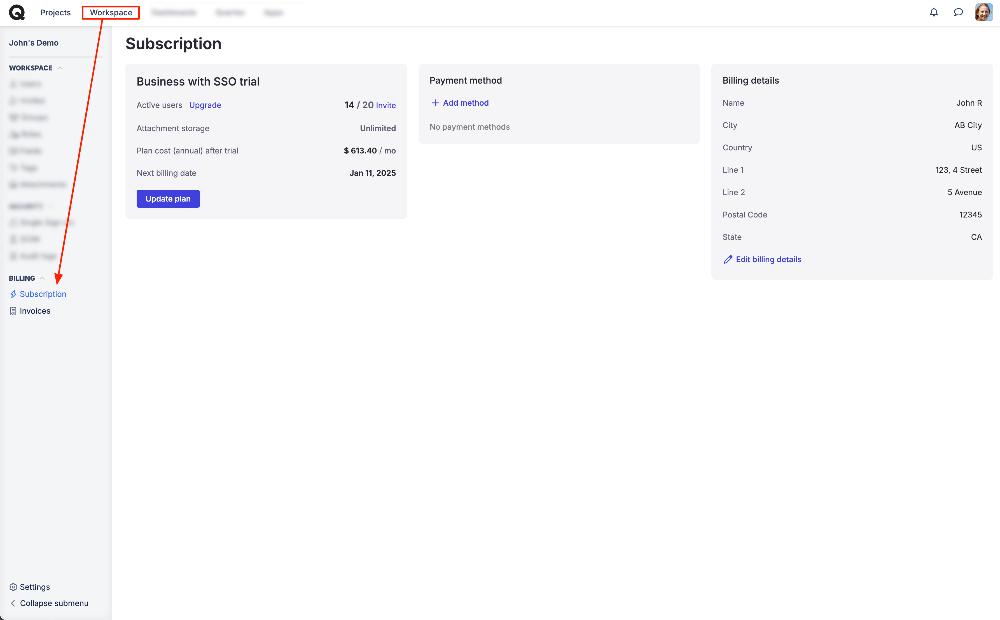
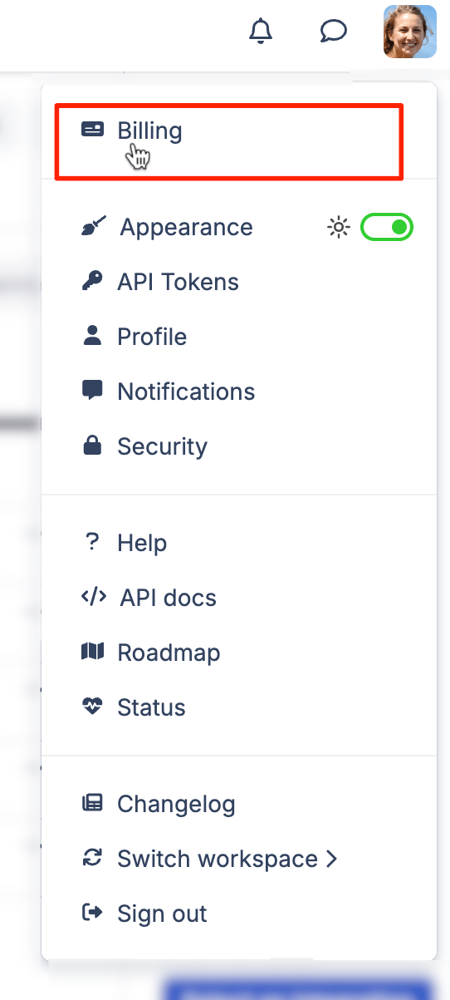
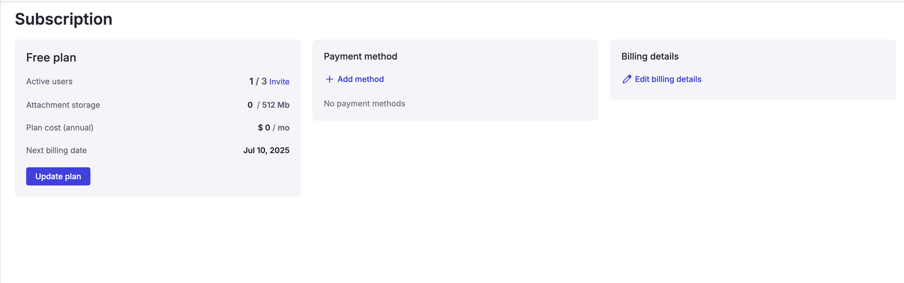
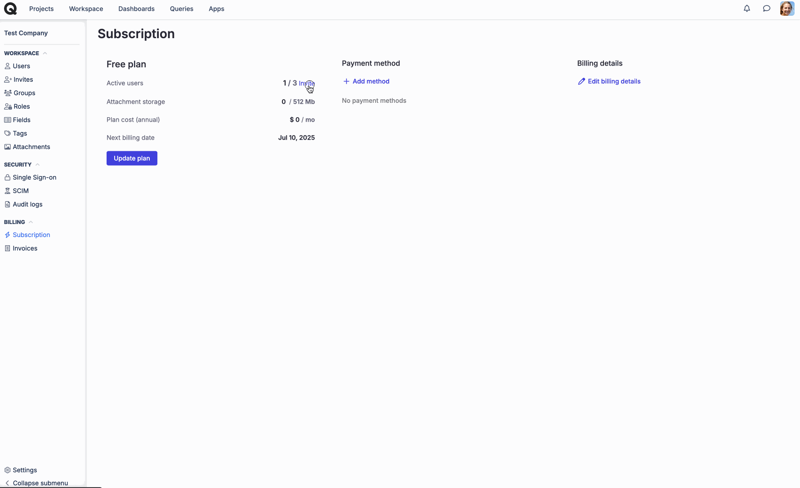
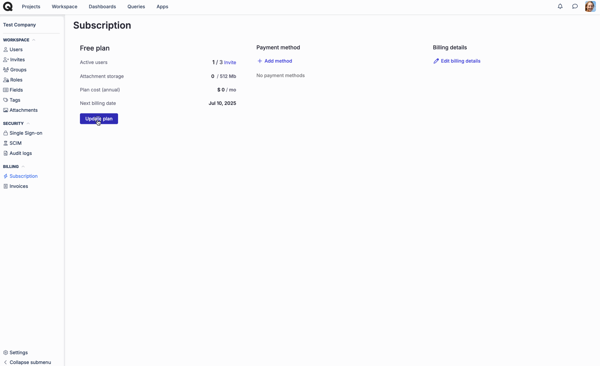
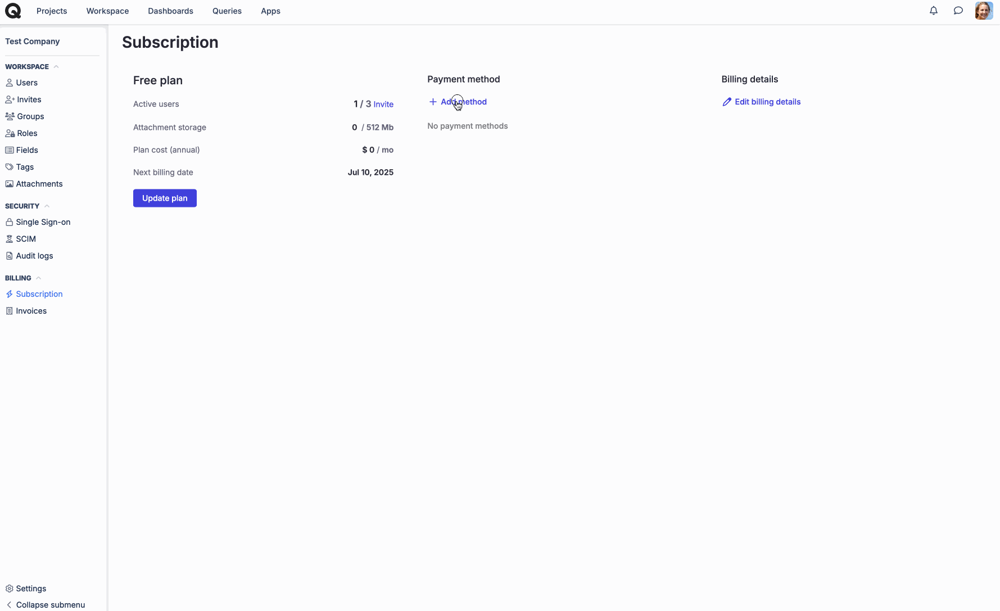
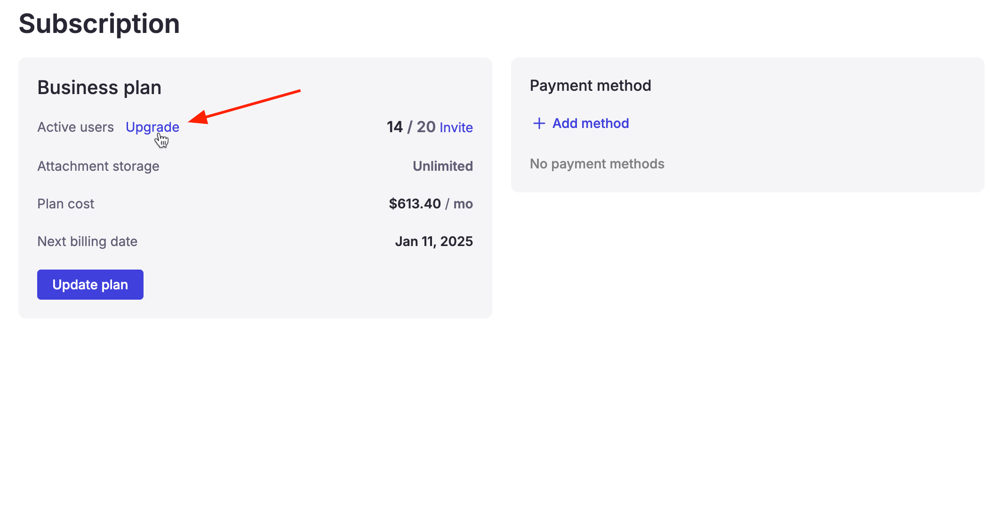

# Billing

### What is the billing section for?

The billing section of the workspace allows managing the subscription and obtaining the issued invoices. This section is only accessible to the workspace owner, billing users, or those that have specific permission to access "Billing" in their [custom role](../workspace-management/roles.md).

### How to check my current billing plan?

On the Subscription page, you can view your current plan, upgrade options, the number of active users, and the next charge.

Additionally, you can invite new users to Qase, update the subscription, and change the payment method.

### How to access the billing section? 

There are multiple options available to you to access the billing section.

1. Click on “Subscriptions” in the workspace page

<figure><figcaption></figcaption></figure>

2\. Click on your profile picture on the top right and click on “Billing

<figure><figcaption></figcaption></figure>

3\. You can click on this direct link as well: [https://app.qase.io/billing](https://app.qase.io/billing)

### Usage 

If you are on the “Free” plan, the page will look like this:

<figure><figcaption></figcaption></figure>

As you can see, you have the option to “Invite users”, upgrade, and add a payment method.

#### Invite users 

Clicking on “Invite users” redirects you to the “Invites” page of your workspace.

<figure><figcaption></figcaption></figure>

#### Upgrade 

Clicking on this option allows you to upgrade your plan.

<figure><figcaption></figcaption></figure>

### Payment methods 

This option allows you to add/update your payment methods.

<figure><figcaption></figcaption></figure>

If you are on a paid plan, you will be able to see the option increase the max users which you can do so by clicking on “Update quantity” under max users.

<figure><figcaption></figcaption></figure>

### Invoices 

You can access all previously issued invoices and download them from the "Invoices" section.

<figure><figcaption></figcaption></figure>
