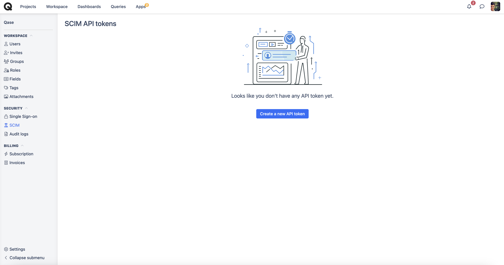
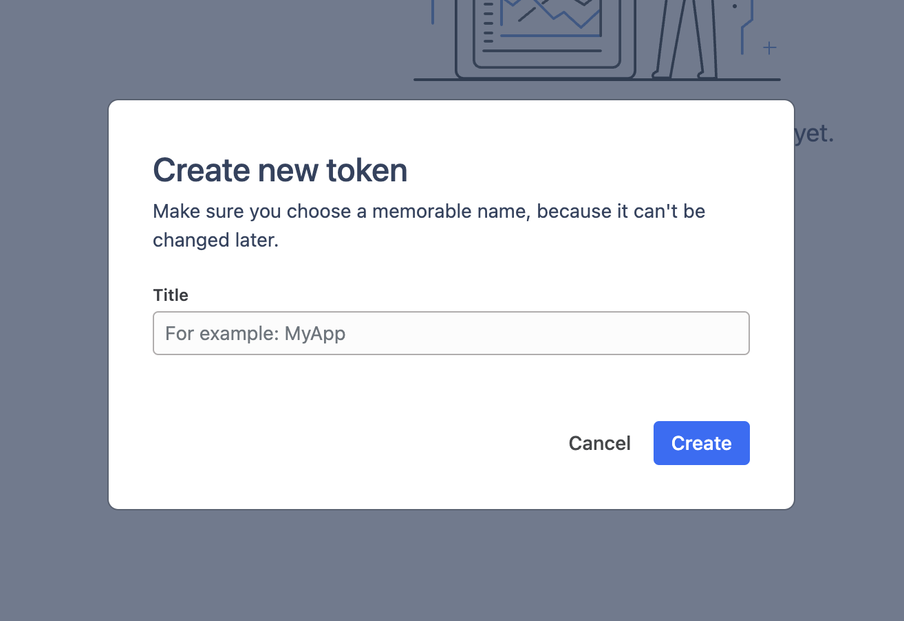

# SCIM

_<mark style="background-color:green;">⚠️SCIM is available in</mark>_ [_<mark style="background-color:green;">Enterprise</mark>_](https://help.qase.io/en/articles/6640055-enterprise-plan) _<mark style="background-color:green;">subscriptions.</mark>_

Qase SCIM API is used by SSO partners to provision, manage, and de-provision users.

The SCIM API is based on the Open standard: System for Cross-domain Identity Management 2. Our SCIM implementation uses the 2.0 version of the protocol.

**Our SCIM implementation supports only one type of resources:** Users — users in a company plan.

**With SCIM you can:**

Get all users in a company. Update, activate, or deactivate users.

**Features not implemented:**

You cannot create or delete teams via the SCIM API. If you need this feature, please contact us.

### User lifecycle management with SCIM <a href="#h_66527c48f0" id="h_66527c48f0"></a>

Any organization that grants access to its services and that uses permissions to control how users engage must manage users and their access. This lifecycle starts when a company onboards its users and continues until they leave the company. Managing users and their access involves various systems and can become challenging.

The increasing use of APIs for nearly every system has enabled organizations to automate the provisioning and management of users, often using the [System for Cross-domain Identity Management (SCIM)](https://en.wikipedia.org/wiki/System\_for\_Cross-domain\_Identity\_Management) as a standard. SCIM provides API methods and JSON objects that define users and groups, so identity providers and integration tools can manage users across systems.

This article looks into the Qase SCIM API, its capabilities, and some standard processes to consider when implementing automatic provisioning and management of users in Qase.

**Qase SCIM API overview**

The Qase SCIM API enables organizations to manage user access automatically. It uses an identity provider, and it includes an interface for other identity providers that support the SCIM protocol. The documentation already features several walkthroughs for configuring an Okta or Azure Active Directory (AD) instance. An Okta or AD instance enables the automatic provisioning of users, and it controls access for teams aligned with the two identity providers.

Additionally, you can call the SCIM API independently for greater control and customization. Independently calling the SCIM API allows middleware to create, update, and delete users.

**User lifecycle management with the Qase SCIM API**

Understanding the information a company uses for onboarding and as users transition into new roles enables you to use your systems and data efficiently. Let's explore some common scenarios organizations encounter when implementing automated user management. We can then understand how the Qase SCIM API can assist with automating the user journey.

Suppose an organization has connected a single sign-on (SSO) capability for Qase logins, but uses an integration platform to perform the SCIM actions. This example demonstrates how to use the API in standard processes, such as onboarding new users and offboarding users.

**New user onboarding**

When discussing automated user management, one of the first topics tends to be creating new users in an application. Here, the ideal user experience is one in which account creation provides immediate access to all necessary resources.

For this example organization, when a company adds a new user to the `qaseUsers` group, the integration layer first calls the SCIM Users API to look up the user, using filters to ensure that the user doesn’t already exist in the system. For a user with the email `alex.smith@example.com`, the lookup would look like this:\


```
https://app.qase.io/scim/v2/Users?attributes=name,userName&filter=(userName eq "alex.smith@example.com")
```

If the user doesn’t exist, the integration layer calls the create method with the user’s details. This method only requires the username (the Qase email address), a family name, and a given name. You can also save the user ID with a property in your user directory to ensure that you have correctly linked the users.

**User offboarding and deletion**

Finally, when a user leaves your organization or no longer requires Qase, you must clean up their accounts. Of course, you can use the Delete User API to delete the account. However, in cases where the user no longer requires Qase, or if policies require that user accounts remain, you can also set the user’s status to inactive using the Update user API.

**Conclusion**

The Qase SCIM API provides all the necessary components for managing your organization’s users through the entire lifecycle. Using existing user information and security groups or roles can make Qase's user and group management almost entirely automated.

### Enable SCIM <a href="#h_9212ed461d" id="h_9212ed461d"></a>

SCIM API is enabled for all customers with Enterprise subscription by default. To manage users with SCIM in your Qase Enterprise account you will need to create a new API token:

1\. Navigate to **Workspace > SCIM** page:

<figure><figcaption></figcaption></figure>

<figure><figcaption></figcaption></figure>

3\. To ensure that everything is working as expected you can make the following request: `GET: https://app.qase.io/scim/v2/Users`

Request Headers:

`Accept` _application/scim+json_

`Content-Type` _application/json_

`Authorization` _Bearer + API Token from the previous step_

***

_⚠️_ Base URL and Authorization type

As you can see from the previous example the base URL for SCIM API is [_https://app.qase.io/scim/v2/Users_](https://app.qase.io/scim/v2/Users). The API token must be included in every call to SCIM via **Authorization** header with type **Bearer**


***

🚧 HTTPS protocol

We support HTTPS requests only. Requests to HTTP protocol are redirected to HTTPS - please note that this redirection response can be handled incorrectly by certain tools.

***

curl example

### Users <a href="#h_983ee85cd3" id="h_983ee85cd3"></a>

With SCIM API you can manage users in your Enterprise account. You can get the full list of users, filter by attribute, add new users, update user's attributes, activate or deactivate users and delete users completely.

* [User attributes](https://help.qase.io/en/articles/8556234-scim#h\_3db9d25de8)
* [User methods](https://help.qase.io/en/articles/8556234-scim#h\_5aaa9e6798)
  * [Get users](https://help.qase.io/en/articles/8556234-scim#h\_3e38eb0be8)
  * [Get user by ID](https://help.qase.io/en/articles/8556234-scim#h\_5801dcd5e1)
  * [Create a new user](https://help.qase.io/en/articles/8556234-scim#h\_d84ea5a11d)
  * [Replace user by ID](https://help.qase.io/en/articles/8556234-scim#h\_3998ca04da)
  * [Update user attributes by ID](https://help.qase.io/en/articles/8556234-scim#h\_82c9e175c8)
  * [Delete user](https://help.qase.io/en/articles/8556234-scim#h\_af885f682d)

#### User attributes <a href="#h_9c8b92f391" id="h_9c8b92f391"></a>

We support the following user attributes:

| IDP attribute name | Qase attribute  | Description                                                                                                                                                                                                                                                                                                                                     |
| ------------------ | --------------- | ----------------------------------------------------------------------------------------------------------------------------------------------------------------------------------------------------------------------------------------------------------------------------------------------------------------------------------------------- |
| Email              | userName        | User email. Mandatory field.                                                                                                                                                                                                                                                                                                                    |
| Name               | name.givenName  | Attribute is used if the value is not empty. Maximum: 60 characters.                                                                                                                                                                                                                                                                            |
|                    | name.familyName | Attribute is used if the `displayName` attribute is not provided, `name` attribute is provided and 'formatted' attribute value is not empty. Maximum: 60 characters.                                                                                                                                                                            |
| User type          | userType        | <p>Supported values: <code>regular</code>, <code>read-only</code> and <code>billing</code>.</p><p>When <code>userType=regular</code>, a user is upgraded to FULL license inside the Qase application. When userType is not specified, user license is updated/set according to internal Qase logic, which depends on the organization plan.</p> |
| Active             | active          | Supported value: `true` or `false`                                                                                                                                                                                                                                                                                                              |

***

_⚠️_ Qase attribute namespace

'urn:ietf:params:scim:schemas:core:2.0:User' is a default SCIM urn for basic fields. If your identity provider does not require defining namespace, the default namespace must be avoided.

***

#### User Methods <a href="#h_5aaa9e6798" id="h_5aaa9e6798"></a>

**Get users**

```
GET: https://app.qase.io/scim/v2/Users
```

Retrieves the list of users in your organization. Use `startIndex` and `count` query parameters to receive paginated results. Supports sorting and the filter parameter.

_Response:_

```
{
    "schemas": [
        "urn:ietf:params:scim:api:messages:2.0:ListResponse"
    ],
    "totalResults": 1,
    "itemsPerPage": 1,
    "startIndex": 1,
    "Resources": [
        {
            "schemas": [
                "urn:ietf:params:scim:schemas:core:2.0:User"
            ],
            "id": "1",
            "userName": "john@doe.com",
            "name": {
                "familyName": "John",
                "givenName": "Doe"
            },
            "active": true,
            "userType": "regular",
            "title": "CEO",
            "emails": [
                {
                    "value": "john@doe.com",
                    "primary": true
                }
            ],
            "meta": {
                "resourceType": "User",
                "location": "https://app.qase.io/scim/v2/Users/1"
            }
        }
    ]
}
```

_**Sorting**_

Sorting allows you to specify the order in which resources are returned by specifying a combination of `sortBy` and `sortOrder` URL parameters. The `sortBy` parameter specifies the attribute whose value will be used to order the returned responses. The `sortOrder` parameter defines the order in which the `sortBy` parameter is applied. Allowed values are `ascending` and `descending`.

_**Filters**_

You can request a subset of resources by specifying the `filter` query parameter containing a filter expression. Attribute names and attribute operators used in filters are case insensitive. The `filter` parameter must contain at least one valid expression. Each expression must contain an attribute name followed by an attribute operator and an optional value.

| <pre><code>eq
</code></pre>  | equal                    |
| ---------------------------- | ------------------------ |
| <pre><code>ne
</code></pre>  | not equal                |
| <pre><code>co
</code></pre>  | contains                 |
| <pre><code>sw
</code></pre>  | starts with              |
| <pre><code>ew
</code></pre>  | ends with                |
| <pre><code>pr
</code></pre>  | preset (has value)       |
| <pre><code>gt
</code></pre>  | greater than             |
| <pre><code>ge
</code></pre>  | greater than or equal to |
| <pre><code>lt
</code></pre>  | less than                |
| <pre><code>le
</code></pre>  | less than or equal to    |
| <pre><code>and
</code></pre> | logical "and"            |
| <pre><code>or
</code></pre>  | logical "or"             |
| <pre><code>not
</code></pre> | "not" function           |
| <pre><code>( )
</code></pre> | precedence grouping      |

Example of complex request:

```
GET: https://app.qase.io/scim/v2/Users?attributes=name,userName&filter=NOT(name.familyName eq "Green")&sortBy=name.givenName&sortOrder=ascending&startIndex=2&count=5
```

***

**Get user by ID**

```
GET: https://app.qase.io/scim/v2/Users/1
```

Retrieves a single user resource

_Response:_

```
{
    "schemas": [
        "urn:ietf:params:scim:schemas:core:2.0:User"
    ],
    "id": "1",
    "userName": "john@doe.com",
    "name": {
        "familyName": "John",
        "givenName": "Doe"
    },
    "active": true,
    "userType": "regular",
    "title": "CEO",
    "emails": [
        {
            "value": "john@doe.com",
            "primary": true
        }
    ],
    "meta": {
        "resourceType": "User",
        "location": "https://app.qase.io/scim/v2/Users/1"
    }
}
```

***

**Create a new user**

```
POST: https://app.qase.io/scim/v2/Users
```

Creates a new user. Payload must include `userName` attribute populated with an email address, `familyName`, and `givenName` attribute.

***

_⚠️_ All newly provisioned users are added with a default role.

***

_Request:_

```
{
    "schemas":["urn:ietf:params:scim:schemas:core:2.0:User"],
    "userName":"john@doe.com",
    "name":{
        "familyName":"John",
        "givenName":"Doe"
    }
}
```

_Response:_

```
{
    "schemas": [
        "urn:ietf:params:scim:schemas:core:2.0:User"
    ],
    "id": "1",
    "meta": {
        "resourceType": "User",
        "location": "https://app.qase.io/scim/v2/Users/1"
    },
    "userName": "john@doe.com",
    "name": {
        "familyName": "John",
        "givenName": "Doe"
    },
    "active": true,
    "emails": [
        {
            "value": "john@doe.com",
            "primary": true
        }
    ]
}
```

***

**Replace user by ID**

```
PUT: https://app.qase.io/scim/v2/Users/1
```

Updates an existing user resource. This is the easiest way to replace the user information.

_Request:_

```
{
    "schemas": [
        "urn:ietf:params:scim:schemas:core:2.0:User"
    ],
    "id": "1",
    "meta": {
        "resourceType": "User",
        "location": "https://app.qase.io/scim/v2/Users/1"
    },
    "userName": "replace@example.com",
    "name": {
        "familyName": "Replace",
        "givenName": "Me"
    },
    "active": true,
    "userType": "regular",
    "emails": [
        {
            "value": "replace@example.com",
            "primary": true
        }
    ]
}
```

_Response:_

```
{
    "schemas": [
        "urn:ietf:params:scim:schemas:core:2.0:User"
    ],
    "id": "1",
    "meta": {
        "resourceType": "User",
        "location": "https://app.qase.io/scim/v2/Users/1"
    },
    "userName": "replace@example.com",
    "name": {
        "familyName": "Replace",
        "givenName": "Me"
    },
    "active": true,
    "userType": "regular",
    "emails": [
        {
            "value": "replace@example.com",
            "primary": true
        }
    ]
}
```

***

**Update user attribute by ID**

```
PATCH: https://app.qase.io/scim/v2/Users/1
```

Updates an existing user resource, overwriting values for specified attributes. Attributes that are not provided will remain unchanged. PATCH only updates the fields provided.

The body of a PATCH request must contain the attribute `Operations`, whose value is an array of one or more PATCH operations. Each PATCH operation object must have exactly one `op` member.

_Request to deactivate user:_

```
{
  "schemas": [
    "urn:ietf:params:scim:api:messages:2.0:PatchOp"
  ],
  "Operations": [
    {
      "op": "Replace",
      "path": "active",
      "value": false
    }
  ]
}
```

_Response:_

```
{
    "schemas": [
        "urn:ietf:params:scim:schemas:core:2.0:User"
    ],
    "id": "1",
    "meta": {
        "resourceType": "User",
        "location": "https://app.qase.io/scim/v2/Users/1"
    },
    "userName": "john@doe.com",
    "name": {
        "familyName": "John",
        "givenName": "Doe"
    },
    "active": true,
    "userType": "regular",
    "emails": [
        {
            "value": "john@doe.com",
            "primary": true
        }
    ]
}
```

_Request to rename user:_

```
{
  "schemas": [
    "urn:ietf:params:scim:api:messages:2.0:PatchOp"
  ],
  "Operations": [
    {
      "op": "Replace",
      "path": "name.givenName",
      "value": "New Given Name"
    }
  ]
}
```

_Request to upgrade user license to regular:_

```
{
  "schemas": [
    "urn:ietf:params:scim:api:messages:2.0:PatchOp"
  ],
  "Operations": [
    {
      "op": "Replace",
      "path": "userType",
      "value": "regular"
    }
  ]
}
```

_Request to update user email (userName):_

```
{
    "schemas": [
        "urn:ietf:params:scim:api:messages:2.0:PatchOp"
    ],
    "Operations": [
        {
            "op": "Replace",
            "path": "userName",
            "value": "new@email.com"
        }
    ]
}
```

***

**Delete user**

```
DELETE: https://app.qase./scim/Users/1
```

Deletes a single user from the organization.

***

_⚠️_User removing restrictions

A user who is the workspace owner cannot be deleted. If you try to delete such user, the API returns a 409 error code.

***

\


\
