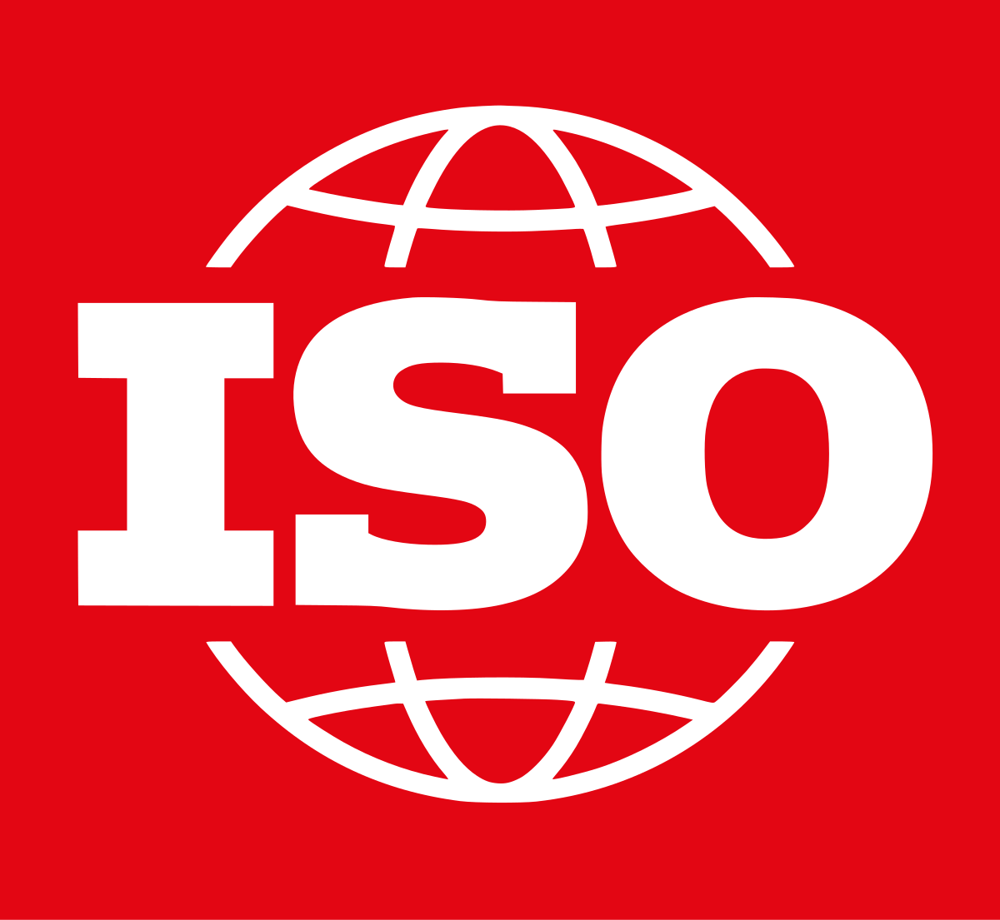

# ISO/IEC 27001:2022

<figure><figcaption></figcaption></figure>


Qase is ISO/IEC 27001:2022 compliant.


The full compliance report can be provided upon request, once we sign a mutual non-disclosure agreement between your company and Qase, as this report discloses sensitive information.&#x20;

:information\_source:  To request ISO/IEC 27001:2022 compliance report and to proceed with mNDA, please send a message to [sales@qase.io](mailto:sales@qase.io)
