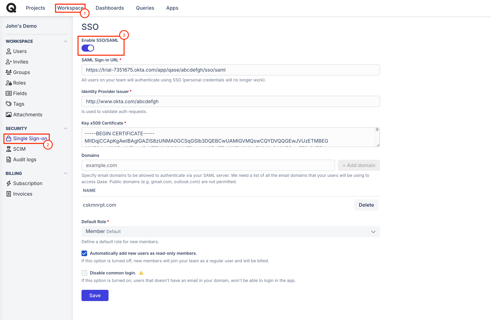

# SSO / SAML instructions


Single-Sign On is available in a [Business](../subscriptions/business-plan.md) subscription **with a** **Qase Access add-on** and [Enterprise](../subscriptions/enterprise-plan.md) subscription.


### What is SSO?

Single sign-on (SSO) is a time-saving and highly secure user authentication process. SSO lets users access multiple applications with a single account and sign out instantly with one click. Qase supports SSO.

### What is SAML?

To provide single sign-on services for your domain, Qase acts as a service provider (SP) through the SAML (Secure Assertion Markup Language) standard.

### How to enable SSO/SAML?

To access SSO/SAML configuration, go to "Security" in Workspace Management, and switch on "Enable SSO/SAML" toggle:

<figure><figcaption></figcaption></figure>

Make sure to provide all the correct details for SSO/SAML to work properly:

* SAML Sign-in URL
* Identity Provider Issuer
* Key x509 Certificate
* Domains (list of email domains from your users' emails that will be used to access Qase)

Additional options available in "Security" are:

* _Default_ [_role_](https://help.qase.io/en/articles/5563741-workspace-management-roles)_:_ assign which User Role should be granted to any new members joining the account.
* _Automatically add new users as read-only members:_ you can impose a safeguard making sure that anyone just joining an account will not be able to create something new or accidentally update or delete existing work.
* _Disable common login:_ with this option turned on, only users with an email address in your domain will be able to sign in.

