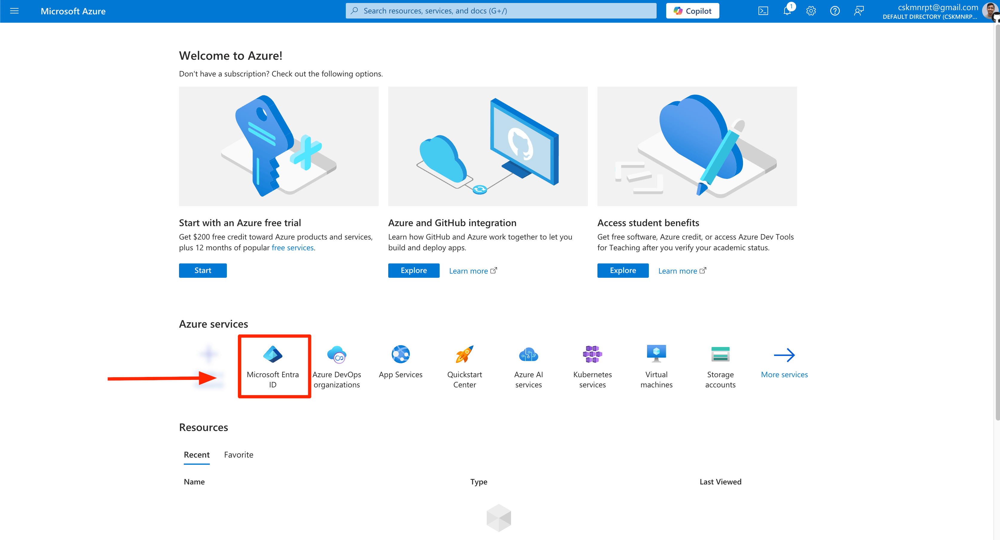
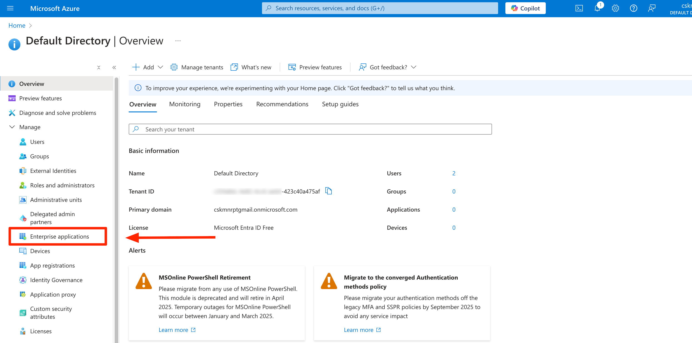
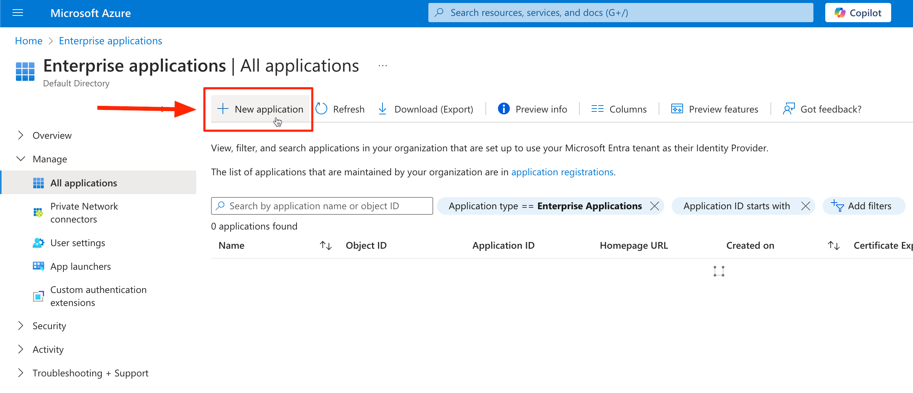
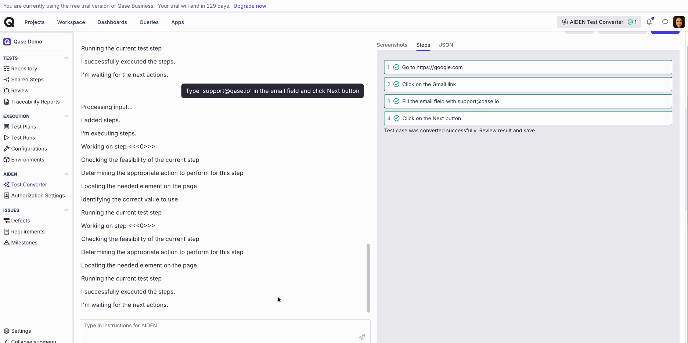
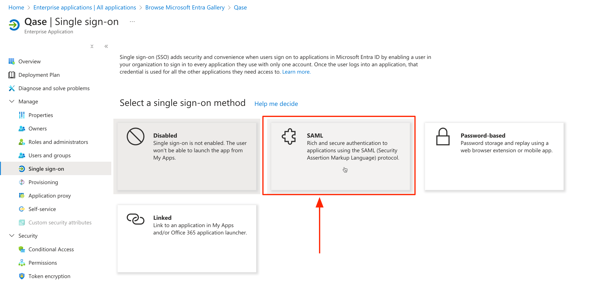
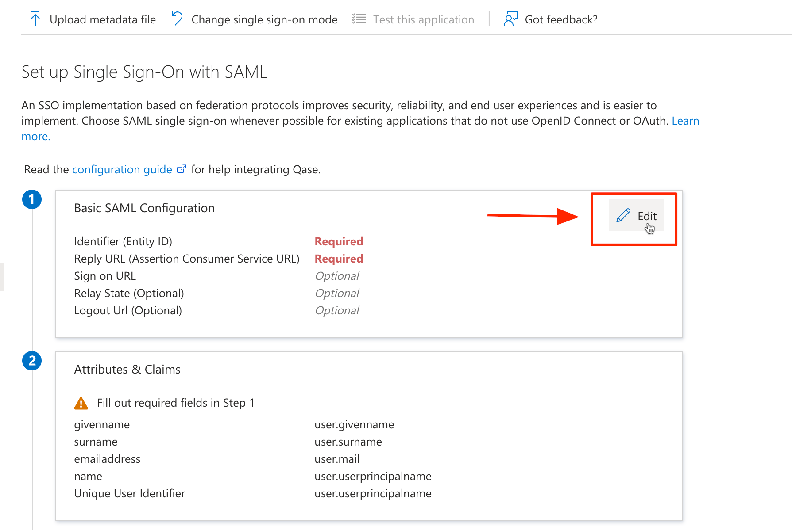
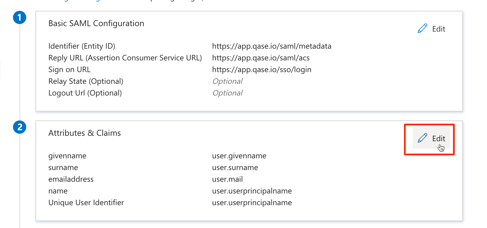
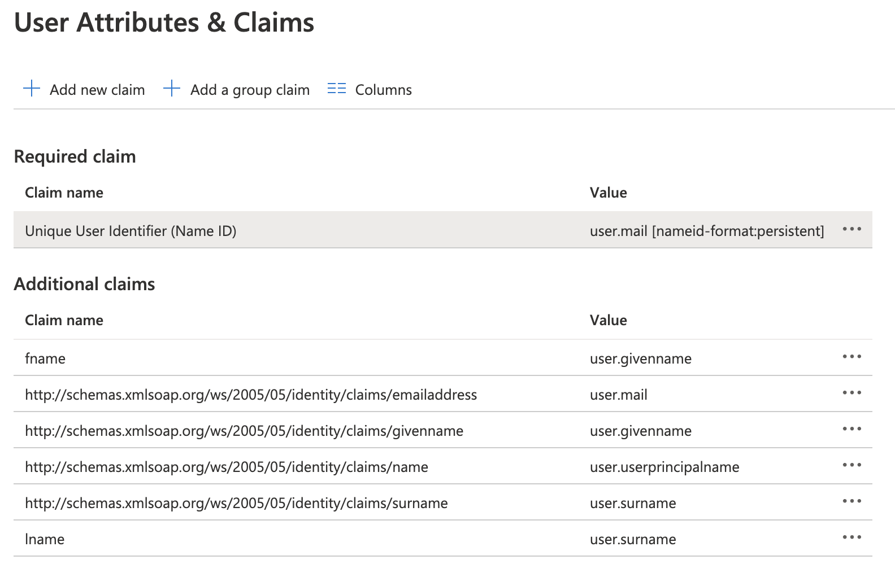
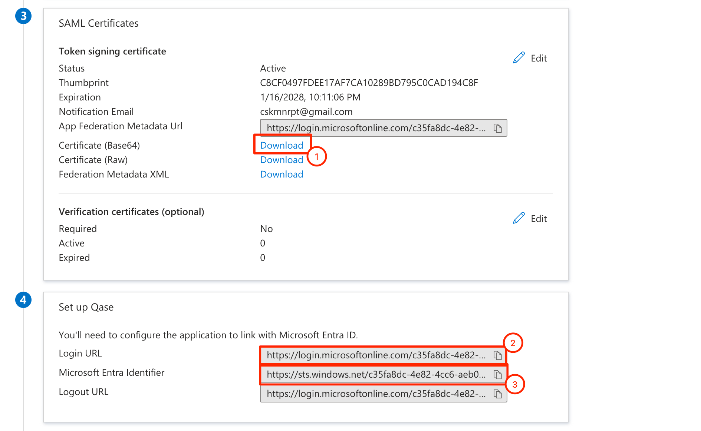

# AzureAD

Qase supports SSO. To provide single sign-on services for your domain, Qase acts as a service provider (SP) through the SAML (Secure Assertion Markup Language) standard.

### How to configure SSO with AzureAD?

1\. Sign in to the [Admin console](https://portal.azure.com/) of your AzureAD account.

2\. Click on "Azure Active Directory" icon:

<figure><figcaption></figcaption></figure>

3\. Go to "**Enterprise applications**" section and click on "**New application**" button:

<figure><figcaption></figcaption></figure>

<figure><figcaption></figcaption></figure>

4\. Create a Non-gallery application and name it 'Qase':

<figure><figcaption></figcaption></figure>

5\. Click on "**Set up single sign on**":

<figure><figcaption></figcaption></figure>

6\. Choose "**SAML**":

<figure><figcaption></figcaption></figure>

7\. Now, you need to set up your AzureAD application. Click on the "Edit" button in the "**Basic SAML Configuration**" block. And fill the form with the following data:

<figure><figcaption></figcaption></figure>

* Identifier (Entity ID): [https://app.qase.io/saml/metadata](https://app.qase.io/saml/metadata)
* Reply URL (ACS URL): [https://app.qase.io/saml/acs](https://app.qase.io/saml/acs)
* Sign on URL: [https://app.qase.io/sso/login](https://app.qase.io/sso/login)

When you are ready, click on "Save" button.

<figure><figcaption></figcaption></figure>

8\. Now you need to configure attribute mapping. Click on "**Edit**" button in "**User Attributes & Claims**" section and for "**Required claim**" set Name ID format to _persistent_ and Name ID value to _`user.mail`._

<figure><figcaption></figcaption></figure>

Also, add two new claims:

* `fname`: `user.givenname`
* `lname`: `user.surname`

<figure><figcaption></figcaption></figure>

<figure><figcaption></figcaption></figure>

9\. Now, you are ready to set up SSO on the Qase side. But at first, you need to get data from the AzureAD app:

<figure><figcaption></figcaption></figure>

1. Download the certificate (Base64)
2. Copy Login URL
3. Copy Azure AD identifier

10\. Now you need to go to the Qase [security page](https://app.qase.io/team/security) and link your account with AzureAD credentials. Click on the "Enable SSO/SAML" toggle button and fill the form:

* _SAML Sign-in URL:_ paste login URL from the previous step
* _Identity Provider Issuer:_ paste Azure AD identifier from the previous step
* _Key x509 Certificate:_ open downloaded in the previous certificate in any editor, copy its content, and paste in the textarea.
* _Domains:_ provide a list of domains separated by a comma, that will be used for SSO. Public domains like gmail, hotmail, and etc are not allowed.

`Any domains that are added will need to be verified. To do so, you will need to add a TXT record to the domain's DNS records.`

<figure><figcaption></figcaption></figure>

* _Default role:_ choose a default role that will be granted to the new users.

If you want new users who join your team to become a read-only by default, check "Automatically add new users as read-only members" checkbox.

After the form is filled, click on the "Save" button.

Setup is complete. Now you can logout from the app and log in through the [SSO login form.](https://app.qase.io/sso/login)


IdP initiated login is **not** supported.

Users will have to sign-in from this Qase's SSO Login page: [https://app.qase.io/sso/login](https://app.qase.io/sso/login)

