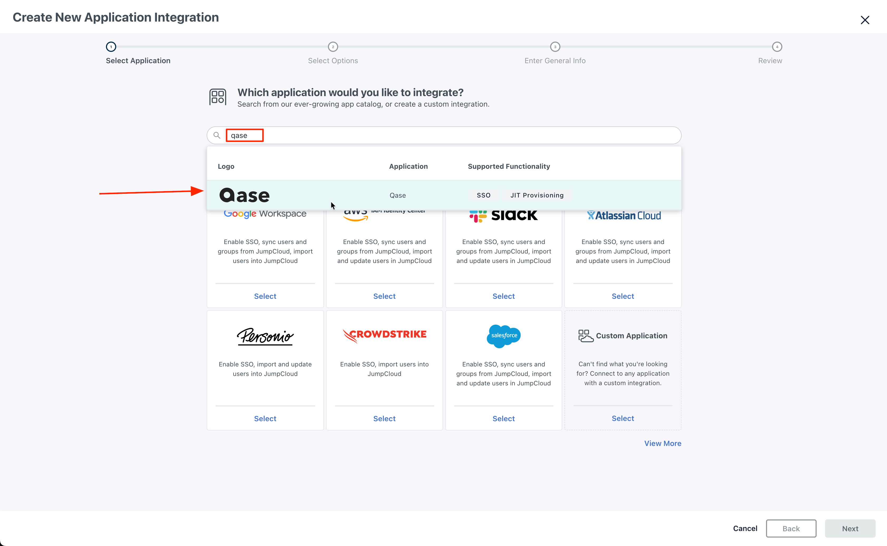
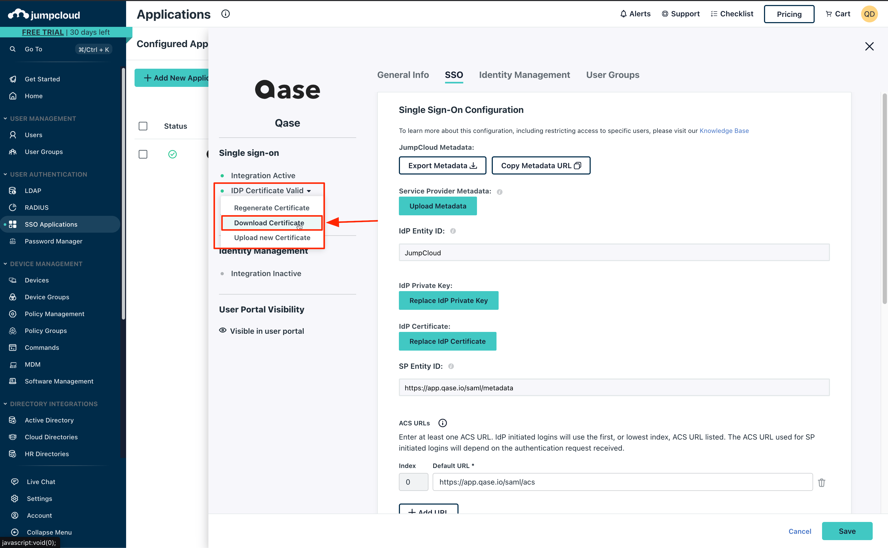
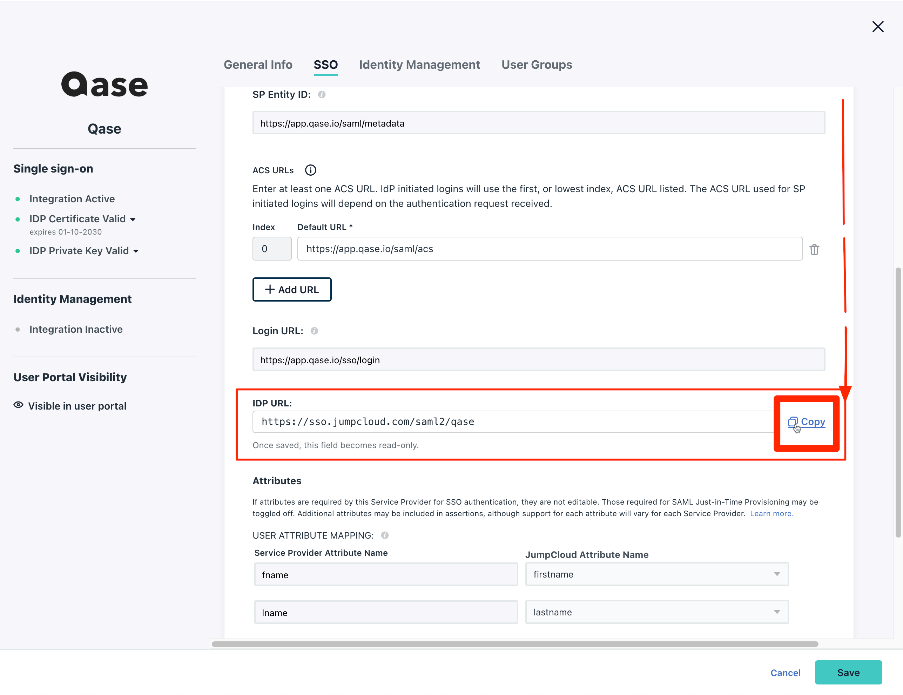
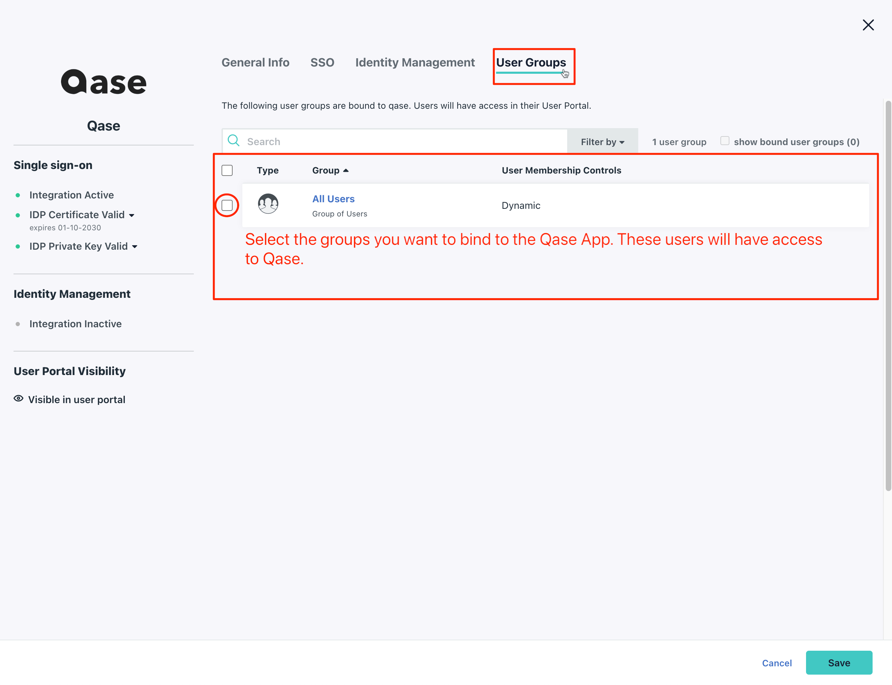
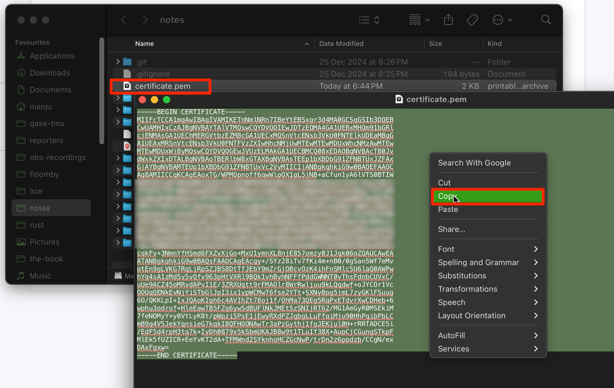
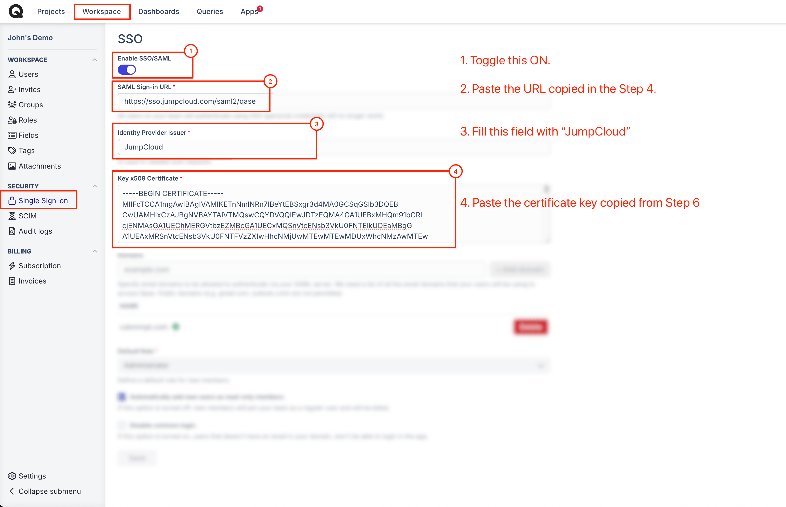

# JumpCloud

How to configure SSO with JumpCloud

To set up your Qase account with SSO/SAML and JumpCloud, you'll need to take the following steps:\
​\
1\. Login to your JumpCloud Admin dashboard, and go to "SSO Applications"

<figure><figcaption></figcaption></figure>

2\. Search for "Qase", select it and click next, then click "Save Application"

<figure><figcaption></figcaption></figure>

3\. Click "Configure Application" and you will land on the following page. Here, download your IdP Certificate

<figure><figcaption></figcaption></figure>

4\. Scroll down and copy the IdP URL as shown below

<figure><figcaption></figcaption></figure>

5\. Add your groups, from the User Groups tab. All users from the selected groups will be able to access Qase

<figure><figcaption></figcaption></figure>

6\. Open the downloaded `certificate.pem` with a text editor and copy the contents of the file.

<figure><figcaption></figcaption></figure>

7\. Setup on JumpCloud is complete. Now you need to go to the Qase [security page](https://app.qase.io/workspace/security) and link your account with JumpCloud's credentials.

Click on the "Enable SSO/SAML" toggle button and fill the form

<figure><figcaption></figcaption></figure>

Map the following parameters as shown in the screenshot above.

* SAML Sign-in URL: the URL copied from Step 4.
* Identity Provider Issuer: JumpCloud
* Key x509 Certificate: text from the `certificate.pem` that you have downloaded in Step 6.
*   Domains\*: provide a list of domains separated by a comma, that will be used for SSO. Public domains like Gmail, Hotmail, etc. are not allowed.\
    \
    \*_This step is mandatory._\

    `Any domains that are added will need to be verified. To do so, you will need to add a TXT record to the domain's DNS records`

<figure><figcaption></figcaption></figure>

9\. If you want new users who join your team to become a read-only by default, check "Automatically add new users as read-only members" checkbox.

After the form is filled, click on the "Save" button.

Setup is complete. Now you can logout from the app and log in through the [SSO login form.](https://app.qase.io/sso/login)

***


IdP initiated login is **not** supported.

Users will have to sign-in from this Qase's SSO Login page: [https://app.qase.io/sso/login](https://app.qase.io/sso/login)

