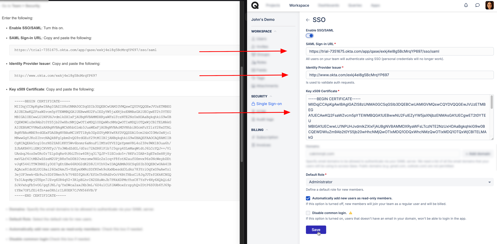

# Okta

To set up your Qase account with SSO/SAML and OneLogin, you'll need to take the following steps:

1\. Login to your Okta Admin dashboar

<figure><figcaption></figcaption></figure>

2\. Go to Applications and click on "Browse App Catalog"

<figure><figcaption></figcaption></figure>

3\. Search for "Qase"

<figure><figcaption></figcaption></figure>

4\. Click on "Add Integration

<figure><figcaption></figcaption></figure>

5\. Check on the option for "Do not display application icon to users" and click "Done"

<figure><figcaption></figcaption></figure>

6\. Once activated, go to the "Sign On" tab, and on the lower left, click "View SAML setup instructions".

<figure><figcaption></figcaption></figure>

7\. This will take you to another page where you will find your SAML Sign-In URL, Identity Provider Issuer, and your Key x509 Certificate and further instructions on how to add these to Qase.

8\. Google setup is complete. Now you need to go to the Qase [security page](https://app.qase.io/workspace/security) and link your account with Google's credentials. Click on the "Enable SSO/SAML" toggle button and fill the form

<figure><figcaption></figcaption></figure>

* Map the following parameters as shown in the screenshot above.
* SAML Sign-in URL
* Identity Provider Issuer
* Key x509 Certificate
*   Domains: provide a list of domains separated by a comma, that will be used for SSO. Public domains like Gmail, Hotmail, etc. are not allowed.

    `Any domains that are added will need to be verified. To do so, you will need to add a TXT record to the domain's DNS records`

<figure><figcaption></figcaption></figure>

9\. If you want new users who join your team to become a read-only by default, check "Automatically add new users as read-only members" checkbox.

After the form is filled, click on the "Save" button.

Setup is complete. Now you can logout from the app and log in through the [SSO login form.](https://app.qase.io/sso/login)
