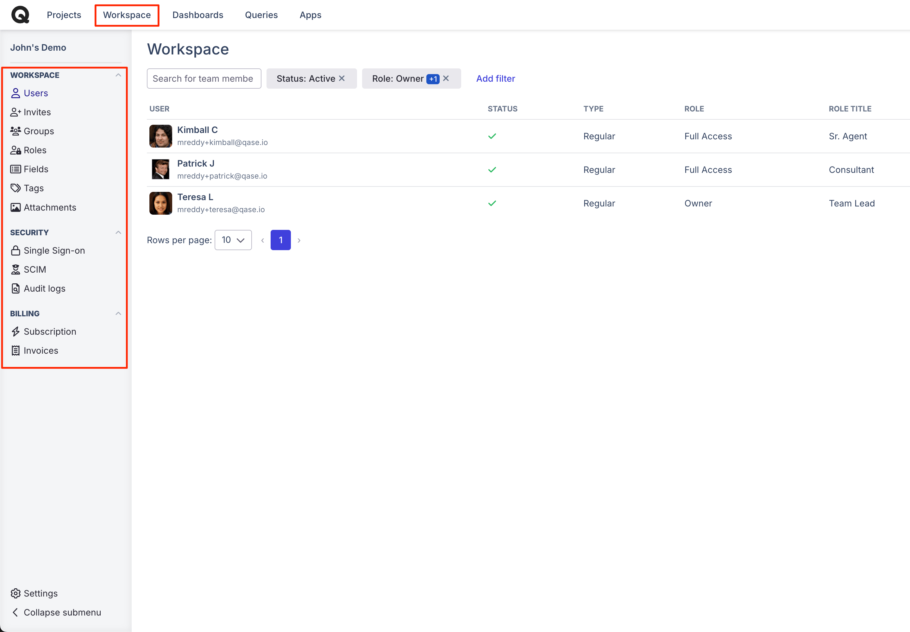

# Workspace management



### What to manage in a workspace?

Qase is a tool designed to increase the productivity of QA and testing teams through collaboration and visibility. This means that you will not be working alone. However, it is important to keep track of who has access to what and what capabilities your teammates possess. You can set up access types with precise granularity, depending on what each user should be allowed to do in Qase.

### What does the workspace consist of?

Let's take a look at workspace management in Qase. To get there, click "Workspace" on the top bar from anywhere you are in Qase at the moment

<figure><figcaption></figcaption></figure>

Workspace Management has several sections for different purposes. Let's go over what each of them is for:

*   Workspace

    * [Users](users.md)
    * [Invites](invites.md)
    * [Groups](groups.md)
    * [Roles](roles.md)
    * [Fields](custom-fields.md)
    * [Tags](tags.md)
    * [Attachments](attachments.md)

*   Security

    * [Single sign-on](../sso-saml-instructions/)
    * [Audit logs](audit-logs.md)

* [Billing](../subscriptions/)
  * Subscription
  * Invoices
