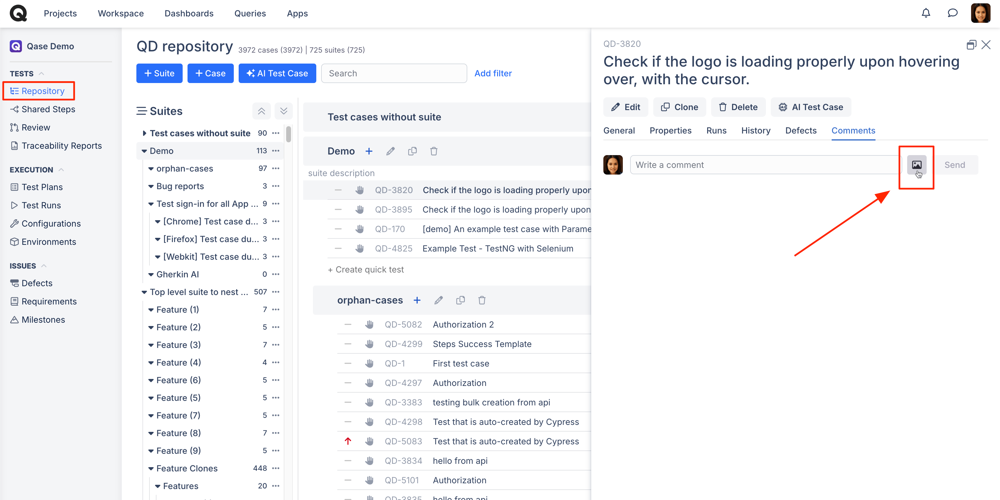
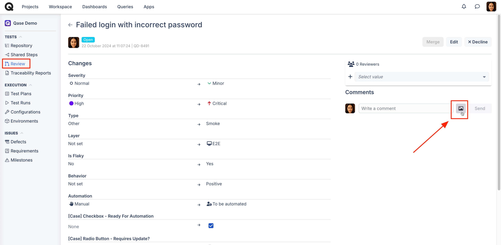
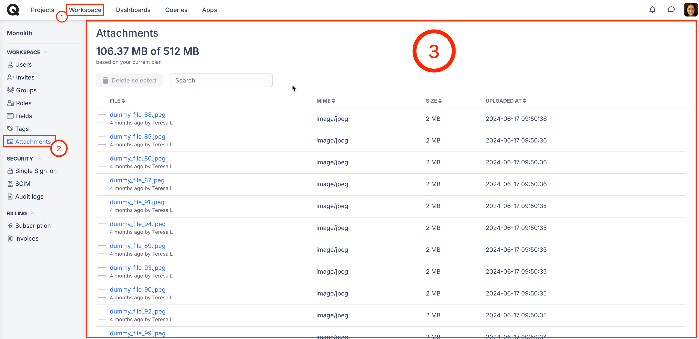
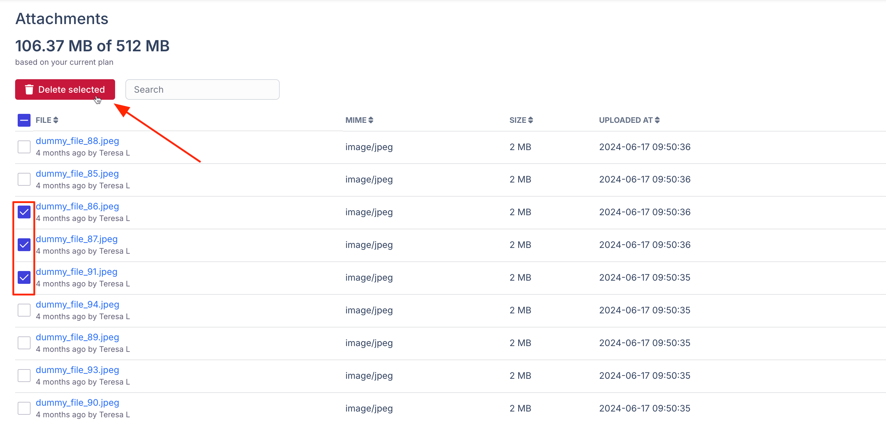

# Attachments

### What are attachments in Qase?

Attachments in the workspace provide a comprehensive overview of the files that have been uploaded and attached to Qase. However, since attachment storage space is limited (500 MB for the Free plan, 250 GB for the startup plan, and unlimited storage for business and enterprise plans), it is important to monitor usage and free up space as needed.



### Where can I add attachments?

To provide your teammates with additional context, you can attach various files in Qase. In fact, there are several entities and places in Qase where attachments can be added.


A single attachment cannot exceed 128 MB.


### You can attach files to:

*   A test case (new or already existing)\

    <figure><figcaption></figcaption></figure>
* An existing test case review and steps-to-reproduce of such test case (if any attachments were added upon initial configuration of a test case before sending to review, such attachments would be automatically added to a review as well)

<figure><figcaption></figcaption></figure>

* A regular step of a test case (at the moment when creating it, or at a later point)

<figure><figcaption></figcaption></figure>

* An already existing defect

<figure><figcaption></figcaption></figure>

* A test's step-to-reproduce run result

<figure><figcaption></figcaption></figure>

* A test case run result. Note: If you attach a file and choose to create a new defect, a file will also be attached to the defect automatically.

<figure><figcaption></figcaption></figure>

You can also add attachments for comments that you leave on test cases, reviews, and defects.

*   Test case:\

    <figure><figcaption></figcaption></figure>
*   Reviews:\

    <figure><figcaption></figcaption></figure>
*   Defects:\

    <figure><figcaption></figcaption></figure>

### Workspace management: attachments 

Attachments in workspace management provide you with a full overview of the files that have been uploaded and attached to Qase so far. Since the storage space for attachments is limited (500 Mb for free plan, 250 Gb for startup plan, and unlimited storage for business and enterprise plans), it is useful to understand how much of it has been utilized and free up some of that space upon necessity.

If you’re on the free or startup plans and you’d like to understand exactly how much storage space your attachments are consuming, you can find out by clicking on the attachments option available in the workspace.

<figure><figcaption></figcaption></figure>

The doughnut chart depicted in the screenshot above depicts the used vs free space. Next to it, you’ll see the space used and the space remaining. You can also search for the attachments by using the search bar.

### Attachments details

Below the summary, there is a list of all files that have been attached, featuring the following details:

<figure><figcaption></figcaption></figure>

1. Filename:
2. A timestamp of upload and uploader name
3. File MIME-type
4. A Qase project, to which a file has been attached (it is a link you can navigate directly to)
5. Size of the file

### Deleting attachments

Any file can be deleted from a three-dot-menu to the right, thus freeing up available space. Files are deleted permanently without any option to restore them at a later point.

<figure><figcaption></figcaption></figure>
