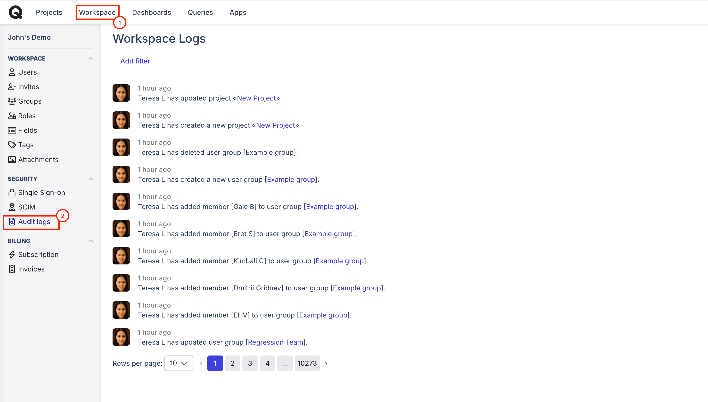
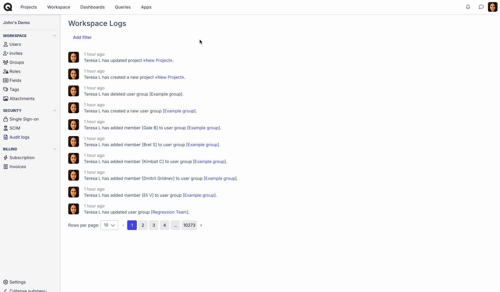

# Audit logs

### What are audit logs in Qase?

Audit logs provide you with a historical record of all actions that have been performed in the workspace so that it's easier to review who performed actions on specific items and when.



Each entry of the log features a timestamp of the action, a performer of the action, and the description of the action that has been performed.

<figure><figcaption></figcaption></figure>

By default, you are taken to the "All" log record, which features log entries for all Qase entities. However, you can switch between log entries of a specific entity, using the filters feature. You can filter logs by type, member, and creation date.

<figure><figcaption></figcaption></figure>

Available Filters:

* Type: [Team Members](users.md), [Projects](../../general/get-started-with-the-qase-platform/create-a-project.md), [Suites](../../test-management/create-a-test-suite.md), [Cases](../../general/get-started-with-the-qase-platform/test-cases/), [Defects](../../general/issues/defects.md), [Runs](../../general/get-started-with-the-qase-platform/create-a-test-run/), [Plans](../../general/execution/test-plan.md), and [Review Requests](../../general/get-started-with-the-qase-platform/test-cases/test-case-review.md)
* Members: all users/members invited to the workspace
* Creation Date: relative dates and absolute dates
