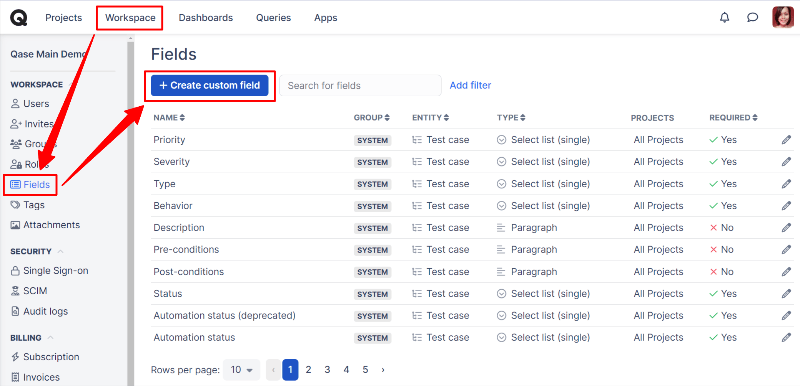
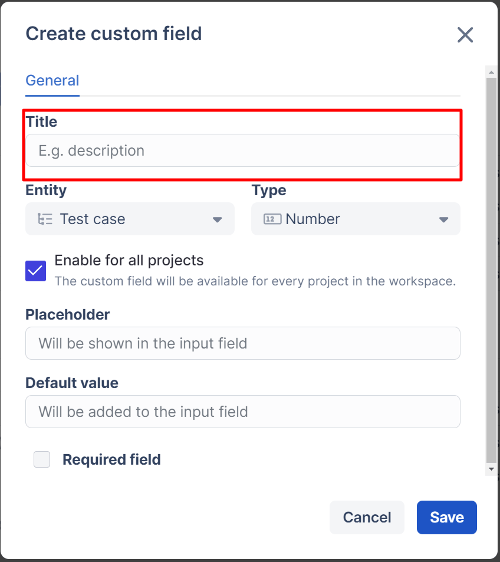
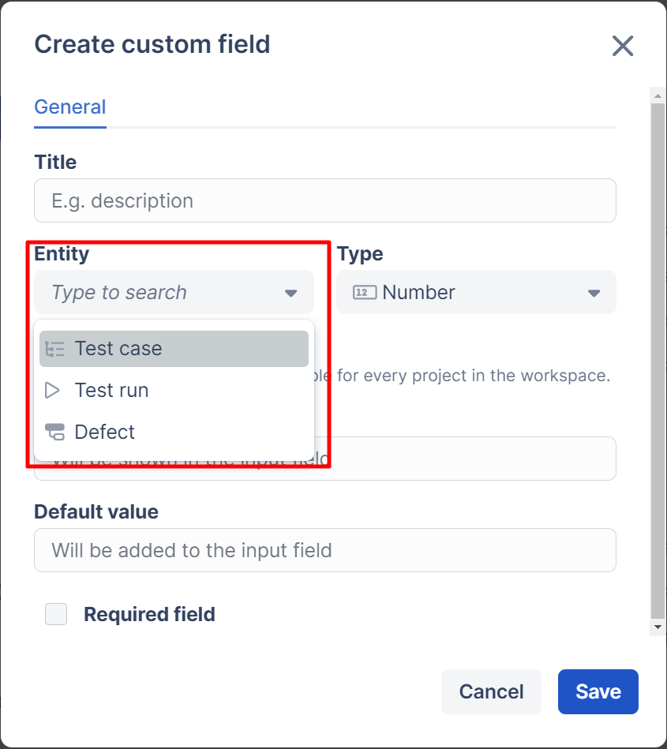
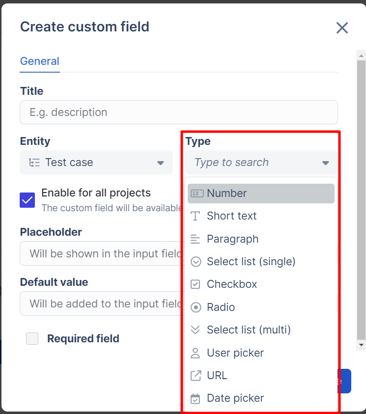
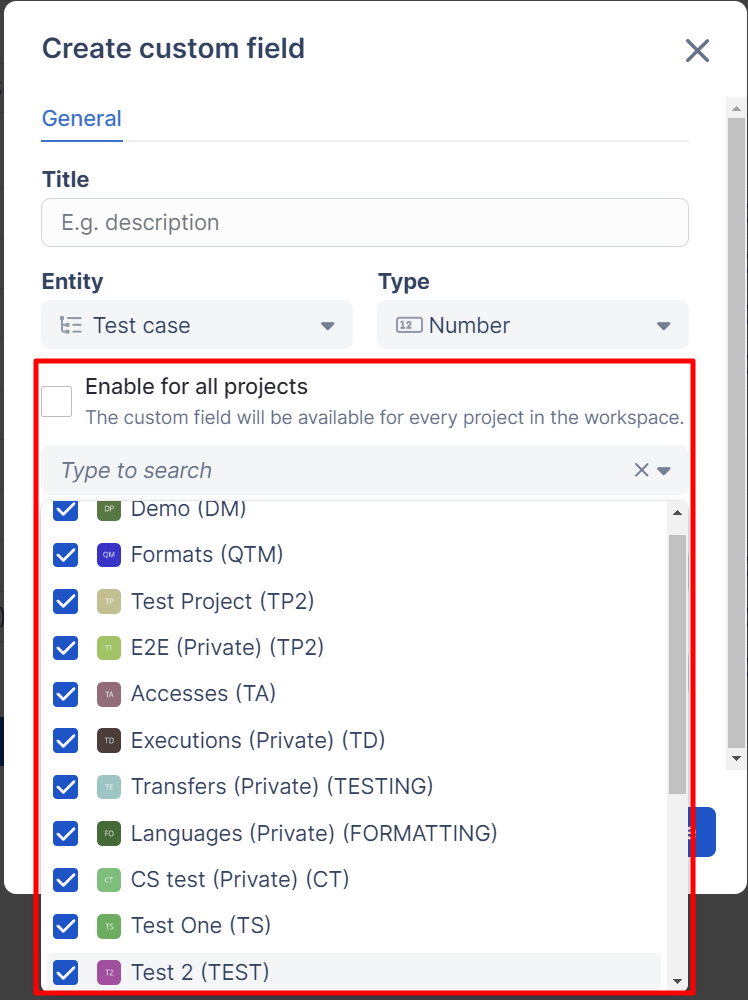
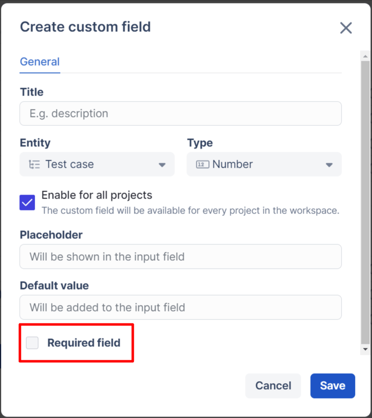
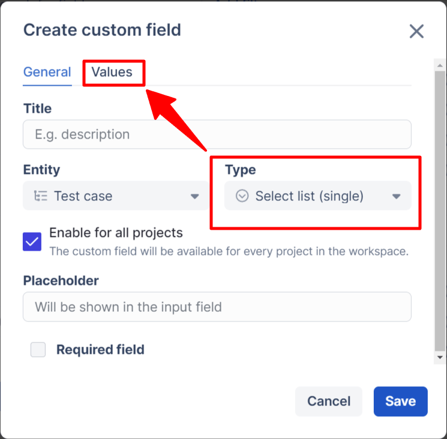
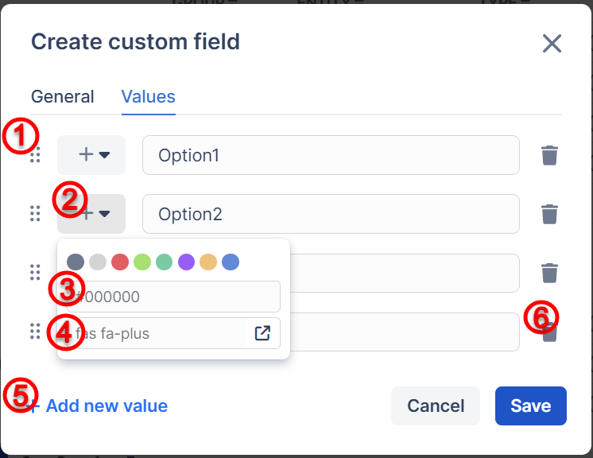
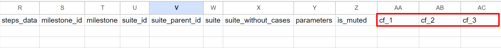

# Custom fields


Custom Fields are available in [Startup](../subscriptions/startup-plan.md), [Business](../subscriptions/business-plan.md), and [Enterprise](../subscriptions/enterprise-plan.md) subscriptions


### What are custom fields in Qase?

Obviously, test scenarios come with all varieties of data connected to them. It is pretty much impossible for us at Qase to predict every single data point you want to record for your [Test Cases](https://docs.qase.io/general/get-started-with-the-qase-platform/create-a-test-run), [Test Runs](https://docs.qase.io/general/get-started-with-the-qase-platform/create-a-test-run-1), or [Defects](https://docs.qase.io/general/get-started-with-the-qase-platform/defects).&#x20;

So instead of trying to cover all bases or giving a bare minimum, we provide you with Custom Fields - a tool to create your own custom data entry points.



You'll need to create these Custom Fields first to be able to fill them in. To get started, navigate to the Workspace settings' "Fields" section:

<figure><figcaption></figcaption></figure>

### Create custom fields

Create a new Custom Field by clicking "+ Create New Custom Field", configure your Custom Field, and define what it will be representing:

* _Title:_ give a brief descriptive name to your Custom Field (Title is the only mandatory parameter).\

<figure><figcaption></figcaption></figure>

* _Entity:_ define which Qase entities your Custom Field will apply to - Test Cases, Test Runs, or Defects. This parameter is a single-choice one, so you cannot select "Test Cases" AND "Test Runs"; if you need to track similar data for both Runs and Cases, you'll need to create two separate Custom Fields for that.

<figure><figcaption></figcaption></figure>

* _Type:_ select from a dropdown which data type will be used in this Custom Field. Depending on the type of data selected, the options below will be different.\
  **​**_**NB:** once a custom field has been created, its type cannot be changed._

<figure><figcaption></figcaption></figure>

* _Enable for all projects:_ choose which Projects your custom field should be applied to. If you have to capture the same data uniformly in multiple projects, you don't have to create duplicates of a field for each project - create a custom field once and apply it to various projects:

<figure><figcaption></figcaption></figure>

* _Placeholder:_ provide a sample value that will be appearing in a field in a faded color, while the Custom Field remains empty. This can help avoid confusion about what should go into the field.\

* _Default value:_ to avoid having Custom Fields left blank, you can automatically insert a default value

<figure><figcaption></figcaption></figure>

* _Required field_ checkbox: checking this box will make a field mandatory; an entity with such Custom Field will not be created until Custom Field is filled in.

<figure><figcaption></figcaption></figure>

* _Values:_ Available for Multiselect and Selectbox types of data, this area allows you to define values to choose from when filling out a custom field:

<figure><figcaption></figcaption></figure>

Creating Values:

1. Click and hold the 6 dots to drag and drop your values when organizing their order.
2. Click the default "plus" icon to open the icon customization options.
3. You can choose from the default colors or input the Hex color code for the icon.
4. You can enter the icon code starting with "fas fa-" followed by the icon name chosen from the provided external link.
5. Add a new value input field
6. Delete a value input field

<figure><figcaption></figcaption></figure>

When exporting into CSV, your Custom Fields will appear as new columns on the far right of your CSV file.​They will be named "`cf_1`", "`cf_2`", "`cf_3`"... following the order of creation of your custom field in your Workspace Fields settings.

<figure><figcaption></figcaption></figure>

***

### Sort the Custom Fields 

By default, custom fields are arranged in chronological order based on their creation time, meaning the most recently created field appears at the bottom of the list.

However, if you want certain fields to be displayed at the top for easier access, you can adjust their order.

<figure><figcaption></figcaption></figure>

To do this, go to Workspace > Fields, select any custom field, and update its order value to change its position.

<figure><figcaption></figcaption></figure>

You can also sort the list by the order field to view the updated arrangement.

<figure><figcaption></figcaption></figure>

