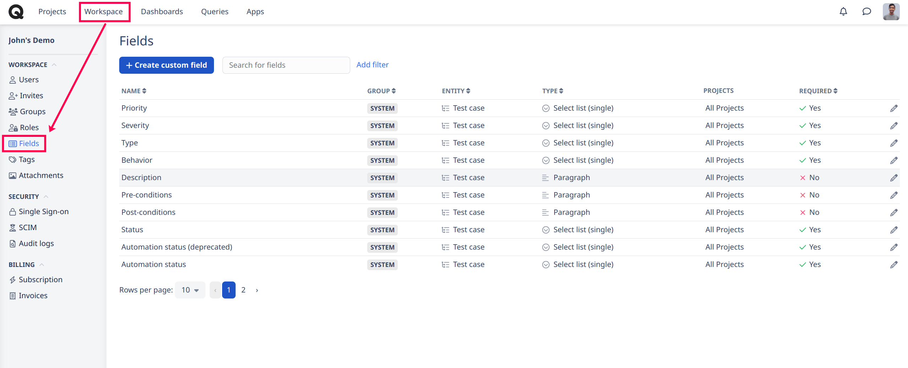
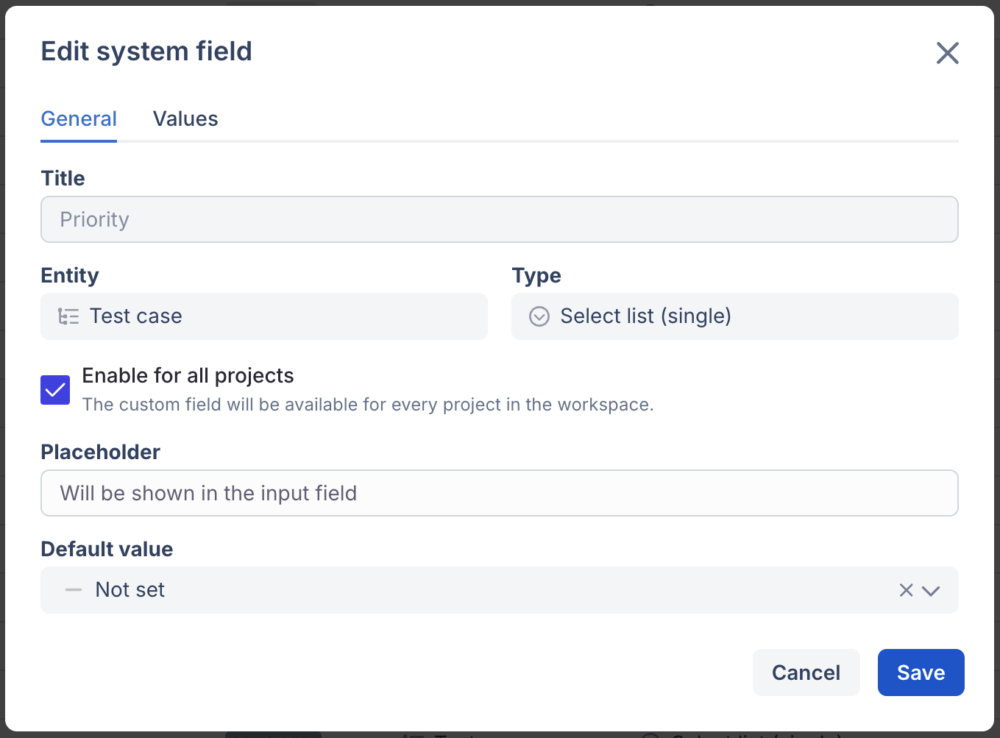
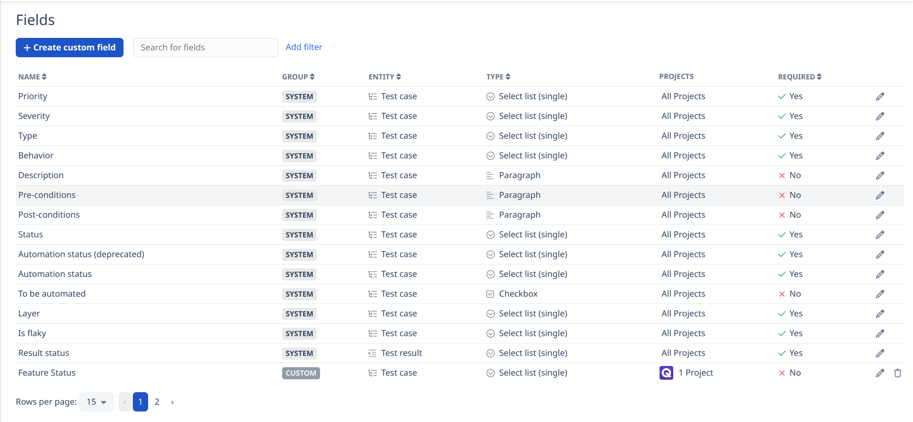
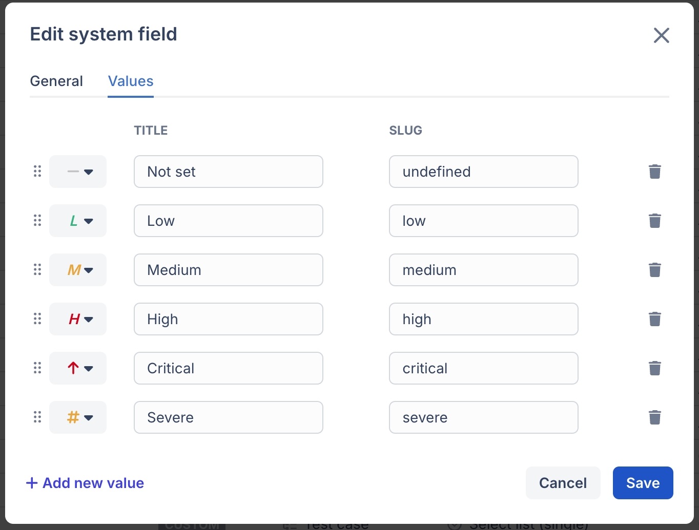

# Fields

### What are the fields for?

The Fields section of the Workspace allows the user to manage system fields and custom fields pertaining to the workspace.

In the fields section, you can create, edit or view all system and custom fields that exist in the workspace.



### Accessing Field settings 

There are multiple options available to you to access the field section.

1. Click on “Fields” in the workspace page

<figure><figcaption></figcaption></figure>

2. Click on “Configure fields” when creating or editing a test case.

<figure><figcaption></figcaption></figure>

### System fields 

A system field can be, optionally, switched OFF via the <a href="https://app.qase.io/workspace/fields">fields </a>section.

<figure><figcaption></figcaption></figure>

<table data-header-hidden><thead><tr><th width="204">Field</th><th>Description</th></tr></thead><tbody><tr><td>Priority</td><td>choose your test cases' priority. Eg- <em>Low, Medium, High, or Not Set</em></td></tr><tr><td>Severity</td><td>options for your test cases' severity. Eg- <em>critical, blocker, normal etc</em></td></tr><tr><td>Type</td><td>select the types of testing that are applicable for your test case</td></tr><tr><td>Behavior</td><td>can be either Destructive, Negative, Positive, or Not Set</td></tr><tr><td>
Description;

Pre &#x26; Post conditions
</td><td>to provide additional details for more context about a test case</td></tr><tr><td>Status</td><td>can be either Active, Draft, or Deprecated</td></tr><tr><td>Layer</td><td>options to pick a layer for the test case, whether it's <em>an</em> <em>end-to-end, API, or a unit test</em></td></tr><tr><td>Is Flaky</td><td>if a test case is unstable, you can mark it as flaky</td></tr><tr><td>Automation Status</td><td>you can choose from Automated, or Manual</td></tr><tr><td>To be automated</td><td>a checkbox property only available for those cases that have Automation status set to Manual.</td></tr><tr><td>Result Status</td><td>a test runs field, for all possible result statuses that can be added to a test case.</td></tr></tbody></table>


There is also the possibility to modify the values of system fields (available on the [Startup](../subscriptions/startup-plan.md), [Business](../subscriptions/business-plan.md), and [Enterprise](../subscriptions/enterprise-plan.md) plans):


<figure><figcaption></figcaption></figure>

### Custom fields 


Custom Fields are available in [Startup](../subscriptions/startup-plan.md), [Business](../subscriptions/business-plan.md), and [Enterprise](../subscriptions/enterprise-plan.md) subscriptions


It is difficult to predict the unique parameters or properties your Test Case, Test Run, or Defects might require. Custom Fields can help.

Create your own Custom Fields of various data types to store any additional information about your test cases, test runs, or defects not covered by default properties.

If you haven't created any Custom Fields yet, you won't see this section in the Test Case, Test Run, or Defects configuration.
