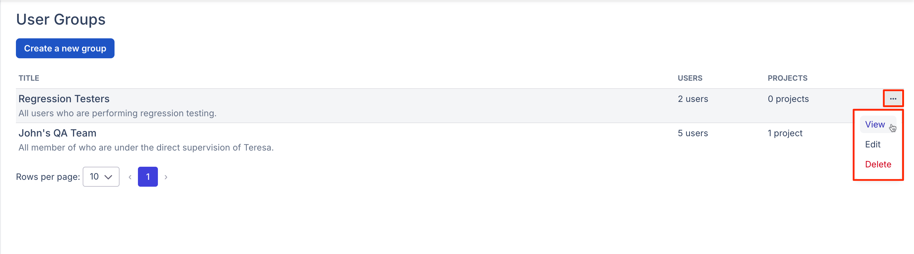

# Groups

**Groups** are a way to categorize your account users by the team they belong to, responsibilities, or team lead - in other words, by any arbitrary characteristic that you deem important.



## Create a new user group 

To create a new User Group, click "Groups" in the Workspace Management left-hand bar and then hit "Create a new group."

<figure><figcaption></figcaption></figure>

In the creation menu, give your new User Group a title and a description - both fields are mandatory.&#x20;

You can add users into the group and also select the projects they have access to while setting it up. When you are ready with creating a group, hit "Create":

<figure><figcaption></figcaption></figure>

After creating a User Group, you will see it in the groups' list with its description and members' number. Under the three-dots menu button, you can View, Edit, or Delete a user group:

<figure><figcaption></figcaption></figure>

* In "View," you can get more details about the members of user group, add new members to a user group, or delete those who should no longer be in it.\

<figure><figcaption></figcaption></figure>

* In "Edit," you can go back to adjusting a user group's title and description.

<figure><figcaption></figcaption></figure>

* "Delete" removes the User Group, but it does not delete or deactivate any users that were a part of it. However, when you attempt to delete a User Group, you will be suggested to move all of its current members into a different User Group (if you have more than one). Alternatively, you can "Do Nothing" and go ahead with deletion:

<figure><figcaption></figcaption></figure>

### Usage 

After creating a user group, you can share a project wit ha group both when you [create a new project](https://docs.qase.io/general/get-started-with-the-qase-platform/create-a-project) and after a project has been created.

While creating a project, you will see the option to “add members from a specific group”. Once you select this option, you will see a dropdown list of the groups you’ve created. Select the one you would like to add to this project and proceed further.

<figure><figcaption></figcaption></figure>

To manage project sharing through groups after project creation, navigate to the project settings. Within the 'General' tab, you will find the option to share a private project with a specific group.

Make sure to click Update Settings after you are done making the changes you want for it to be saved.
