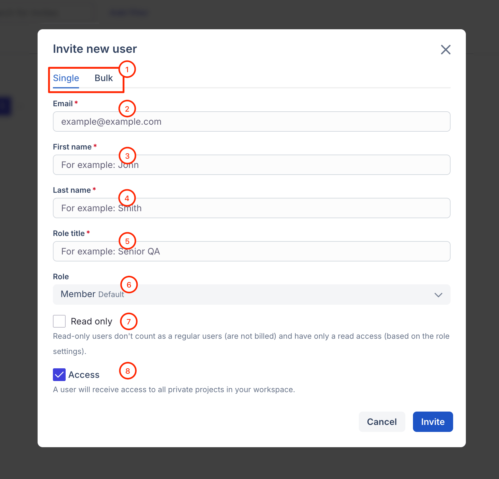
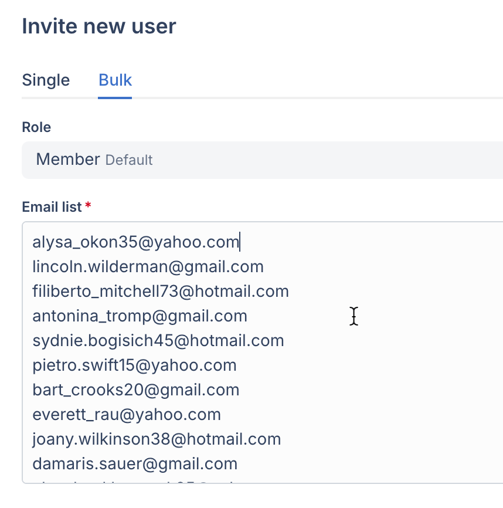

# Invites

### What is "Invites" tab for?

"Invites" tab of the workspace settings allows you to invite new members and find or revoke all the invitations that have been issued but have not yet been accepted.



### How to invite a new member? 

To invite a new teammate, click "Invite new member" in the "Invites" tab:

<figure><figcaption></figcaption></figure>

Let's take a look at all the available options:

<figure><figcaption></figcaption></figure>

1\. You can invite a single user, or invite all of your team at once, from the the Bulk tab.

2\. Enter the email address of the team mate you're inviting here.

3, and 4.  Enter their First and Last name.

5\. Enter their Role's Title (_Please note, this will not be their role, it's just for reference only)_

6\. Select the Role you would like them to have, on Qase. Default is "Member"

7\. Select this box if you want to invite this user as "Read-only"

8\. ❗️ Make sure to uncheck the box before sending an invitation, if a new member should only have a limited scope of projects to have access to – otherwise, they will automatically gain access to every project in Qase upon joining.


When inviting users in Bulk – each email should be **separated by a line break**. See example below.


<figure><figcaption></figcaption></figure>
