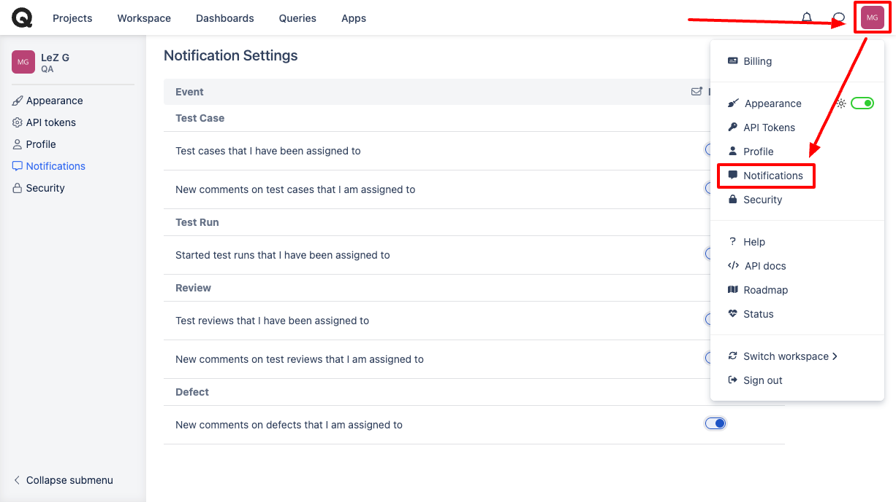
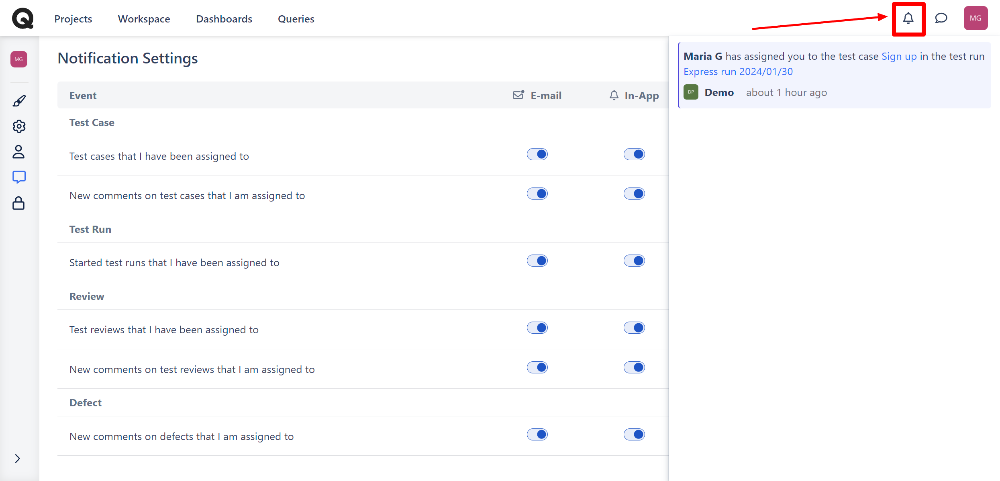

# Notifications



To stay on top of the important updates occurring in your Qase workspace, make sure to set up the notifications. ​ To access your email notification settings:

1. Navigate to your profile icon on the top right corner of your screen ​
2. In the provided options, look for "Notifications" which should show the screen below.

<figure><figcaption></figcaption></figure>

These settings are for various activities related to test cases, test runs, reviews, and defects.

| Entities   | Events                                                                                                                                                                                                                                                                                                      |
| ---------- | ----------------------------------------------------------------------------------------------------------------------------------------------------------------------------------------------------------------------------------------------------------------------------------------------------------- |
| Test Cases | 
<strong>a. Test Cases Assigned to You:</strong>

Receive email notifications when you are assigned to new test cases. ​

<strong>b. New Comments on Your Assigned Test Cases:</strong>

Receive email notifications when new comments are added to test cases you are assigned to.
 |
| Test Runs  | 
<strong>a. Started Test Runs Assigned to You:</strong>

Receive email notifications when a test run you have been assigned is started.
                                                                                                                                                          |
| Reviews    | 
<strong>a. Test Reviews Assigned to You:</strong>

Receive email notifications when you are assigned to test reviews.  <strong>b. New Comments on Your Assigned Test Reviews:</strong>

Receive email notifications when new comments are added to test reviews you are assigned to.
 |
| Defects    | 
<strong>a. New Comments on Your Assigned Defects:</strong>

Receive email notifications when new comments are added to defects you are assigned to.
                                                                                                                                             |

Consider triggering a test notification for each category to verify that your email notifications are set up correctly. Depending on the notification type, create a test case, add comments, start a test run, initiate a review, or comment on a defect. Check your email inbox for the corresponding notifications to confirm that the settings work as expected.

<figure><figcaption></figcaption></figure>

\
Following these steps, you can tailor your email notifications to inform you about the activities that matter most in your testing and review processes.

\
