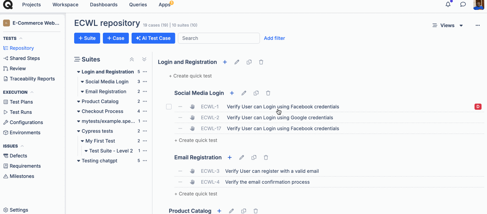
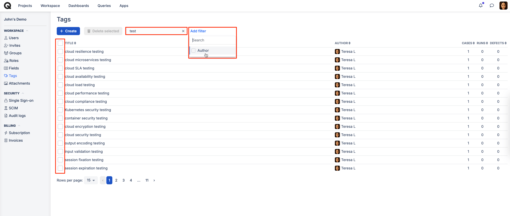

# Tags

### What are tags used for?

Tags allow you to label your test cases, defects and test runs.



### How to create a tag? 

You can create new tags in a few ways:

1. While editing a test case via the sidebar

<figure><figcaption></figcaption></figure>

2. While creating/editing a test case via create/edit form:

<figure><figcaption></figcaption></figure>

3. While creating/editing a test run:

<figure><figcaption></figcaption></figure>

4. While creating a defect manually:

<figure><figcaption></figcaption></figure>

5. In workspace, go to tags. Tags created using this method can be applied to any entities during editing.

<figure><figcaption></figcaption></figure>

When adding a tag to any entity, you can also choose from one of the existing tags from the suggestions in the dropdown.

## Manage Tags 

***

All existing tags can be found in [Workspace >> Tags](https://app.qase.io/workspace/tags), where you can also search, filter and delete them in bulk.

On the right, you can see the number of entities each tag has been applied to.

<figure><figcaption></figcaption></figure>

## Bulk Edit Tags 

***

You can manage tags for multiple test cases simultaneously. With Bulk Edit, you can:

* **Add new tags** to multiple test cases at once.
* **Remove selected tags** from multiple test cases.

<figure><figcaption></figcaption></figure>

If you need to replace existing tags with new ones, you can do so by first removing the old tags and then adding the new ones. To make this process easier, your selection of test cases is preserved even after the update.
