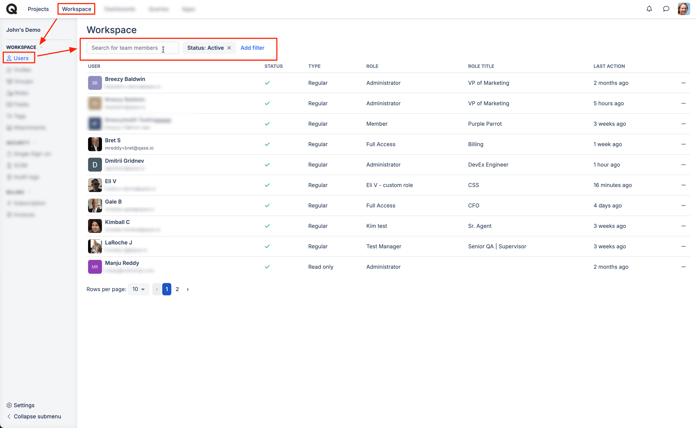
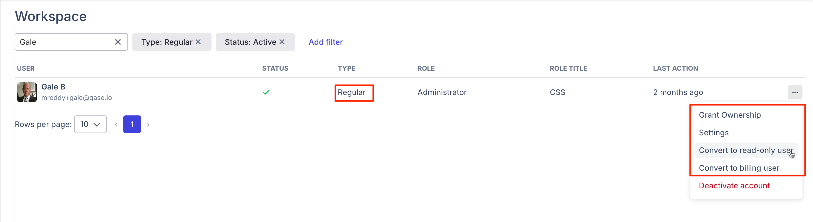
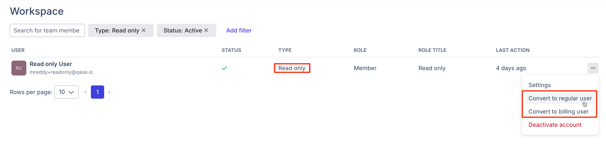
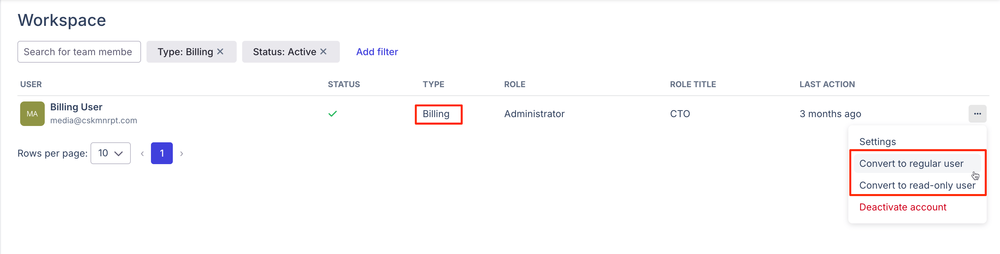
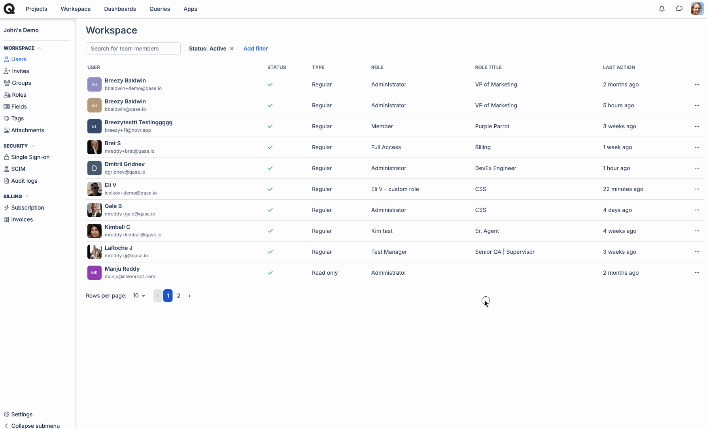

# Users

What is "Users" tab in Qase?

Users is a section of workspace management where you can manage the users of your workspace, deactivate or reactivate them, change their roles.



### What types of licenses can be provided to users?

There are three types of licenses you can grant to users:

<table data-header-hidden><thead><tr><th width="139">Type</th><th>Description</th></tr></thead><tbody><tr><td>Regular</td><td>this is the main type of license - a regular user is a fully capable user with access to all functionality (within the limits of what their <a href="roles.md">User Role</a> permits)</td></tr><tr><td>Read-only</td><td>a user with limited capabilities, only able to view the items they have access to and leave comments on <a href="../../general/get-started-with-the-qase-platform/test-cases/">Test Cases</a>, <a href="../../general/issues/defects.md">Defects</a>, and <a href="../../general/get-started-with-the-qase-platform/test-cases/test-case-review.md">Test Case Reviews</a> - but not able to create, modify or delete any entities.</td></tr><tr><td>Billing</td><td>a user with limited capabilities, only able to see the Workspace: <a href="../billing/">Billing section</a>, but not other entities; the purpose of such a user is to manage the subscription, invoices, and payment methods.</td></tr></tbody></table>


You cannot invite someone as a billing user - you can only convert an existing regular or read-only user into a billing user.


### Existing users directory 

All of the existing users in your account can be found in the Users section. Use the filters to look up users by their Status (Active or Inactive), Type (Regular, Read-only, Billing) and Role (Owner, Administrator, and Member).

<figure><figcaption></figcaption></figure>

For each user you see, there are details about their status (green check and red cross), type (regular, billing, and read-only), role, role title, and how long ago their last action was logged.

There are additional actions that can be performed on each user - if you click the three-dots menu button on the right from user details:

* You can convert an active user into a read-only or billing user (if they are a regular user) or a regular user (if they are read-only or billing user at the moment) or billing user (if they are read-only or regular user)

<figure><figcaption></figcaption></figure>

<figure><figcaption></figcaption></figure>

<figure><figcaption></figcaption></figure>

* You can deactivate or activate a user account

<figure><figcaption></figcaption></figure>

* You can go to user settings to adjust their name, role title, and role

<figure><figcaption></figcaption></figure>

* You can also grant ownership (if you are the owner) to any other regular user

<figure><figcaption></figcaption></figure>

