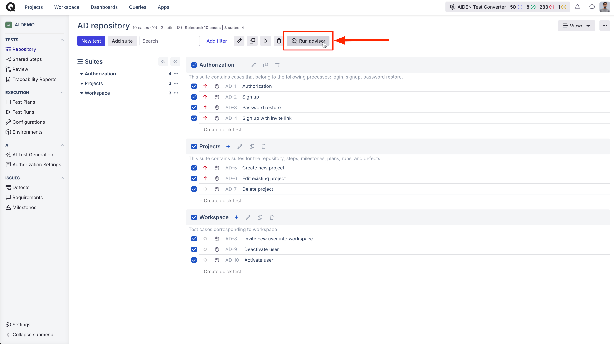
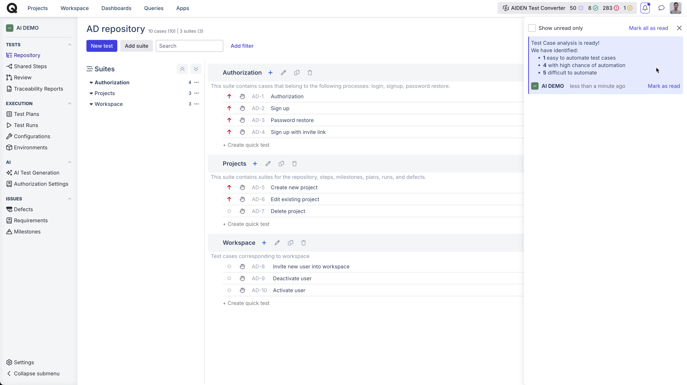
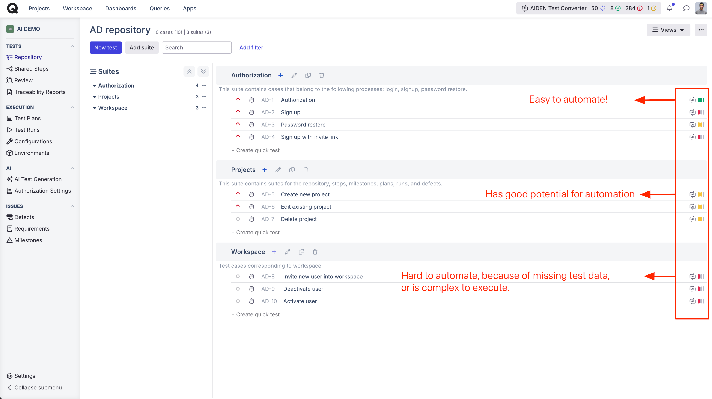
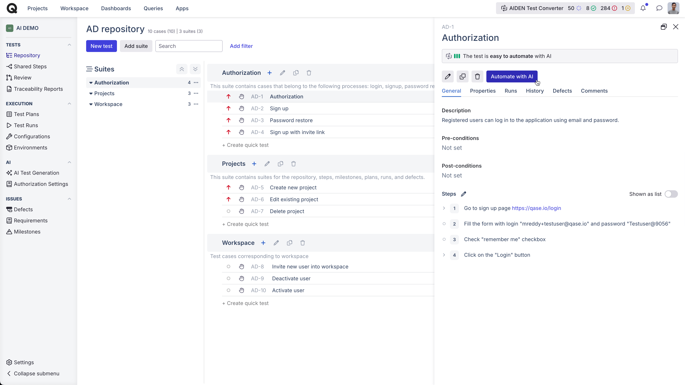
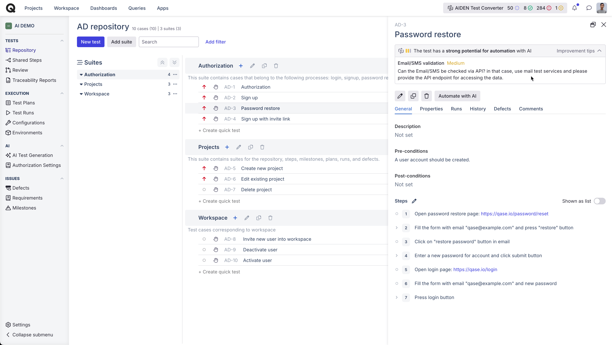
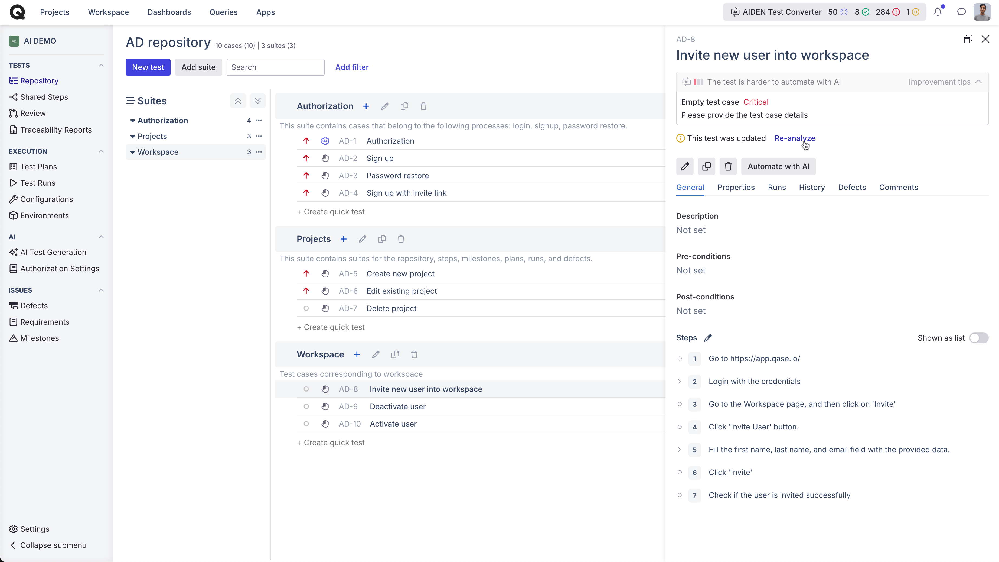
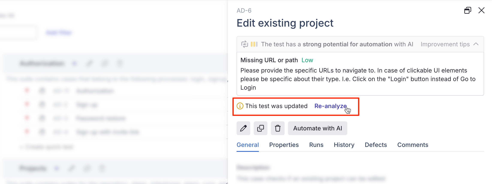

# Test Advisor

Every repository has some test cases are perfect for automation — they’re stable, repetitive, and save a huge amount of time when automated.

Test Advisor helps you quickly identify these high-value tests, so you can focus on what brings the biggest impact with the least effort.

To start the advisor, select all the suites or test cases, and click 'Run Advisor' button:

<figure><figcaption></figcaption></figure>

The analysis will take a moment, so feel free to sit back or tackle other tasks. AIDEN will automatically notify you with a summary as soon as it’s done.

<figure><figcaption></figcaption></figure>

Let's understand the results:

<figure><figcaption></figcaption></figure>

Green: These test cases are easy to automate, with minimal or no oversight.

<figure><figcaption></figcaption></figure>

Yellow: Test case has good potential for automation, it may be missing information.

<figure><figcaption></figcaption></figure>

Red: This test case lacks essential details, such as test steps, or involves complex logic that makes automation challenging.

<figure><figcaption></figcaption></figure>

Based on the suggestions from AIDEN, once you edit your test cases that are not in Green, you can 'reanalyse' them.

<figure><figcaption></figcaption></figure>

<figure><figcaption></figcaption></figure>

After reading this article, please check:

* ### [AIDEN - QA Architect](qa-architect.md) 
