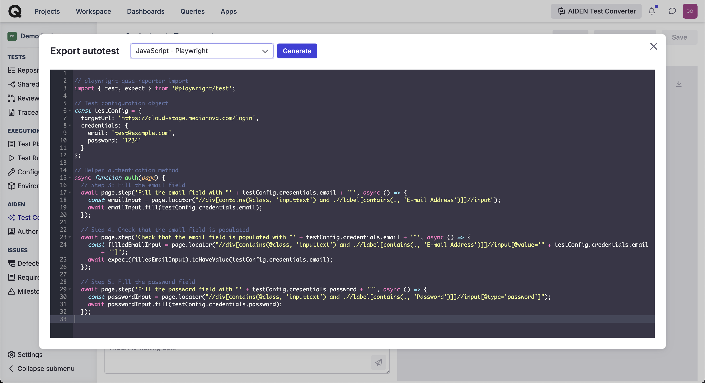

# AIDEN - QA Architect


For pricing details, check [AIDEN pricing: explained](https://help.qase.io/en/articles/11737411-aiden-pricing-explained).


While Manual testing has been the cornerstone of software quality for decades, it is slow, costly, and error-prone. And, traditional test automation requires deep technical expertise, extensive infrastructure, and ongoing maintenance — and these are barriers that prevent many teams from adopting it effectively.

AIDEN eliminates these challenges by allowing users to create, execute, and maintain automated tests using natural language instead of working with code.

By leveraging Generative AI, AIDEN transforms test descriptions into executable test scripts in Qase Cloud, runs them in parallel across multiple browsers.

With AIDEN, you can analyse your repository, generate automated test code from your manual test cases, and execute the tests in Qase Cloud.

***

## Repository Advisor 

Every repository has some test cases are perfect for automation — they’re stable, repetitive, and save a huge amount of time when automated.&#x20;

**Test Advisor** helps you quickly identify these high-value tests, so you can focus on what brings the biggest impact with the least effort.&#x20;

To start the advisor, select all the suites or test cases, and click '**Run Advisor**' button:

<figure><figcaption></figcaption></figure>

<figure><figcaption></figcaption></figure>

The analysis will take a moment, so feel free to sit back or tackle other tasks. AIDEN will automatically notify you with a summary as soon as it’s done.

<figure><figcaption></figcaption></figure>

Let's understand the results:

<figure><figcaption></figcaption></figure>

Green: These test cases are easy to automate, with minimal or no oversight.

Yellow: Test case has good potential for automation, it may be missing information.

Red: This test case lacks essential details, such as test steps, or involves complex logic that makes automation challenging.

Based on the suggestions from AIDEN, once you edit your test cases that are not in Green, you can 'reanalyse' them.

<figure><figcaption></figcaption></figure>

<figure><figcaption></figcaption></figure>

***

## Let's start automating! 

### **a) Convert an existing Manual Test**&#x20;

Open any test case, and click the 'Automate with AI' button to begin:

<figure><figcaption></figcaption></figure>

#### Adding the environment 

Your tests will run at a specific domain, so let's add the host environment:

<figure><figcaption></figcaption></figure>

If your host environment is not accessible from the public internet, you can help Qase tunnel to your private environment, here's a script that will help you set it up:

👉 [https://github.com/qase-tms/qase-frp](https://github.com/qase-tms/qase-frp)

<figure><figcaption></figcaption></figure>

#### Authorization 

Most of test cases generally require authorization as a precondition. You can add your authorization steps and use them when starting auto-test generation.

<figure><figcaption></figcaption></figure>

<figure><figcaption></figcaption></figure>

#### Generation 

You can monitor the status and view the test case that is being used for generation at the top.

<figure><figcaption></figcaption></figure>

The generator works by first breaking down your manual test case steps into proper actionable steps.

A 'Success' or 'Failure' message is displayed for each step, along with a screenshot to communicate progress.

<figure><figcaption></figcaption></figure>

#### Edit Steps 

If generation fails for a step, the status is updated as 'Error' and the particular steps with the problem will have the Error description.

<figure><figcaption></figcaption></figure>

You can help AIDEN by editing the particular step. Click 'Edit steps' and just correct the step text in natural language.

You can also delete steps that are not needed, or even edit steps that are successfully generated if you need to change something.

Click 'Regenerate' and AIDEN updates the steps. If you edit a step that is not generated yet, it will simply update the step's text.

If edits are made to a step that is already generated, it'll restart generation from that step.

#### Action Editor 

For scenarios where the error is a bit complicated, for example, if an element is not recognized as a button, you can use the JSON Action Editor to debug the step.

Follow the link below to understand how the action editor works.

👉  [guide-action-editor.md](../guide-action-editor.md "mention")

<figure><figcaption></figcaption></figure>

#### Notification widget 

If you navigate away, to a different page in the middle of the generation. You can always check the progress from AIDEN's notification widget.

If the generation is successful, you can find the test case from the "For Review" tab.

Generation can also be paused. There's a tab to view all the test cases that are paused previously.

<figure><figcaption></figcaption></figure>

#### Review and Save 

Once all test steps are successfully generated, the entire execution can be reviewed from the final step's attachment.

<figure><figcaption></figcaption></figure>

Click 'Save' to complete the generate and save the test case to the repository. You can differentiate this test case from the rest of the manual test cases with this symbol.

<figure><figcaption></figcaption></figure>

### b) Creating an auto-test from scratch 

To create a new automated test from scratch, start by selecting ‘Automate with AIDEN’ from the ‘New test’ dropdown.

<figure><figcaption></figcaption></figure>

#### Start the conversation:

In this workflow, you interact with AIDEN using natural language. Simply tell AIDEN what to test, and it will translate your instructions into executable test steps.

<figure><figcaption></figcaption></figure>

Begin by providing the website or domain you want to test. For example, say: `let's use Google.com`

<figure><figcaption></figcaption></figure>

Define Your Steps:

AIDEN will break down your instructions into actionable steps and display visual feedback (screenshots) for each one. You can:

* Give simple actions like: “Click the ‘Gmail’ button”
* Or compound instructions like: “Enter ‘[support@qase.io](mailto:support@qase.io)’ in the search box, then click ‘Next’”

<figure><figcaption></figcaption></figure>

Each instruction is parsed and split into individual steps. As steps are generated, you’ll see both:

* A natural language summary of the action, as a step.
* A JSON block with selector and element type details

<figure><figcaption></figcaption></figure>

<figure><figcaption></figcaption></figure>

#### Deleting steps:

To delete a specific step, type for example: “Delete step 4”

<figure><figcaption></figcaption></figure>

## Download the test code 

You can copy or download the generated test code with the **Export code** option. This option is available on both the repository, and while generating the auto-test.

If you had already saved the test case, simply click the test case to open in preview, and use the '`Export autotest`' option.

<figure><figcaption></figcaption></figure>

Select the language and click '**Generate**' - it will take a quick moment to display the code. You can then copy or download the code.

<figure><figcaption></figcaption></figure>

With the 'automate with AIDEN' workflow, you'll always have the option to export the code, at any point during generation:

<figure><figcaption></figcaption></figure>

With the convertion workflow, the 'Export code' option will be active in two instances:

* Test is 100% converted; all steps are successfully generated

<figure><figcaption></figcaption></figure>

* Test is partially converted; a failure occurred at any step

<figure><figcaption></figcaption></figure>


Currently, code can only be exported to:

* **Javascript**
  * Playwright
  * Cypress


## Executing the automated tests 

To run the tests in Qase Cloud, simply select the tests from the repository for an express test run.

<figure><figcaption></figcaption></figure>

In this window, select 'Cloud' and proceed to choose the Environment, and Configuration options.

<figure><figcaption></figcaption></figure>

Depending on the browser configuration, multiple test runs will be created and the execution for the selected test cases will be begin the cloud immediately.

<figure><figcaption></figcaption></figure>

Once the tests are executed, the results will be posted back to the test run automatically.

<figure><figcaption></figcaption></figure>

A screenshot is captured at each test step along with a complete video of the entire execution, are attached to the result. You will also find a `.zip` file attached for the trace.
