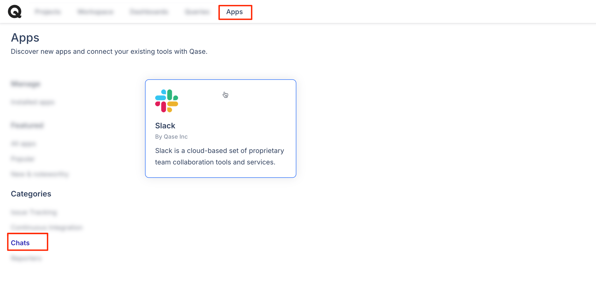
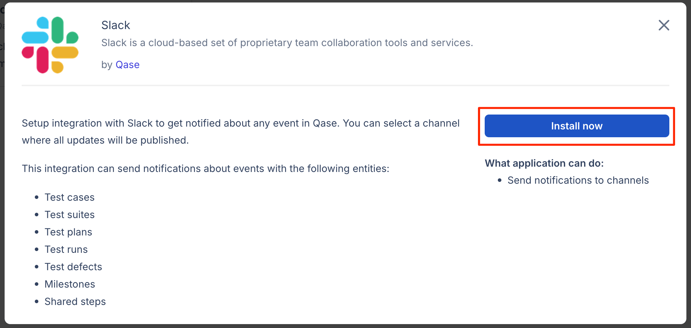
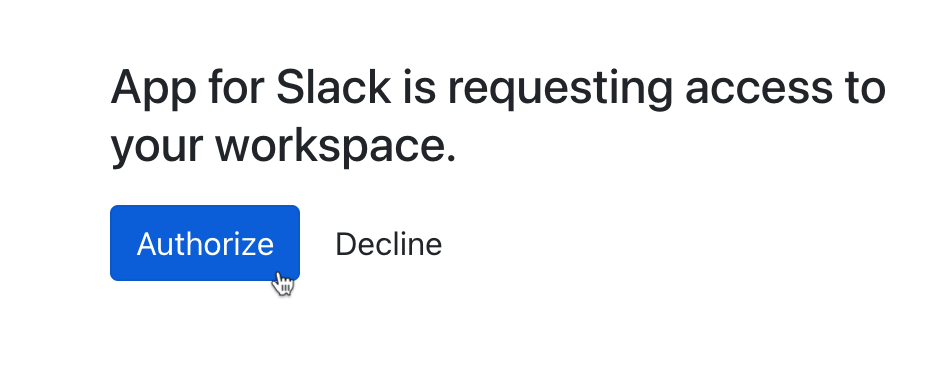
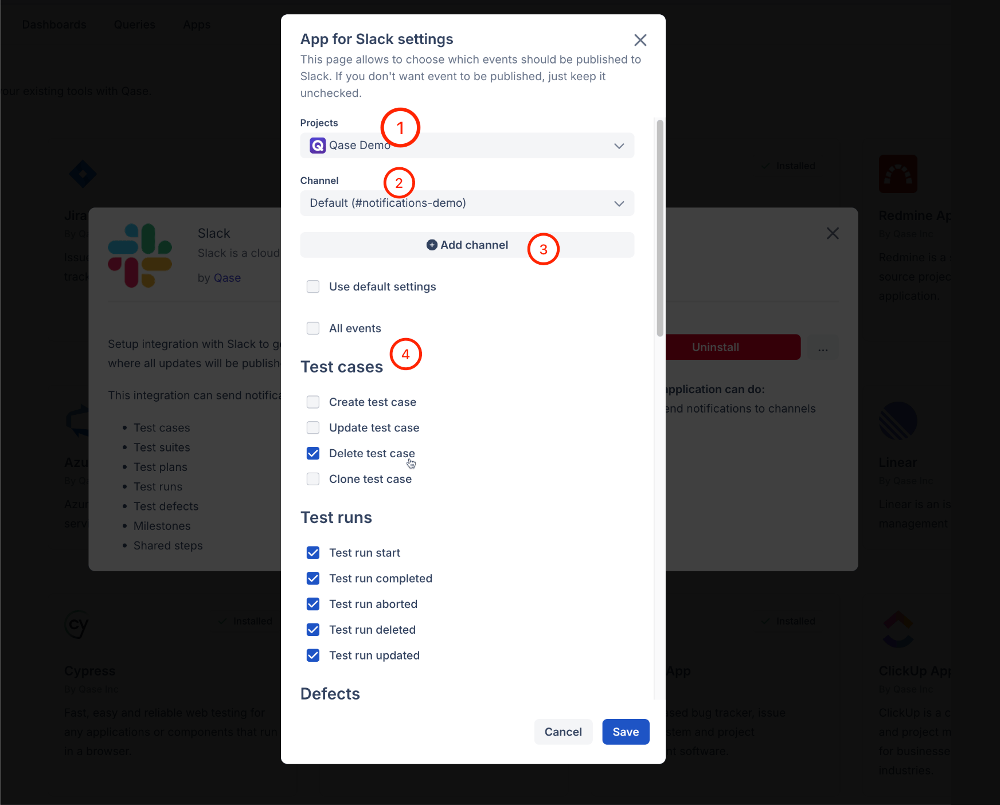

# Slack

## What is Slack?

[Slack](https://slack.com/) brings team communication and collaboration into one place so you can get more work done, whether you belong to a large enterprise or a small business.



### Why use Slack integration?

With the Slack app for Qase, you can be notified about important events in your Qase workspace.

## How to install Slack? 

1. Go to Apps in your Qase Workspace.

<figure><figcaption></figcaption></figure>

2. Click the Slack card and select “Install now”.

<figure><figcaption></figcaption></figure>

3. Sign in to Slack (if logged out).
4. Choose a channel for notifications and click “Allow”.

<figure><figcaption></figcaption></figure>

5. Authorize the app to complete the installation.

<figure><figcaption></figcaption></figure>

6. The app is now installed.

<figure><figcaption></figcaption></figure>

7. Click the Slack card again, then go to Settings to configure notifications.

<figure><figcaption></figcaption></figure>

\
1\) Each Qase project can have its own set of notifications and a specific Slack channel for notifications.

2, and 3) For every channel you want to receive notifications, you must grant permission when adding it.

4\) Start selecting all the events you want notifications for.
