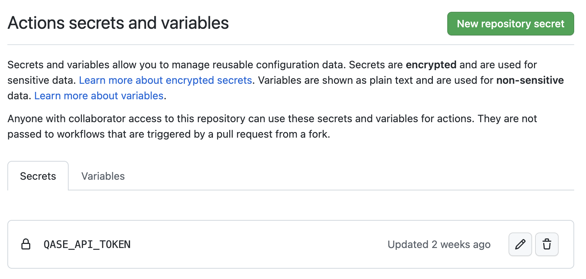
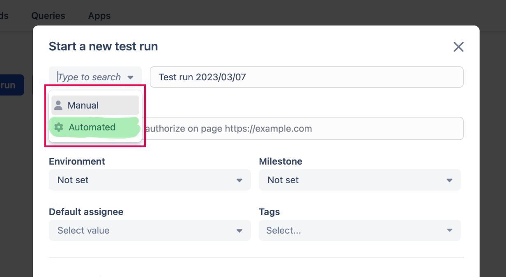
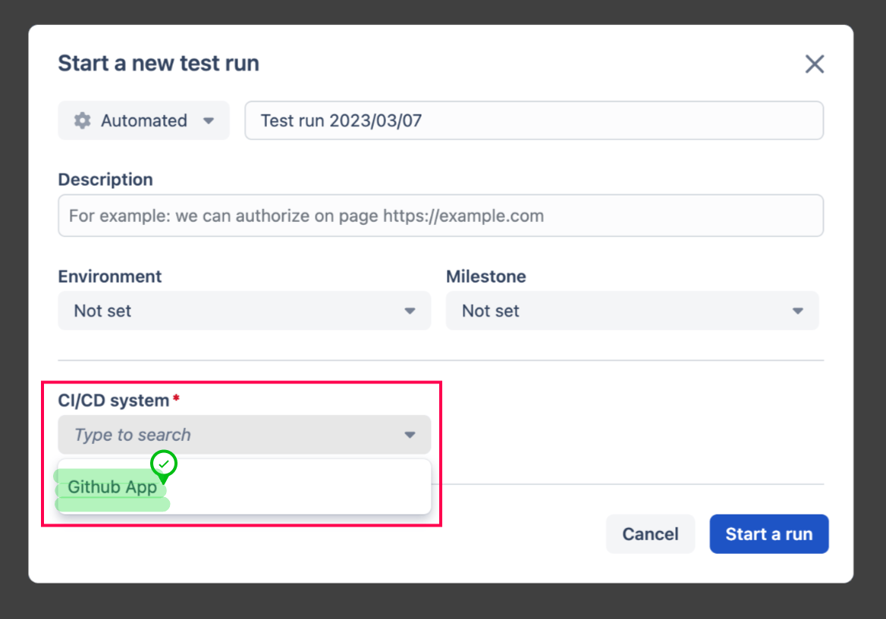
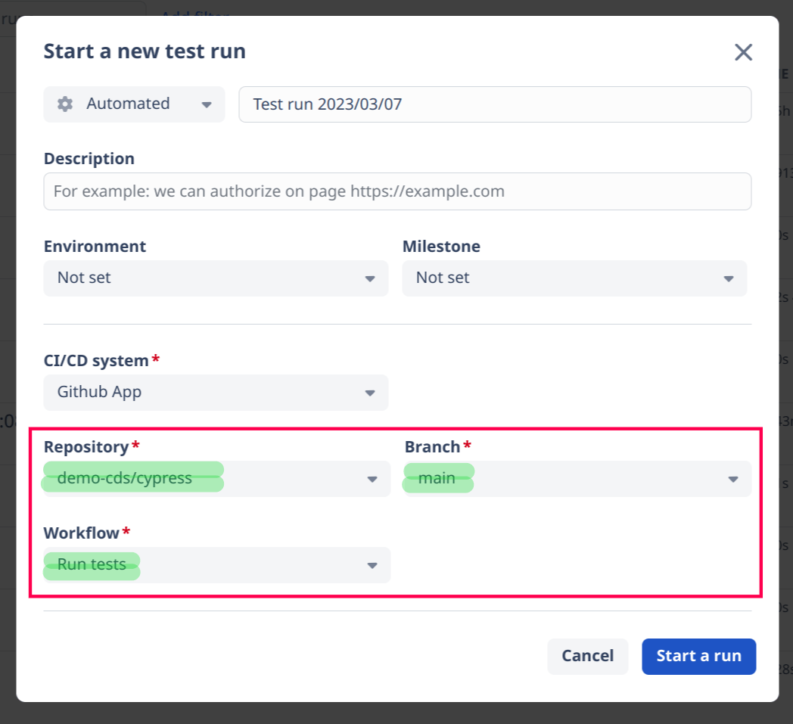
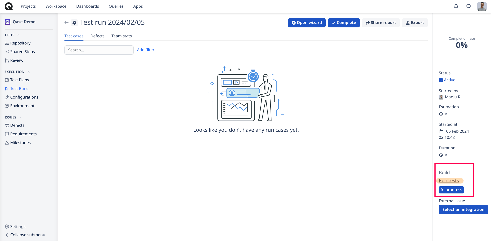
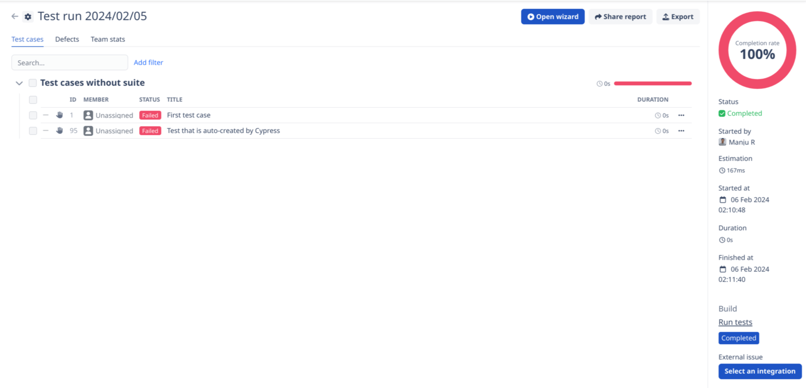
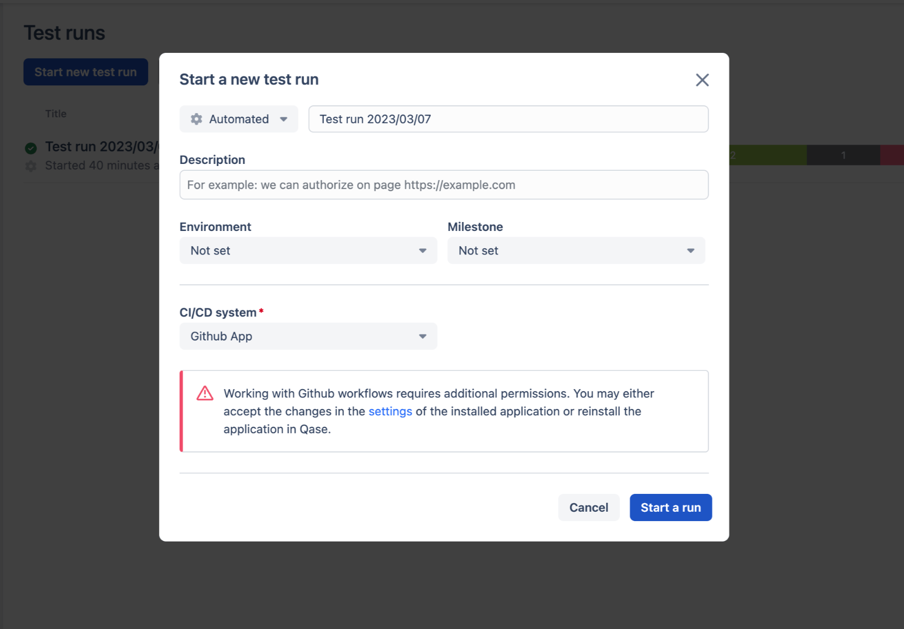

# GitHub CI

### What is GitHub?

[GitHub](https://github.com/) is a code hosting platform for version control and collaboration. It lets you and others work together on projects from anywhere.



## **CI/CD Workflows**

***

### a. Connect your Workflow <a href="#h_4ddff38ee0" id="h_4ddff38ee0"></a>

Follow these steps to connect a GitHub workflow to Qase:

1. One of Qase [reporter apps](https://help.qase.io/en/collections/3564516-apps#reporters) should be used in order to receive the test run results.
2. [Create a token](https://help.qase.io/en/collections/3564516-apps#reporters) in Qase and add it to the `QASE_API_TOKEN` secret in your [GitHub repository settings](https://docs.github.com/en/actions/security-guides/encrypted-secrets#creating-encrypted-secrets-for-a-repository).

<figure><figcaption></figcaption></figure>

3. The inputs and env variables that are required need to be defined in a workflow:


```yaml
name: Qase Tests
on:
  workflow_dispatch:
    inputs:
      qase_api_base_url:
        description: "Qase API URL"
        required: true
      qase_report:
        description: "Enabled/disabled reporting to Qase"
        required: true
      qase_project_code:
        description: "Qase project code"
        required: true
      qase_run_id:
        description: "Qase Run ID"
        required: true
      qase_run_complete:
        description: "Qase Run autocomplete"
        required: true

env:
  QASE_API_BASE_URL: ${{ inputs.qase_api_base_url }}
  QASE_TESTOPS_PROJECT: ${{ inputs.qase_project_code }}
  QASE_TESTOPS_RUN_ID: ${{ inputs.qase_run_id }}
  QASE_TESTOPS_RUN_COMPLETE: true
  QASE_TESTOPS_API_TOKEN: ${{ secrets.QASE_API_TOKEN }}
```


4. Add a step to the _**first place**_ in the job. It allows to link a GitHub workflow run with a Qase test run.\


```
jobs:
  test:
    timeout-minutes: 60
    runs-on: ubuntu-latest
    steps:
      - uses: cskmnrpt/qase-link-run@v2
        env:
          QASE_TESTOPS_API_TOKEN: ${{ env.QASE_TESTOPS_API_TOKEN }}
```

5. Add additional steps to execute your tests.


### b. Start an automated run <a href="#h_243d154c96" id="h_243d154c96"></a>

After the workflow is connected, you can initiate automated test runs from Qase:

1. From the Test runs screen, click "Start a new Test run", and choose the type as 'Automated'

<figure><figcaption></figcaption></figure>

2. Choose a CI/CD system to use (Github):

<figure><figcaption></figcaption></figure>

3. Fill in the required fields:

<figure><figcaption></figcaption></figure>

4. Click "Start a run" button.
5. You will be redirected to a test run you started. In the test run details section, you will see a link to the workflow run in GitHub and the current status.

<figure><figcaption></figcaption></figure>

6. When the tests have been executed, the test run will contain all the results sent by a reporter (it should be properly configured):

<figure><figcaption></figcaption></figure>

### GitHub Actions <a href="#h_0bc1726ce5" id="h_0bc1726ce5"></a>

GitHub Actions allows for reusable functions and workflows, enhancing automation and efficiency.

Qase offers the following actions, which can be integrated into your workflows to streamline tasks.

* [Create Qase test runs](https://github.com/qase-tms/gh-actions/tree/main/run-create)
* [Complete (close) Qase test runs](https://github.com/qase-tms/gh-actions/tree/main/run-complete)
* [Send test reports in JUnit, XCTest, Qase, and Allure formats](https://github.com/qase-tms/gh-actions/tree/main/report)
* [Create Qase environments](https://github.com/qase-tms/gh-actions/tree/main/env-create)
* [Create Qase milestones](https://github.com/qase-tms/gh-actions/tree/main/milestone-create)


### Troubleshooting: <a href="#h_d58df6962e" id="h_d58df6962e"></a>

If integration with GitHub has already been enabled before, it’s required to accept new permissions in the GitHub application settings.

In case of insufficient permissions after clicking on the “Start a run” button, a message with an error will appear.

<figure><figcaption></figcaption></figure>

### Useful resource <a href="#h_cdd81132bc" id="h_cdd81132bc"></a>

An example of Github integration: \
[https://github.com/qase-tms/qase-javascript/tree/master/examples/github-qase-integration](https://github.com/qase-tms/qase-javascript/tree/master/examples/github-qase-integration)
