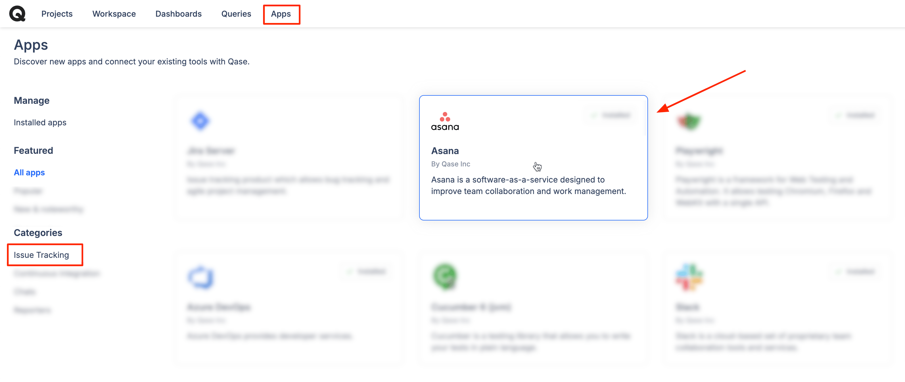
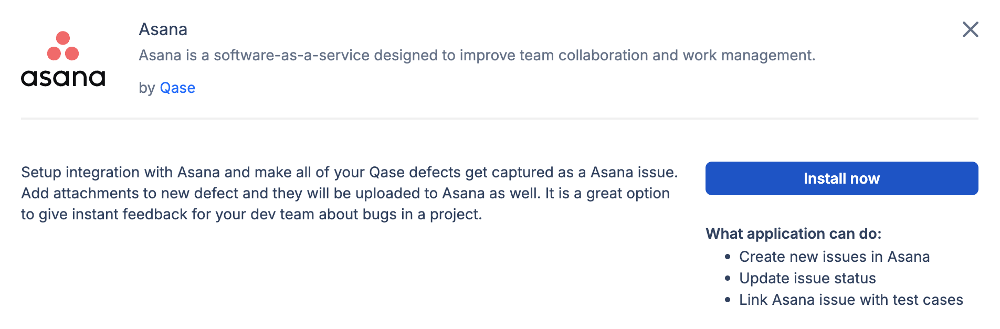
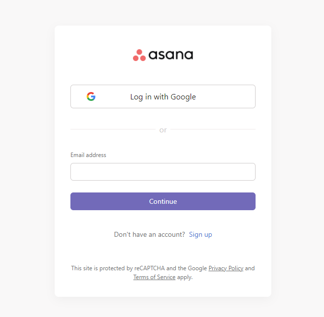
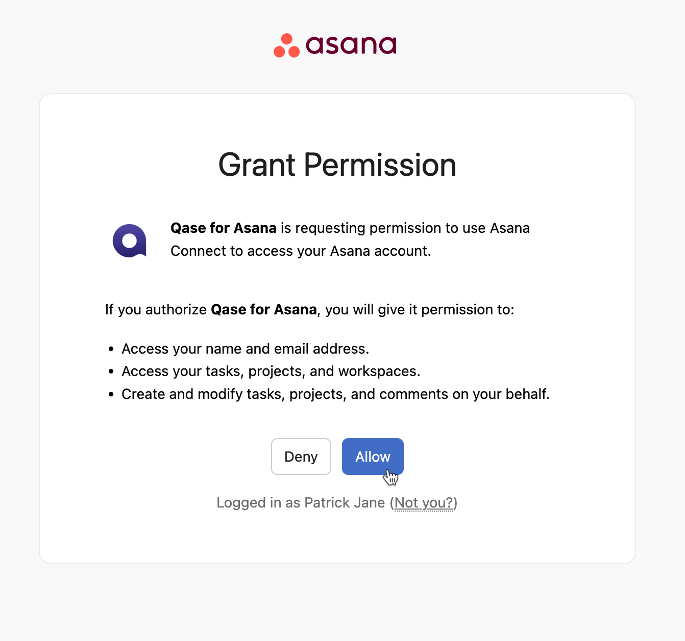
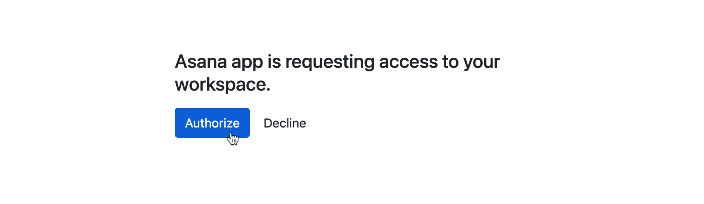
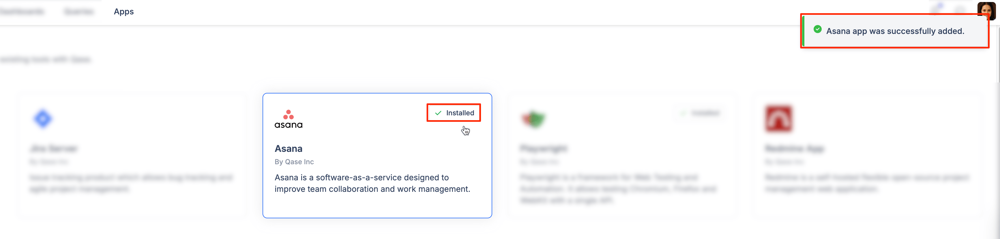
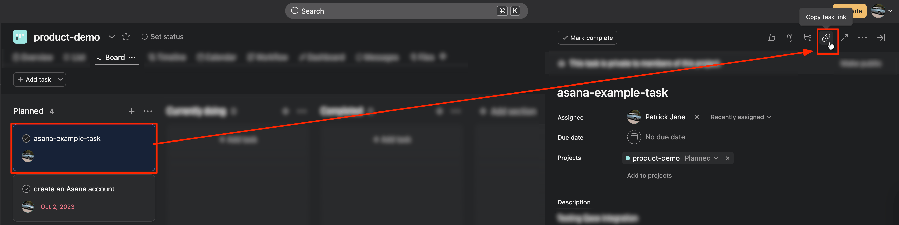
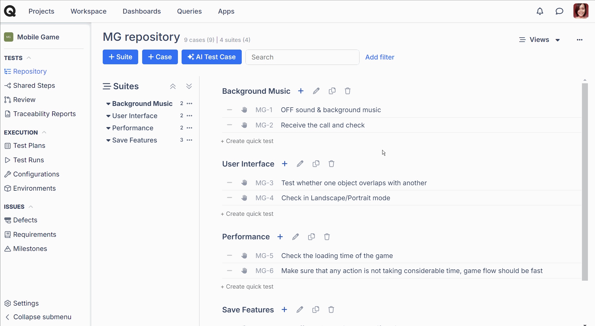
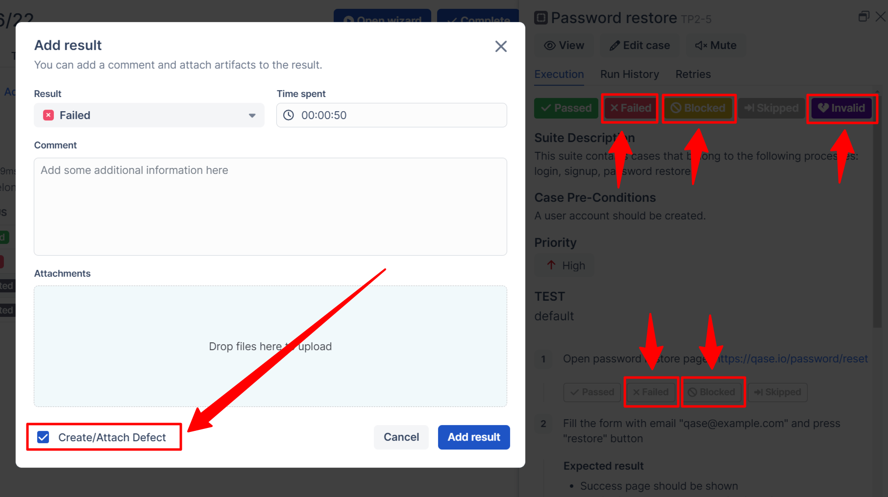

# Asana

### What is Asana?

[Asana](https://asana.com/) is a web and mobile work management platform designed to help teams organize, track, and manage their work.



### Why use Asana integration?

With the Asana app, you can:

* Link Qase [test case](../../general/get-started-with-the-qase-platform/test-cases/), [test run](../../general/get-started-with-the-qase-platform/create-a-test-run/), or [defects](../../general/issues/defects.md) to Asana tasks.
* Create a new Asana task or connect an existing Asana task when you file a [defect during a test run](../../general/issues/defects.md#h_357b732096) in Qase
* Sync status of a Qase Defect to a connect Asana task (i.e., as soon as you mark the defect as “Resolved” in a connected defect, the Asana Defect will be marked “Completed”).

### How to install Asana? 

1. &#x20;Click "Apps" in your Qase workspace
2. Click Asana card, then hit "Install now":

<figure><figcaption></figcaption></figure>

<figure><figcaption></figcaption></figure>

3\. Log into Asana, if you are currently not:

<figure><figcaption></figcaption></figure>

4\. Click "Allow" to grant access to Asana for the Qase app:

<figure><figcaption></figcaption></figure>

5\. After the redirect, hit "Authorize" to finalize the installation:

<figure><figcaption></figcaption></figure>

6\. The app is now successfully installed:

<figure><figcaption></figcaption></figure>

## Usage: 

***

First, copy your task link from Asana -

<figure><figcaption></figcaption></figure>

### 1. Linking a Qase test case: 

* In the repository, select a test case and in the right sidebar, switch to Properties
* Scroll down to the "Link with Apps" dropdown and select "Asana"
* Paste your Asana task link into the field then hit "Link"
* The linked Asana tasks will appear below the "Link With Apps" field
* To unlink the Asana task, click "x" next to the task's title

<figure><figcaption></figcaption></figure>

### 2. Linking a Qase test run: 

* Navigate to the Test run you want to link to Asana
* Click on "Select an Integration"
* In the Integration dropdown, select Asana
* Insert the Asana task link into the field and click "Link"
* The linked Asana tasks will appear below "External Issues"
* To unlink the Asana task, click on the Trash icon next to it and it will be unlinked:

<figure><figcaption></figcaption></figure>

### 3. Linking a Qase defect 

* Go to the Qase defect you want to link to Asana
* In the right sidebar, find the "Link with Apps" dropdown and select "Asana"
* Paste your Asana task link into the field then hit "Link"
* The linked Asana tasks will appear below the "Link With Apps" field and will also be visible from the main Defects view.
* To unlink the Asana task, click "x" next to the task's title

<figure><figcaption></figcaption></figure>

### 4. Create an Asana task from a Qase Test run: 

* Inside the test run wizard, marking your test steps or test case as "Failed" or "Blocked" (or "Invalid" for test cases) will provide you with the option to "Create/Attach Defect".

<figure><figcaption></figcaption></figure>

* In the Defect creation form, the “Choose Integration” is available when you "Use existing" or "Create new Defect. You can select "Asana" and click on "Add defect":
* Fill in the details including the Asana Workspace, Team (if any) and Project, then hit "Create":

<figure><figcaption></figcaption></figure>

* Or you can select "Link" from the top tab and paste your existing Asana task link and click "Link".
* In the Qase Defect, you will now have connected a new or existing Asana issue link.

<figure><figcaption></figcaption></figure>
