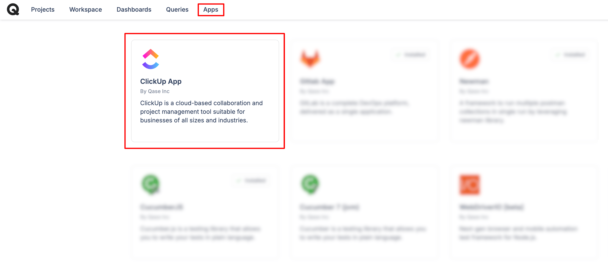
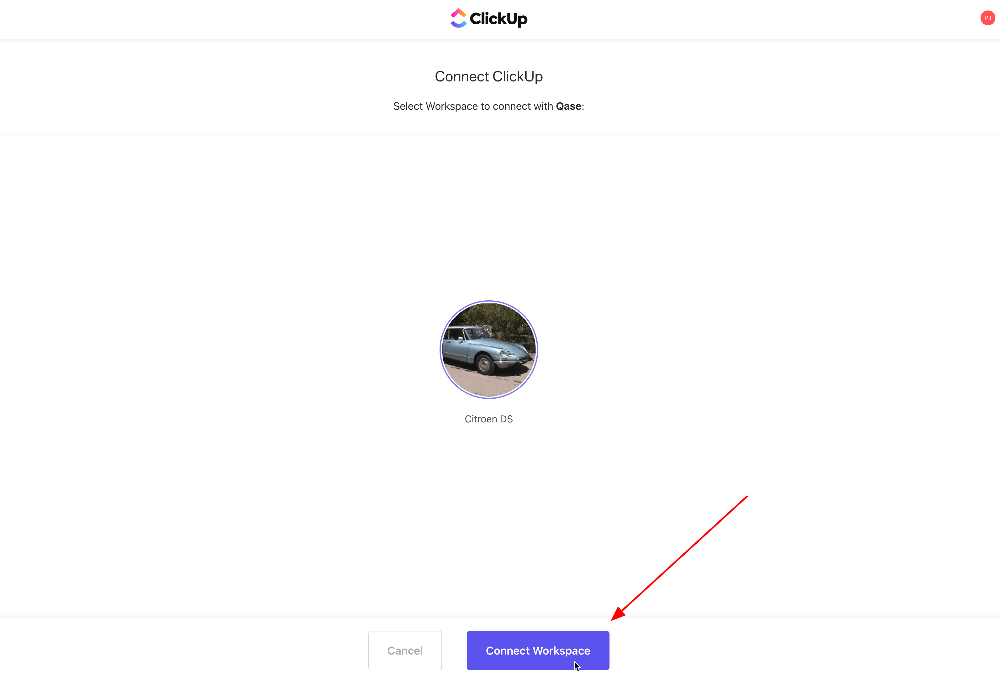
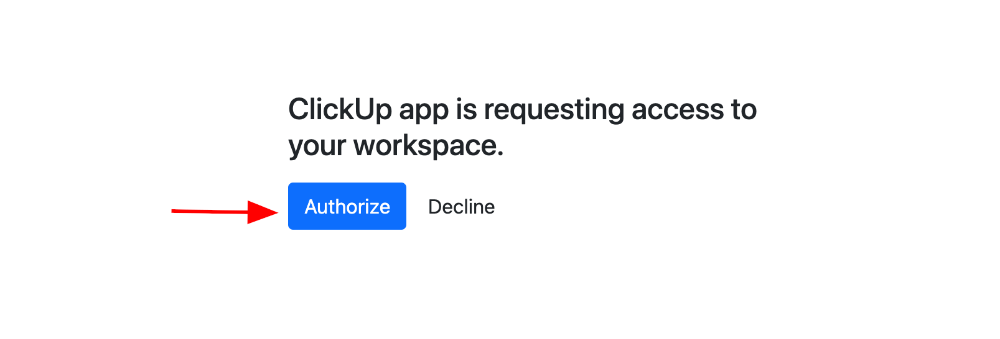

# ClickUp

### What is ClickUp?

[ClickUp](https://clickup.com/) is a cloud-based collaboration and project management tool suitable for businesses of all sizes and industries.



### Why use ClickUp integration?

With ClickUp app, you can:

* Link Qase [test cases](../../general/get-started-with-the-qase-platform/test-cases/), [test runs](../../general/get-started-with-the-qase-platform/create-a-test-run/), and [defects](../../general/issues/defects.md) to ClickUp issues.
* Create a new issue in ClickUp when you file a defect [during a test run in Qase](../../general/issues/defects.md#h_357b732096)

### How to install ClickUp? 

1\. From the "Apps" section in your workspace, select the ClickUp App, then hit "Install now"

<figure><figcaption></figcaption></figure>

2\. Log into ClickUp if you're already signed-in and click "Connect Workspace"

<figure><figcaption></figcaption></figure>

3\. On the next screen, click "Authorize" to complete the installation

<figure><figcaption></figcaption></figure>

4\. The app is now successfully installed

<figure><figcaption></figcaption></figure>

## Usage 

***

### Link your Qase Test Cases 

In your repository, click any test case to open its preview and switch to the Properties tab.

Scroll down to the "Link with Apps" section, and choose ClickUp. Then, proceed to search and link your issues.

Linked issues can be removed with the ( x ) icon

<figure><figcaption></figcaption></figure>

### Link your Qase Test runs 

Test runs can be linked to a ClickUp issue, from the Run Dashboard.

Under the "External Issues" section, click 'Select an Integration' to proceed. Only one ClickUp issue can be linked to the Test run

<figure><figcaption></figcaption></figure>

### Link your Qase Defects 

Defects can be linked to a ClickUp issue, from the Defect Dashboard. Under the "External Issues" section, select the ClickUp app to proceed.

<figure><figcaption></figcaption></figure>

### Create a new ClickUp issue from a Qase Test run 

When you assign a negative result to a case during a test run, you will have the option to create or attach a Qase defect.

Additionally, you can select the ‘ClickUp’ option from the "Choose Integration" dropdown to either create or link a ClickUp issue.

The created or linked issue will be visible in both the defects tab of the test run and the defect section of the project.

<figure><figcaption></figcaption></figure>
