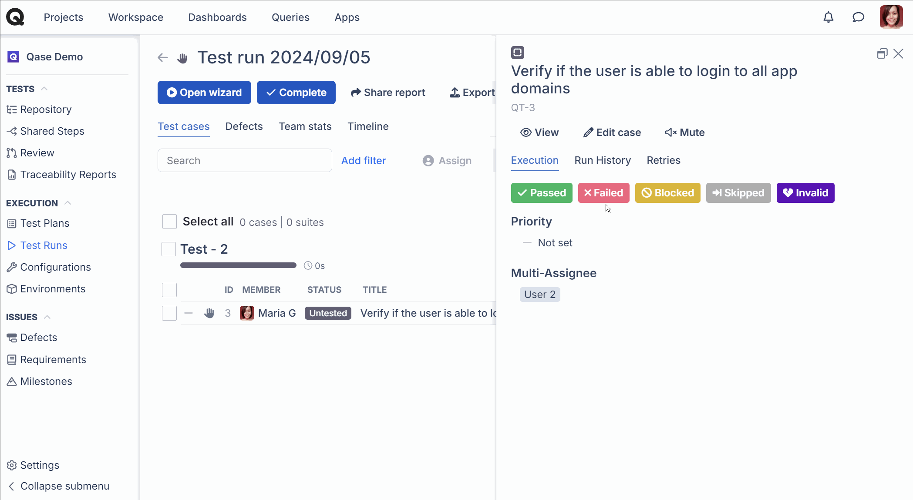
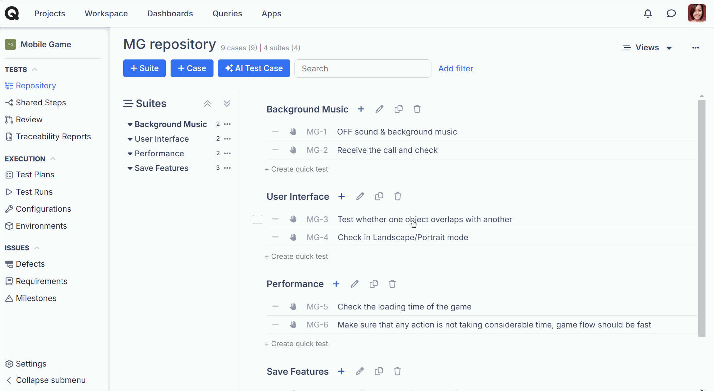
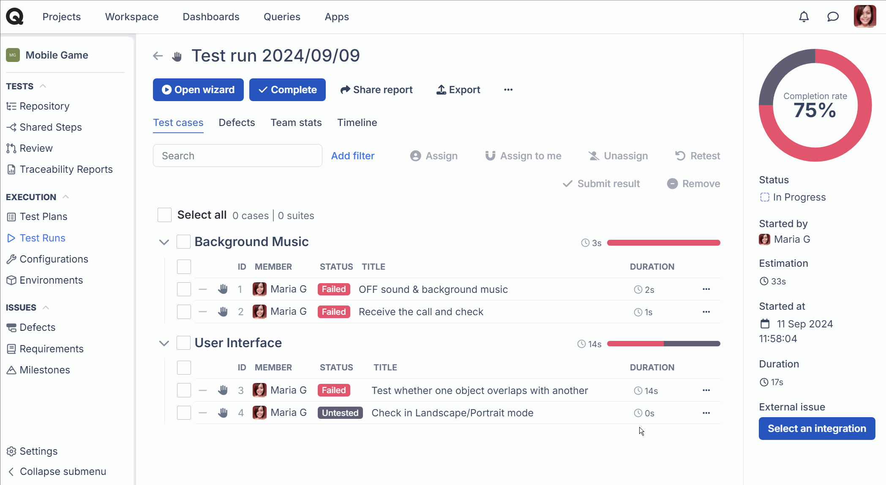
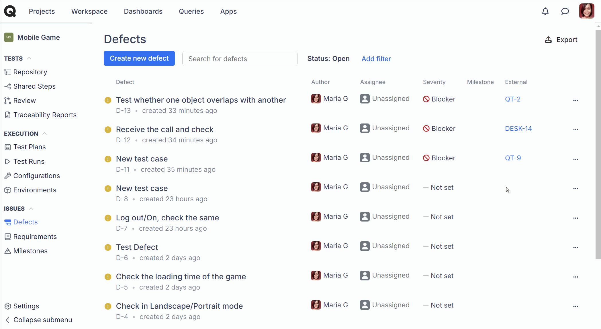

# GitHub

### What is GitHub?

[GitHub](https://github.com/) is a code hosting platform for version control and collaboration. It lets you and others work together on projects from anywhere.



With the GitHub app, you can:

* link an existing issue in GitHub to a Qase [test case](../../general/get-started-with-the-qase-platform/test-cases/), [test run](../../general/get-started-with-the-qase-platform/create-a-test-run/), or [defect](../../general/issues/defects.md).
* create a new issue or connect an existing issue in GitHub when you [file a defect during a test run](../../general/issues/defects.md#h_357b732096) in Qase.
* [connect a GitHub workflow](../ci-cd/github.md#ci-cd-workflows) to Qase and execute automated runs in GitHub from a Qase test run.

## Installation 

***

Go to the 'Apps' section of your workspace:

To install the app, follow these steps:

1. Click the GitHub card, and hit "Install now"
2. Log in to GitHub, if you're not already.
3. Select the GitHub Repositories where you want to install the app, then hit "Install"
4. After the redirect, hit "Authorize" to complete the installation.
5. The app is now installed successfully.


**Step 4** is important because it authorizes GitHub to access your Qase workspace.


<figure><figcaption></figcaption></figure>

## Usage 

***

### 1. Issue-tracking 

### 1. Creating a new GitHub issue from Qase 

If you encounter a defect during a test run, you can either create a new Github issue directly from Qase or link an existing Github issue.

* In the test run, mark your test case as Failed, Blocked, or Invalid and proceed with creating a Defect
* In the Defect creation form, under “Choose Integrations”, select "GitHub App" and click "Add defect"
* Choose the GitHub repository to create an issue in, then hit "Create"

<figure><figcaption></figcaption></figure>

* Or select the Link tab at the top and select your repository search for the issue and click on "Link".

<figure><figcaption></figcaption></figure>

* In the Qase Defect, you will now have a connected GitHub issue link
* The statuses of the Qase Defect and the connected GitHub issue synced, meaning marking one as closed resolves the other (and vice versa).

### 2. Linking existing issues 

In addition to creating new GitHub issues, you can also link test cases, runs, and defects to a GitHub issue -

#### a. Linking Test cases 

1. In the repository, click on the test case you want to link the GitHub issue to.
2. Switch to the properties tab in the preview window.
3. Scroll down and click on "Link GitHub app issue"
4. In the modal window, select your repository, search for the issue, and click "Link".

<figure><figcaption></figcaption></figure>

#### b. Linking Test runs 

1. In the Test runs view, click on the run you want to link the GitHub issue to.
2. In the Run dashboard, to the bottom right, find the button 'Select an integration' under External issue.
3. In the modal window, select your repository, search for the issue, and click "Link".

<figure><figcaption></figcaption></figure>

#### c. Linking defects 

1. In the Defects section, click on a defect you want to link the GitHub issue to.
2. Inside the Defect view, find the "Link with Apps" dropdown on the bottom right and select "GitHub App".
3. In the modal window, select your repository, search for the issue, and click "Link".

<figure><figcaption></figcaption></figure>
