# Jira Cloud

## What is Jira?

[Jira](https://www.atlassian.com/software/jira) is a proprietary issue-tracking product developed by Atlassian that allows bug tracking and agile project management.



## Why use Jira Cloud integration?

Qase offers a robust integration with Jira, enabling you to link [test cases](https://help.qase.io/en/articles/5563704-test-cases), [test runs](https://help.qase.io/en/articles/5563702-test-runs), and [defects](https://help.qase.io/en/articles/5563710-defects) to Jira issues both, from Qase, and from Jira.

The statuses of a Qase defect and its linked Jira issue are [synchronized](https://help.qase.io/en/articles/6417207-jira-cloud#h_261cf21fcb). When a Jira issue is set to a completed status, the corresponding Qase defect is marked as resolved, and vice versa.

If you work across multiple Qase workspaces, you can easily [duplicate the installation](https://help.qase.io/en/articles/6417207-jira-cloud#h_820d5674bc) and status mapping across all of them. You can also [limit access](https://help.qase.io/en/articles/6417207-jira-cloud#h_45df841f00) to your Jira projects as necessary.

## How to install Jira App on Qase? 


To ensure a successful installation, the process must be carried out by a user with **administrative** access to Jira.


Start by [inviting](../../administration/workspace-management/invites.md) your Jira administrator to your Qase workspace, and be sure to assign them the administrator [role](../../administration/workspace-management/roles.md) in Qase as well.

### Steps for Jira Administrator: 

***

#### 1. Installing the Qase App on Jira.

*   In your Qase workspace, navigate to ‘Apps’ and find the Jira Cloud app.

    Click “Install now”.

<figure>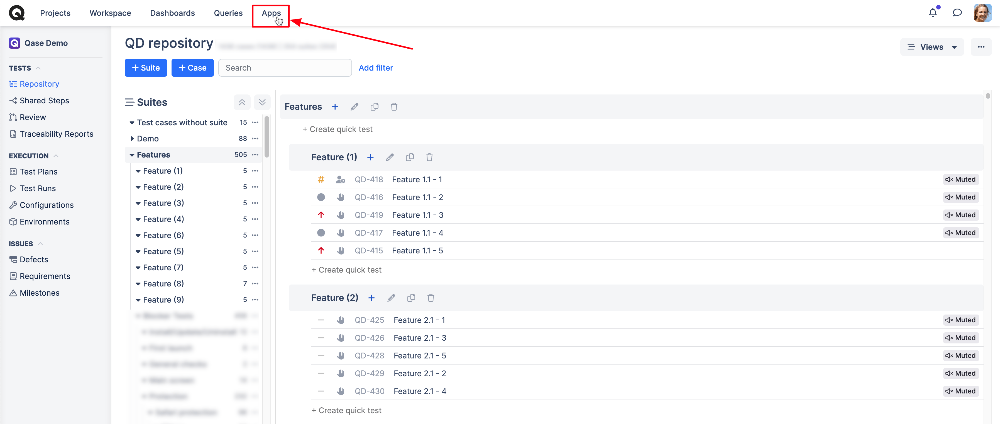<figcaption></figcaption></figure>

<figure><figcaption></figcaption></figure>

* You will be redirected to the Atlassian Marketplace. Click “Get it now”. If you’re not already logged in, you’ll need to sign in to proceed.

<figure><figcaption></figcaption></figure>

<figure>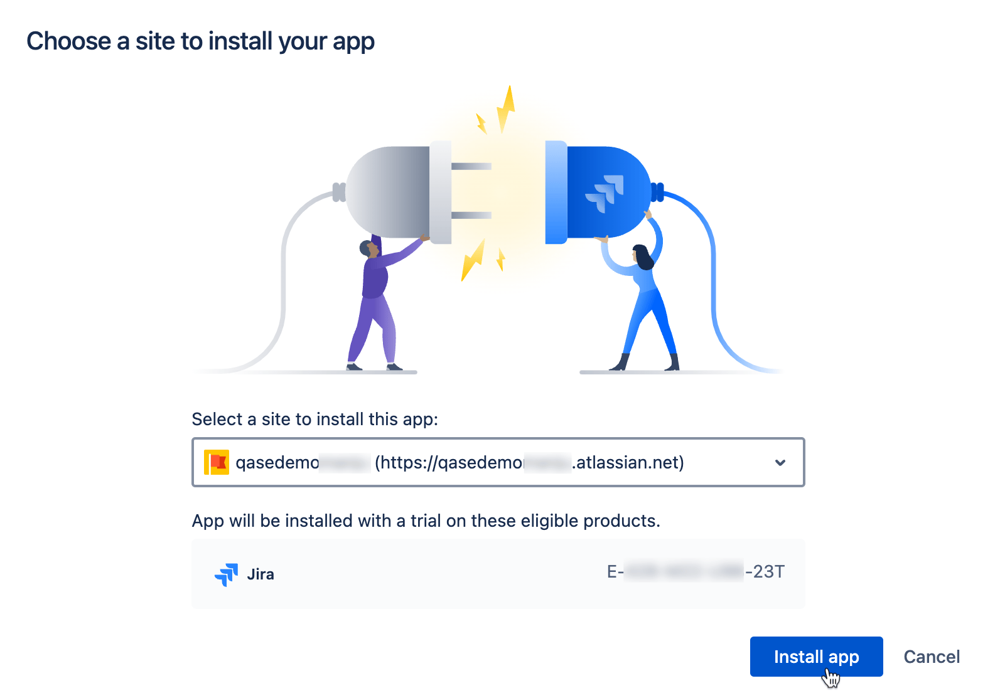<figcaption></figcaption></figure>

#### 2. Link, the App on Jira with your Qase Workspace.

* After the app is installed, click on “Configure”.

<figure>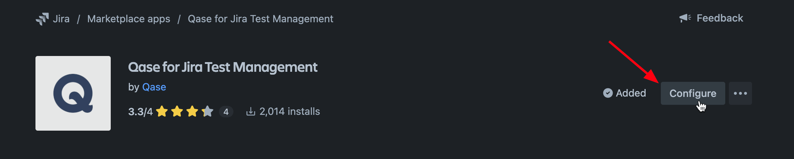<figcaption></figcaption></figure>

<em>Alternatively, you can find the Configure button by going to Apps > Manage Your Apps > Qase > Configure.</em>

*   On the configuration page, click “Link with Qase”.\

    <figure>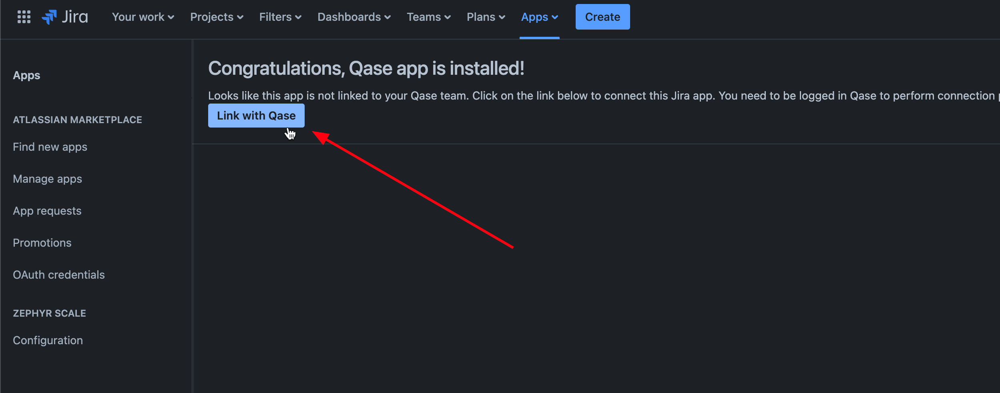<figcaption></figcaption></figure>
* You will be redirected to Qase. Click “Authorize” to complete the linking and finalize the installation.

<figure>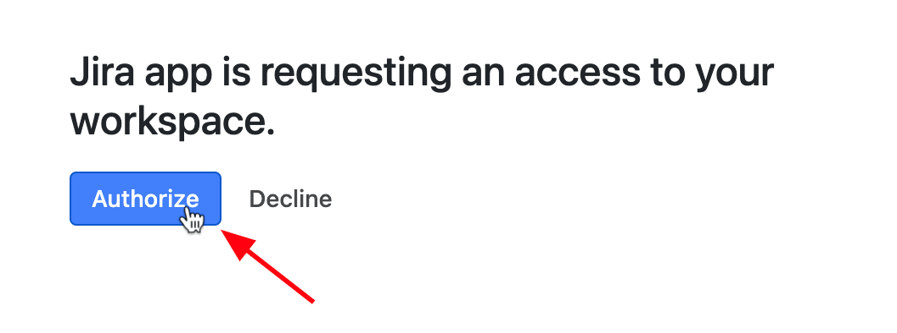<figcaption></figcaption></figure>

*   Verify that the app has been successfully installed.\

    <figure><figcaption></figcaption></figure>

## Mapping Statuses Between Qase and Jira 

***

[Qase Defects](../../general/get-started-with-the-qase-platform/defects/) have the following statuses: **Open**, **In-progress**, **Resolved**, **Invalid**

<figure><figcaption></figcaption></figure>

You might have several _projects ¹_ in your Jira instance, each with different and potentially unique statuses for each _issue type ²_

<figure>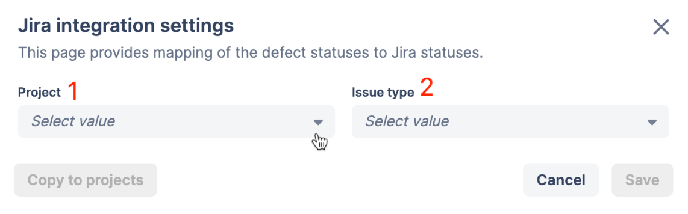<figcaption></figcaption></figure>

### Using default mapping 

***

To simplify the process, you can set a default mapping for a project that will apply to all issue types, within that project -

<figure>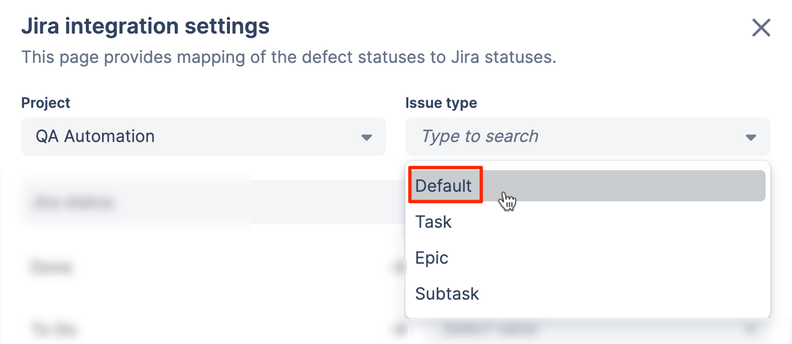<figcaption></figcaption></figure>

<figure>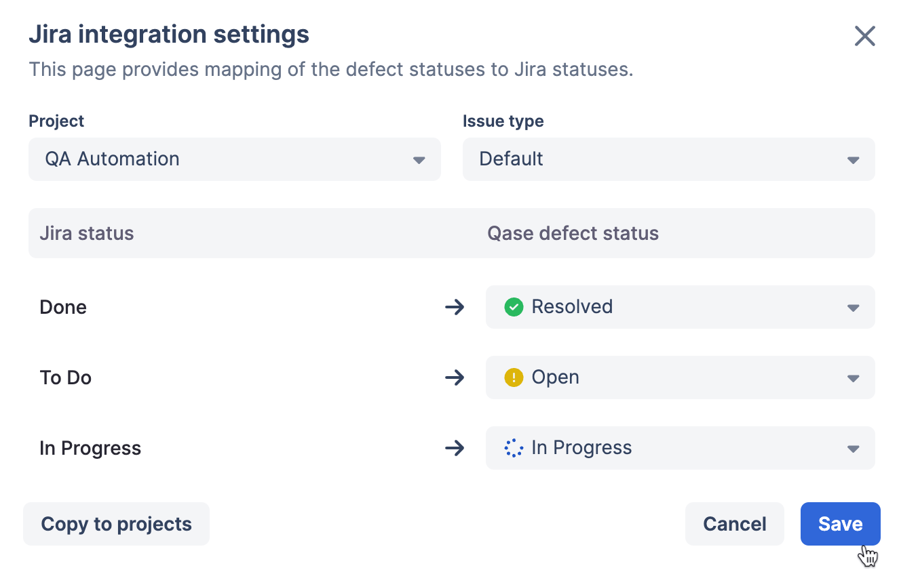<figcaption></figcaption></figure>

Once you save the mapping, all issue types will use the default mapping unless their statuses have been specifically mapped differently.

In this example, all issue types such as _Task_, _Epic_, and _Subtask_ will use the default mapping unless their specific statuses have been mapped differently.

For instance, if you have custom mappings for the _Epic_ issue type, but not for _Task_ and _Subtask_, then _Task_ and _Subtask_ will fall back to the default mapping.

### **Copy mapping to other projects**

***

After setting up the mapping for one project, you can copy it to other projects by clicking the “Copy to projects” button at the bottom left of the modal. You can choose to apply the mapping to all projects or select specific ones.

<figure><figcaption></figcaption></figure>

<figure><figcaption></figcaption></figure>

Once you make your selection, Qase will apply the mapping to matching statuses and notify you of the updates:

* If any statuses can't be mapped because they don't exist in the original settings, Qase will alert you to the number of projects with unmapped statuses.
* Projects and statuses with issues will be marked with a warning icon, making it easy to identify and adjust them manually if needed.

Expand this toggle to view some frequently asked questions about copying mapped statuses.

**1. How are statuses matched when copying mappings from one project to another?**

Statuses are matched based on similarity in names. Any status with the same name in Jira, regardless of spaces or case, will be mapped.

**2. How are mapped, and unmapped statuses counted in notifications?**

Notifications reflect only target statuses. For example, if Project A has 5 statuses and Project B has 4, with 3 matched, the notifications would be:

• “_3 statuses were successfully mapped_.”

• “_1 status in 1 project could not be matched. Review and update manually._”

**3. What happens if I copy a new status mapping to a project with existing mappings?**

If statuses match (by name similarity), the new mapping will replace the old one. If statuses do not match, the original mapping remains, but a warning icon will indicate statuses that weren’t updated for review.

**4. What if I modify the original project from which statuses were copied?**

You can manually update any project mapping without affecting others. To apply updates to all projects, repeat the “copy to projects” process.

## Access control 

***

_⚠️ The features under access control are only available for_ [_Business_](../../administration/subscriptions/business-plan.md) _and_ [_Enterprise_](../../administration/subscriptions/enterprise-plan.md) _Users._

### 1. Managing access to your Jira Projects 

You can enable Access control from the three dots (---) menu on the Jira app card [here](https://app.qase.io/apps?app=jira-cloud).

<figure>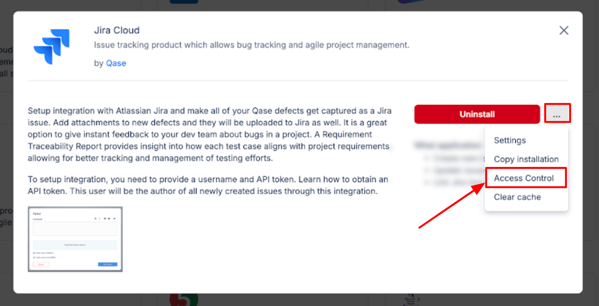<figcaption></figcaption></figure>

<figure>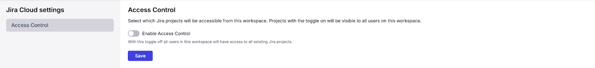<figcaption></figcaption></figure>

Once enabled, you can select which Jira projects Qase will have access to.

<figure>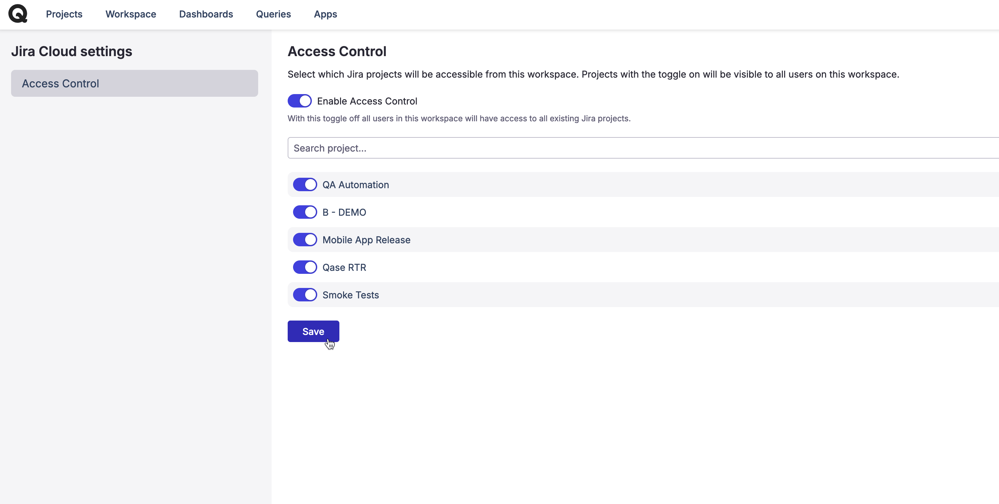<figcaption></figcaption></figure>

If you do not activate access control to select specific Jira projects, all of your Jira projects will be accessible to Qase by default.

### 2. Connect multiple Qase workspaces to your Jira instance.

***

If your team works across multiple Qase workspaces but uses a single Jira instance, you can easily copy the Jira installation from one workspace to another.

In the Jira app card, click ‘Copy installation.’ A modal will appear listing all other workspaces where you are the owner or administrator, provided they don’t already have a Jira integration installed.

<figure><figcaption></figcaption></figure>

Select the desired workspace from the list and proceed to copy the installation. Your status mappings and project access settings will be copied over as they are.

Please note that these settings are copied only once and are not synced, allowing you to freely modify them in the target workspace.

<figure><figcaption></figcaption></figure>

## Linking from Jira: 

***

### 1. Link Qase test cases to Jira issues: 

<figure><figcaption></figcaption></figure>

* Click "Open Test cases" in Jira sidebar
* Click "Link a case"
* Insert test case title or its Case ID into the field and click "Link"
* To unlink a case, click the "Trash Bin" icon in the sidebar next to the test case you want to unlink (an icon will appear when you hover over the linked case).

### 2. Link Qase test runs to Jira issues: 

* Switch on "Qase: Runs" module through the options:

<figure>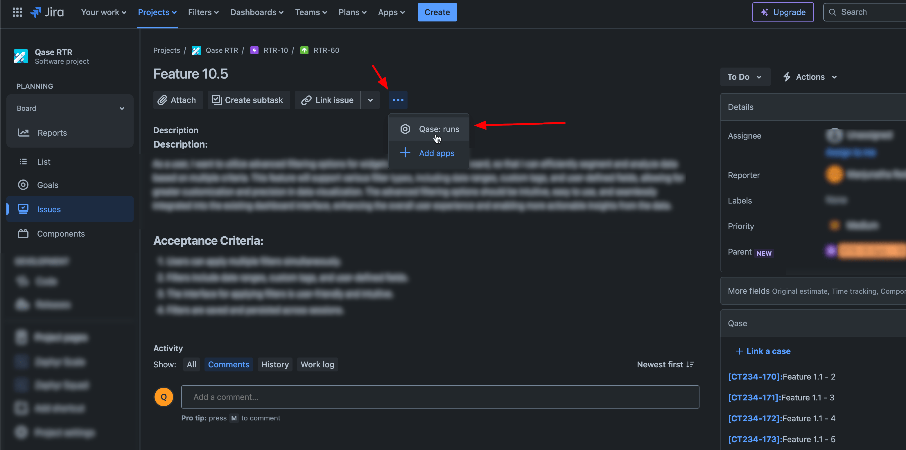<figcaption></figcaption></figure>

* In the module that appeared, click "Link a run":

<figure><figcaption></figcaption></figure>

* Use the search box to find the needed run by title, and click Link to attach it to the issue:

<figure>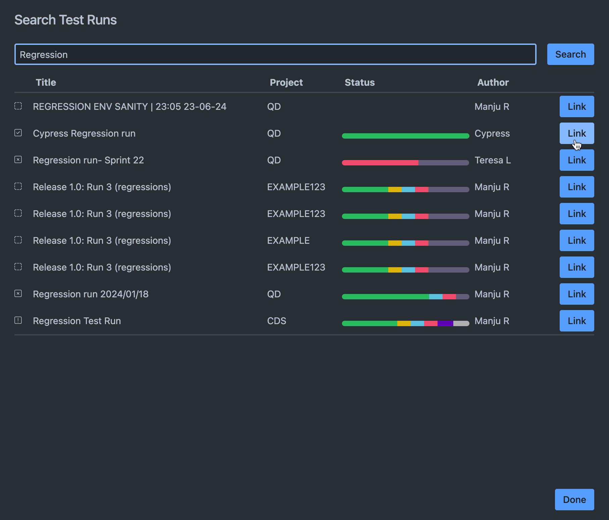<figcaption></figcaption></figure>

* Linked run and the statuses of cases in it are now shown in the issue:

<figure>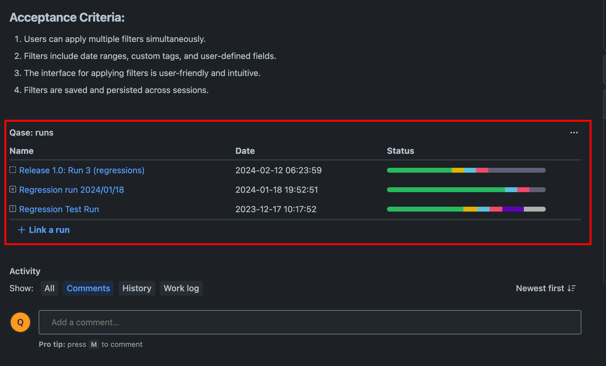<figcaption></figcaption></figure>

* _Note:_ a Jira issue can have multiple runs attached to it, and any runs you have linked to Jira issues while setting up a run in Qase will also be shown in the "Qase: Runs" module.

## Linking from Qase: 

***

### 1. Link Jira issues to Qase Test cases 

<figure>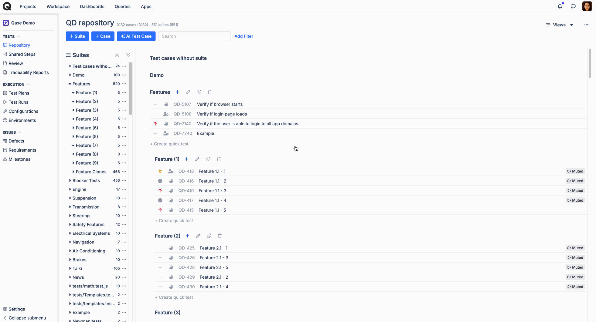<figcaption>
<code>Link a single test case.</code>
</figcaption></figure>

The option to link, or unlink Jira issues can be found under the properties tab of the test case preview.

<figure>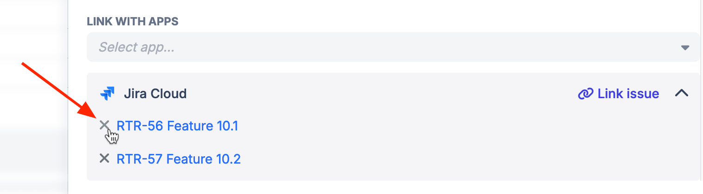<figcaption>
<code>Unlink a single test case.</code>
</figcaption></figure>

For linking test cases in bulk, select the test cases and use the "Edit" option.

<figure><figcaption>
<code>Link / Unlink multiple test cases (Bulk Edit)</code>
</figcaption></figure>

### 2. Link Jira issues to a Qase Test run: 

<figure>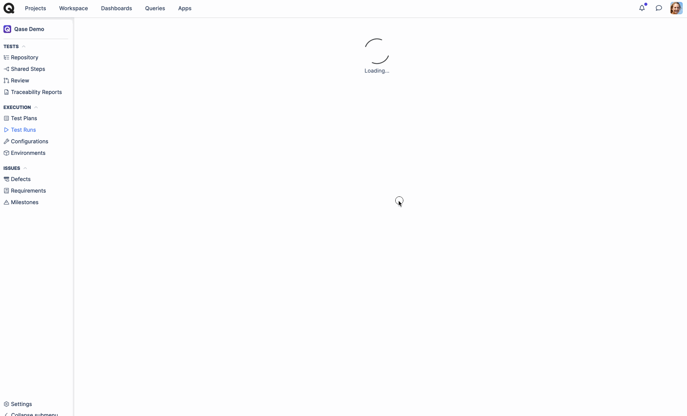<figcaption></figcaption></figure>

The option to link Jira issue can be found in the Test run Dashboard, under External Issues.

### 3. Link Jira issues to a Qase defect:

#### a) From Test runs

If you encounter a defect during a test run, you can either create a new Jira issue directly from Qase or link an existing Jira issue.

1. In the test run, mark your case as Failed, Blocked, or Invalid and proceed with creating a Defect.
2. In the Defect creation form, under “Choose Integrations” select "Jira Cloud" and click "Add defect"

<figure>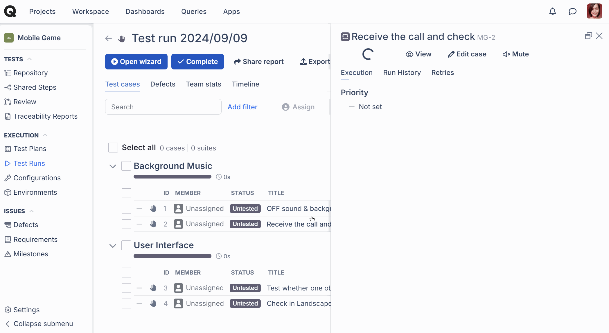<figcaption>
<code>creating a new Jira issue from a Qase Test run</code>
</figcaption></figure>

<figure>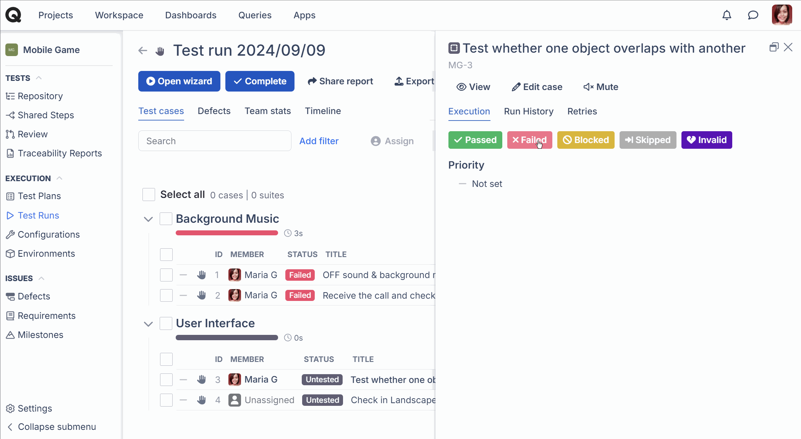<figcaption>
<code>Linking an existing Jira issue from a Qase Test run</code>
</figcaption></figure>

#### b) From Defects

If you’re creating a defect that isn’t linked to any result from the defects section, you can link a Jira issue from the defect dashboard using the “Link with apps” section.​

<figure><figcaption>
<code>Linking a Qase defect to a Jira issue</code>
</figcaption></figure>

Once linked, the defect will be visible under the External column in the Defects section of your project.

<figure>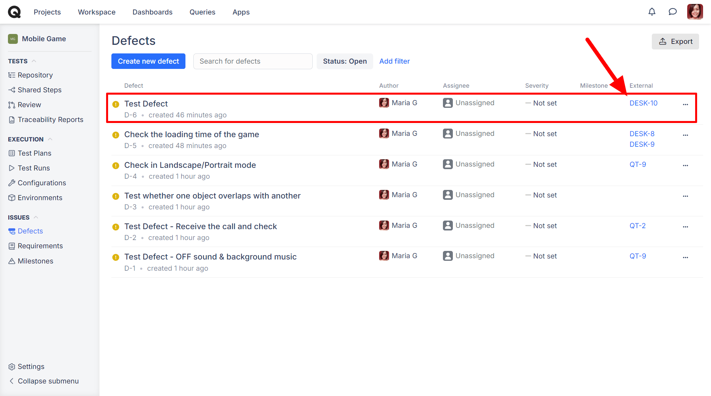<figcaption></figcaption></figure>

​And, also in the defect dashboard here -

<figure>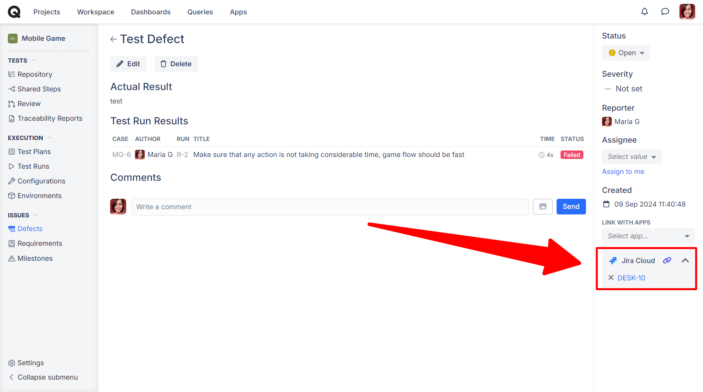<figcaption></figcaption></figure>

Once a Defect has been created and if you update the status of the Defect, you'll notice that you have the option to select the status for the associated Jira issue to be transitioned into:
