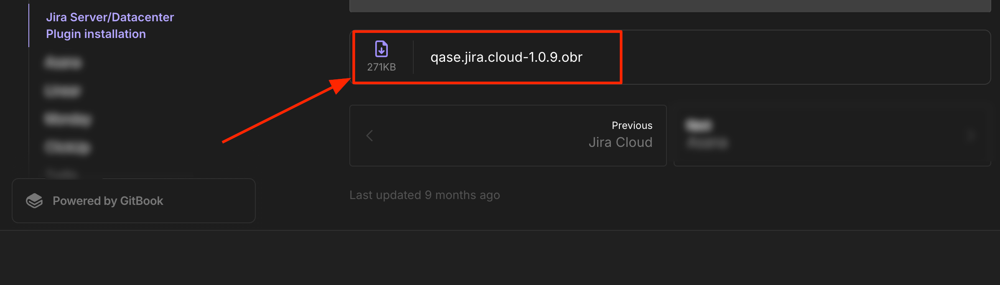
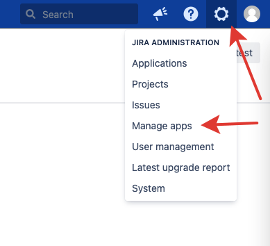
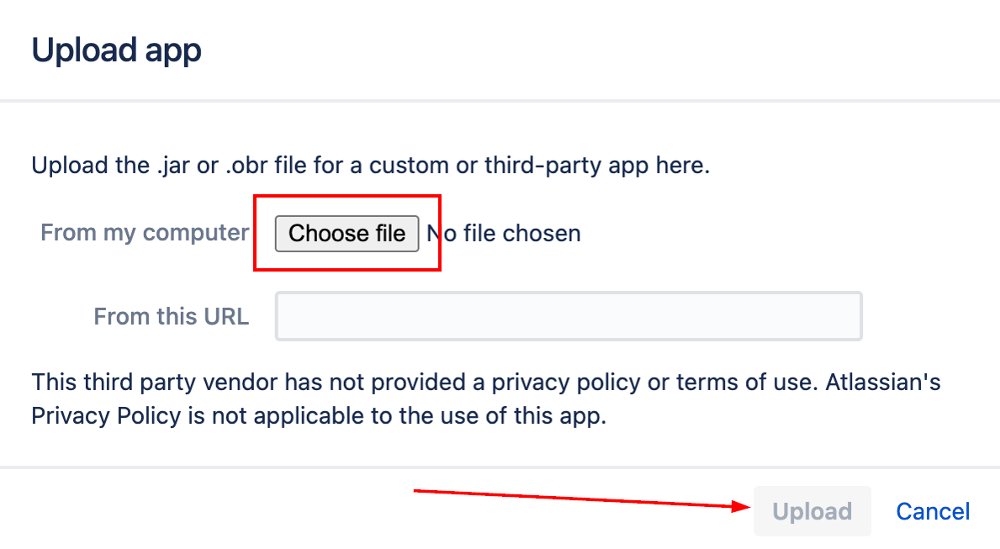
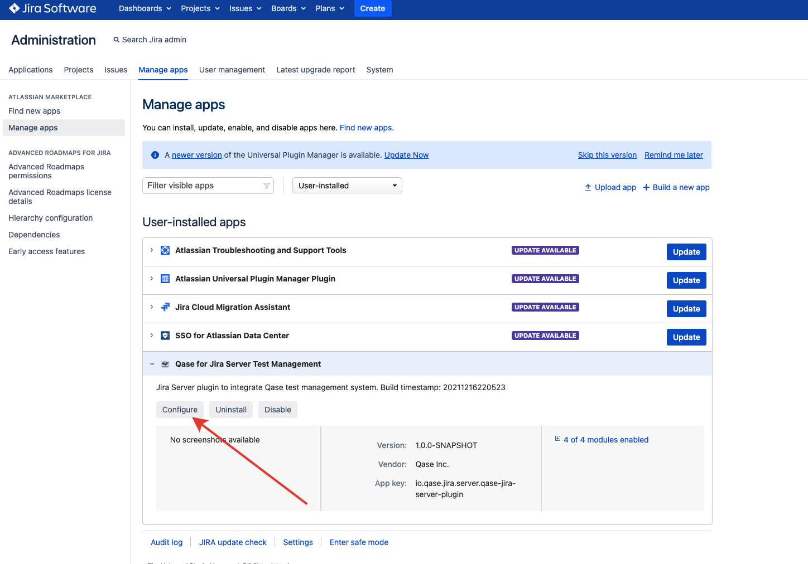
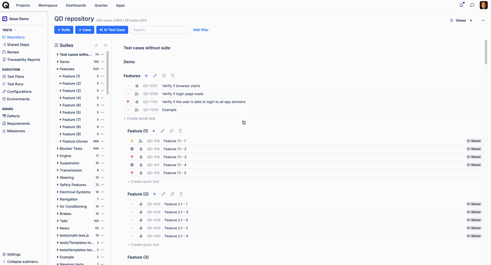
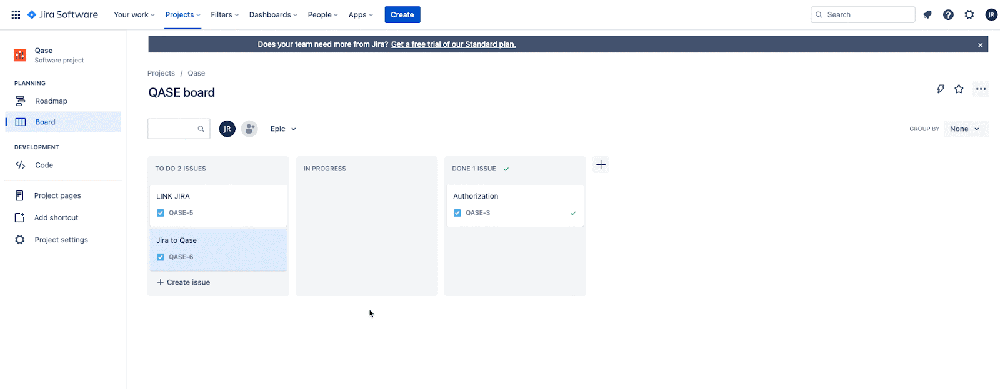
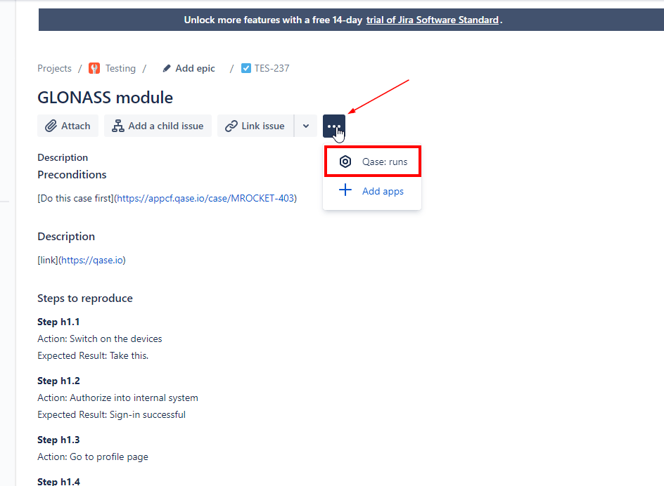
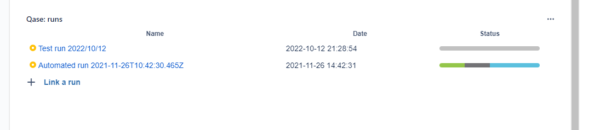

# Jira Server/Datacenter Plugin installation

Qase offers a robust integration with Jira, enabling you to link [test cases](../../general/get-started-with-the-qase-platform/test-cases/), [test runs](../../general/get-started-with-the-qase-platform/create-a-test-run/), and [defects](../../general/issues/defects.md) to Jira issues both, from Qase, and from Jira.

The statuses of a Qase defect and its linked Jira issue are [synchronized](jira-server-datacenter-plugin-installation.md#h_6f0f4a388d). When a Jira issue is set to a completed status, the corresponding Qase defect is marked as resolved, and vice versa.

## Installation 

***


​If you are using **Jira Data Center, you can install the app from Jira Marketplace** instead of using the package provided in this article.

Once you do so, proceed directly, to the **step 6** of this instruction.


1. Download the plugin package attached at the end of the article.

<figure><figcaption></figcaption></figure>

2.  Go to "Manage apps" page in Jira:

    \

    <figure><figcaption></figcaption></figure>

<figure><figcaption></figcaption></figure>

3.  Select the plugin package you've downloaded, and click "Upload".\

    <figure><figcaption></figcaption></figure>
4. Select the plugin package you've downloaded, and click "Upload".
5.  After installation, click the "Configure" button and link Jira with Qase:\

    <figure><figcaption></figcaption></figure>

6\. You will be re-directed to Qase, click "Authorize" on the this step.

That's it, you're ready to go!

## Mapping Statuses Between Qase and Jira 

***

Qase Defects have the following statuses: **Open**, **In-progress**, **Resolved**, **Invalid**

<figure><figcaption></figcaption></figure>

To map the statuses, click on the app card, and then, choose "Settings" from the (--) menu.

You might have several _projects ¹_ in your Jira instance, each with different and potentially unique statuses for each _issue type ²_

\
Select the Project, Issue Type and click on "Add transition" and select the Defect Mapping and Save the changes:

<figure><figcaption></figcaption></figure>

You have an option to "Do nothing" in terms of status update of a Qase defect, once the associated Jira issue gets transitioned into a specific status - then, the Qase defect will remain in the status it was.

## Link from Qase

***

### 1. Link Jira issues to Qase Test cases 

\
In your repository, click any test case to open its preview and switch to the Properties tab.

Scroll down to the "Link with Apps" section, and choose Jira Server. Then, proceed to search and link your issues.

Linked issues can be removed with the ( x ) icon.

<figure><figcaption></figcaption></figure>

`Unlink a test case.`

<figure><figcaption></figcaption></figure>

### 2. Link Jira issues to a Qase Test run: 

\
Test runs can be linked to a Jira issue, from the Run Dashboard.

Under the "External Issues" section, click 'Select an Integration' to proceed. Only one Jira issue can be linked to the Test run.

<figure><figcaption></figcaption></figure>

The option to link Jira issue can be found in the Test run Dashboard, under External Issues.

### 3. Link Jira issues to a Qase defect: 

#### a) From Test runs

If you encounter a defect during a test run, you can either create a new Jira issue directly from Qase or link an existing Jira issue.

1. In the test run, mark your case as Failed, Blocked, or Invalid and proceed with creating a Defect.
2. In the Defect creation form, under “Choose Integrations” select "Jira Server" and click "Add defect"

`creating a new Jira issue from a Qase Test run`

<figure><figcaption></figcaption></figure>

`Linking an existing Jira issue from a Qase Test run`

<figure><figcaption></figcaption></figure>

#### b) From Defects

If you’re creating a defect that isn’t linked to any result from the defects section, you can link a Jira issue from the defect dashboard using the “Link with apps” section.​

`Linking a Qase defect to a Jira issue`

<figure><figcaption></figcaption></figure>

Once linked, the defect will be visible under the External column in the Defects section of your project.

<figure><figcaption></figcaption></figure>

​And, also in the defect dashboard here -

<figure><figcaption></figcaption></figure>

Once a Defect has been created and if you update the status of the Defect, you'll notice that you have the option to select the status for the associated Jira issue to be transitioned into:

<figure><figcaption></figcaption></figure>

## Link from Jira 

***

### 1. Test cases 

* Click "Link a case"
* Insert test case title or its Case ID into the field and click "Link"

<figure><figcaption></figcaption></figure>

* To unlink a case, click the "Trash Bin" icon in the sidebar next to the test case you want to unlink (an icon will appear when you hover over the linked case):

<figure><figcaption></figcaption></figure>

### 2. Test runs 

* Switch on "Qase: Runs" module through the options:

<figure><figcaption></figcaption></figure>

* In the module that appeared, click "Link a run":

<figure><figcaption></figcaption></figure>

* Use the search box to find the needed run by title, and click Link to attach it to the issue:

<figure><figcaption></figcaption></figure>

* Linked run and the statuses of cases in it are now shown in the issue:

<figure><figcaption></figcaption></figure>

_Note:_ `a Jira issue can have multiple runs attached to it`

<figure><figcaption></figcaption></figure>

Any runs you have linked to Jira issues while setting up a run in Qase will also be shown in the "Qase: Runs" module.


