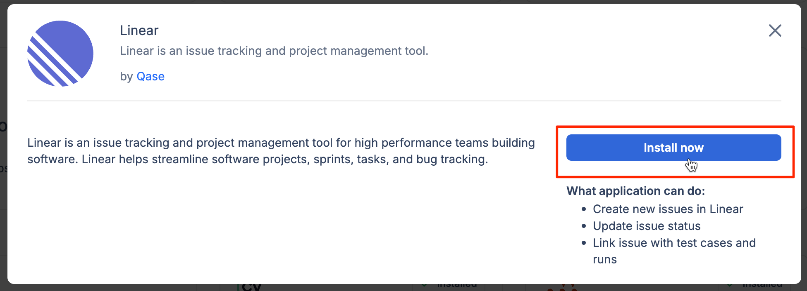
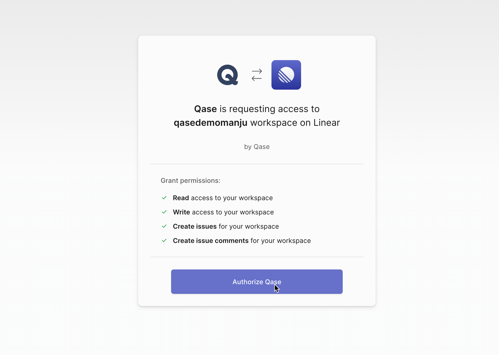
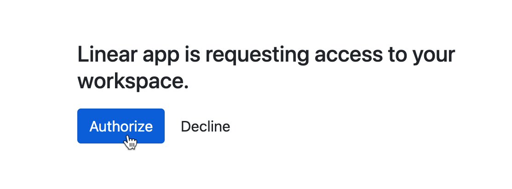
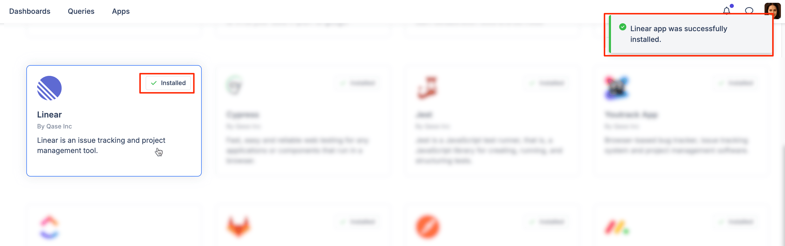
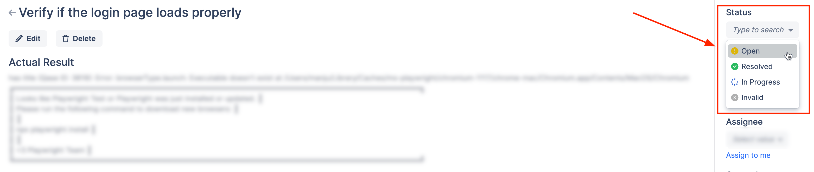
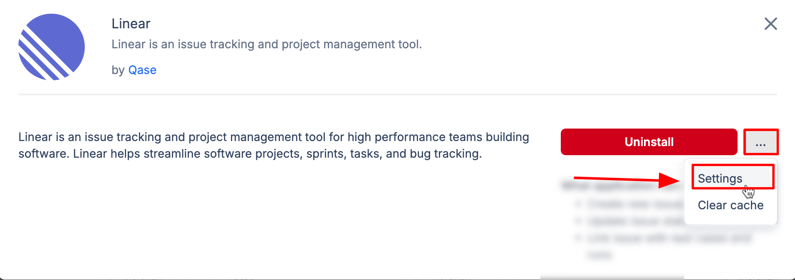
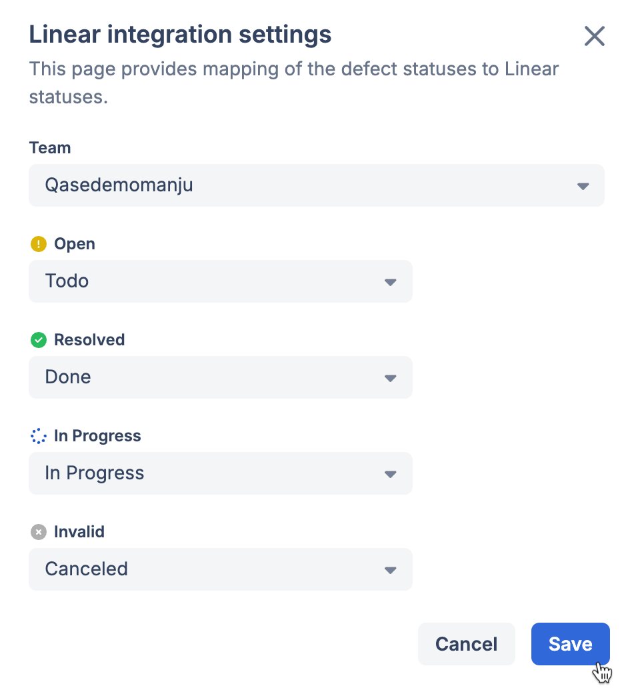

# Linear

### What is Linear?

**Linear** helps streamline software projects, sprints, issues, and bug tracking.



### Why use Linear integration?

With the Linear app, you can:

* Link Qase [test case](../../general/get-started-with-the-qase-platform/test-cases/), [test run](../../general/get-started-with-the-qase-platform/create-a-test-run/), or [defects](../../general/issues/defects.md) to Linear issues
* Create a new Linear issue [directly from a Qase Test run](../../general/issues/defects.md#h_357b732096).
* Automatically sync statuses of a the connected issues (i.e. the Qase defect and the connected Linear issues' statuses are automatically synced).

### How to install Linear? 

1. Click "Apps" in your Qase workspace (Before proceeding with the installation, please sign in to Linear in another tab):

<figure><figcaption></figcaption></figure>

2. Click Linear card, then hit "Install now":

<figure><figcaption></figcaption></figure>

3. In the following page, click on "Authorize Qase":

<figure><figcaption></figcaption></figure>

4. After the redirect, hit "Authorize" to finalize the installation:

<figure><figcaption></figcaption></figure>

5. The app is now successfully installed:

<figure><figcaption></figcaption></figure>

## Usage 

***

### Link your Qase Test cases 

In your repository, click any test case to open its preview and switch to the Properties tab.

Scroll down to the "Link with Apps" section, and choose Linear. Then, proceed to search and link your issues.

Linked issues can be removed with the ( x ) icon.

<figure><figcaption></figcaption></figure>

### Link your Qase Test runs 

Test runs can be linked to a Linear issue, from the Run Dashboard.

Under the "External Issues" section, click 'Select an Integration' to proceed. Only one Linear issue can be linked to the Test run.

<figure><figcaption></figcaption></figure>

### Link your Qase Defects 

Defects can be linked to a Linear issue, from the Defect Dashboard. Under the "External Issues" section, select the LInear app to proceed.

<figure><figcaption></figcaption></figure>

### Create a new Linear issue from a Qase Test run 

When you assign a negative result to a case during a test run, you will have the option to create or attach a Qase defect.

Additionally, you can select the ‘Linear’ option from the "Choose Integration" dropdown to either create or link a Linear issue.

The created or linked issue will be visible in both the defects tab of the test run and the defect section of the project.

<figure><figcaption></figcaption></figure>

### Mapping Statuses Between Qase and Linear 

Qase Defects have the following statuses: `Open`, `In-progress`, `Resolved`, `Invalid`

<figure><figcaption></figcaption></figure>

You can map these statuses to your Linear issues, from the app settings -

<figure><figcaption></figcaption></figure>

Statuses can be mapped for each team separately

<figure><figcaption></figcaption></figure>

After mapping the statuses, changing a defect’s status in Qase will automatically update the corresponding status in Linear.
