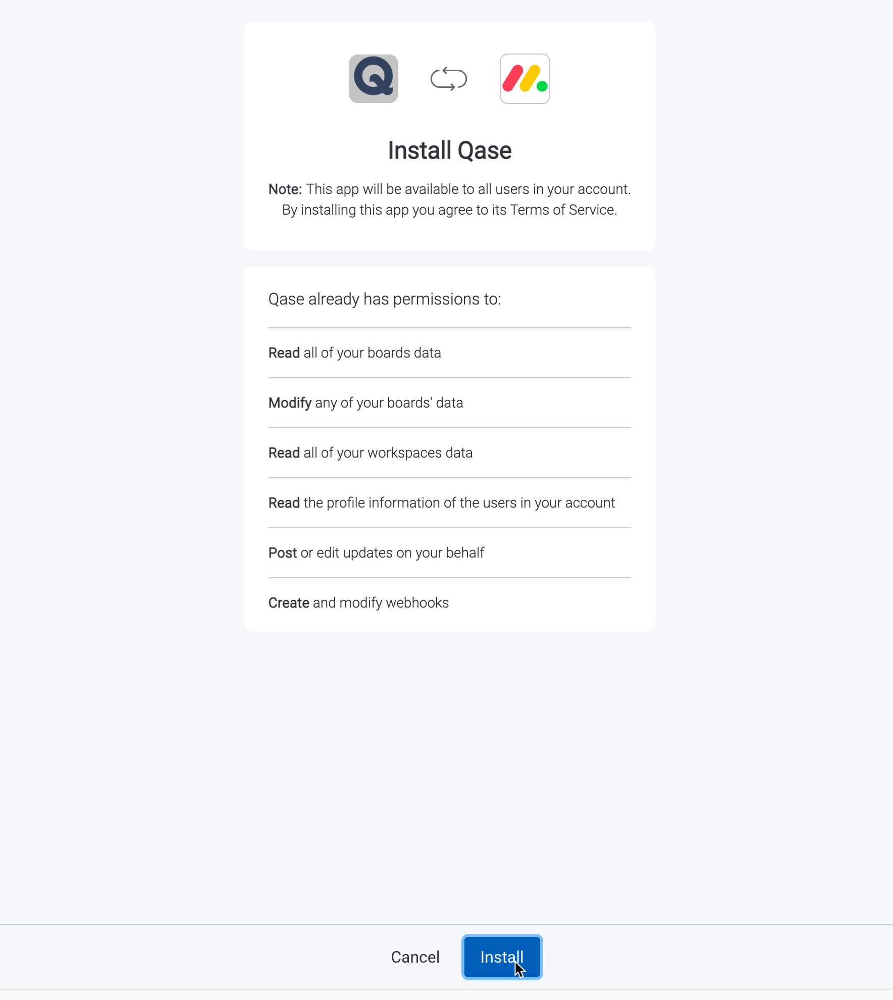
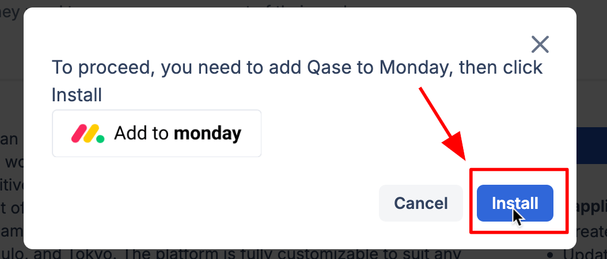
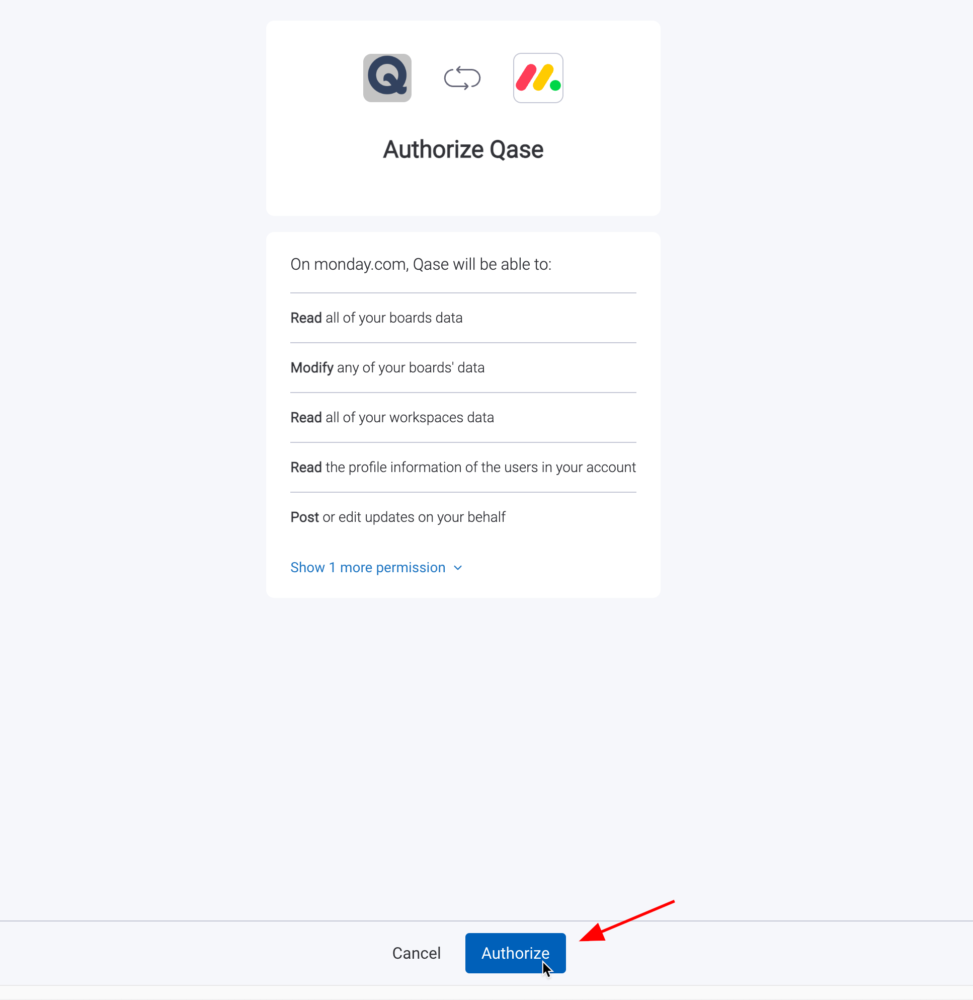
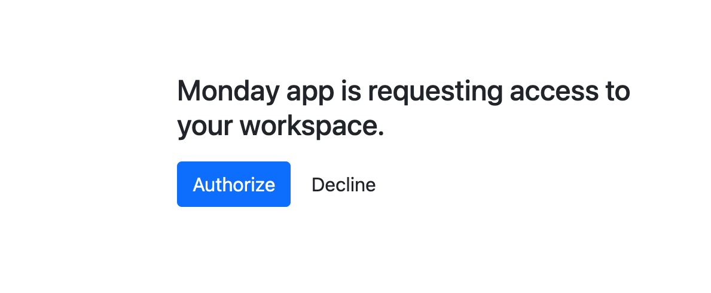
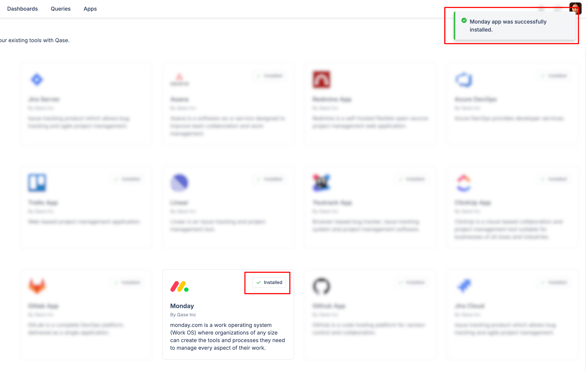
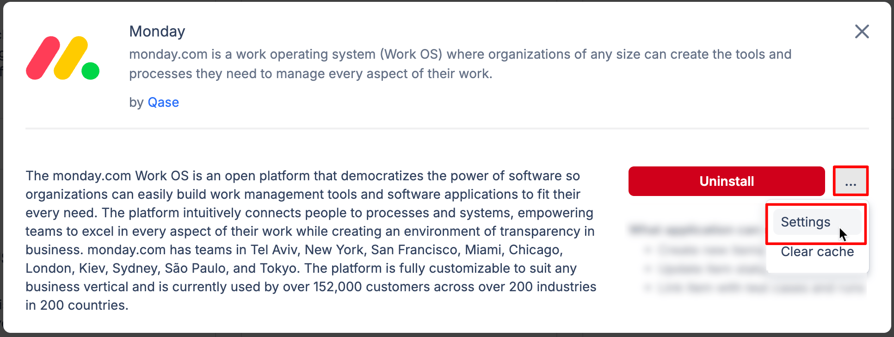
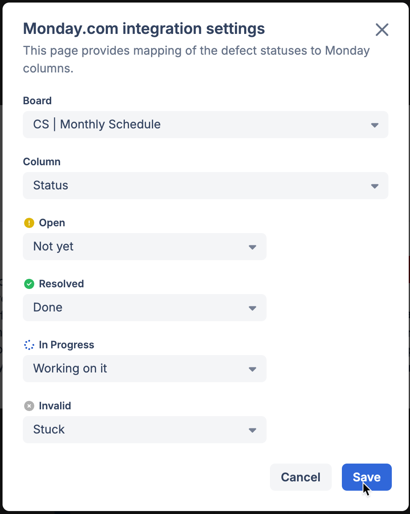

# Monday

### What is Monday?

[Monday](https://monday.com/) is a work OS that powers teams to run processes, projects, and everyday work their way.



### Why use Monday integration?

With the Monday app, you can:

* Link Qase [test case](../../general/get-started-with-the-qase-platform/test-cases/), [test run](../../general/get-started-with-the-qase-platform/create-a-test-run/), or [defects](../../general/issues/defects.md) to Monday items.
* Create a new items in Monday when you file a [defect during a test run](../../general/issues/defects.md#h_357b732096) in Qase

### How to install Monday? 

1. From the "Apps" section of your workspace, click the Monday App card.

<figure><figcaption></figcaption></figure>

2. Now, click the 'install' button and then, "Add to Monday" -

<figure><figcaption></figcaption></figure>

3. Sign in to Monday and select your Workspace, then, click 'Install'

<figure><figcaption></figcaption></figure>

4. Switch back to your Qase workspace's tab and now you should see an 'Install' button.

<figure><figcaption></figcaption></figure>

5. Click authorise on Monday screen, and then on Qase's screen.

<figure><figcaption></figcaption></figure>

<figure><figcaption></figcaption></figure>

6. The app is now successfully installed.

<figure><figcaption></figcaption></figure>

## Usage 

***

### Link your Qase Test Cases 

In your repository, click any test case to open its preview and switch to the Properties tab.

Scroll down to the "Link with Apps" section, and choose Monday. Then, proceed to search and link your items.

Linked items can be removed with the ( x ) icon.

<figure><figcaption></figcaption></figure>

### Link your Qase Test runs 

Test runs can be linked to a Monday item, from the Run Dashboard.

Under the "External Issues" section, click 'Select an Integration' to proceed. Only one Monday item can be linked to the Test run.

<figure><figcaption></figcaption></figure>

### Link your Qase Defects 

Defects can be linked to a Monday item, from the Defect Dashboard. Under the "External Issues" section, select the Monday app to proceed.

<figure><figcaption></figcaption></figure>

### Create a new Monday item from a Qase Test run 

When you assign a negative result to a case during a test run, you will have the option to create or attach a Qase defect.

Additionally, you can select the ‘Monday’ option from the "Choose Integration" dropdown to either create or link a Monday item.

The created or linked item will be visible in both the defects tab of the test run and the defect section of the project.

<figure><figcaption></figcaption></figure>

### Mapping Statuses Between Qase and Monday 

Qase Defects have the following statuses: `Open`, `In-progress`, `Resolved`, `Invalid`

<figure><figcaption></figcaption></figure>

You can map these statuses to your Linear issues, from the app settings -

<figure><figcaption></figcaption></figure>

Statuses can be mapped for each board, and column separately

<figure><figcaption></figcaption></figure>

After mapping the statuses, changing a defect’s status in Qase will automatically update the corresponding status in Monday.

1.  Click "Apps" in your Qase workspace:\

    <figure><figcaption></figcaption></figure>
2. Click Monday app card, then hit "Install now"
3. Click on “Add to Monday”
4. Once you selected the workspace, click on “Install”
5. Navigate back to the Qase apps page
6. Click on “Install”
7. Review the permissions and click on “Authorize”
8. Click on “Authorize” in the following page as well
9. Now the app is installed

<figure><figcaption></figcaption></figure>

### Usage 

#### Linking from Qase to Monday app: 

1\. To link a Monday app to a Qase test case from Qase:

* Select a case in the repository and switch to properties in the sidebar
* Click "Link Monday issues"
* Select the board and insert Monday app issue title into the field and hit "Link" (the title is case sensitive)
* Now the issue is linked:

<figure><figcaption></figcaption></figure>

2\. To unlink the Monday app issue, click "x" next to the card title:

3\. Link Qase test runs to Monday app issues: here's how you can link Monday issues to your test run

* Navigate to the test runs page
* Click on the run
* In the run's main page, locate the side-bar to the right
* Scroll down and under "External Issue" click on "Select an Integration"
* Select "Monday"
* Search for the issue's id and click on "Link"

<figure><figcaption></figcaption></figure>

### Create Monday aapp issue while creating a defect in Qase 

* In the test run, mark your case as failed, blocked, or invalid and proceed with creating a defect.
* in the defect creation form, under “Choose Integrations” select "Monday" and click "Add defect"
* Fill in the required fields then hit "Create"

<figure><figcaption></figcaption></figure>

*   In the Qase defect you will now have a connected Monday app issue link:\

    <figure><figcaption></figcaption></figure>

    <figure><figcaption></figcaption></figure>
