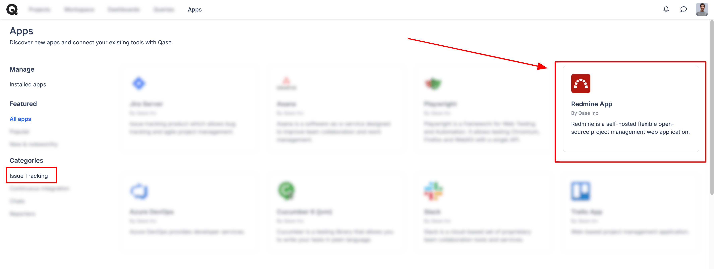
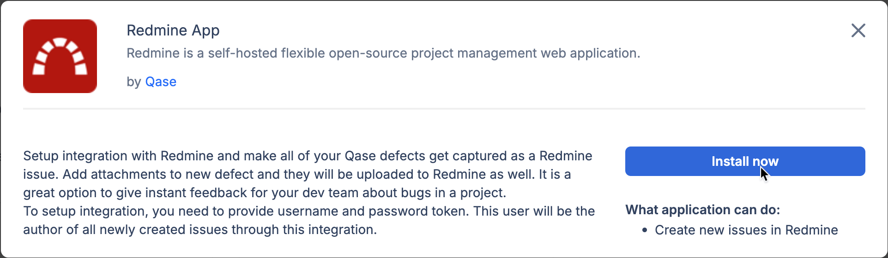
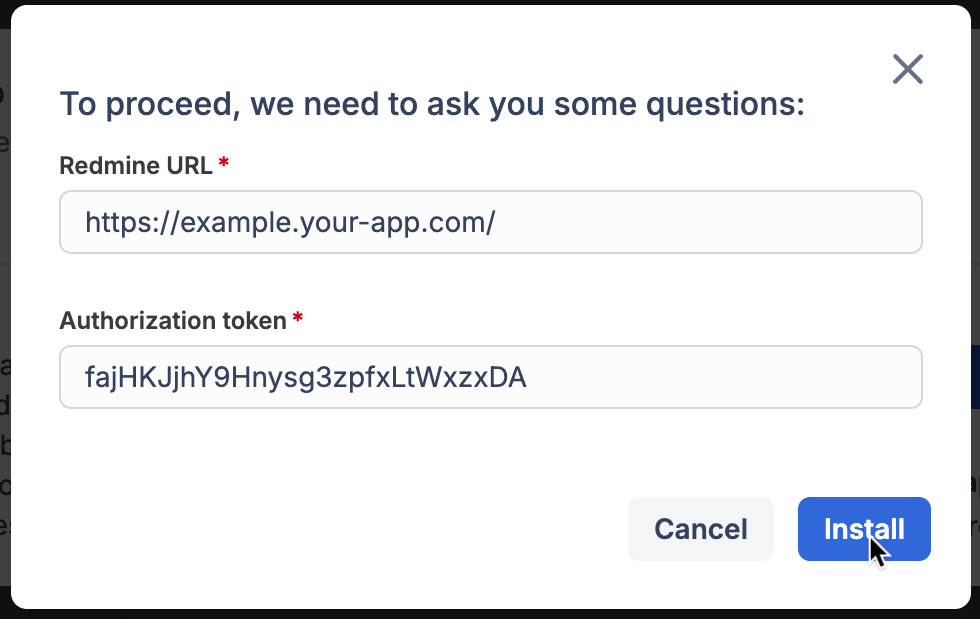
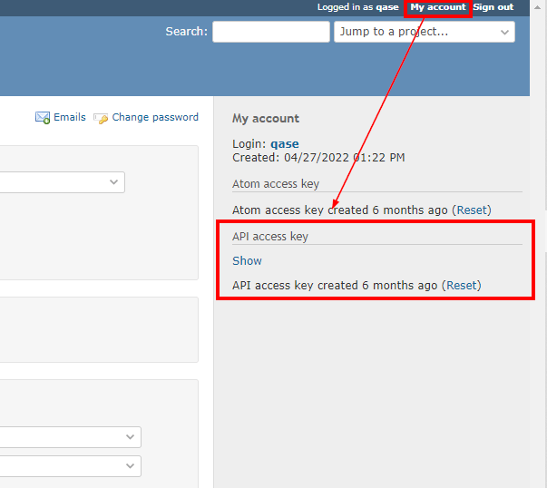
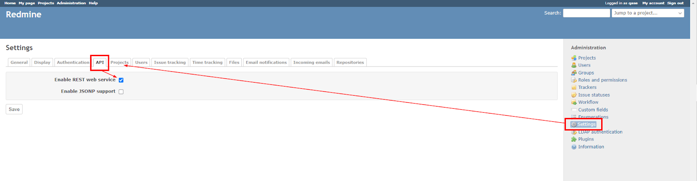
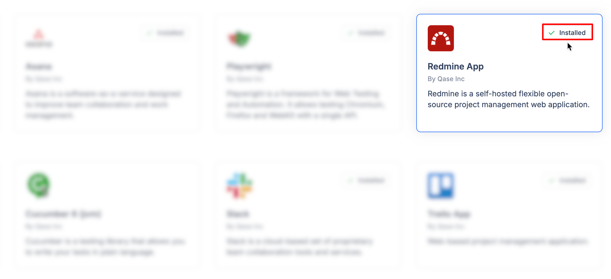

# Redmine

### What is Redmine?

[Redmine](https://www.redmine.org/) is a free and open-source, web-based project management and issue-tracking tool that allows users to manage multiple projects and associated sub-projects.



### Why use Redmine integration?

With the Redmine app, you can:

* Link Qase [test cases](../../general/get-started-with-the-qase-platform/test-cases/), [test runs](../../general/get-started-with-the-qase-platform/create-a-test-run/), and [defects](../../general/issues/defects.md) to Redmine issues.
* Create a new issue in Redmine when you file a defect [during a test run in Qase](../../general/issues/defects.md#h_357b732096)

### How to install Redmine? 

1. From the "Apps" section of your workspace, find the Redmine App card, and click "Install now.

<figure><figcaption></figcaption></figure>

<figure><figcaption></figcaption></figure>

2. Sign in to Redmine and obtain your `Redmine URL` and `Authorization Token` then click “Install".

<figure><figcaption></figcaption></figure>

* You can generate an `API Token` from the "My account" page

<figure><figcaption></figcaption></figure>

* Additionally, make sure that REST API service is enabled:\
  ​ `Settings > API > Enable REST web service`

<figure><figcaption></figcaption></figure>

3. The app is now successfully installed:

<figure><figcaption></figcaption></figure>

## Usage 

***

### Link your Qase Test Cases 

In your repository, click any test case to open its preview and switch to the Properties tab.

Scroll down to the "Link with Apps" section, and choose Redmine. Then, proceed to search and link your issues.

Linked issues can be removed with the ( x ) icon.

<figure><figcaption></figcaption></figure>

### Link your Qase Test runs 

Test runs can be linked to a Redmine issue, from the Run Dashboard.

Under the "External Issues" section, click 'Select an Integration' to proceed. Only one Redmine issue can be linked to the Test run.

<figure><figcaption></figcaption></figure>

### Link your Qase Defects 

Defects can be linked to a Redmine issue, from the Defect Dashboard. Under the "External Issues" section, select the Redmine app to proceed.

<figure><figcaption></figcaption></figure>

### Create a new Redmine issue from a Qase Test run 

When you assign a negative result to a case during a test run, you will have the option to create or attach a Qase defect.

Additionally, you can select the ‘Redmine’ option from the "Choose Integration" dropdown to either create or link a Redmine issue.

The created or linked issue will be visible in both the defects tab of the test run and the defect section of the project.

<figure><figcaption></figcaption></figure>

