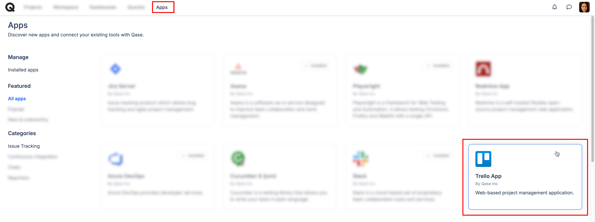
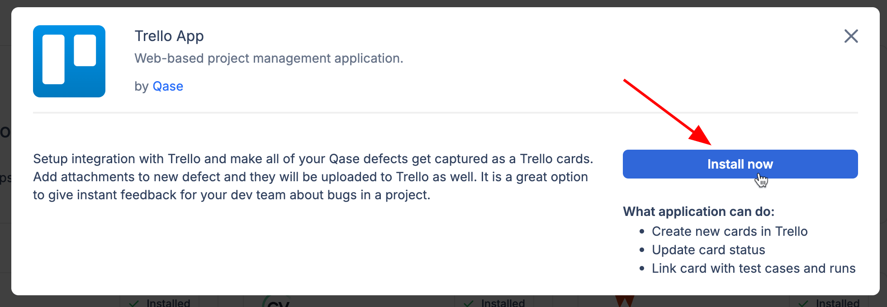
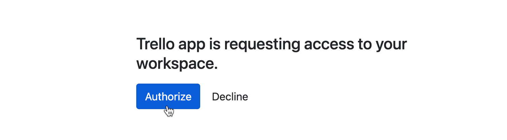
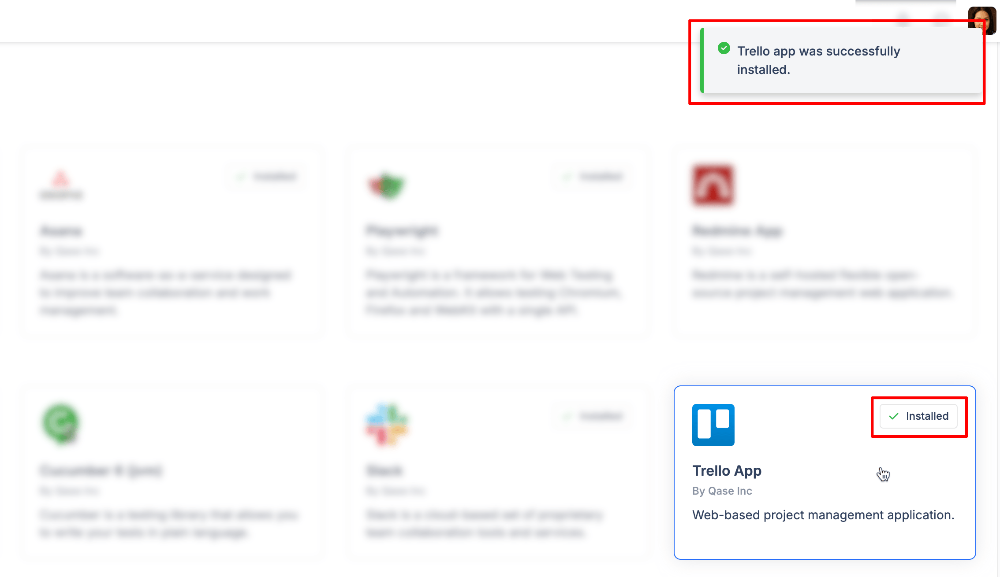

# Trello

### What is Trello?

[Trello](https://trello.com/) is a web-based, Kanban-style, list-making application for agile project management, developed by Atlassian.



### Why use Trello integration?

With Trello app, you can:

* Link Qase [test cases](../../general/get-started-with-the-qase-platform/test-cases/), [test runs](../../general/get-started-with-the-qase-platform/create-a-test-run/), and [defects](../../general/issues/defects.md) to Trello issues.
* Create a new issue in Trello when you file a defect [during a test run in Qase](../../general/issues/defects.md#h_357b732096)

### How to install Trello? 

1. Click "Apps" in your Qase workspace

<figure><figcaption></figcaption></figure>

2. Click Trello card, then hit "Install now".

<figure><figcaption></figcaption></figure>

3. Sign in to Trello, if you are currently not, and Click "Allow" to grant access to Trello for the Qase app:

<figure><figcaption></figcaption></figure>

4. After the redirect, hit "Authorize" to finalize the installation

<figure><figcaption></figcaption></figure>

5. The app is now successfully installed:

<figure><figcaption></figcaption></figure>

## Usage: 

***

### Link your Qase Test Cases 

In your repository, click any test case to open its preview and switch to the Properties tab.

Scroll down to the "Link with Apps" section, and choose Trello. Then, proceed to search and link your issues.

Linked issues can be removed with the ( x ) icon.

<figure><figcaption></figcaption></figure>

### Link your Qase Test runs 

Test runs can be linked to a Trello issue, from the Run Dashboard.

Under the "External Issues" section, click 'Select an Integration' to proceed. Only one Trello issue can be linked to the Test run.

<figure><figcaption></figcaption></figure>

### Link your Qase Defects 

Defects can be linked to a Trello issue, from the Defect Dashboard. Under the "External Issues" section, select the Trello app to proceed.

<figure><figcaption></figcaption></figure>

### Create a new Trello issue from a Qase Test run 

When you assign a negative result to a case during a test run, you will have the option to create or attach a Qase defect.

Additionally, you can select the ‘Trello’ option from the "Choose Integration" dropdown to either create or link a Trello issue.

The created or linked issue will be visible in both the defects tab of the test run and the defect section of the project.

<figure><figcaption></figcaption></figure>

1. Click "Apps" in your Qase workspace
2. Click Trello card, then hit "Install now":

<figure><figcaption></figcaption></figure>

<figure><figcaption></figcaption></figure>

3\. Sign in to Trello, if you are currently not:

4\. Click "Allow" to grant access to Trello for the Qase app:

5\. After the redirect, hit "Authorize" to finalize the installation:

6\. The app is now successfully installed:

### Usage 

1. To link a Trello card to a Qase test case:\

   * Select a case in the repository and switch to properties in the sidebar:

<figure><figcaption></figcaption></figure>

* Click "Link Trello App issues":

* Insert Trello card title into the field and hit "Link":

<figure><figcaption></figcaption></figure>

* Now the Trello card is linked:

* To unlink the Trello card, click "x" next to the card title:

2\. To link a Trello card to a Qase test run:

* Navigate to the test run you want to link to Trello
* Click on "Select an Integration"

<figure><figcaption></figcaption></figure>

* In the integration pop-up, select Trello App:

* Insert Trello card title into the field and hit "Link":

<figure><figcaption></figcaption></figure>

* Now the Trello card is linked:

<figure><figcaption></figcaption></figure>

* To unlink the Trello card from the run, click on the trash bin for the particular run and it will be unlinked:

<figure><figcaption></figcaption></figure>

3\. To create a Trello card task together with a defect in Qase:

* In the test run, mark your case as failed, blocked, or invalid and proceed with creating a defect:

* In the defect creation form, click “Choose Integration,” select "Trello App" and click "Add defect":

<figure><figcaption></figcaption></figure>

* Choose the Trello “Board” and “List” to create a card in, then hit "Create":

<figure><figcaption></figcaption></figure>

* In the Qase Defect you will now have a connected Trello card link:

<figure><figcaption></figcaption></figure>

<figure><figcaption></figcaption></figure>
