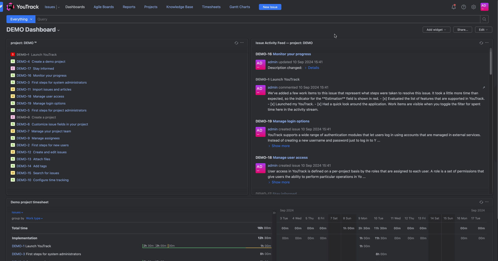
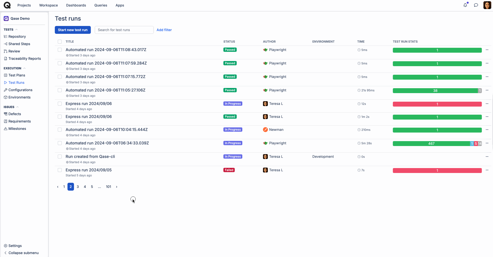
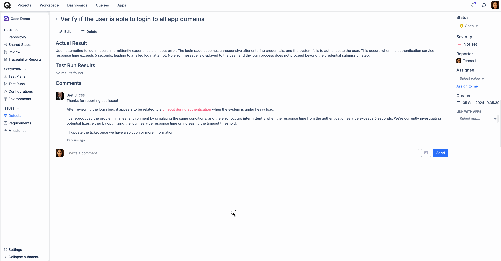

# YouTrack

### What is YouTrack?

[YouTrack](https://www.jetbrains.com/youtrack/) is a proprietary, commercial browser-based bug tracker, issue tracking system and project management software, developed by JetBrains.



### Why use YouTrack integration?

With YouTrack app, you can:

* Link Qase [test cases](../../general/get-started-with-the-qase-platform/test-cases/), [test runs](../../general/get-started-with-the-qase-platform/create-a-test-run/), and [defects](../../general/issues/defects.md) to YouTrack issues.
* Create a new issue in YouTrack when you file a defect [during a test run in Qase](../../general/issues/defects.md#h_357b732096)

### How to install YouTrack? 

To install the app, you will need the YouTrack instance's URL and an Authorization Token:

.png>)

1. Click "Apps" in your Qase workspace
2. Click YouTrack App, then hit "Install now"
3. Sign in to YouTrack and obtain your YouTrack URL and Authorization Token then click “Install”
4. The app is now successfully installed

## Usage 

***

### Link your Qase Test Cases 

In your repository, click any test case to open its preview and switch to the Properties tab.

Scroll down to the "Link with Apps" section, and choose YouTrack. Then, proceed to search and link your issues.

Linked issues can be removed with the ( x ) icon

<figure><figcaption></figcaption></figure>

### Link your Qase Test runs 

Test runs can be linked to a YouTrack issue, from the Run Dashboard.

Under the "External Issues" section, click 'Select an Integration' to proceed. Only one YouTrack issue can be linked to the Test run

<figure><figcaption></figcaption></figure>

### Link your Qase Defects 

Defects can be linked to a YouTrack issue, from the Defect Dashboard. Under the "External Issues" section, select the YouTrack app to proceed.

<figure><figcaption></figcaption></figure>

### Create a new YouTrack issue from a Qase Test run 

When you assign a negative result to a case during a test run, you will have the option to create or attach a Qase defect.

Additionally, you can select the ‘YouTrack’ option from the "Choose Integration" dropdown to either create or link a YouTrack issue.

The created or linked issue will be visible in both the defects tab of the test run and the defect section of the project

<figure><figcaption></figcaption></figure>

