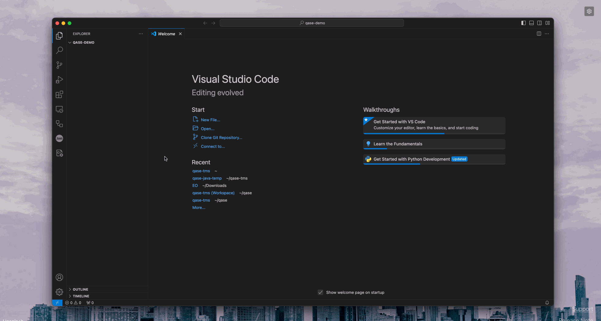

# Qase CLI App


Documentation for Qase API and Reporters is at [https://reporters.qase.io/](https://reporters.qase.io/)


Qase CLI or `qli` is Qase's command line app build in Go Language, which can be used to start and complete test runs, and it can publish results to Qase in several formats.

View source code on GitHub here: [qase-tms/qasectl](https://github.com/qase-tms/qasectl)

## How to install the app? <a href="#h_5f45a8ad9f" id="h_5f45a8ad9f"></a>

***

### Install via `go install` <a href="#h_18843f58b7" id="h_18843f58b7"></a>

The easiest way to install Qase CLI is using `go install`:

```
go install github.com/qase-tms/qasectl@latest
```

Make sure to add `$GOPATH/bin` to your `$PATH` environment variable to be able to run the `qasectl` command. The binary is named `qasectl`, you may want to create an alias, as `qli`


### Build from source <a href="#h_55b13fb2a8" id="h_55b13fb2a8"></a>

* Clone the repository

```bash
git clone https://github.com/qase-tms/qasectl.git && cd qasectl
```

* Build the binary

```bash
make build
```

You will find the binary in the `build/` directory.

Try creating a test run by executing the binary -

```bash
./build/qli testops run create --project QD --token <your-token> --title "Run created from Qase-cli" --description "Hello, from qase-cli" --environment <env-slug> --verbose
```

<figure><figcaption></figcaption></figure>

### Use a Docker image <a href="#h_492af1dc6e" id="h_492af1dc6e"></a>

* Pull the Docker image

```bash
docker pull ghcr.io/qase-tms/qase-cli:latest
```

* Run the Docker container

```bash
docker run --rm ghcr.io/qase-tms/qase-cli:latest <add-your-command-here>
```

## Using Qase CLI <a href="#h_ece25f3472" id="h_ece25f3472"></a>

***

You can generate an API token from [here](https://app.qase.io/user/api/token) 🔗 and refer to [this guide](https://help.qase.io/en/articles/9787250-how-do-i-find-my-project-code) 🔗 to find your project code, and run\_id in Qase.

### Create a test run: <a href="#h_e61ea8bfa1" id="h_e61ea8bfa1"></a>

You can create a test run by using the `create` command. The `create` command is used to create a new test run in the specified project and save a test run ID to a file.

You can specify the file path using the `--output` option.

If the file path is not specified, the test run ID will be saved to `qase.env` in the current directory.

The file will contain the test run ID in the following format:

```bash
QASE_TESTOPS_RUN_ID=<run-id>
```

You can use the test run ID in subsequent steps to upload test results for the test run.

For extracting the test run ID from file, use the following command:

```bash
cat qase.env | grep QASE_TESTOPS_RUN_ID | cut -d'=' -f2
```

#### Example usage - <a href="#h_de19688ca8" id="h_de19688ca8"></a>

```bash
qli testops run create \
-p <project_code> \
-t <token> \
--title <title> \
-d <description> \
-e <environment> \
-m <milestone> \
-o <plan> \
-v
```

The `create` command supports the following options:

Required :

* `--project`, `-p`: The project code where the test run will be created.
* `--token`, `-t`: The API token to authenticate with the Qase API.
* `--title`: The name of the test run.

Optional :

* `--description`, `-d`: The description of the test run.
* `--environment`, `-e`: The environment where the test run will be executed.
* `--milestone`, `-m`: The milestone of the test run.
* `--plan`: The test plan of the test run. .
* `--output`, `-o`: is the output path to save the run Id, with the default being `qase.env` in the working directory.
* `--verbose`, `-v`: Enable verbose mode. .

The following example shows how to create a test run in the project with the code `DEMO`:

```bash
qli testops run create \
--project DEMO \
--token <token> \
--title "Example test run created using Qase CLI" \
--verbose
```

### Complete a test run <a href="#h_bdc6d140d3" id="h_bdc6d140d3"></a>

You can complete a test run by using the complete command. The complete command is used to complete a test run in the specified project.

#### Example usage - <a href="#h_6238e9bf35" id="h_6238e9bf35"></a>

```bash
qli testops run complete \
--project <project_code> \
--token <token> \
--id <run_id> \
--verbose
```

Here, the `--id` flag takes the ID of the Qase test run that is to be marked complete.

The following example shows how to complete a test run with the `id` 1 in the project with the code `DEMO`:

```bash
qli testops run complete --project DEMO --token <token> --id 1 --verbose
```

### Upload test results <a href="#h_2724643597" id="h_2724643597"></a>

You can upload test results by using the upload command. The upload command is used to upload test results for a test run in the specified project.

#### Example usage - <a href="#h_717a1629dc" id="h_717a1629dc"></a>

```bash
qli testops result upload \
--project <project_code> \
--token <token> \
--id <run_id> \
--format <format> \
--path <results_file> \
--batch <batch> \
--verbose
```

The upload command supports following options:

Required :

`--project`, -p: The project code where the test results will be uploaded.

`--token`, `-t`: The API token to authenticate with the Qase API.

`--id`: The ID of the test run to upload results for. _Required if `title` is not set._

`--title`: The title of the test results. _Required if `id` is not set_.

`--path`: The path to the test results file or folder.

`--format`: The format of the test results file. Allowed values: `junit`, `qase`, `allure`, `xctest`.

Optional :

`--description`, `-d`: The description of the test results.

`--steps`: The mode of upload steps for XCTest. Allowed values: `all`, `user`.

`--batch`: The batch number of the test results. Default value is `200`.

`--suite`, `-s`: Define the root suite for all the test results.

`--verbose`, `-v`: Enable verbose mode.

The following example shows how to upload test results in the `JUnit` format for a test run with the ID `1` in the project with the code `DEMO`:

```bash
qli testops result upload \
--project DEMO \
--token <token> \
--id 1 \
--format junit \
--path /path/to/results.xml \
--verbose
```

Similarly, use the following paths, for other result types -

* Qase format: `--path /path/to/build/qase-results/results.json`
* Allure format: `--path /path/to/allure-results`
* XCTest format: `--path /path/to/xctest-results`

### Create Environments and Milestones: <a href="#h_6d74ecd478" id="h_6d74ecd478"></a>

Similar to creating test runs, you can use the `create` command is used to create a new environment or milestone in the specified project and save a value to a file.

Path for saving the `qase.env` file can be specified using the `--output` option.

If the file path is not specified, `qase.env` will be saved to the working directory.

`qase.env` will contain

```bash
QASE_ENVIRONMENT=<slug>
```

or,

```bash
QASE_MILESTONE=<id>
```

You can use the Environment slug, or Milestone Id in subsequent steps when creating a new test run.

For extracting the values from the from file, use the following command:

```bash
cat qase.env | grep QASE_ENVIRONMENT | cut -d'=' -f2
```

```bash
cat qase.env | grep QASE_MILESTONE | cut -d'=' -f2
```

### Example usage - <a href="#h_dde1cae474" id="h_dde1cae474"></a>

To create an Environment:

```bash
qli testops env create --project <project_code> \
--token <token> \
--title <title> \
--slug <slug> \
--description <description> \
--host <host> \
--verbose
```

The `create` command for `env` supports the following options:

Required :

* `--project`, `-p`: The project code where the test run will be created.
* `--token`, `-t`: The API token to authenticate with the Qase API.
* `--title`: The title of the Environment.
* `--slug`: The slug value of the Environment.

Optional :

* `--description`, `-d`: The description of the test run.
* `--environment`, `-e`: The environment where the test run will be executed.
* `--output`, `-o`: is the output path to save `qase.env`
* `--verbose`, `-v`: Enable verbose mode. .

To create a Milestone:

```bash
qli testops milestone create --project <project_code> \
--token <token> \
--title <title> \
--description <description> \
--status <status> \
--due-date <due_date> \
--verbose
```

The `create` command for `milestone` has the following options:

Required :

* `--project`, `-p`: The project code where the milestone will be created.
* `--token`, `-t`: The API token to authenticate with the Qase API.
* `--title`: The name of the milestone.

Optional :

* `--description`, `-d`: The description of the milestone.
* `--status`, `-s`: The status of the milestone. Allowed values: `active`, `completed`.
* `--due-date`, `-d`: The due date of the milestone. Format: `YYYY-MM-DD`
* `--output`, `-o`: is the output path to save `qase.env`
* `--verbose`, `-v`: Enable verbose mode.

## Configuring Qase CLI in your CI workflow <a href="#h_d73946e63f" id="h_d73946e63f"></a>

You can use `qli` in cases where your test runner generates run reports in one of these formats (Junit; Qase; Allure; XCTest).

### Examples <a href="#h_4b6f1328c9" id="h_4b6f1328c9"></a>

**GitHub**

<details>

<summary>An example <a href="https://github.com/cskmnrpt/qase-playwright-demo/blob/docker-qli/.github/workflows/docker-qli.yml">github.yml</a>, that uses <a href="https://help.qase.io/en/articles/7210938-github#h_0bc1726ce5">Qase GitHub Actions</a>.</summary>

```yaml
name: Run Playwright Tests and Report to Qase

on:
  push:
    branches:
      - docker-qli

jobs:
  test:
    runs-on: ubuntu-latest

    steps:
      - name: Checkout code
        uses: actions/checkout@v4

      - name: Set up Node.js
        uses: actions/setup-node@v4
        with:
          node-version: "18"

      - name: Install dependencies
        run: npm install

      - name: Run Playwright tests
        run: npx playwright test
        continue-on-error: true

      - name: Get current date
        id: get-date
        run: echo "date=$(date +'%Y-%m-%d %H:%M:%S')" >> $GITHUB_OUTPUT

      - name: Create a Qase test run
        uses: qase-tms/gh-actions/run-create@v1
        id: qase-run-create
        with:
          token: ${{ secrets.QASE_API_TOKEN }}
          project: ${{ secrets.QASE_PROJECT_CODE }}
          title: "Playwright Test Run ${{ steps.get-date.outputs.date }}"
          description: "Automated Playwright test run"
          environment: "dev-web-app"
          verbose: true

      - name: Upload test results to Qase
        uses: qase-tms/gh-actions/report@v1
        continue-on-error: true
        with:
          token: ${{ secrets.QASE_API_TOKEN }}
          project: ${{ secrets.QASE_PROJECT_CODE }}
          id: ${{ steps.qase-run-create.outputs.id }}
          format: junit
          path: results/test-results.xml
          batch: 100
          verbose: true

      - name: Complete a Qase test run
        uses: qase-tms/gh-actions/run-complete@v1
        id: complete
        # use always() to run even if test step failed or job was canceled
        # but don't run if creating a test run failed before this step
        if: always() && steps.qase-run-create.outcome == 'success'
        with:
          token: ${{ secrets.QASE_API_TOKEN }}
          project: ${{ secrets.QASE_PROJECT_CODE }}
          id: ${{ steps.qase-run-create.outputs.id }}
          verbose: true
```

</details>

**GitLab**

<details>

<summary>An example <a href="https://gitlab.com/cskmnrpt/qase-playwright-demo/-/blob/qase-cli/.gitlab-ci.yml?ref_type=heads">.gitlab-ci.yml</a>, that uses Qase CLI in a docker container.</summary>

```yaml
stages:
  - test
  - publish

variables:
  PROJECT_CODE: ${QASE_PROJECT_CODE}
  API_TOKEN: ${QASE_API_TOKEN}
  RESULTS_FILE: "results.xml"
  TEST_RUN_TITLE: "Test Run $(date +'%Y-%m-%d_%H-%M-%S')"
  TEST_RUN_DESCRIPTION: "Test run description"
  OUTPUT_FILE: "qase.env"

test_and_report:
  stage: test
  image: ubuntu:20.04
  before_script:
    - apt-get update && apt-get install -y curl gnupg
    - curl -fsSL https://deb.nodesource.com/setup_18.x | bash -
    - apt-get install -y nodejs
    - node -v && npm -v
    - npm install
    - mkdir results

  script:
    - npx playwright test --reporter=junit --output=/results/${RESULTS_FILE} || true 
  artifacts:
    paths:
      - /results/${RESULTS_FILE}

publish:
  stage: publish
  image: docker:24.0.5
  services:
    - docker:24.0.5-dind
  script:
    - |
      docker run --rm -v "$(pwd)/results:/results" \
      ghcr.io/qase-tms/qase-cli:latest testops run create \
      --project ${PROJECT_CODE} \
      --token ${API_TOKEN} \
      --title "${TEST_RUN_TITLE}" \
      --description "${TEST_RUN_DESCRIPTION}" \
      --output /results/${OUTPUT_FILE}

    # step to parse the RUN_ID from the output file
    - RUN_ID=$(cat results/${OUTPUT_FILE} | grep QASE_TESTOPS_RUN_ID | cut -d'=' -f2)
    
    # publishes results to Qase
    - |
      docker run --rm -v "$(pwd)/results:/results" \
      ghcr.io/qase-tms/qase-cli:latest testops result upload \
      --project ${PROJECT_CODE} \
      --token ${API_TOKEN} \
      --id ${RUN_ID} \
      --format junit \
      --path /results/${RESULTS_FILE} \
      --verbose

    # marks the Qase test run as complete.
    - |
      docker run --rm \
      ghcr.io/qase-tms/qase-cli:latest testops run complete \
      --project ${PROJECT_CODE} \
      --token ${API_TOKEN} \
      --id ${RUN_ID} \
      --verbose
```

</details>

