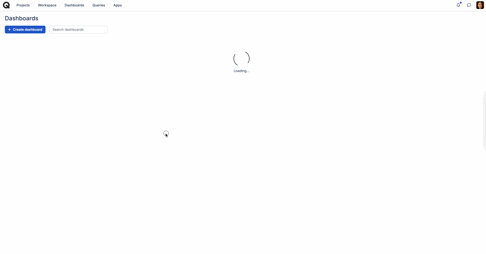

# Dashboards

## What are dashboards? 

Dashboards are a feature designed to provide you with a comprehensive understanding of their projects through statistical and analytical data.

You can create as many dashboards as you need, and each dashboard is fully customizable and can be shared with team members or external stakeholders with just a few clicks.

_<mark style="background-color:purple;">Dashboards are available in</mark>_ [_<mark style="background-color:purple;">Startup</mark>_](https://help.qase.io/en/articles/5563728-startup-plan)_<mark style="background-color:purple;">,</mark>_ [_<mark style="background-color:purple;">Business</mark>_](https://help.qase.io/en/articles/5563727-business-plan)_<mark style="background-color:purple;">, and</mark>_ [_<mark style="background-color:purple;">Enterprise</mark>_](https://help.qase.io/en/articles/6640055-enterprise-plan) _<mark style="background-color:purple;">subscriptions.</mark>_





## The Get Started Dashboard 

***

The Get Started Dashboard is designed to let you dive right into your analytics and customize as you go.

<figure><figcaption></figcaption></figure>

Setting up a dashboard from scratch can be time-consuming and overwhelming, especially when managing multiple projects and teams. To simplify this process, your workspace includes a Get Started Dashboard, providing an immediate overview of your team’s work.

This dashboard is automatically added to your workspace and comes included by default when you sign up. It features the most-used widgets from QA teams across the industry.

The Get Started Dashboard offers:

* **Pre-Configured Widgets:** Includes essential widgets that draw data from all projects in your workspace, offering a comprehensive view of your team’s activities.
* **Instant Insights:** Provides analytics without needing initial setup.
* **Customizability:** Allows you to:
  * Filter data based on various parameters.
  * Remove or add widgets to customize the view.
  * Change the dashboard name to better reflect its purpose.

## Creating a dashboard 

***

If you prefer to build a dashboard from scratch to meet specific needs or preferences, let’s explore how you can create a custom dashboard tailored to your requirements.

* First off, give your dashboard a **Title** \[1] (mandatory) and add a brief **description** \[2]:
* Next up, choose the dashboard **visibility** \[3]: you can keep it private to yourself or make it public for the entire team to use:

<figure><figcaption></figcaption></figure>

* Finally, pick[ projects](https://docs.qase.io/general/get-started-with-the-qase-platform/create-a-project) to base your dashboard on. If you select "All projects," the dashboard will gather data on all projects available to you. You can also choose just one project or any selection of projects to feed the data into your dashboard. If a dashboard is made public, every user will only see data regarding the projects they have access to.

<figure><figcaption></figcaption></figure>

Once configured, you can always go back to editing your dashboard's parameters via the Settings button:

<figure><figcaption></figcaption></figure>

## Dashboard Filters 

***

You can retrieve precise data within your dashboard widgets with the help of Filters.

<figure><figcaption></figcaption></figure>

Currently, the filters are available for the following widget types -

* Single Value
* Time Value
* Distribution Charts

_We’re expanding these filters to include more parameters, and extend the filters to Time Series widget type._

## Compare metrics across different projects / time periods 

***

To gain a comprehensive understanding of your projects’ performance, you can _compare_ various metrics _across different projects_ or _time periods_ using the diverse widget types available.

<figure><figcaption>
<code>Easily duplicate widgets, to view the same metric across diffrent projects</code>
</figcaption></figure>

**Identify Trends**:  Track changes in metrics such as test case counts, defect statuses, or test results over selected [time periods](https://help.qase.io/en/articles/5563698-dashboards#h\_537d98ced2), and compare these trends across multiple projects to spot patterns or anomalies.

**Analyze Project Performance**:  Use widgets like [Time Series](https://help.qase.io/en/articles/5563698-dashboards#h\_c16702bf28) and [Distribution Charts](https://help.qase.io/en/articles/5563698-dashboards#h\_6a4018eda2) to assess the performance and distribution of metrics across different projects, helping to pinpoint strengths and areas for improvement.

**Benchmark Against Standards**:  Utilize [Single Value](https://help.qase.io/en/articles/5563698-dashboards#h\_f1f898c3a1) widgets to compare current metrics with historical data, providing insight into whether your projects are meeting predefined benchmarks or goals.

## Widgets: Types 

***

When you are ready to begin adding widgets. hit the "+Add widget" button:

<figure><figcaption></figcaption></figure>

<figure><figcaption></figcaption></figure>

Several widgets are available; in the modal window, they are broken down into two groups: "**By Type**" and "**By Entity.**"

In the _Entities_ group, you can find widgets related to each specific entity - there are widgets for test cases, test runs, test results, defects, requirements, and custom fields.

_Type_ grouping collects different types of widgets:

* _**Single Value**:_ a single value chart shows a single value that represents the current state of the entity. This chart type answers the following question: “How many artifacts do we have at the moment?“.
* _**Timed Value**:_ a timed value chart shows a cumulative sum of events that happened to some entity. This chart answers the following question: “How many artifacts have been created this day/week/month?".
* _**Distribution charts**:_ this chart shows the current distribution of various test case properties or custom field values.
* _**Time-series:**_ a time-series chart shows changes for a specific entity type over a selected period of time.
* _**Table:**_ data is presented in a table format, with an option to display select columns.

Let's have a closer look at each of the widgets available:

### &#x20;Single Value 

***

<figure><figcaption></figcaption></figure>

*   #### _Single Value: Test Cases Count_ 

    _​_This widget shows the number of test cases you have in a project or projects at the moment and how it has increased or decreased over the specified time period.

<figure><figcaption></figcaption></figure>

*   #### _Single Value: Opened Defects Count_ 

    This widget shows the number of defects you have in a project or projects at the moment and how it has increased or decreased over the specified time period.

<figure><figcaption></figcaption></figure>

* #### _Single Value: Active Test Runs Count_ 

This widget shows the number of active test runs you have in a project or projects at the moment and how it has increased or decreased over the specified time period.

<figure><figcaption></figcaption></figure>

* #### _Single Value: Requirements Count_ 

This widget shows the number of requirements you have in a project or projects at the moment and how it has increased or decreased over the specified time period.

<figure><figcaption></figcaption></figure>

* #### _Single Value: Suite Count_ 

This widget shows the number of suites you have in a project or projects at the moment and how it has increased or decreased over the specified time period.

<figure><figcaption></figcaption></figure>

* #### _Single Value: Open Review Requests_ 

This widget shows the number of open (unprocessed) review requests you have in a project or projects at the moment and how it has increased or decreased over the specified time period.

<figure><figcaption></figcaption></figure>

* #### _Single Value: Test Cases Automation Ratio_ 

This widget shows the percentage of automated test cases you have in a project or projects at the moment and how it has increased or decreased over the specified time period. It is based on an "Automation Status" property of test cases.

<figure><figcaption></figcaption></figure>

* #### _Single Value: Flaky Test Cases Count_ 

This widget shows the number of flaky test cases you have in a project or projects at the moment and how it has increased or decreased over the specified time period. It is based on an "Is Flaky" property of test cases.

<figure><figcaption></figcaption></figure>

**Note:** You can select the benchmark time period in the widget settings for all Single value widgets.

<figure><figcaption></figcaption></figure>

### Timed Value 

***

<figure><figcaption></figcaption></figure>

* #### _Timed Value: Test Cases Events_ 

This widget shows the number of test cases that have been created, updated, or deleted in a project/projects over a specified period of time, and how this number has increased or decreased over a specified period of time.

<figure><figcaption></figcaption></figure>

* #### _Timed Value: Defects Events_ 

This widget shows the number of defects that have been created, updated, or deleted in a project/projects over a specified period of time, and how this number has increased or decreased over a specified period of time.

<figure><figcaption></figcaption></figure>

* #### _Timed Value: Test Results Events_ 

This widget shows the number of specific test results that have been submitted during test runs in a project/projects over a specified period of time, and how this number has increased or decreased over a specified period of time.

<figure><figcaption></figcaption></figure>

* #### _Timed Value: Test Run Events_ 

This widget shows the number of test runs that have been created, completed, or aborted in a project/projects over a specified period of time, and how this number has increased or decreased over a specified period of time.

<figure><figcaption></figcaption></figure>

**Note:** The type of event (created/completed/aborted) and the time range can be selected in the widget settings for all Timed Value widgets.

<figure><figcaption></figcaption></figure>

### Distribution Chart 

***

<figure><figcaption></figcaption></figure>

*   #### _Distribution Chart: Test Case Property Distribution_ 

    This chart shows the distribution of test cases by one of their properties. It can be represented as either a donut graph or a bar graph. Available properties are Status, Type, Behavior, Priority, Severity, Automation, and Layer.

<figure><figcaption></figcaption></figure>

\

<figure><figcaption></figcaption></figure>

<figure><figcaption></figcaption></figure>

* #### _Distribution Chart: Custom Field Values Distribution_ 

This chart shows the distribution of test cases by one of its custom field values. It can be represented as either a donut graph or a bar graph. Supported Custom Field data types are Select List (Single/Multi), Radiobutton, and Checkbox.

<figure><figcaption></figcaption></figure>

<figure><figcaption></figcaption></figure>

### Time Series 

***

<figure><figcaption></figcaption></figure>

* #### _Time Series: Test Cases Count_ 

This graph shows the number of test cases as of the current day as well as how it has been changing over the specified period.

<figure><figcaption></figcaption></figure>

* #### _Time Series: Test Cases Events_ 

This graph shows the number of test case events (creation, updates, or deletions) as of the current day as well as how it has been changing over the specified period.

<figure><figcaption></figcaption></figure>

* #### _Time Series: Test Cases Automation Ratio_ 

This graph shows how many automated test cases you have in a project or projects at the moment and how these numbers have been changing over time. It is based on an "Automation Status" property of test cases.

<figure><figcaption></figcaption></figure>

* #### _Time Series: Test Cases Automation Velocity:_ 

This graph shows how quickly your test cases with a “To Be Automated” status have been automated and how these numbers have changed over time. It is based on an "Automation Status" property and only applies to the automation statuses “To Be Automated” and “Automated.”

<figure><figcaption></figcaption></figure>

* #### _Time Series: Flaky Test Cases Count_ 

This graph shows the number of flaky test cases and how these numbers have been changing over time. It is based on an "Is Flaky" property of test cases.

<figure><figcaption></figcaption></figure>

* #### _Time Series: Test Results Events_ 

This graph shows the number of test results recorded (creation, updates, or deletions) as of the current day as well as how it has been changing over the specified period and which results were recorded.

<figure><figcaption></figcaption></figure>

**Note:** You can select the “Period” and “Dimension” in the widget settings for all Time Series widget type.

<figure><figcaption></figcaption></figure>

### Table: Qase Query Language (QQL) 

***

<mark style="background-color:green;">With the</mark> [<mark style="background-color:green;">QQL</mark>](https://docs.qase.io/general/analytics/queries) <mark style="background-color:green;">widget, you can leverage advanced query searches, and pin</mark> [<mark style="background-color:green;">frequently used or preferred QQL searches</mark>](https://docs.qase.io/general/analytics/queries/saved-queries) <mark style="background-color:green;">to your dashboards to facilitate quicker and more comprehensive monitoring of testing activities.</mark>

<figure><figcaption></figcaption></figure>

This widget presents data in a table format based on your [_saved queries_](https://docs.qase.io/general/analytics/queries/saved-queries) _\[1]_. You have the flexibility to select and customize which _fields \[2]_ are displayed in the query table.

<figure><figcaption></figcaption></figure>

<figure><figcaption></figcaption></figure>

<figure><figcaption></figcaption></figure>

\
You have the option to expand the widget to view additional rows or click "_see all_" to access the Query directly for more detailed information.

Additionally, you can create multiple widgets for the same query, each with different fields, allowing for easy comparison.

<figure><figcaption></figcaption></figure>

_**Please note**_, once the widget is created:

* You can modify your widget configuration whenever necessary, as well as edit the original query.
* If changes are made to the original query and the new results don't align with your widget configuration, you will be prompted to adjust the configuration to display the updated results.
* Users with limited permissions will only see query information that aligns with their allowed access levels.

## Share Dashboard 

***

Provide access to a report to anyone who needs to view project progress - even if they are not your Qase account members - with a public link.

\

<figure><figcaption></figcaption></figure>

<figure><figcaption></figcaption></figure>
