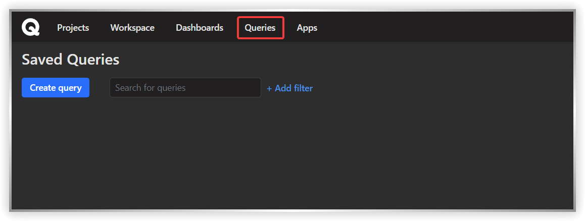
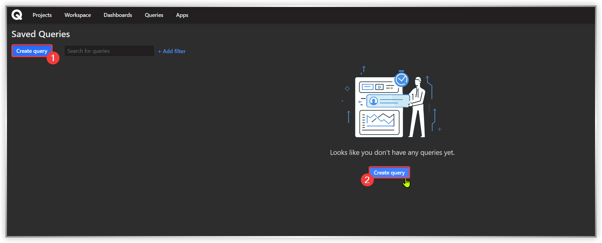
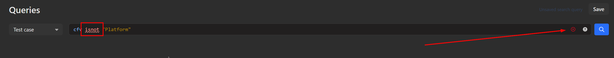

# Queries (QQL, Qase Query Language)

### What are queries in software testing?

Queries help you make analytical requests to get specific data from your Qase projects.

_<mark style="background-color:green;">Queries are available in</mark>_ [_<mark style="background-color:green;">Business</mark>_](https://help.qase.io/en/articles/5563727-business-plan) _<mark style="background-color:green;">and</mark>_ [_<mark style="background-color:green;">Enterprise</mark>_](https://help.qase.io/en/articles/6640055-enterprise-plan) _<mark style="background-color:green;">subscriptions.</mark>_



Queries are based on Qase Query Language (QQL). You can access Queries from the top-left menu.

<figure><figcaption></figcaption></figure>

From this page, you can manage [saved queries](https://docs.qase.io/general/analytics/queries/saved-queries) and create new ones.

### Create a new query

***

You can click on either one of the two buttons to create a new query.

<figure><figcaption></figcaption></figure>

Here, you can:\
1\. Select the entity from the drop down

2\. Write your query

3\. Search the query

4\. Save the query

<figure><figcaption></figcaption></figure>

## QQL Structure <a href="#h_36f7852862" id="h_36f7852862"></a>

***

QQL consists of two parts: "Entity" + "Query". Both are required to perform a search.

Here are a few examples:

```
entity = "defect" and status = "open"
```

```
entity = "case" and project = "DEMO" and title ~ "auth" order by id desc
```

```
entity = "result" and status = "failed" and timeSpent > 5000 and 
milestone ~ "Sprint 12"
```

```
entity = "case" and isFlaky = false and automation = "To be automated"
```

<mark style="background-color:yellow;">**Entity**</mark> <mark style="background-color:yellow;"></mark><mark style="background-color:yellow;">can be selected from the drop-down, and</mark> <mark style="background-color:yellow;"></mark><mark style="background-color:yellow;">**Projects**</mark><mark style="background-color:yellow;">, by default, include all projects available to a user.</mark>

<mark style="background-color:yellow;">If your expression contains a syntax error, the erroneous element will be highlighted in red, as well as you will see a red "x" icon appearing in the expression field:</mark>

<figure><figcaption></figcaption></figure>

### Entities <a href="#h_06385495fe" id="h_06385495fe"></a>

Below are the available entities. Click on an entity to skip to the attributes available for it.

* [Test case](https://docs.qase.io/general/analytics/queries#test\_case)
* [Test run](https://docs.qase.io/general/analytics/queries#test\_run)
* [Test run result](https://docs.qase.io/general/analytics/queries#test\_run\_results)
* [Test plan](https://docs.qase.io/general/analytics/queries#test\_plan)
* [Defects](https://docs.qase.io/general/analytics/queries-qql-qase-query-language#defects)
* [Requirement](https://docs.qase.io/general/analytics/queries#requirement)

### Expressions

Currently, QQL supports seven expression types. They are listed here in the decreasing priority order:


| Expression Type              | Example                                                                                         |
| ---------------------------- | ----------------------------------------------------------------------------------------------- |
| Parenthesis                  | <p></p><pre><code>( expression )
</code></pre>                                                  |
| Negation                     | <p></p><pre><code>not expression
</code></pre>                                                  |
| Logical Expression           | <p></p><pre><code>true
</code></pre><p>or</p><pre><code>false                    
</code></pre> |
| Logical AND                  | <p></p><pre><code>expression and expression
</code></pre>                                       |
| Logical OR                   | <p></p><pre><code>expression or expression
</code></pre>                                        |
| Checking the attribute value | <p></p><pre><code>attribute operand value
</code></pre>                                         |
| Sorting by field             | <p></p><pre><code>ORDER BY field ASC/DESC
</code></pre>                                         |

### Supported operands: <a href="#h_d76506957d" id="h_d76506957d"></a>

| **Operand**  | **Meaning**              | **Works With** |
| ------------ | ------------------------ | -------------- |
| <            | less than                | integer        |
| <=           | less than or equal to    | integer        |
| >            | greater than             | integer        |
| >=           | greater than or equal to | integer        |
| =, is        | equal to                 | integer, bool  |
| !=           | not equal to             | integer, bool  |
| \~           | includes                 | string, text   |
| in           | includes (array)         | array          |
| not in       | does not include (array) | array          |
| is empty     | no value                 |                |
| is not empty | value exists             |                |

### Data types: <a href="#h_057d278c89" id="h_057d278c89"></a>

| **Data type** | **Possible values**                                                  | **Supported operands** |
| ------------- | -------------------------------------------------------------------- | ---------------------- |
| Integer       | 110                                                                  | >, >=, <, <=, =, !=    |
| String        | Some text                                                            | \~                     |
| Boolean       | True or False                                                        | is                     |
| Array         | <p>['value 1', 'value 2']  ;<br>('value 1', 'value 2')  ;<br>[ ]</p> | in                     |
| Null          | null                                                                 |                        |

### Functions: <a href="#h_de59438a78" id="h_de59438a78"></a>


| Name          | Return type | Arguments                                                                                                                                                                                  | Description                   |
| ------------- | ----------- | ------------------------------------------------------------------------------------------------------------------------------------------------------------------------------------------ | ----------------------------- |
| currentUser() | integer     | -                                                                                                                                                                                          | Returns an ID of current user |
| now()         | integer     | <p>"+Nd" / "-Nd"- modifies returned value, adding/subtracting N days.</p><p>In "+Nd", replace d with<br>​ w for weeks;<br>​ m for months.<br>​</p><p><code>N must be an integer</code></p> | Returns current timestamp     |

## Entity fields <a href="#h_ea6301433d" id="h_ea6301433d"></a>

***

### Test case: <a href="#test_case" id="test_case"></a>

| Attribute                                                                                                                                                                                                                        | Description                                                                                                    | Examples                                                                                                                                                                                                                                                                                                                                                                                                                         |
| -------------------------------------------------------------------------------------------------------------------------------------------------------------------------------------------------------------------------------- | -------------------------------------------------------------------------------------------------------------- | -------------------------------------------------------------------------------------------------------------------------------------------------------------------------------------------------------------------------------------------------------------------------------------------------------------------------------------------------------------------------------------------------------------------------------- |
| <pre><code>id
</code></pre>                                                                                                                                                                                                      | identifier                                                                                                     | <pre><code>id = 17
</code></pre><pre><code>id != 20
</code></pre><pre><code>id is 17
</code></pre><pre><code>id in [1, 2, 10]
</code></pre><pre><code>not id in [1, 2, 10]
</code></pre>                                                                                                                                                                                                                                         |
| <pre><code>title
</code></pre><pre><code>preconditions
</code></pre><pre><code>postconditions
</code></pre><pre><code>description
</code></pre>                                                                                  | <p>Test case title,</p><p><br>Pre/postconditions,</p><p>Description</p>                                        | <pre><code>title is "first test"
</code></pre><pre><code>title = "first test"
</code></pre><pre><code>title ~ "rst"
</code></pre><pre><code>title in ["first test", "second test"]
</code></pre>                                                                                                                                                                                                                                 |
| <pre><code>author
</code></pre>                                                                                                                                                                                                  | creator the test case.                                                                                         | <pre><code>author in ["user1", "user2"]
</code></pre><pre><code>author = "user1" [or] 
author = "user2"
</code></pre>                                                                                                                                                                                                                                                                                                            |
| <pre><code>author
</code></pre>                                                                                                                                                                                                  | If a test case is created by a reporter app                                                                    | <pre><code>author = [name]-reporter
</code></pre><p>Replace [name] with reporter name.</p><pre><code>Eg: author = pytest-reporter
</code></pre><p>Reporters:</p><hr><p>Playwright;</p><p>cucumberjs;</p><p>cypress;</p><p>jest;</p><p>newman;</p><p>testcafe;</p><p>cucumber3; cucumber4; cucumber5;</p><p>junit4; jnuit5;</p><p>testng;</p><p>pytest;</p><p>robotframework;</p><p>xctest;</p><p>phpunit;</p><p>codeception.</p> |
| <pre><code>cf
</code></pre>                                                                                                                                                                                                      | <p>Custom fields:<br>a complex attribute with a specific syntax, see examples.</p>                             | <pre><code>cf["Epic"] = "Auth"
</code></pre><pre><code>cf["Story"] in ["Story 1", "Story 2"]
</code></pre><pre><code>cf["Epic"] is null
</code></pre>                                                                                                                                                                                                                                                                            |
| <pre><code>cfv
</code></pre>                                                                                                                                                                                                     | Custom field values. (by all custom fields)                                                                    | <pre><code>cfv = "Auth"
</code></pre><pre><code>cfv in ["Story 1", "Story 2"]
</code></pre>                                                                                                                                                                                                                                                                                                                                      |
| <pre><code>status
</code></pre><pre><code>type
</code></pre><pre><code>behavior
</code></pre><pre><code>automation
</code></pre><pre><code>layer
</code></pre><pre><code>priority
</code></pre><pre><code>severity
</code></pre> |                                                                                                                | <pre><code>status is "Actual"
</code></pre><pre><code>status = "Actual"
</code></pre><pre><code>status != "Deprecated"
</code></pre><pre><code>status in ["Draft", "Actual"]
</code></pre>                                                                                                                                                                                                                                       |
| <pre><code>created
</code></pre>                                                                                                                                                                                                 | Time of case creation                                                                                          | <pre><code>created >= now("-14d")
</code></pre><pre><code>created >= startOfDay("-1m")
</code></pre><pre><code>created &#x3C; 1569430502709
</code></pre>                                                                                                                                                                                                                                                                        |
| <pre><code>createdBy
</code></pre>                                                                                                                                                                                               | The user who created the case                                                                                  | <pre><code>createdBy in ["user1", "user2"]
</code></pre><pre><code>createdBy = "user1" or createdBy = "user2"
</code></pre>                                                                                                                                                                                                                                                                                                      |
| <pre><code>updated
</code></pre>                                                                                                                                                                                                 | Last modified date                                                                                             | <pre><code>updated >= now("-7d")
</code></pre><pre><code>updated >= startOfDay()
</code></pre><pre><code>updated &#x3C; 1569430502709
</code></pre>                                                                                                                                                                                                                                                                              |
| <pre><code>isDeleted
</code></pre>                                                                                                                                                                                               | Check whether the case has been deleted or not                                                                 | <pre><code>isDeleted is false
</code></pre><pre><code>isDeleted = true
</code></pre>                                                                                                                                                                                                                                                                                                                                             |
| <pre><code>isFlaky
</code></pre>                                                                                                                                                                                                 | Check whether the case has been flagged as flaky                                                               | <pre><code>isFlaky is false
</code></pre><pre><code>isFlaky = true
</code></pre>                                                                                                                                                                                                                                                                                                                                                 |
| <pre><code>project
</code></pre>                                                                                                                                                                                                 | <p>By default, search is performed across all projects.</p><p>If required, you can specify a project code.</p> | <pre><code>project = 'DEMO'
</code></pre><pre><code>project in ['DEMO', 'QTC']
</code></pre><pre><code>project not in ['DEMO']
</code></pre>                                                                                                                                                                                                                                                                                     |
| <pre><code>suite
</code></pre>                                                                                                                                                                                                   | Test case's suite title                                                                                        | <pre><code>suite ~ 'auth'
</code></pre><pre><code>suite != 'auth'
</code></pre>                                                                                                                                                                                                                                                                                                                                                  |
| <pre><code>milestone
</code></pre>                                                                                                                                                                                               | Test case's milestone title                                                                                    | <pre><code>milestone = 'Sprint 24'
</code></pre>                                                                                                                                                                                                                                                                                                                                                                                 |
| <pre><code>tags
</code></pre>                                                                                                                                                                                                    | Test case's tags                                                                                               | <pre><code>tags not in ['tag','tag2']
</code></pre>                                                                                                                                                                                                                                                                                                                                                                              |

### Defects: <a href="#defects" id="defects"></a>

| Attribute                              | Description                                                                                                               | Examples                                                                                                                                                                                                                                                                                                                                                                                                                                          |
| -------------------------------------- | ------------------------------------------------------------------------------------------------------------------------- | ------------------------------------------------------------------------------------------------------------------------------------------------------------------------------------------------------------------------------------------------------------------------------------------------------------------------------------------------------------------------------------------------------------------------------------------------- |
| <pre><code>id
</code></pre>            | identifier                                                                                                                | <pre><code>id = 17
</code></pre><pre><code>id != 20
</code></pre><pre><code>id is 17
</code></pre><pre><code>id in [1, 2, 10]
</code></pre><pre><code>not id in [1, 2, 10]
</code></pre>                                                                                                                                                                                                                                                          |
| <pre><code>title
</code></pre>         | Defect title                                                                                                              | <pre><code>title is "first test"
</code></pre><pre><code>title = "first test"
</code></pre><pre><code>title ~ "rst"
</code></pre><pre><code>title in ["first test", "second test"]
</code></pre>                                                                                                                                                                                                                                                  |
| <pre><code>actual_result
</code></pre> | Actual result                                                                                                             | <pre><code>actual_result is "first"
</code></pre><pre><code>actual_result = "first"
</code></pre><pre><code>actual_result ~ "rst"
</code></pre><pre><code>actual_result in ["first", "second"]
</code></pre>                                                                                                                                                                                                                                      |
| <pre><code>project
</code></pre>       | Project                                                                                                                   | <pre><code>project = 'DEMO'
</code></pre><pre><code>project in ['DEMO', 'QTC']
</code></pre><pre><code>project not in ['DEMO']
</code></pre>                                                                                                                                                                                                                                                                                                      |
| <pre><code>status
</code></pre>        | <p>Statuses</p><hr><p>open;<br>resolved;<br>in progress; invalid</p>                                                      | <pre><code>status is "Open"
</code></pre><pre><code>status = "Resolved"
</code></pre><pre><code>status != "Invalid"
</code></pre><pre><code>status in ["Open", "Invalid"]
</code></pre>                                                                                                                                                                                                                                                           |
| <pre><code>severity
</code></pre>      | <p>Severity</p><hr><p>undefined;</p><p>blocker;</p><p>critical;</p><p>major;</p><p>normal;</p><p>minor;</p><p>trivial</p> | <pre><code>severity is "blocker"
</code></pre><pre><code>severity = "blocker"
</code></pre><pre><code>severity != "blocker"
</code></pre><pre><code>severity in ["blocker", "critical"]
</code></pre>                                                                                                                                                                                                                                             |
| <pre><code>author
</code></pre>        | The user who created the defect                                                                                           | <pre><code>author in ["user1", "user2"]
</code></pre><pre><code>author = "user1"
</code></pre>                                                                                                                                                                                                                                                                                                                                                    |
| <pre><code>author
</code></pre>        | If a defect has been created by a reporter app                                                                            | <pre><code>author = [name]-reporter
</code></pre><p>Replace [name] with reporter name.</p><pre><code>Eg: author = pytest-reporter
</code></pre><p><strong>Reporters:</strong></p><hr><p>Playwright;</p><p>cucumberjs;</p><p>cypress;</p><p>jest;</p><p>newman;</p><p>testcafe;</p><p>cucumber3; cucumber4; cucumber5;</p><p>junit4; jnuit5;</p><p>testng;</p><p>pytest;</p><p>robotframework;</p><p>xctest;</p><p>phpunit;</p><p>codeception.</p> |
| <pre><code>createdBy
</code></pre>     | The user who created the defect                                                                                           | <pre><code>createdBy in ["user1", "user2"]
</code></pre><pre><code>createdBy = "user1" or createdBy = "user2"
</code></pre>                                                                                                                                                                                                                                                                                                                       |
| <pre><code>created
</code></pre>       | Time of creation                                                                                                          | <pre><code>created >= now("-14d")
</code></pre><pre><code>created >= startOfDay("-1m")
</code></pre><pre><code>created &#x3C; 1569430502709
</code></pre>                                                                                                                                                                                                                                                                                         |
| <pre><code>updated
</code></pre>       | Time of update                                                                                                            | <pre><code>updated >= now("-14d")
</code></pre><pre><code>updated >= startOfDay("-1m")
</code></pre><pre><code>updated &#x3C; 1569430502709
</code></pre>                                                                                                                                                                                                                                                                                         |
| <pre><code>resolved
</code></pre>      | Time of resolution                                                                                                        | <pre><code>resolved >= now("-14d")
</code></pre><pre><code>resolved >= startOfDay("-1m")
</code></pre><pre><code>resolved &#x3C; 1569430502709
</code></pre>                                                                                                                                                                                                                                                                                      |
| <pre><code>isDeleted
</code></pre>     | Whether the defect is deleted                                                                                             | <pre><code>isDeleted is false
</code></pre><pre><code>isDeleted = true
</code></pre>                                                                                                                                                                                                                                                                                                                                                              |
| <pre><code>isResolved
</code></pre>    | Whether the defect is resolved                                                                                            | <pre><code>isResolved is false
</code></pre><pre><code>isResolved = true
</code></pre>                                                                                                                                                                                                                                                                                                                                                            |
| <pre><code>milestone
</code></pre>     | Defect's milestone title                                                                                                  | <pre><code>milestone = 'Milestone title'
</code></pre>                                                                                                                                                                                                                                                                                                                                                                                            |
| <pre><code>cfv
</code></pre>           | Custom field values (by all custom fields)                                                                                | <pre><code>cfv = "Auth"
</code></pre><pre><code>cfv in ["Story 1", "Story 2"]
</code></pre><pre><code>cfv is empty
</code></pre>                                                                                                                                                                                                                                                                                                                  |
| <pre><code>cf
</code></pre>            | <p>Custom fields:<br>a complex attribute with a specific syntax, see examples.</p>                                        | <pre><code>cf["Epic"] = "Auth"
</code></pre><pre><code>cf["Story"] in ["Story 1", "Story 2"]
</code></pre><pre><code>cf["Epic"] is null
</code></pre>                                                                                                                                                                                                                                                                                             |
| <pre><code>tags
</code></pre>          | Defect's tags                                                                                                             | <pre><code>tags not in ['tag']
</code></pre>                                                                                                                                                                                                                                                                                                                                                                                                      |

### Test run: <a href="#test_run" id="test_run"></a>

| **Attribute**                        | **Description**                                                                    | **Examples**                                                                                                                                                                                                                                                                                                                                                                                                                     |
| ------------------------------------ | ---------------------------------------------------------------------------------- | -------------------------------------------------------------------------------------------------------------------------------------------------------------------------------------------------------------------------------------------------------------------------------------------------------------------------------------------------------------------------------------------------------------------------------- |
| <pre><code>id
</code></pre>          | Identifier                                                                         | <pre><code>id = 17
</code></pre><pre><code>id != 20
</code></pre><pre><code>id is 17
</code></pre><pre><code>id in [1, 2, 10]
</code></pre><pre><code>id not in [1, 2, 10]
</code></pre>                                                                                                                                                                                                                                         |
| <pre><code>title
</code></pre>       | Title                                                                              | <pre><code>title is "first test"
</code></pre><pre><code>title = "first test"
</code></pre><pre><code>title ~ "rst"
</code></pre><pre><code>title in ["first test", "second test"]
</code></pre>                                                                                                                                                                                                                                 |
| <pre><code>description
</code></pre> | Description                                                                        | <pre><code>description is "first"
</code></pre><pre><code>description = "first"
</code></pre><pre><code>description ~ "rst"
</code></pre><pre><code>description in ["first", "second"]
</code></pre>                                                                                                                                                                                                                             |
| <pre><code>project
</code></pre>     | Project                                                                            | <pre><code>project = 'DEMO'
</code></pre><pre><code>project in ['DEMO', 'QTC']
</code></pre><pre><code>project not in ['DEMO']
</code></pre>                                                                                                                                                                                                                                                                                     |
| <pre><code>plan
</code></pre>        | Title of the plan used                                                             | <pre><code>plan = 'Regression'
</code></pre>                                                                                                                                                                                                                                                                                                                                                                                     |
| <pre><code>status
</code></pre>      | Status                                                                             | <pre><code>status is "Open"
</code></pre><pre><code>status = "Resolved"
</code></pre><pre><code>status != "Invalid"
</code></pre><pre><code>status in ["Open", "Invalid"]
</code></pre>                                                                                                                                                                                                                                          |
| <pre><code>author
</code></pre>      | The user who created the run                                                       | <pre><code>author in ["user1", "user2"]
</code></pre><pre><code>author = "user1" or createdBy = "user2"
</code></pre>                                                                                                                                                                                                                                                                                                            |
| <pre><code>author
</code></pre>      | If a test run has been created by a reporter app                                   | <pre><code>author = [name]-reporter
</code></pre><p>Replace [name] with reporter name.</p><pre><code>Eg: author = pytest-reporter
</code></pre><p>Reporters:</p><hr><p>Playwright;</p><p>cucumberjs;</p><p>cypress;</p><p>jest;</p><p>newman;</p><p>testcafe;</p><p>cucumber3; cucumber4; cucumber5;</p><p>junit4; jnuit5;</p><p>testng;</p><p>pytest;</p><p>robotframework;</p><p>xctest;</p><p>phpunit;</p><p>codeception.</p> |
| <pre><code>createdBy
</code></pre>   | The user who created the run                                                       | <pre><code>createdBy in ["user1", "user2"]
</code></pre><pre><code>createdBy = "user1"   or 
createdBy = "user2"
</code></pre>                                                                                                                                                                                                                                                                                                   |
| <pre><code>started
</code></pre>     | Time of start                                                                      | <pre><code>started >= now("-14d")
</code></pre><pre><code>started >= startOfDay("-1m")
</code></pre><pre><code>started &#x3C; 1569430502709
</code></pre>                                                                                                                                                                                                                                                                        |
| <pre><code>ended
</code></pre>       | Time of finish                                                                     | <pre><code>ended >= now("-14d")
</code></pre><pre><code>ended >= startOfDay("-1m")
</code></pre><pre><code>ended &#x3C; 1569430502709
</code></pre>                                                                                                                                                                                                                                                                              |
| <pre><code>deleted
</code></pre>     | Time of removal                                                                    | <pre><code>deleted >= now("-14d")
</code></pre><pre><code>deleted >= startOfDay("-1m")
</code></pre><pre><code>deleted &#x3C; 1569430502709
</code></pre>                                                                                                                                                                                                                                                                        |
| <pre><code>isDeleted
</code></pre>   | Whether the run is deleted                                                         | <pre><code>isDeleted is false
</code></pre><pre><code>isDeleted = true
</code></pre>                                                                                                                                                                                                                                                                                                                                             |
| <pre><code>isStarted
</code></pre>   | Whether the run is started                                                         | <pre><code>isStarted is false
</code></pre><pre><code>isStarted = true
</code></pre>                                                                                                                                                                                                                                                                                                                                             |
| <pre><code>isEnded
</code></pre>     | Whether the run is ended                                                           | <pre><code>isEnded is false
</code></pre><pre><code>isEnded = true
</code></pre>                                                                                                                                                                                                                                                                                                                                                 |
| <pre><code>isPublic
</code></pre>    | Whether the run has a public link                                                  | <pre><code>isPublic is false
</code></pre><pre><code>isPublic = true
</code></pre>                                                                                                                                                                                                                                                                                                                                               |
| <pre><code>isAutotest
</code></pre>  | Whether the run is automated                                                       | <pre><code>isAutotest is false
</code></pre><pre><code>isAutotest = true
</code></pre>                                                                                                                                                                                                                                                                                                                                           |
| <pre><code>Milestone
</code></pre>   | Run's milestone title                                                              | <pre><code>milestone = 'Milestone title'
</code></pre>                                                                                                                                                                                                                                                                                                                                                                           |
| <pre><code>cfv
</code></pre>         | Custom field values (by all custom fields)                                         | <pre><code>cfv = "Auth"
</code></pre><pre><code>cfv in ["Story 1", "Story 2"]
</code></pre><pre><code>cfv is empty
</code></pre>                                                                                                                                                                                                                                                                                                 |
| <pre><code>cf
</code></pre>          | <p>Custom fields:<br>a complex attribute with a specific syntax, see examples.</p> | <pre><code>cf["Epic"] = "Auth"
</code></pre><pre><code>cf["Story"] in ["Story 1", "Story 2"]
</code></pre><pre><code>cf["Epic"] is null
</code></pre>                                                                                                                                                                                                                                                                            |
| <pre><code>tags
</code></pre>        | Run's tags                                                                         | <pre><code>tags not in ['tag_name']
</code></pre>                                                                                                                                                                                                                                                                                                                                                                                |

### Test run results: <a href="#test_run_results" id="test_run_results"></a>

| Attribute                                                        | Description                                                                                                                               | Examples                                                                                                                                                                                                                                                                                                                                                                                                                                          |
| ---------------------------------------------------------------- | ----------------------------------------------------------------------------------------------------------------------------------------- | ------------------------------------------------------------------------------------------------------------------------------------------------------------------------------------------------------------------------------------------------------------------------------------------------------------------------------------------------------------------------------------------------------------------------------------------------- |
| <pre><code>id
</code></pre>                                      | Identifier                                                                                                                                | <pre><code>caseId = 17
</code></pre><pre><code>caseId != 20
</code></pre><pre><code>caseId is 17
</code></pre><pre><code>caseId in [1, 2, 10]
</code></pre><pre><code>not caseId in [1, 2, 10]
</code></pre>                                                                                                                                                                                                                                      |
| <pre><code>comment
</code></pre>                                 | Comment                                                                                                                                   | <pre><code>comment is "first test"
</code></pre><pre><code>comment = "first test"
</code></pre><pre><code>comment ~ "rst"
</code></pre><pre><code>comment in ["first test", "second test"]
</code></pre>                                                                                                                                                                                                                                          |
| <pre><code>case
</code></pre>                                    | Test Run Result's case title                                                                                                              | <pre><code>case is "first"
</code></pre><pre><code>case = "first"
</code></pre><pre><code>case ~ "rst"
</code></pre><pre><code>case in ["first", "second"]
</code></pre>                                                                                                                                                                                                                                                                          |
| <pre><code>run
</code></pre>                                     | Test Run title                                                                                                                            | <pre><code>run is "first"
</code></pre><pre><code>run = "first"
</code></pre><pre><code>run ~ "rst"
</code></pre><pre><code>run in ["first", "second"]
</code></pre>                                                                                                                                                                                                                                                                              |
| <pre><code>project
</code></pre>                                 | Project                                                                                                                                   | <pre><code>project = 'DEMO'
</code></pre><pre><code>project in ['DEMO', 'QTC']
</code></pre><pre><code>project not in ['DEMO']
</code></pre>                                                                                                                                                                                                                                                                                                      |
| <pre><code>status
</code></pre>                                  | <p>Status</p><hr><p>Passed;</p><p>Failed;</p><p>Blocked;</p><p>Retest;</p><p>Skipped;</p><p>Deleted;</p><p>In progress;</p><p>Invalid</p> | <pre><code>status is "Invalid"
</code></pre><pre><code>status = "Invalid"
</code></pre><pre><code>status != "Invalid"
</code></pre><pre><code>status in ["Invalid", "Failed"]
</code></pre>                                                                                                                                                                                                                                                       |
| <pre><code>author
</code></pre><pre><code>assignee
</code></pre> | The user who created the result                                                                                                           | <pre><code>author in ["user1", "user2"]
</code></pre><pre><code>author = "user1" or createdBy = "user2"
</code></pre>                                                                                                                                                                                                                                                                                                                             |
| <pre><code>author
</code></pre><pre><code>assignee
</code></pre> | If a test run result has been created by a reporter app                                                                                   | <pre><code>author = [name]-reporter
</code></pre><p>Replace [name] with reporter name.</p><pre><code>Eg: author = pytest-reporter
</code></pre><p><strong>Reporters:</strong></p><hr><p>Playwright;</p><p>cucumberjs;</p><p>cypress;</p><p>jest;</p><p>newman;</p><p>testcafe;</p><p>cucumber3; cucumber4; cucumber5;</p><p>junit4; jnuit5;</p><p>testng;</p><p>pytest;</p><p>robotframework;</p><p>xctest;</p><p>phpunit;</p><p>codeception.</p> |
| <pre><code>createdBy
</code></pre>                               | The user who created the run                                                                                                              | <pre><code>createdBy in ["user1", "user2"]
</code></pre><pre><code>createdBy = "user1" or createdBy = "user2"
</code></pre>                                                                                                                                                                                                                                                                                                                       |
| <pre><code>ended
</code></pre>                                   | Time of finish                                                                                                                            | <pre><code>ended >= now("-14d")
</code></pre><pre><code>ended >= startOfDay("-1m")
</code></pre><pre><code>ended &#x3C; 1569430502709
</code></pre>                                                                                                                                                                                                                                                                                               |
| <pre><code>isDeleted
</code></pre>                               | Whether the result is deleted                                                                                                             | <pre><code>isDeleted is false
</code></pre><pre><code>isDeleted = true
</code></pre>                                                                                                                                                                                                                                                                                                                                                              |
| <pre><code>timeSpent
</code></pre>                               | Time spent (in milliseconds)                                                                                                              | <pre><code>timeSpent > 10000
</code></pre>                                                                                                                                                                                                                                                                                                                                                                                                        |

### Test plan: <a href="#test_plan" id="test_plan"></a>

| Attribute                            | Description                 | Examples                                                                                                                                                                                                                 |
| ------------------------------------ | --------------------------- | ------------------------------------------------------------------------------------------------------------------------------------------------------------------------------------------------------------------------ |
| <pre><code>id
</code></pre>          | Identifier                  | <pre><code>id = 17
</code></pre><pre><code>id != 20
</code></pre><pre><code>id is 17
</code></pre><pre><code>id in [1, 2, 10]
</code></pre><pre><code>not id in [1, 2, 10]
</code></pre>                                 |
| <pre><code>title
</code></pre>       | Title                       | <pre><code>title is "first test"
</code></pre><pre><code>title = "first test"
</code></pre><pre><code>title ~ "rst"
</code></pre><pre><code>title in ["first test", "second test"]
</code></pre>                         |
| <pre><code>description
</code></pre> | Plan's description          | <pre><code>description is "first test"
</code></pre><pre><code>description = "first test"
</code></pre><pre><code>description ~ "rst"
</code></pre><pre><code>description in ["first test", "second test"]
</code></pre> |
| <pre><code>project
</code></pre>     | Project                     | <pre><code>project = 'DEMO'
</code></pre><pre><code>project in ['DEMO', 'QTC']
</code></pre><pre><code>project not in ['DEMO']
</code></pre>                                                                             |
| <pre><code>created
</code></pre>     | Time of creation            | <pre><code>created >= now("-14d")
</code></pre><pre><code>created >= startOfDay("-1m")
</code></pre><pre><code>created &#x3C; 1569430502709
</code></pre>                                                                |
| <pre><code>updated
</code></pre>     | Time of the last update     | <pre><code>updated >= now("-14d")
</code></pre><pre><code>updated >= startOfDay("-1m")
</code></pre><pre><code>updated &#x3C; 1569430502709
</code></pre>                                                                |
| <pre><code>deleted
</code></pre>     | Time of deletion            | <pre><code>deleted >= now("-14d")
</code></pre><pre><code>deleted >= startOfDay("-1m")
</code></pre><pre><code>deleted &#x3C; 1569430502709
</code></pre>                                                                |
| <pre><code>isDeleted
</code></pre>   | Whether the plan is deleted | <pre><code>isDeleted is false
</code></pre><pre><code>isDeleted = true
</code></pre>                                                                                                                                     |

### Requirement: <a href="#requirement" id="requirement"></a>

| Attribute                            | Description                                                                                                                                  | Examples                                                                                                                                                                                                                 |
| ------------------------------------ | -------------------------------------------------------------------------------------------------------------------------------------------- | ------------------------------------------------------------------------------------------------------------------------------------------------------------------------------------------------------------------------ |
| <pre><code>id
</code></pre>          | Identifier                                                                                                                                   | <pre><code>id = 17
</code></pre><pre><code>id != 20
</code></pre><pre><code>id is 17
</code></pre><pre><code>id in [1, 2, 10]
</code></pre><pre><code>not id in [1, 2, 10]
</code></pre>                                 |
| <pre><code>parent
</code></pre>      | Parent requirement's title                                                                                                                   | <pre><code>parent is "first test"
</code></pre><pre><code>parent = "first test"
</code></pre><pre><code>parent ~ "rst"
</code></pre><pre><code>parent in ["first test", "second test"]
</code></pre>                     |
| <pre><code>project
</code></pre>     | Project                                                                                                                                      | <pre><code>project = 'DEMO'
</code></pre><pre><code>project in ['DEMO', 'QTC']
</code></pre><pre><code>project not in ['DEMO']
</code></pre>                                                                             |
| <pre><code>author
</code></pre>      | The user who created the requirement                                                                                                         | <pre><code>author in ["user1", "user2"]
</code></pre><pre><code>author = "user1"     or 
createdBy = "user2"
</code></pre>                                                                                               |
| <pre><code>createdBy
</code></pre>   | The user who created the requirement                                                                                                         | <pre><code>createdBy in ["user1", "user2"]
</code></pre><pre><code>createdBy = "user1"  or 
createdBy = "user2"
</code></pre>                                                                                            |
| <pre><code>title
</code></pre>       | Title                                                                                                                                        | <pre><code>title is "first test"
</code></pre><pre><code>title = "first test"
</code></pre><pre><code>title ~ "rst"
</code></pre><pre><code>title in ["first test", "second test"]
</code></pre>                         |
| <pre><code>description
</code></pre> | Description                                                                                                                                  | <pre><code>description is "first test"
</code></pre><pre><code>description = "first test"
</code></pre><pre><code>description ~ "rst"
</code></pre><pre><code>description in ["first test", "second test"]
</code></pre> |
| <pre><code>status
</code></pre>      | <p>Status</p><hr><p>valid;</p><p>draft;</p><p>review;</p><p>rework;</p><p>finish;</p><p>implemented;</p><p>not-testable;</p><p>obsolete.</p> | <pre><code>status = 'valid'
</code></pre>                                                                                                                                                                                |
| <pre><code>type
</code></pre>        | <p>Type</p><hr><p>epic;</p><p>user-story;</p><p>feature.</p>                                                                                 | <pre><code>type = 'epic'
</code></pre>                                                                                                                                                                                   |
| <pre><code>created
</code></pre>     | Time of creation                                                                                                                             | <pre><code>created >= now("-14d")
</code></pre><pre><code>created >= startOfDay("-1m")
</code></pre><pre><code>created &#x3C; 1569430502709
</code></pre>                                                                |
| <pre><code>updated
</code></pre>     | Time of last update                                                                                                                          | <pre><code>updated >= now("-14d")
</code></pre><pre><code>updated >= startOfDay("-1m")
</code></pre><pre><code>updated &#x3C; 1569430502709
</code></pre>                                                                |
| <pre><code>deleted
</code></pre>     | Time of deletion                                                                                                                             | <pre><code>deleted >= now("-14d")
</code></pre><pre><code>deleted >= startOfDay("-1m")
</code></pre><pre><code>deleted &#x3C; 1569430502709
</code></pre>                                                                |
| <pre><code>isDeleted
</code></pre>   | Whether the requirement is deleted                                                                                                           | <pre><code>isDeleted is false
</code></pre><pre><code>isDeleted = true
</code></pre>                                                                                                                                     |

### Examples of Queries

***

```
entity = "case" and isDeleted is true
```

```
entity = "case" and created >= now("-3d")
```

```
entity = "case" and created <= now("-3d")
```

```
entity = "case" and isDeleted is true and project in ["QTC"]
```

```
project = "QTC" and automation = "Not automated"
```

```
project = "MR" and automation != "Automated"
```

```
project = "QTC" and status in ["Draft", "Actual"]
```

```
entity = "defect" and status !="Open" and severity = "Not set"
```

```
entity = "defect" and status !=1 and severity = 0
```

```
entity = "defect" and status !=1 and severity = 0 and cfv in ["1", "2"]
```

```
entity = "defect" and status !="Open" and severity != "Not set" and milestone is empty
```

```
entity = "defect" and status !="Open" and severity != "Not set" and cf["Defect URL"] is not null
```

```
entity = "case" and author != "CEO" and updated <= now("-1d") and isFlaky is false
```

```
entity = "case" and author != "CEO" and updated <= now("-1d") and project in ('QA
```


\


\
\


\


### &#x20;<a href="#h_e9113559bb" id="h_e9113559bb"></a>

### &#x20;<a href="#h_340289e352" id="h_340289e352"></a>

### &#x20;<a href="#h_d6d0c91118" id="h_d6d0c91118"></a>

### &#x20;<a href="#h_cb4adef46a" id="h_cb4adef46a"></a>

***

### &#x20;<a href="#h_de59438a78" id="h_de59438a78"></a>

\


\


###

###


