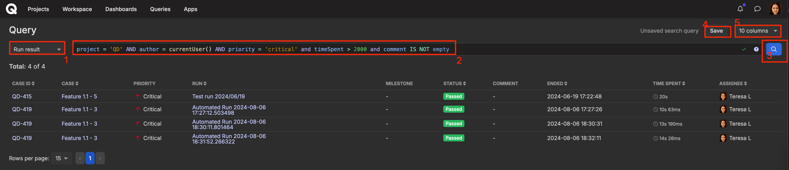

# Queries (QQL, Qase Query Language)

What are queries in software testing?

Queries help you make analytical requests to get specific data from your Qase projects.

_<mark style="background-color:green;">Queries are available in</mark>_ [_<mark style="background-color:green;">Business</mark>_](https://help.qase.io/en/articles/5563727-business-plan) _<mark style="background-color:green;">and</mark>_ [_<mark style="background-color:green;">Enterprise</mark>_](https://help.qase.io/en/articles/6640055-enterprise-plan) _<mark style="background-color:green;">subscriptions.</mark>_






Queries are based on Qase Query Language (QQL). You can access Queries from the top-left menu.

<figure><figcaption></figcaption></figure>

From this page, you can manage [saved queries](https://docs.qase.io/general/analytics/queries/saved-queries) and create new ones.


[Saved Queries](https://docs.qase.io/general/analytics/queries-qql-qase-query-language/saved-queries) can be used with the [QQL widget](https://docs.qase.io/general/analytics/dashboards).

QQL widget allows you to leverage advanced query searches, and pin frequently used or preferred QQL searches to your [_dashboards_](https://docs.qase.io/general/analytics/dashboards) to facilitate quicker and more comprehensive monitoring of testing activities.



### Create a new query

***

You can click on either one of the two buttons to create a new query.

<figure><figcaption></figcaption></figure>

Here, you can: \
\
1\. Select the entity from the drop down

2\. Write your query

3\. Search the query

4\. Save the query

5\. Choose the fields to be displayed in the table.

<figure><figcaption></figcaption></figure>


## QQL Structure <a href="#h_36f7852862" id="h_36f7852862"></a>

***

QQL consists of two parts: "Entity" + "Query". Both are required to perform a search.

Here are a few examples:

```
entity = "defect" and status = "open"
```

```
entity = "case" and project = "DEMO" and title ~ "auth" order by id desc
```

```
entity = "result" and status = "failed" and timeSpent > 5000 and 
milestone ~ "Sprint 12"
```

```
entity = "case" and isFlaky = false and automation = "To be automated"
```



**Entity** can be selected from the drop-down, and **Projects**, by default, include all projects available to a user.

If your expression contains a syntax error, the erroneous element will be highlighted in red, as well as you will see a red "x" icon appearing in the expression field:



<figure><figcaption></figcaption></figure>

### Entities <a href="#h_06385495fe" id="h_06385495fe"></a>

Below are the available entities. Click on an entity to skip to the attributes available for it.

* [Test case](https://docs.qase.io/general/analytics/queries#test\_case)
* [Test run](https://docs.qase.io/general/analytics/queries#test\_run)
* [Test run result](https://docs.qase.io/general/analytics/queries#test\_run\_results)
* [Test plan](https://docs.qase.io/general/analytics/queries#test\_plan)
* [Defects](https://docs.qase.io/general/analytics/queries-qql-qase-query-language#defects)
* [Requirement](https://docs.qase.io/general/analytics/queries#requirement)

### Expressions

Currently, QQL supports seven expression types. They are listed here in the decreasing priority order:


<table><thead><tr><th width="271">Expression Type</th><th>Example</th></tr></thead><tbody><tr><td>Parenthesis</td><td><p></p><pre><code>( expression )
</code></pre></td></tr><tr><td>Negation</td><td><p></p><pre><code>not expression
</code></pre></td></tr><tr><td>Logical Expression</td><td><p></p><pre><code>true
</code></pre><p>or</p><pre><code>false                    
</code></pre></td></tr><tr><td>Logical AND</td><td><p></p><pre><code>expression and expression
</code></pre></td></tr><tr><td>Logical OR</td><td><p></p><pre><code>expression or expression
</code></pre></td></tr><tr><td>Checking the attribute value</td><td><p></p><pre><code>attribute operand value
</code></pre></td></tr><tr><td>Sorting by field</td><td><p></p><pre><code>ORDER BY field ASC/DESC
</code></pre></td></tr></tbody></table>

### Supported operands: <a href="#h_d76506957d" id="h_d76506957d"></a>

<table data-header-hidden><thead><tr><th width="226.33333333333331">Operand</th><th width="277">Meaning</th><th>Works with</th></tr></thead><tbody><tr><td><strong>Operand</strong></td><td><strong>Meaning</strong></td><td><strong>Works With</strong></td></tr><tr><td>&#x3C;</td><td>less than</td><td>integer</td></tr><tr><td>&#x3C;=</td><td>less than or equal to</td><td>integer</td></tr><tr><td>></td><td>greater than</td><td>integer</td></tr><tr><td>>=</td><td>greater than or equal to</td><td>integer</td></tr><tr><td>=, is</td><td>equal to</td><td>integer, bool</td></tr><tr><td>!=</td><td>not equal to</td><td>integer, bool</td></tr><tr><td>~</td><td>includes</td><td>string, text</td></tr><tr><td>in</td><td>includes (array)</td><td>array</td></tr><tr><td>not in</td><td>does not include (array)</td><td>array</td></tr><tr><td>is empty</td><td>no value</td><td></td></tr><tr><td>is not empty</td><td>value exists</td><td></td></tr></tbody></table>

### Data types: <a href="#h_057d278c89" id="h_057d278c89"></a>

<table data-header-hidden><thead><tr><th width="227.33333333333331"></th><th width="279"></th><th></th></tr></thead><tbody><tr><td><strong>Data type</strong></td><td><strong>Possible values</strong></td><td><strong>Supported operands</strong></td></tr><tr><td>Integer</td><td>110</td><td>>, >=, &#x3C;, &#x3C;=, =, !=</td></tr><tr><td>String</td><td>Some text</td><td>~</td></tr><tr><td>Boolean</td><td>True or False</td><td>is</td></tr><tr><td>Array</td><td>['value 1', 'value 2']  ;<br>('value 1', 'value 2')  ;<br>[ ]</td><td>in</td></tr><tr><td>Null</td><td>null</td><td></td></tr></tbody></table>

### Functions: <a href="#h_de59438a78" id="h_de59438a78"></a>


<table><thead><tr><th width="162">Name</th><th width="100">Return type</th><th width="299">Arguments</th><th>Description</th></tr></thead><tbody><tr><td>currentUser()</td><td>integer</td><td>-</td><td>Returns an ID of current user</td></tr><tr><td>now()</td><td>integer</td><td><p>"+Nd" / "-Nd"- modifies returned value, adding/subtracting N days.</p><p>In "+Nd", replace d with<br>​ w for weeks;<br>​ m for months.<br>​</p><p><code>N must be an integer</code></p></td><td>Returns current timestamp</td></tr><tr><td>startOfDay()</td><td>integer</td><td><p>'YYYY-mm-dd' - modifies returned value to the start of this input date.</p><p><code>"+/-N[d/w/m]"</code> - modifies returned value by N days/weeks/months.</p></td><td>Returns timestamp of start of current day.</td></tr><tr><td>startOfWeek()</td><td>integer</td><td><p>'YYYY-mm-dd' - modifies returned value to the start of first day of the week (relative to the input date)</p><p><code>"+/-N[d/w/m]"</code> - modifies returned value by N days/weeks/months.</p></td><td>Returns timestamp of start of current week.</td></tr><tr><td>startOfMonth()</td><td>integer</td><td><p>'YYYY-mm-dd' - modifies returned value to the start of first day of the month (relative to the input date)</p><p><code>"+/-N[d/w/m]"</code> - modifies returned value by N days/weeks/months.</p></td><td>Returns timestamp of start of current Month.</td></tr><tr><td>endOfDay()</td><td>integer</td><td><p>'YYYY-mm-dd' - modifies returned value to the end of the input date.</p><p><code>"+/-N[d/w/m]"</code> - modifies returned value by N days/weeks/months.</p></td><td>Returns timestamp of end of current day.</td></tr><tr><td>endOfWeek()</td><td>integer</td><td><p>'YYYY-mm-dd' - modifies returned value to the end of first day of the week (relative to the input date)</p><p><code>"+/-N[d/w/m]"</code> - modifies returned value by N days/weeks/months.</p></td><td>Returns timestamp of end of current Week.</td></tr><tr><td>endOfMonth()</td><td>integer</td><td><p>'YYYY-mm-dd' - modifies returned value to the end of first day of the month (relative to the input date)</p><p><code>"+/-N[d/w/m]"</code> - modifies returned value by N days/weeks/months.</p></td><td>Returns timestamp of end of current Month.</td></tr></tbody></table>

## Entity fields <a href="#h_ea6301433d" id="h_ea6301433d"></a>

***

### Test case: <a href="#test_case" id="test_case"></a>

<table data-header-hidden><thead><tr><th width="205"></th><th width="177.33333333333331"></th><th></th></tr></thead><tbody><tr><td>Attribute</td><td>Description</td><td>Examples</td></tr><tr><td><pre><code>id
</code></pre></td><td>identifier</td><td><pre><code>id = 17
</code></pre><pre><code>id != 20
</code></pre><pre><code>id is 17
</code></pre><pre><code>id in [1, 2, 10]
</code></pre><pre><code>not id in [1, 2, 10]
</code></pre></td></tr><tr><td><pre><code>title
</code></pre><pre><code>preconditions
</code></pre><pre><code>postconditions
</code></pre><pre><code>description
</code></pre></td><td><p>Test case title,</p><p><br>Pre/postconditions,</p><p>Description</p></td><td><pre><code>title is "first test"
</code></pre><pre><code>title = "first test"
</code></pre><pre><code>title ~ "rst"
</code></pre><pre><code>title in ["first test", "second test"]
</code></pre></td></tr><tr><td><pre><code><strong>author
</strong></code></pre></td><td>creator the test case.</td><td><p></p><pre><code>author in ["user1", "user2"]
</code></pre><pre><code>author = "user1" [or] 
author = "user2"
</code></pre><pre><code>author = group('name') [or] 
author in [group('name1'), group('name2')]
</code></pre><pre><code>author = activeUsers() [or] 
author = inactiveUsers()
</code></pre></td></tr><tr><td><pre><code>author
</code></pre></td><td>If a test case is created by a reporter app</td><td><pre><code>author = [name]-reporter
</code></pre><p>Replace [name] with reporter name.</p><pre><code>Eg: author = pytest-reporter
</code></pre><p>Reporters:</p><hr><p>Playwright;</p><p>cucumberjs;</p><p>cypress;</p><p>jest;</p><p>newman;</p><p>testcafe;</p><p>cucumber3; cucumber4; cucumber5;</p><p>junit4; jnuit5;</p><p>testng;</p><p>pytest;</p><p>robotframework;</p><p>xctest;</p><p>phpunit;</p><p>codeception.</p></td></tr><tr><td><pre><code>cf
</code></pre></td><td>Custom fields:<br>a complex attribute with a specific syntax, see examples.</td><td><p></p><pre><code>cf["Epic"] = "Auth"
</code></pre><pre><code>cf["Story"] in ["Story 1", "Story 2"]
</code></pre><pre><code>cf["Epic"] is null
</code></pre><pre><code>cf["Story"] = ["Auth", "Login"]
</code></pre></td></tr><tr><td><pre><code>cfv
</code></pre></td><td>Custom field values. (by all custom fields)</td><td><pre><code>cfv = "Auth"
</code></pre><pre><code>cfv in ["Story 1", "Story 2"]
</code></pre></td></tr><tr><td><pre><code>status
</code></pre><pre><code>type
</code></pre><pre><code>behavior
</code></pre><pre><code>automation
</code></pre><pre><code>layer
</code></pre><pre><code>priority
</code></pre><pre><code>severity
</code></pre></td><td></td><td><pre><code>status is "Actual"
</code></pre><pre><code>status = "Actual"
</code></pre><pre><code>status != "Deprecated"
</code></pre><pre><code>status in ["Draft", "Actual"]
</code></pre></td></tr><tr><td><pre><code>created
</code></pre></td><td>Time of case creation</td><td><pre><code>created >= now("-14d")
</code></pre><pre><code>created >= startOfDay("-1m")
</code></pre><pre><code>created &#x3C; 1569430502709
</code></pre></td></tr><tr><td><pre><code>createdBy
</code></pre></td><td>The user who created the case</td><td><pre><code>createdBy in ["user1", "user2"]
</code></pre><pre><code>createdBy = "user1" or createdBy = "user2"
</code></pre></td></tr><tr><td><pre><code>updated
</code></pre></td><td>Last modified date</td><td><pre><code>updated >= now("-7d")
</code></pre><pre><code>updated >= startOfDay()
</code></pre><pre><code>updated &#x3C; 1569430502709
</code></pre></td></tr><tr><td><pre><code>isDeleted
</code></pre></td><td>Check whether the case has been deleted or not</td><td><pre><code>isDeleted is false
</code></pre><pre><code>isDeleted = true
</code></pre></td></tr><tr><td><pre><code>isFlaky
</code></pre></td><td>Check whether the case has been flagged as flaky</td><td><pre><code>isFlaky is false
</code></pre><pre><code>isFlaky = true
</code></pre></td></tr><tr><td><pre><code>project
</code></pre></td><td><p>By default, search is performed across all projects.</p><p>If required, you can specify a project code.</p></td><td><pre><code>project = 'DEMO'
</code></pre><pre><code>project in ['DEMO', 'QTC']
</code></pre><pre><code>project not in ['DEMO']
</code></pre></td></tr><tr><td><pre><code>suite
</code></pre></td><td>Test case's suite title</td><td><pre><code>suite ~ 'auth'
</code></pre><pre><code>suite != 'auth'
</code></pre></td></tr><tr><td><pre><code>milestone
</code></pre></td><td>Test case's milestone title</td><td><pre><code>milestone = 'Sprint 24'
</code></pre></td></tr><tr><td><pre><code>tags
</code></pre></td><td>Test case's tags</td><td><pre><code>tags not in ['tag','tag2']
</code></pre></td></tr></tbody></table>

### Defects: <a href="#defects" id="defects"></a>

<table data-header-hidden><thead><tr><th width="194"></th><th width="141.33333333333331"></th><th></th></tr></thead><tbody><tr><td>Attribute</td><td>Description</td><td>Examples</td></tr><tr><td><pre><code>id
</code></pre></td><td>identifier</td><td><pre><code>id = 17
</code></pre><pre><code>id != 20
</code></pre><pre><code>id is 17
</code></pre><pre><code>id in [1, 2, 10]
</code></pre><pre><code>not id in [1, 2, 10]
</code></pre></td></tr><tr><td><pre><code>title
</code></pre></td><td>Defect title</td><td><pre><code>title is "first test"
</code></pre><pre><code>title = "first test"
</code></pre><pre><code>title ~ "rst"
</code></pre><pre><code>title in ["first test", "second test"]
</code></pre></td></tr><tr><td><pre><code>actual_result
</code></pre></td><td>Actual result</td><td><pre><code>actual_result is "first"
</code></pre><pre><code>actual_result = "first"
</code></pre><pre><code>actual_result ~ "rst"
</code></pre><pre><code>actual_result in ["first", "second"]
</code></pre></td></tr><tr><td><pre><code>project
</code></pre></td><td>Project</td><td><pre><code>project = 'DEMO'
</code></pre><pre><code>project in ['DEMO', 'QTC']
</code></pre><pre><code>project not in ['DEMO']
</code></pre></td></tr><tr><td><pre><code>status
</code></pre></td><td><p>Statuses</p><hr><p>open;<br>resolved;<br>in progress; invalid</p></td><td><pre><code>status is "Open"
</code></pre><pre><code>status = "Resolved"
</code></pre><pre><code>status != "Invalid"
</code></pre><pre><code>status in ["Open", "Invalid"]
</code></pre></td></tr><tr><td><pre><code>severity
</code></pre></td><td><p>Severity</p><hr><p>undefined;</p><p>blocker;</p><p>critical;</p><p>major;</p><p>normal;</p><p>minor;</p><p>trivial</p></td><td><pre><code>severity is "blocker"
</code></pre><pre><code>severity = "blocker"
</code></pre><pre><code>severity != "blocker"
</code></pre><pre><code>severity in ["blocker", "critical"]
</code></pre></td></tr><tr><td><pre><code>author
</code></pre></td><td>The user who created the defect</td><td><pre><code>author in ["user1", "user2"]
</code></pre><pre><code>author = "user1"
</code></pre></td></tr><tr><td><pre><code>author
</code></pre></td><td>If a defect has been created by a reporter app</td><td><pre><code>author = [name]-reporter
</code></pre><p>Replace [name] with reporter name.</p><pre><code>Eg: author = pytest-reporter
</code></pre><p><strong>Reporters:</strong></p><hr><p>Playwright;</p><p>cucumberjs;</p><p>cypress;</p><p>jest;</p><p>newman;</p><p>testcafe;</p><p>cucumber3; cucumber4; cucumber5;</p><p>junit4; jnuit5;</p><p>testng;</p><p>pytest;</p><p>robotframework;</p><p>xctest;</p><p>phpunit;</p><p>codeception.</p></td></tr><tr><td><pre><code>createdBy
</code></pre></td><td>The user who created the defect</td><td><pre><code>createdBy in ["user1", "user2"]
</code></pre><pre><code>createdBy = "user1" or createdBy = "user2"
</code></pre></td></tr><tr><td><pre><code>created
</code></pre></td><td>Time of creation</td><td><pre><code>created >= now("-14d")
</code></pre><pre><code>created >= startOfDay("-1m")
</code></pre><pre><code>created &#x3C; 1569430502709
</code></pre></td></tr><tr><td><pre><code>updated
</code></pre></td><td>Time of update</td><td><pre><code>updated >= now("-14d")
</code></pre><pre><code>updated >= startOfDay("-1m")
</code></pre><pre><code>updated &#x3C; 1569430502709
</code></pre></td></tr><tr><td><pre><code>resolved
</code></pre></td><td>Time of resolution</td><td><pre><code>resolved >= now("-14d")
</code></pre><pre><code>resolved >= startOfDay("-1m")
</code></pre><pre><code>resolved &#x3C; 1569430502709
</code></pre></td></tr><tr><td><pre><code>isDeleted
</code></pre></td><td>Whether the defect is deleted</td><td><pre><code>isDeleted is false
</code></pre><pre><code>isDeleted = true
</code></pre></td></tr><tr><td><pre><code>isResolved
</code></pre></td><td>Whether the defect is resolved</td><td><pre><code>isResolved is false
</code></pre><pre><code>isResolved = true
</code></pre></td></tr><tr><td><pre><code>milestone
</code></pre></td><td>Defect's milestone title</td><td><pre><code>milestone = 'Milestone title'
</code></pre></td></tr><tr><td><pre><code>cfv
</code></pre></td><td>Custom field values (by all custom fields)</td><td><pre><code>cfv = "Auth"
</code></pre><pre><code>cfv in ["Story 1", "Story 2"]
</code></pre><pre><code>cfv is empty
</code></pre></td></tr><tr><td><pre><code>cf
</code></pre></td><td>Custom fields:<br>a complex attribute with a specific syntax, see examples.</td><td><pre><code>cf["Epic"] = "Auth"
</code></pre><pre><code>cf["Story"] in ["Story 1", "Story 2"]
</code></pre><pre><code>cf["Epic"] is null
</code></pre></td></tr><tr><td><pre><code>tags
</code></pre></td><td>Defect's tags</td><td><pre><code>tags not in ['tag']
</code></pre></td></tr></tbody></table>

### Test run: <a href="#test_run" id="test_run"></a>

<table data-header-hidden><thead><tr><th width="185.33333333333331"></th><th width="188"></th><th></th></tr></thead><tbody><tr><td><strong>Attribute</strong></td><td><strong>Description</strong></td><td><strong>Examples</strong></td></tr><tr><td><pre><code>id
</code></pre></td><td>Identifier</td><td><pre><code>id = 17
</code></pre><pre><code>id != 20
</code></pre><pre><code>id is 17
</code></pre><pre><code>id in [1, 2, 10]
</code></pre><pre><code>id not in [1, 2, 10]
</code></pre></td></tr><tr><td><pre><code>title
</code></pre></td><td>Title</td><td><pre><code>title is "first test"
</code></pre><pre><code>title = "first test"
</code></pre><pre><code>title ~ "rst"
</code></pre><pre><code>title in ["first test", "second test"]
</code></pre></td></tr><tr><td><pre><code>description
</code></pre></td><td>Description</td><td><pre><code>description is "first"
</code></pre><pre><code>description = "first"
</code></pre><pre><code>description ~ "rst"
</code></pre><pre><code>description in ["first", "second"]
</code></pre></td></tr><tr><td><pre><code>project
</code></pre></td><td>Project</td><td><pre><code>project = 'DEMO'
</code></pre><pre><code>project in ['DEMO', 'QTC']
</code></pre><pre><code>project not in ['DEMO']
</code></pre></td></tr><tr><td><pre><code>plan
</code></pre></td><td>Title of the plan used</td><td><pre><code>plan = 'Regression'
</code></pre></td></tr><tr><td><pre><code>status
</code></pre></td><td>Status</td><td><pre><code>status is "Open"
</code></pre><pre><code>status = "Resolved"
</code></pre><pre><code>status != "Invalid"
</code></pre><pre><code>status in ["Open", "Invalid"]
</code></pre></td></tr><tr><td><pre><code>author
</code></pre></td><td>The user who created the run</td><td><pre><code>author in ["user1", "user2"]
</code></pre><pre><code>author = "user1" or createdBy = "user2"
</code></pre></td></tr><tr><td><pre><code>author
</code></pre></td><td>If a test run has been created by a reporter app</td><td><pre><code>author = [name]-reporter
</code></pre><p>Replace [name] with reporter name.</p><pre><code>Eg: author = pytest-reporter
</code></pre><p>Reporters:</p><hr><p>Playwright;</p><p>cucumberjs;</p><p>cypress;</p><p>jest;</p><p>newman;</p><p>testcafe;</p><p>cucumber3; cucumber4; cucumber5;</p><p>junit4; jnuit5;</p><p>testng;</p><p>pytest;</p><p>robotframework;</p><p>xctest;</p><p>phpunit;</p><p>codeception.</p></td></tr><tr><td><pre><code>createdBy
</code></pre></td><td>The user who created the run</td><td><pre><code>createdBy in ["user1", "user2"]
</code></pre><pre><code>createdBy = "user1"   or 
createdBy = "user2"
</code></pre></td></tr><tr><td><pre><code>started
</code></pre></td><td>Time of start</td><td><pre><code>started >= now("-14d")
</code></pre><pre><code>started >= startOfDay("-1m")
</code></pre><pre><code>started &#x3C; 1569430502709
</code></pre></td></tr><tr><td><pre><code>ended
</code></pre></td><td>Time of finish</td><td><pre><code>ended >= now("-14d")
</code></pre><pre><code>ended >= startOfDay("-1m")
</code></pre><pre><code>ended &#x3C; 1569430502709
</code></pre></td></tr><tr><td><pre><code>deleted
</code></pre></td><td>Time of removal</td><td><pre><code>deleted >= now("-14d")
</code></pre><pre><code>deleted >= startOfDay("-1m")
</code></pre><pre><code>deleted &#x3C; 1569430502709
</code></pre></td></tr><tr><td><pre><code>isDeleted
</code></pre></td><td>Whether the run is deleted</td><td><pre><code>isDeleted is false
</code></pre><pre><code>isDeleted = true
</code></pre></td></tr><tr><td><pre><code>isStarted
</code></pre></td><td>Whether the run is started</td><td><pre><code>isStarted is false
</code></pre><pre><code>isStarted = true
</code></pre></td></tr><tr><td><pre><code>isEnded
</code></pre></td><td>Whether the run is ended</td><td><pre><code>isEnded is false
</code></pre><pre><code>isEnded = true
</code></pre></td></tr><tr><td><pre><code>isPublic
</code></pre></td><td>Whether the run has a public link</td><td><pre><code>isPublic is false
</code></pre><pre><code>isPublic = true
</code></pre></td></tr><tr><td><pre><code>isAutotest
</code></pre></td><td>Whether the run is automated</td><td><pre><code>isAutotest is false
</code></pre><pre><code>isAutotest = true
</code></pre></td></tr><tr><td><pre><code>Milestone
</code></pre></td><td>Run's milestone title</td><td><pre><code>milestone = 'Milestone title'
</code></pre></td></tr><tr><td><pre><code>cfv
</code></pre></td><td>Custom field values (by all custom fields)</td><td><pre><code>cfv = "Auth"
</code></pre><pre><code>cfv in ["Story 1", "Story 2"]
</code></pre><pre><code>cfv is empty
</code></pre></td></tr><tr><td><pre><code>cf
</code></pre></td><td>Custom fields:<br>a complex attribute with a specific syntax, see examples.</td><td><pre><code>cf["Epic"] = "Auth"
</code></pre><pre><code>cf["Story"] in ["Story 1", "Story 2"]
</code></pre><pre><code>cf["Epic"] is null
</code></pre></td></tr><tr><td><pre><code>tags
</code></pre></td><td>Run's tags</td><td><pre><code>tags not in ['tag_name']
</code></pre></td></tr></tbody></table>

### Test run results: <a href="#test_run_results" id="test_run_results"></a>

<table data-header-hidden><thead><tr><th width="165.33333333333331"></th><th width="177"></th><th></th></tr></thead><tbody><tr><td>Attribute</td><td>Description</td><td>Examples</td></tr><tr><td><pre><code>id
</code></pre></td><td>Identifier</td><td><pre><code>caseId = 17
</code></pre><pre><code>caseId != 20
</code></pre><pre><code>caseId is 17
</code></pre><pre><code>caseId in [1, 2, 10]
</code></pre><pre><code>not caseId in [1, 2, 10]
</code></pre></td></tr><tr><td><pre><code>comment
</code></pre></td><td>Comment</td><td><pre><code>comment is "first test"
</code></pre><pre><code>comment = "first test"
</code></pre><pre><code>comment ~ "rst"
</code></pre><pre><code>comment in ["first test", "second test"]
</code></pre></td></tr><tr><td><pre><code>case
</code></pre></td><td>Test Run Result's case title</td><td><pre><code>case is "first"
</code></pre><pre><code>case = "first"
</code></pre><pre><code>case ~ "rst"
</code></pre><pre><code>case in ["first", "second"]
</code></pre></td></tr><tr><td><pre><code>run
</code></pre></td><td>Test Run title</td><td><pre><code>run is "first"
</code></pre><pre><code>run = "first"
</code></pre><pre><code>run ~ "rst"
</code></pre><pre><code>run in ["first", "second"]
</code></pre></td></tr><tr><td><pre><code>project
</code></pre></td><td>Project</td><td><pre><code>project = 'DEMO'
</code></pre><pre><code>project in ['DEMO', 'QTC']
</code></pre><pre><code>project not in ['DEMO']
</code></pre></td></tr><tr><td><pre><code>status
</code></pre></td><td><p>Status</p><hr><p>Passed;</p><p>Failed;</p><p>Blocked;</p><p>Retest;</p><p>Skipped;</p><p>Deleted;</p><p>In progress;</p><p>Invalid</p></td><td><pre><code>status is "Invalid"
</code></pre><pre><code>status = "Invalid"
</code></pre><pre><code>status != "Invalid"
</code></pre><pre><code>status in ["Invalid", "Failed"]
</code></pre></td></tr><tr><td><pre><code>author
</code></pre><pre><code>assignee
</code></pre></td><td>The user who created the result</td><td><pre><code>author in ["user1", "user2"]
</code></pre><pre><code>author = "user1" or createdBy = "user2"
</code></pre></td></tr><tr><td><pre><code>author
</code></pre><pre><code>assignee
</code></pre></td><td>If a test run result has been created by a reporter app</td><td><pre><code>author = [name]-reporter
</code></pre><p>Replace [name] with reporter name.</p><pre><code>Eg: author = pytest-reporter
</code></pre><p><strong>Reporters:</strong></p><hr><p>Playwright;</p><p>cucumberjs;</p><p>cypress;</p><p>jest;</p><p>newman;</p><p>testcafe;</p><p>cucumber3; cucumber4; cucumber5;</p><p>junit4; jnuit5;</p><p>testng;</p><p>pytest;</p><p>robotframework;</p><p>xctest;</p><p>phpunit;</p><p>codeception.</p></td></tr><tr><td><pre><code>createdBy
</code></pre></td><td>The user who created the run</td><td><pre><code>createdBy in ["user1", "user2"]
</code></pre><pre><code>createdBy = "user1" or createdBy = "user2"
</code></pre></td></tr><tr><td><pre><code>ended
</code></pre></td><td>Time of finish</td><td><pre><code>ended >= now("-14d")
</code></pre><pre><code>ended >= startOfDay("-1m")
</code></pre><pre><code>ended &#x3C; 1569430502709
</code></pre></td></tr><tr><td><pre><code>isDeleted
</code></pre></td><td>Whether the result is deleted</td><td><pre><code>isDeleted is false
</code></pre><pre><code>isDeleted = true
</code></pre></td></tr><tr><td><pre><code>timeSpent
</code></pre></td><td>Time spent (in milliseconds)</td><td><pre><code>timeSpent > 10000
</code></pre></td></tr></tbody></table>

### Test plan: <a href="#test_plan" id="test_plan"></a>

<table data-header-hidden><thead><tr><th width="173.33333333333331"></th><th width="176"></th><th></th></tr></thead><tbody><tr><td>Attribute</td><td>Description</td><td>Examples</td></tr><tr><td><pre><code>id
</code></pre></td><td>Identifier</td><td><pre><code>id = 17
</code></pre><pre><code>id != 20
</code></pre><pre><code>id is 17
</code></pre><pre><code>id in [1, 2, 10]
</code></pre><pre><code>not id in [1, 2, 10]
</code></pre></td></tr><tr><td><pre><code>title
</code></pre></td><td>Title</td><td><pre><code>title is "first test"
</code></pre><pre><code>title = "first test"
</code></pre><pre><code>title ~ "rst"
</code></pre><pre><code>title in ["first test", "second test"]
</code></pre></td></tr><tr><td><pre><code>description
</code></pre></td><td>Plan's description</td><td><pre><code>description is "first test"
</code></pre><pre><code>description = "first test"
</code></pre><pre><code>description ~ "rst"
</code></pre><pre><code>description in ["first test", "second test"]
</code></pre></td></tr><tr><td><pre><code>project
</code></pre></td><td>Project</td><td><pre><code>project = 'DEMO'
</code></pre><pre><code>project in ['DEMO', 'QTC']
</code></pre><pre><code>project not in ['DEMO']
</code></pre></td></tr><tr><td><pre><code>created
</code></pre></td><td>Time of creation</td><td><pre><code>created >= now("-14d")
</code></pre><pre><code>created >= startOfDay("-1m")
</code></pre><pre><code>created &#x3C; 1569430502709
</code></pre></td></tr><tr><td><pre><code>updated
</code></pre></td><td>Time of the last update</td><td><pre><code>updated >= now("-14d")
</code></pre><pre><code>updated >= startOfDay("-1m")
</code></pre><pre><code>updated &#x3C; 1569430502709
</code></pre></td></tr><tr><td><pre><code>deleted
</code></pre></td><td>Time of deletion</td><td><pre><code>deleted >= now("-14d")
</code></pre><pre><code>deleted >= startOfDay("-1m")
</code></pre><pre><code>deleted &#x3C; 1569430502709
</code></pre></td></tr><tr><td><pre><code>isDeleted
</code></pre></td><td>Whether the plan is deleted</td><td><pre><code>isDeleted is false
</code></pre><pre><code>isDeleted = true
</code></pre></td></tr></tbody></table>

### Requirement: <a href="#requirement" id="requirement"></a>

<table data-header-hidden><thead><tr><th width="174.33333333333331"></th><th width="178"></th><th></th></tr></thead><tbody><tr><td>Attribute</td><td>Description</td><td>Examples</td></tr><tr><td><pre><code>id
</code></pre></td><td>Identifier</td><td><pre><code>id = 17
</code></pre><pre><code>id != 20
</code></pre><pre><code>id is 17
</code></pre><pre><code>id in [1, 2, 10]
</code></pre><pre><code>not id in [1, 2, 10]
</code></pre></td></tr><tr><td><pre><code>parent
</code></pre></td><td>Parent requirement's title</td><td><pre><code>parent is "first test"
</code></pre><pre><code>parent = "first test"
</code></pre><pre><code>parent ~ "rst"
</code></pre><pre><code>parent in ["first test", "second test"]
</code></pre></td></tr><tr><td><pre><code>project
</code></pre></td><td>Project</td><td><pre><code>project = 'DEMO'
</code></pre><pre><code>project in ['DEMO', 'QTC']
</code></pre><pre><code>project not in ['DEMO']
</code></pre></td></tr><tr><td><pre><code>author
</code></pre></td><td>The user who created the requirement</td><td><pre><code>author in ["user1", "user2"]
</code></pre><pre><code>author = "user1"     or 
createdBy = "user2"
</code></pre></td></tr><tr><td><pre><code>createdBy
</code></pre></td><td>The user who created the requirement</td><td><pre><code>createdBy in ["user1", "user2"]
</code></pre><pre><code>createdBy = "user1"  or 
createdBy = "user2"
</code></pre></td></tr><tr><td><pre><code>title
</code></pre></td><td>Title</td><td><pre><code>title is "first test"
</code></pre><pre><code>title = "first test"
</code></pre><pre><code>title ~ "rst"
</code></pre><pre><code>title in ["first test", "second test"]
</code></pre></td></tr><tr><td><pre><code>description
</code></pre></td><td>Description</td><td><pre><code>description is "first test"
</code></pre><pre><code>description = "first test"
</code></pre><pre><code>description ~ "rst"
</code></pre><pre><code>description in ["first test", "second test"]
</code></pre></td></tr><tr><td><pre><code>status
</code></pre></td><td><p>Status</p><hr><p>valid;</p><p>draft;</p><p>review;</p><p>rework;</p><p>finish;</p><p>implemented;</p><p>not-testable;</p><p>obsolete.</p></td><td><pre><code>status = 'valid'
</code></pre></td></tr><tr><td><pre><code>type
</code></pre></td><td><p>Type</p><hr><p>epic;</p><p>user-story;</p><p>feature.</p></td><td><pre><code>type = 'epic'
</code></pre></td></tr><tr><td><pre><code>created
</code></pre></td><td>Time of creation</td><td><pre><code>created >= now("-14d")
</code></pre><pre><code>created >= startOfDay("-1m")
</code></pre><pre><code>created &#x3C; 1569430502709
</code></pre></td></tr><tr><td><pre><code>updated
</code></pre></td><td>Time of last update</td><td><pre><code>updated >= now("-14d")
</code></pre><pre><code>updated >= startOfDay("-1m")
</code></pre><pre><code>updated &#x3C; 1569430502709
</code></pre></td></tr><tr><td><pre><code>deleted
</code></pre></td><td>Time of deletion</td><td><pre><code>deleted >= now("-14d")
</code></pre><pre><code>deleted >= startOfDay("-1m")
</code></pre><pre><code>deleted &#x3C; 1569430502709
</code></pre></td></tr><tr><td><pre><code>isDeleted
</code></pre></td><td>Whether the requirement is deleted</td><td><pre><code>isDeleted is false
</code></pre><pre><code>isDeleted = true
</code></pre></td></tr></tbody></table>

### Examples of Queries

***

```
entity = "case" and isDeleted is true
```

```
entity = "case" and created >= now("-3d")
```

```
entity = "case" and created <= now("-3d")
```

```
entity = "case" and isDeleted is true and project in ["QTC"]
```

```
project = "QTC" and automation = "Not automated"
```

```
project = "MR" and automation != "Automated"
```

```
project = "QTC" and status in ["Draft", "Actual"]
```

```
entity = "defect" and status !="Open" and severity = "Not set"
```

```
entity = "defect" and status !=1 and severity = 0
```

```
entity = "defect" and status !=1 and severity = 0 and cfv in ["1", "2"]
```

```
entity = "defect" and status !="Open" and severity != "Not set" and milestone is empty
```

```
entity = "defect" and status !="Open" and severity != "Not set" and cf["Defect URL"] is not null
```

```
entity = "case" and author != "CEO" and updated <= now("-1d") and isFlaky is false
```

```
entity = "case" and author != "CEO" and updated <= now("-1d") and project in ('QA
```


\


\
\


\


### &#x20;<a href="#h_e9113559bb" id="h_e9113559bb"></a>

### &#x20;<a href="#h_340289e352" id="h_340289e352"></a>

### &#x20;<a href="#h_d6d0c91118" id="h_d6d0c91118"></a>

### &#x20;<a href="#h_cb4adef46a" id="h_cb4adef46a"></a>

***

### &#x20;<a href="#h_de59438a78" id="h_de59438a78"></a>

\


\


###

###


