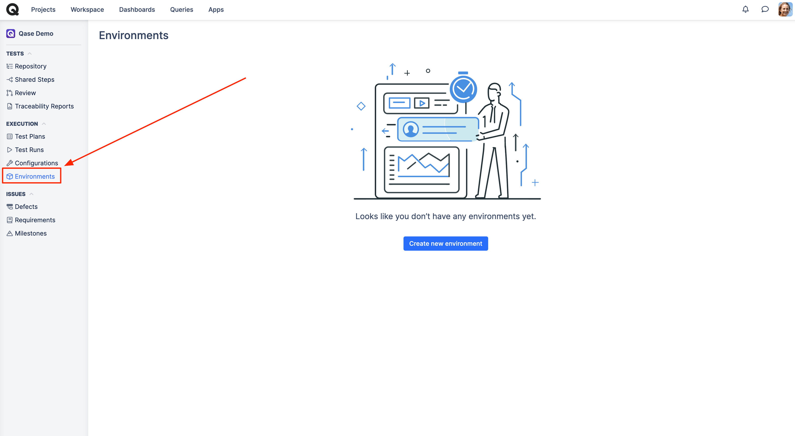
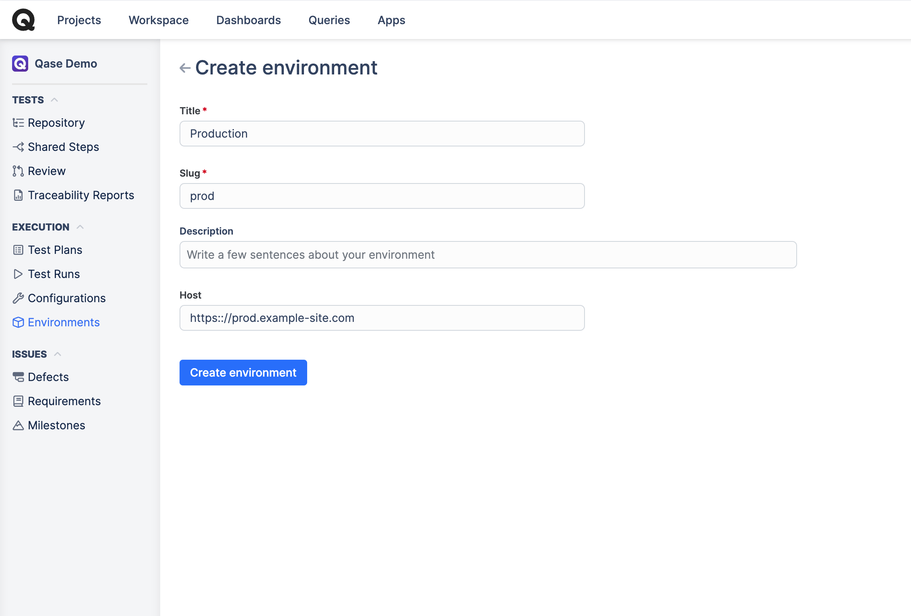

# Environments

What are environments in a test case management system?

Environments in a test case management system are an additional entity which allows you to represent your real-life infrastructure environments and then specify which of the environment a [test run](../get-started-with-the-qase-platform/create-a-test-run/) should be executed in.&#x20;



### How to create an environment?

To create a new environment, navigate to the Project's "Environments" tab, then hit "Create new environment":


Please note that **only users** with the **Owner** and **Administrator roles**, as well as, those with custom roles with create/update permissions, will have the access to create Environments.


<figure><figcaption></figcaption></figure>

<figure><figcaption></figcaption></figure>

Define the new environment's properties:

* _Title:_ mandatory field, descriptive name of an environment which will be appearing in the test runs (i.e., _Production Env_)
* _Slug:_ mandatory field, a URL-friendly shortened version of the title (i.e., “_prod”_)
* _Description:_ optional field for extra context about the environment and what it's to be used for
* _Host:_ optional field, the URL address of the environment (as a reference)

Once created, your new environment can now be used as a property of a test run:

<figure><figcaption></figcaption></figure>

When using the API, test runs can be created with a specific environment by using the environment's slug as a parameter in the request.

For example, when creating test runs with [`qli`](../../automation/qase-cli-app/#h_e61ea8bfa1), the `-e` flag can be used to define the environment for the new test run.

`qli testops run create -p DEMO -t <token> --title "Example Test run" -e prod`

Additionally, `qli` can also [create](../../automation/qase-cli-app/#h_6d74ecd478) an environment.\
