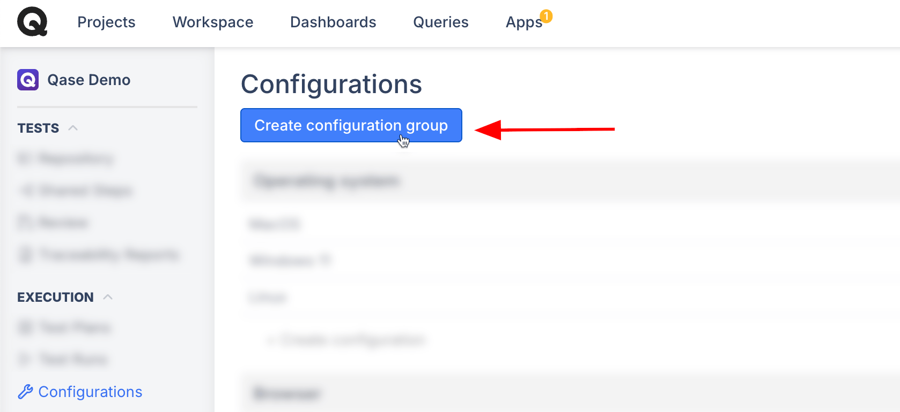
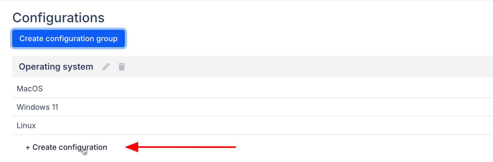
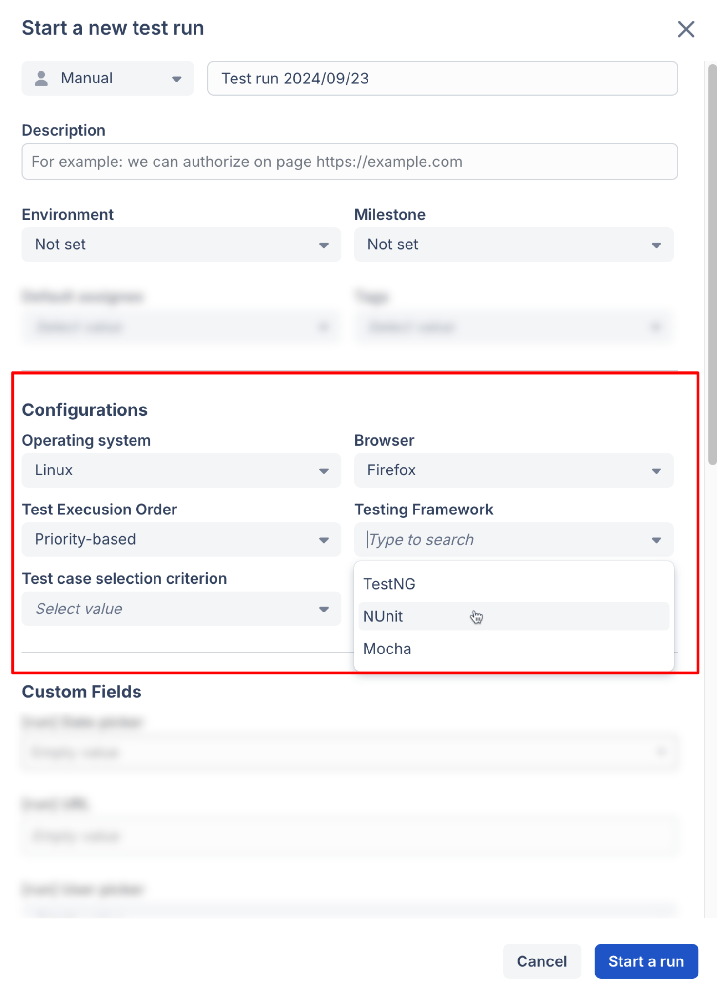
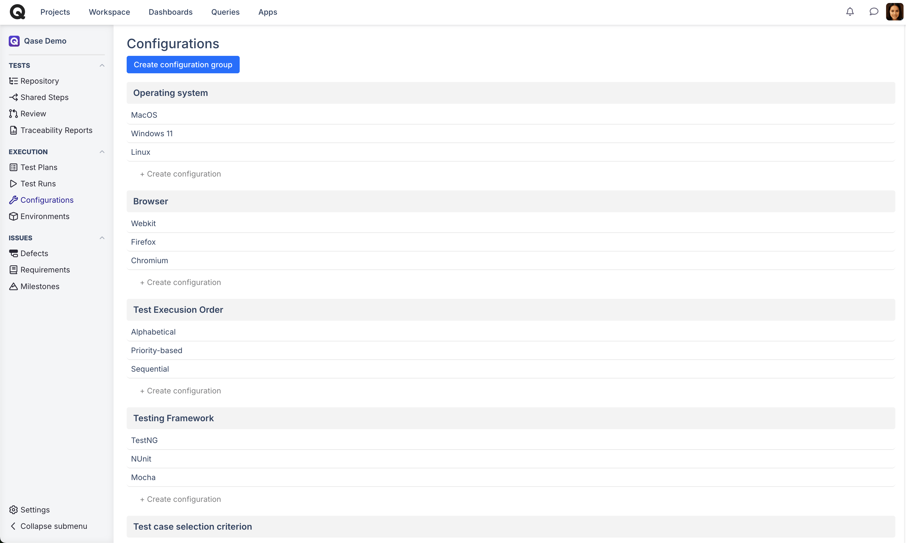
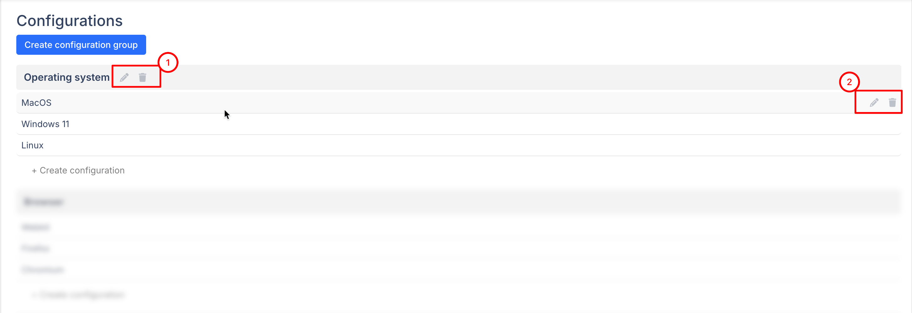

# Configurations

### What are configurations used for?

Configurations can be used to specify for any [Test Run](../get-started-with-the-qase-platform/create-a-test-run/), which hardware or software configuration this run should be performed on.



### How to create a configuration group?

Configuration groups are found in [projects](../get-started-with-the-qase-platform/create-a-project.md).

<figure><figcaption></figcaption></figure>

Imagine that your team is working on a web application, and you want to test its behavior in several different browsers.

For that, you can create a "Browsers" configuration group and list all the browsers you plan to be performing testing in:

<figure><figcaption></figcaption></figure>

<figure><figcaption></figcaption></figure>

Once your configuration group has been created, and you've added all possible individual configurations to test on, you can now specify this while preparing a test run - all available configuration groups will be shown in the "Configurations" section:

<figure><figcaption></figcaption></figure>

You can create multiple configuration groups and have combinations of, for example, different browsers and different OS:

<figure><figcaption></figcaption></figure>

You can also edit or delete both configuration groups and individual configurations after having created them:

<figure><figcaption></figcaption></figure>
