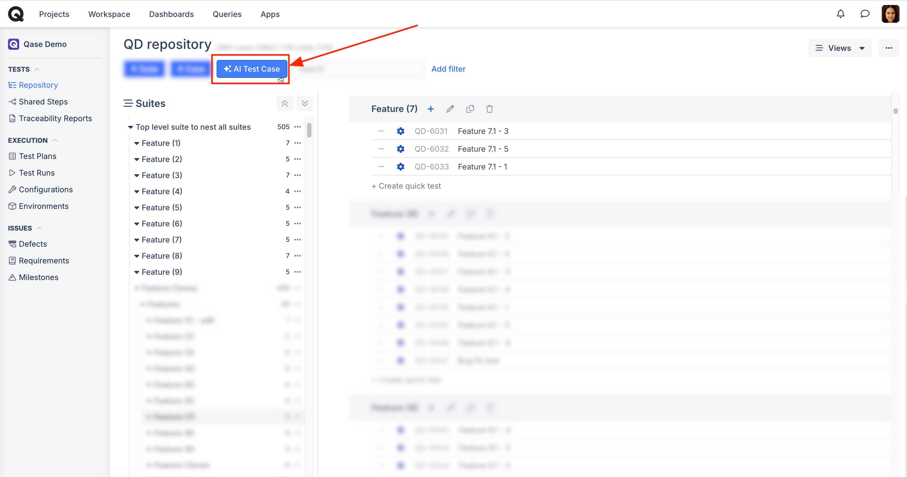
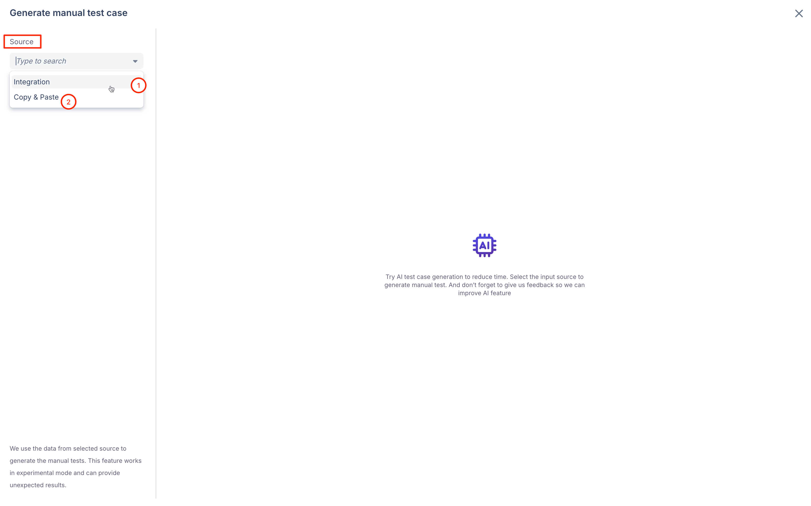
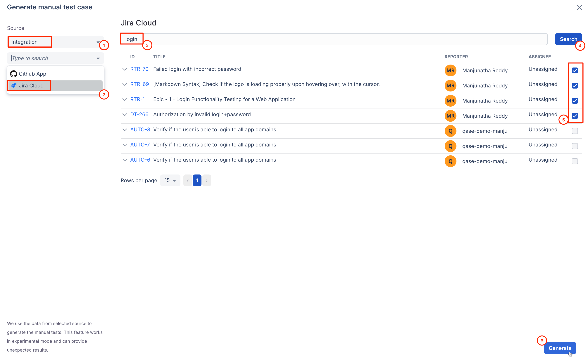
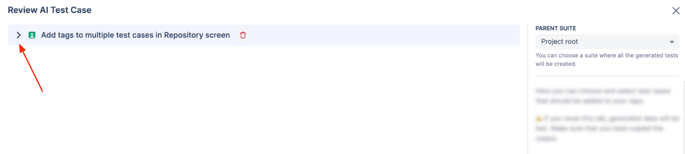
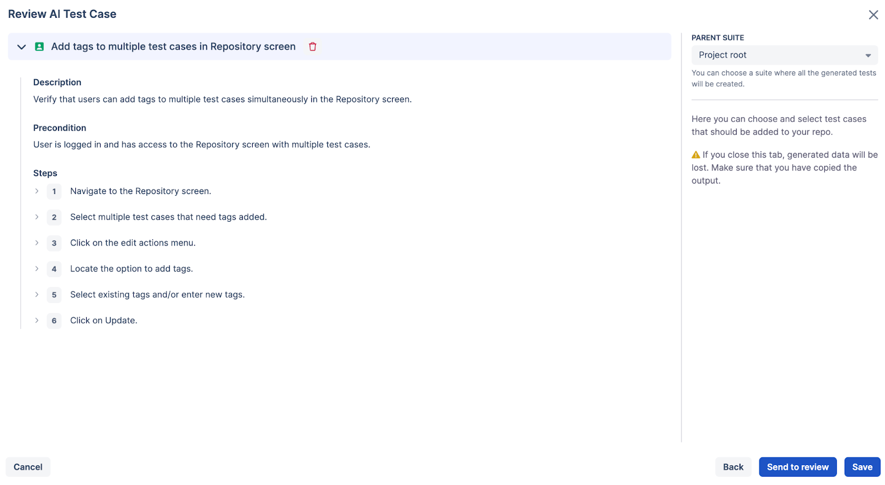
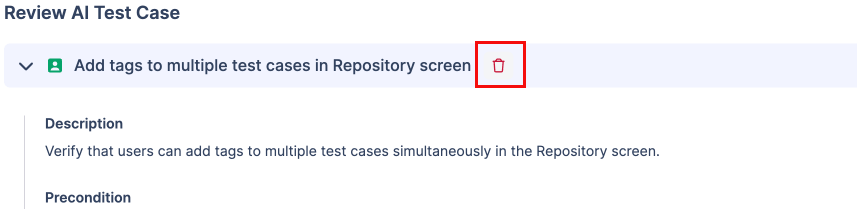
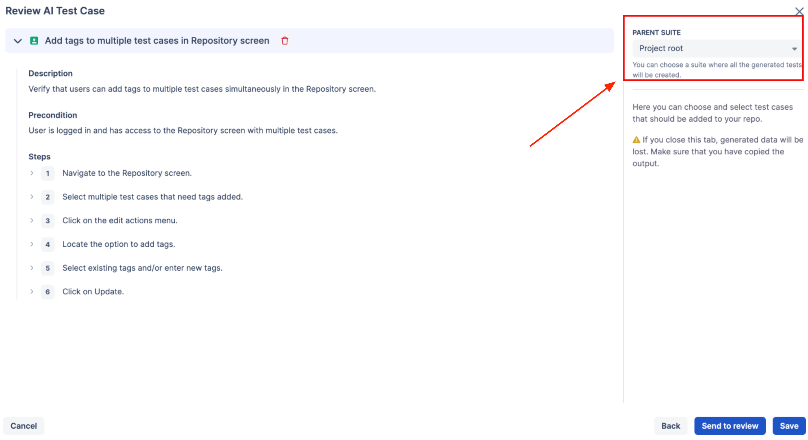
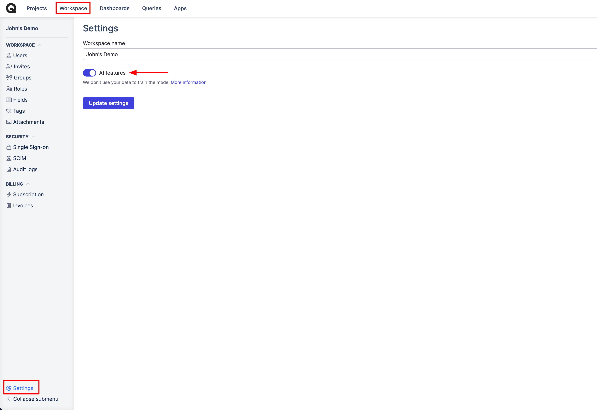

# AI Test Case Generator


This feature is in Beta, and it is available with our [Business](../../administration/subscriptions/business-plan.md) and [Enterprise](../../administration/subscriptions/enterprise-plan.md) subscriptions.




## What is Qase AI Test Case Generator? 

Qase’s ✨ AI Test Case Generator helps QA testers and engineers generate manual test cases from requirements.

Instead of manually creating all the test cases to cover a requirement, the AI Test Case Generator uses Generative AI to generate a set of test cases based on your input.

You can review these generated test cases and add the suitable ones to your repository, saving time and effort.

### Key Information: 

***

**Beta**:  The AI Test Case Generator is currently in Beta mode. While the prompts are designed for accurate test case generation, this is a new technology, and results may vary in accuracy.

**Responsibility**:  The usage of results produced by the AI Test Case Generator is at the discretion of the user. Qase does not bear responsibility for any adverse consequences, including but not limited to, inaccurate or insufficient test cases.

**Updates**:  As a Beta feature, it will be frequently updated. Users will receive a 1-day prior notice for any updates.

**User Agreement**: Using this feature indicates the user's acceptance of these provisions.

### Data Privacy 

***

**Does Qase use customer data?**

No, using Qase's AI Test Case Generator will not result in your data being used to train the language model. This Beta version uses the ChatGPT API Platform for test case generation. OpenAI explicitly states that "We do not train on your business data." You can review their privacy statement [here](https://openai.com/enterprise-privacy/).

## How do I use Qase’s AI Test Case Generator ? 

***

Before you use, although not mandatory, it is recommended to create a Suite in your Repository to place the results of the AI test case generator. This allows for easier review and management of the test cases.

#### Steps to Use the AI Test Case Generator 

Click the AI Test Case action button to open the generator screen.

<figure><figcaption></figcaption></figure>

**Input the Requirement(s):**

<figure><figcaption></figcaption></figure>

(1) Use the existing integration to specify an Issue Id from Jira cloud/ GitHub.

<figure><figcaption></figcaption></figure>

(2) Enter the Requirement manually

<figure><figcaption></figcaption></figure>

* Title Field: Enter the requirement title or a bunch of requirements. For a single requirement, the title should be descriptive of the use case. For multiple requirements, it might be descriptive of the Epic or Theme of the requirement (e.g., authorization).
* Description Fields: Enter your requirement(s). For best results, use the requirements template or an example requirement.
* Generate Test Cases: Click the Generate action button.

**Review Generated Test Cases:**

***

1️⃣ Expand the test cases to review them -

<figure><figcaption></figcaption></figure>

<figure><figcaption></figcaption></figure>

For test cases generated through the integration, the Issue IDs used in the generation will also be displayed. Click “Show Input” to view them.

2️⃣ If a test case is not suitable or inaccurate, you can delete it from the list.

<figure><figcaption></figcaption></figure>

3️⃣ Save suitable test cases to a Suite in your Repository. You also have the option to send the cases through the standard [Review](https://help.qase.io/en/articles/5563713-test-case-review) process.

_Note that if you close the screen, all results will be lost._

<figure><figcaption></figcaption></figure>

4️⃣ All ✨AI-generated test cases added to the Repository will be labelled ' ✨AI ' to indicate their AI origin.

<figure><figcaption></figcaption></figure>

5️⃣ Once the ✨ AI test cases are sent for review, or added to the repository, you can make additional improvements as needed, just as you would with manually created test cases.

### How do I disable this feature? 

***

If you do not want to use this feature, it can be disabled, from the Workspace's settings.

<figure><figcaption></figcaption></figure>


Your feedback is crucial for us, to fine-tune and improve the relevance and accuracy of the generated test cases. You are welcome to share your valuable feedback on our support chat!


