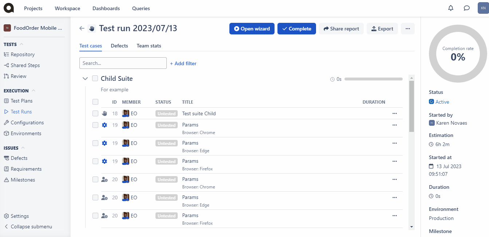

# Test runs

### What is a test run in software testing?

A Test Run is a single instance of executing a specific set of test cases.



A Test Run may consist one Test case, a bunch of them, whole sets of Test cases ([Test Suite](https://help.qase.io/en/articles/5563702-test-runs)), or even Test cases from different areas bundled together in a Test Plan.

There are two ways to start a Test Run:\
1\. **Express Run** - from the Project Repository page.\
2\. **Regular Run** - from Test Runs page.

***

### **Express Run**

You can quickly set up a Test Run for one or more test cases directly from the Repository.

​ Hit the "Run" button and proceed to select the Environment, Milestone, Configurations, or any other fields, as needed.

<figure><figcaption></figcaption></figure>

### **Regular test run**

To create a regular test run, navigate to "Test Runs" section, and hit the "Start New Test Run" button. You will see the same modal window as seen while creating a Test Run from the Repository page.\

<figure><figcaption></figcaption></figure>

#### **Run Properties**

* **Run title:** it is automatically set to the current date. You can replace it with your preferred title.
  * _`Eg: "Regression Test - Release 2.0"`_
* **Description:** give additional details about the test run.
  * _`Eg: "This test run verifies new features and bug fixes in the latest release.`_\
    _`​`_
* [Environment](https://docs.qase.io/general/execution/environments): define in which environment the test run should be performed.
  * _`Eg: testing, staging, production.`_
* [Milestone](https://docs.qase.io/general/issues/milestones): select which Milestone tied to the Test Run.
  * _`Eg: Release 2.0`_
* [Configuration](https://docs.qase.io/general/execution/using-configurations-in-qase-tms): choose from pre-defined configuration options.
  * _`Eg: OS: Windows ; Browser: Chrome`_
* [Custom Fields](https://docs.qase.io/administration/workspace-management/custom-fields): set custom field values if previously configured.

**Choosing Test cases:** Here, you'll be presented with three options.

From Respository.

From Test Plan: You can choose all or select Test cases from a Test Plan.

From Saved Queries: You can read more about Saved Queries <a href="https://help.qase.io/en/articles/6417205-saved-queries">here</a>.

<mark style="background-color:green;">​NB: Queries are available with</mark> [<mark style="background-color:green;">Business</mark>](https://help.qase.io/en/articles/5563727-business-plan) <mark style="background-color:green;">and</mark> [<mark style="background-color:green;">Enterprise</mark>](https://help.qase.io/en/articles/6640055-enterprise-plan) <mark style="background-color:green;">subscriptions.</mark>

## Test runs view 

***

Here, you can look at all of your Test runs, with their Author, [Environment](https://docs.qase.io/general/execution/environments), Time Spent and Status with a visual summary of their results.

<figure><figcaption></figcaption></figure>

You can filter the Runs by Status, Assigned to, Environment, Milestone, Tags, Automation status, Creation date, and your <a href="https://docs.qase.io/administration/workspace-management/custom-fields">custom fields</a> (if any).

From the "..." menu, you can do several things:

## Dashboard 

***

To go to the Run dashboard, simply click on the Test Run name.

Let's explore the options available in the dashboard -

<figure><figcaption></figcaption></figure>

1**. Open Wizard:** this will guide you through the Test Cases contained in the run, step-by-step.

2\. **Share Report:** turn on public link and easily share your Run report with anyone, even if they don't have an account in Qase.

Example of a Shared report

3\. **Export:** you can download a CSV export of your Test Run.

4\. **(---) Menu:** Clone run option allows you to create a new identical copy of your run. You can edit the run details, abort it or go the Test Run settings from here.

5\. **Search and Filters:** search cases by their title or Id and filter by a specific parameter.

6**. Defects and Team stats:** view all associated defects from this run and see stats for results by assignee.

​

7\. T**he "..." menu button:** has options to Run wizard, assign case to a team member or View/edit the Test case itself.

8\. **Run details:** this side bar houses a completion chart and other test run configuration details like -

* Environment, Configurations, Milestones and tags
* Run status, author, create date and estimated time for completion.
* Linked External Issues.

<em>Expand to learn more</em>

* Donut Graph shows the breakdown of Test Cases in the Run by status. Hovering over a section of the graph you will see the actual number of Cases in a respective Status. If you click on a section of the graph, a quick filter will be applied to show you only the Cases in a specific status.
* Completion Rate represents the percentage of Cases in a run that have been performed so far.
* Status_:_ This lets you know if the run is currently active or completed.
* Started by and Started at - provide details on who started this Test Run, and when.
* Estimation: It predicts how long your current Test Run will take based on the time spent in previous Test Runs on the same Test cases.
* Duration: the summary of time that has been spent on all Test Cases in the current Test Run so far.
* Environment, Tags, Configurations, Milestones, and Custom Fields: Details about the specific environment of the test run and the associated tags, Milestones and Custom fields.
*   External Issue: You can link a test run with an issue/task from any issue tracker Apps that you have installed.

    Here's an example of a JIRA issue linked to a test run:

9\. **Bulk action:** You can select multiple test cases and click on 'Update selected' to retest / submit result / manage assignee / remove test case from run.

Example

**Defects Tab:**

The Defects tab provides information about failed test cases in the run, including the reporter, assignee, third-party app connections, and status.

**Team Stats Tab:**

The Team Stats tab provides information about your teammates in the Test Run, including their work time, results, and a performance trend chart.

## Test Run Wizard 

***

Opening is the wizard is easy, just click on a test case in a Run. You can also get to the wizard in the following ways:

1. Click "Open Wizard" in the Dashboard:
2. Click 'Open Wizard' in the Test Runs Menu
3. Click "Run Wizard" in the "..." menu of a Test Case:

<figure><figcaption></figcaption></figure>

In the wizard, can you advance through Test Cases, add comments, attachments, and log results for both individual steps and the entire Test Case.

<figure><figcaption></figcaption></figure>

You can also file defects as you work through the test case. Check the [defects](https://docs.qase.io/general/get-started-with-the-qase-platform/defects) article for more information.

In the wizard, use the "View/Edit Case" buttons to open a test case in a new tab for viewing or making changes.

<figure><figcaption></figcaption></figure>

NB: If you've enabled the "Fail case on step fail" option in Project settings, failing any Test Case step will automatically result in the entire Test Case failing. To prevent this, adjust the setting.

## Editing a completed Test Run 

***

After finishing a Test Run, you can add results by enabling "Allow to add results for cases in closed runs" in settings.\
​\
Then, go to Test Runs, open the run using the "Open Wizard" option. In the wizard, click the edit icon (pencil) to adjust the run duration, add comments, and attachments.

Save changes with the green check mark or discard them with the red cross.

<figure><figcaption></figcaption></figure>

## Test Run Settings 

***

Under Project Settings, there's a dedicated section for modifying run behaviour.\
​

<figure><figcaption></figcaption></figure>

Let's look at each option in more detail:

| Option                                        | Behaviour                                                                                                                                                                                                                                                                                                                                                                                                                                                                                                  |
| --------------------------------------------- | ---------------------------------------------------------------------------------------------------------------------------------------------------------------------------------------------------------------------------------------------------------------------------------------------------------------------------------------------------------------------------------------------------------------------------------------------------------------------------------------------------------- |
| Fast Pass                                     | <ul><li>Enabled: you won't be prompted to add extra details when marking a test case as "passed"/ "skipped."</li></ul><ul><li>Disabled: A modal window appears for adding extra details like comments or attachments when marking a case as "passed"/ "skipped."</li></ul>                                                                                                                                                                                                                                 |
| Default create/attach defect checkbox         | <ul><li>Enabled: The checkbox for creating a defect is checked by default when you fail, invalidate, or mark a case as "blocked."</li></ul><ul><li>Disabled: The checkbox is unchecked by default in those scenarios.</li></ul>                                                                                                                                                                                                                                                                            |
| Auto complete                                 | <ul><li>Enabled: A run is automatically marked as complete when all cases have a result.</li></ul><ul><li>Disabled: You need to manually mark the run as complete, even when all cases have a result.</li></ul>                                                                                                                                                                                                                                                                                            |
| Auto passed                                   | <ul><li>Enabled: Marking all steps of a case as "passed" automatically marks the entire case as "passed."</li></ul><ul><li>Disabled: You need to separately mark the case as "passed," even if all steps are "passed."</li></ul>                                                                                                                                                                                                                                                                           |
| Auto assignee                                 | <ul><li>Enabled: Unassigned test cases are automatically assigned to the first person who opens them in the Wizard.</li></ul><ul><li>Disabled: Unassigned cases remain unassigned until explicitly assigned.</li></ul>                                                                                                                                                                                                                                                                                     |
| Auto create test cases                        | 
For results reported via API or an API reporter.
<ul><li>
Enabled: If the result refers to a test case that is not in your Qase repository, a new case is created. Also, any updates will be made

Later on, if something changes in that test case upon the next result submission, related test case in the repository will get updated accordingly with this option enabled
</li></ul><ul><li>Disabled: cases are not created/updated for results of non-existent test cases.</li></ul> |
| Fail case on step fail                        | <ul><li>Enabled: Failing any step will cause the whole case to be marked as "failed," preventing you from recording results for the remaining steps.</li></ul><ul><li>Disabled: You can proceed with the case even if a step has failed.</li></ul>                                                                                                                                                                                                                                                         |
| Allow to add results for cases in closed runs | <ul><li>Enabled: You can continue submitting results or retesting cases in completed or aborted runs.</li></ul><ul><li>Disabled: Closed runs do not allow further result submissions.</li></ul>                                                                                                                                                                                                                                                                                                            |
| Assignee result lock                          | <ul><li>Enabled: Only the assignee can submit results; others must explicitly assign themselves to do so.</li></ul><ul><li>Disabled: Any user, even if not assigned, can submit results, but results are associated with the submitter.</li></ul>                                                                                                                                                                                                                                                          |
| Redirect after adding result                  | <ul><li>No redirect: Stay on the same case after submitting a result.</li></ul><ul><li>First case in a run without result: Redirect to the first case without results.</li><li>Next case in suite: Go directly to the next case in the suite without results.</li></ul>                                                                                                                                                                                                                                    |

***

Related Articles[Getting Started](https://help.qase.io/en/articles/5563688-getting-started)[Defects](https://help.qase.io/en/articles/5563710-defects)[Milestones](https://help.qase.io/en/articles/5563715-milestones)[ClickUp](https://help.qase.io/en/articles/6417208-clickup)[GitHub](https://help.qase.io/en/articles/7210938-github)Did this answer your question?😞😐😃

***

1007 N Orange St. 4th Floor, Suite #1686, Wilmington, DE 19801, USA[We run on Intercom](https://www.intercom.com/intercom-link?company=Qase\&solution=customer-support\&utm\_campaign=intercom-link\&utm\_content=We+run+on+Intercom\&utm\_medium=help-center\&utm\_referrer=https%3A%2F%2Fhelp.qase.io%2Fen%2Farticles%2F5563702-test-runs\&utm\_source=desktop-web)

* 
* 
* 
* 
* 

From Saved Queries: You can read more about Saved Queries <a href="https://help.qase.io/en/articles/6417205-saved-queries">here</a>.

\
\

<figure><figcaption></figcaption></figure>

1. With the new test run configured, you will now see it in the Test Runs view with a condensed summary of it:
   * _Time:_ will show how much time has been spent so far on performing Test Cases in this run.
   * _Status:_ will show a summary of test cases per status - how many have passed, how many have been failed, skipped, blocked, invalidated, or untested.
   * _Environment:_ will show the environment of the run, which was selected when the run was created.

<figure><figcaption></figcaption></figure>

#### Filtering

You can filter by Status, Assigned to, Environment, Milestone, Tags, Automation status, and Creation date.

<figure><figcaption></figcaption></figure>

#### Three-dots-menu options

From the three-dots-menu, you can do several things:

<figure><figcaption></figcaption></figure>

* Access test run dashboard
*   _Open Wizard:_ this option will take you to the list of test cases that need to be performed, and you can go through them one by one:\

    \

    <figure><figcaption></figcaption></figure>
* _Clone Run:_ quickly create an identical instance of a test run, if you want to perform it again from scratch
* _Edit run:_ change the parameters of the test run
* Delete test run

\
