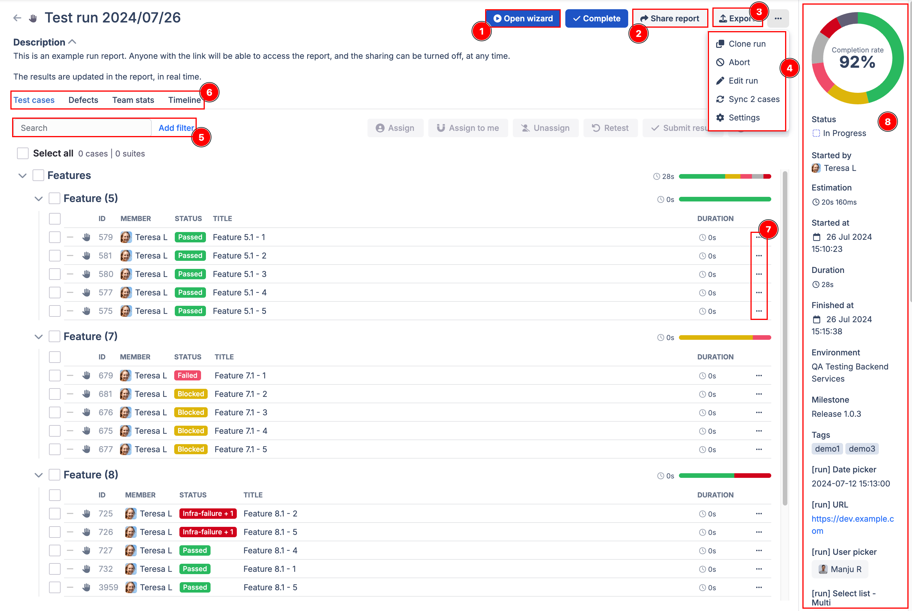
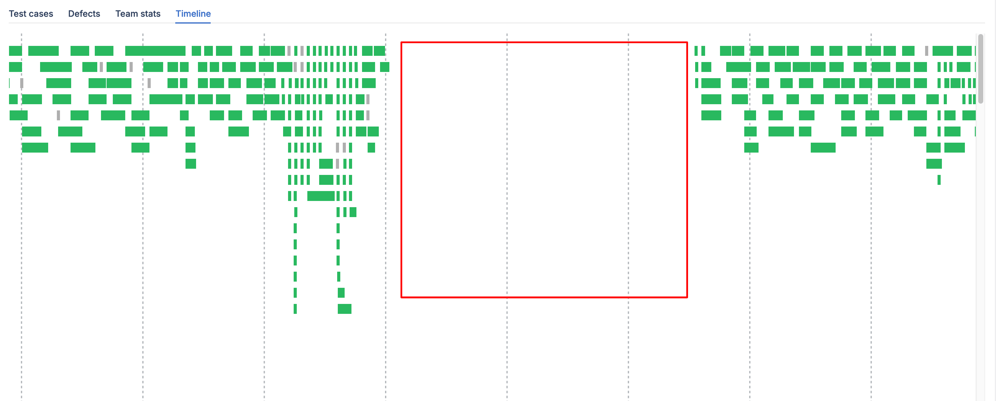
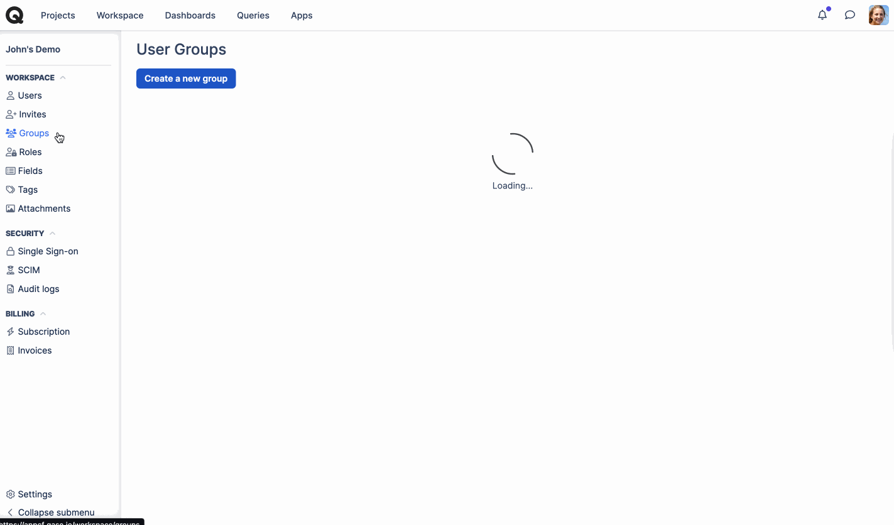
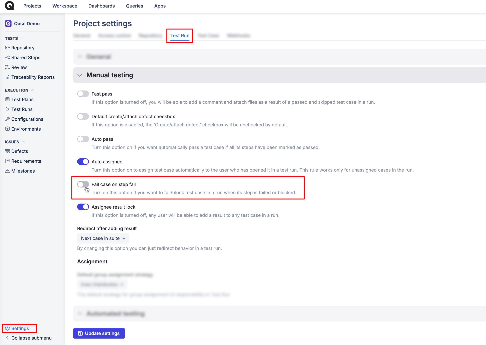
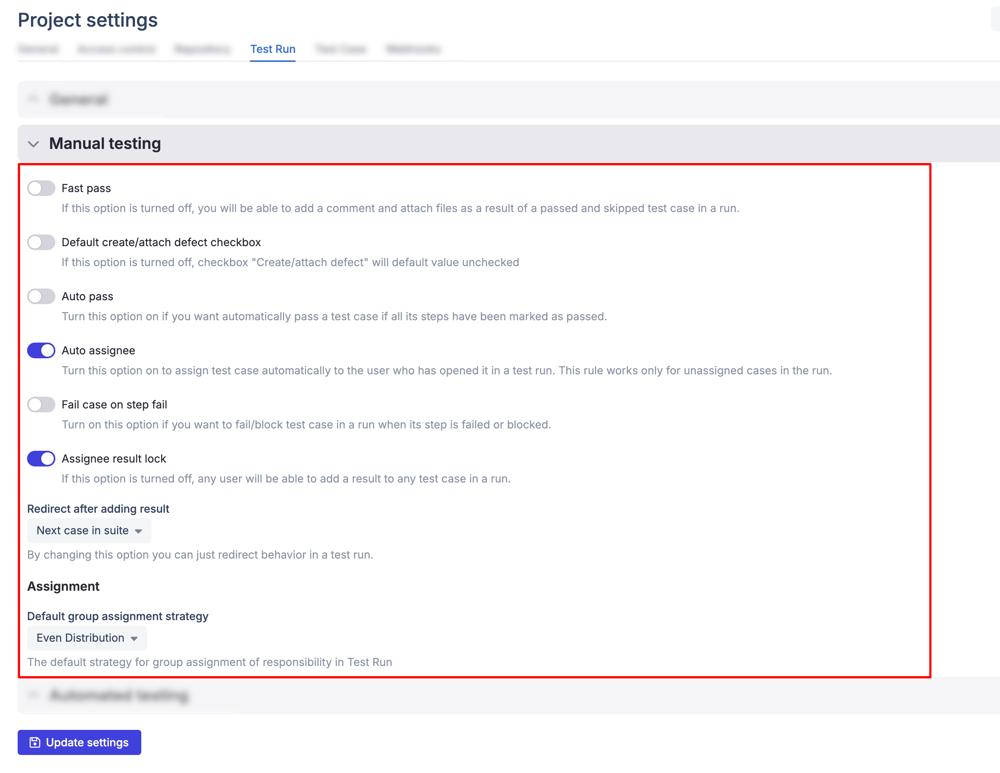
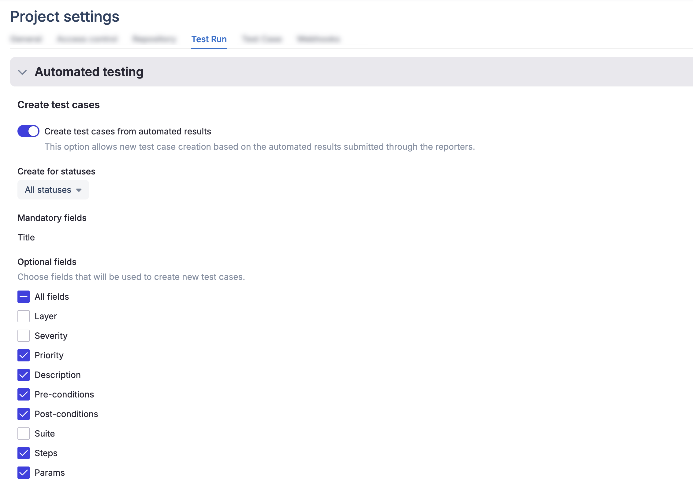

# Test runs

### What is a test run in software testing?

A Test Run is a single instance of executing a specific set of test cases.



A Test Run may consist one Test case, a bunch of them, whole sets of Test cases ([Test suite](../../../test-management/create-a-test-suite.md)), or even Test cases from different areas bundled together in a Test Plan.

There are two ways to start a Test Run:\
1\. **Express Run** - from the Project's Repository.\
2\. **Regular Run** - from Test Runs page.

***

### **Express Run**

You can quickly set up a Test Run for one or more test cases directly from the Repository.

​ Hit the "Run" button and proceed to select the Environment, Milestone, Configurations, or any other fields, as needed.

<figure><figcaption></figcaption></figure>

### **Regular test run**

To create a regular test run, navigate to "Test Runs" section, and hit the "Start New Test Run" button. You will see the same modal window as seen while creating a Test Run from the Repository page.

<figure><figcaption></figcaption></figure>

#### **Run Properties**

* **Run title:** it is automatically set to the current date. You can replace it with your preferred title.
  * _`Eg: "Regression Test - Release 2.0"`_
* **Description:** give additional details about the test run.
  * _`Eg: "This test run verifies new features and bug fixes in the latest release.`_\
    &#xNAN;_`​`_
* [Environment](https://docs.qase.io/general/execution/environments): define in which environment the test run should be performed.
  * _`Eg: testing, staging, production.`_
* [Milestone](https://docs.qase.io/general/issues/milestones): select which Milestone tied to the Test Run.
  * _`Eg: Release 2.0`_
* [Configuration](https://docs.qase.io/general/execution/using-configurations-in-qase-tms): choose from pre-defined configuration options.
  * _`Eg: OS: Windows ; Browser: Chrome`_
* [Custom Fields](https://docs.qase.io/administration/workspace-management/custom-fields): set custom field values if previously configured.

**Choosing Test cases:** Here, you'll be presented with three options.

From Respository.

From Test Plan: You can choose all or select Test cases from a Test Plan.

From Saved Queries: You can read more about Saved Queries <a href="../../analytics/saved-queries.md">here</a>.


Queries are available with Business and Enterprise subscriptions.


## Test runs view 

***

Here, you can look at all of your Test runs, with their Author, [Environment](https://docs.qase.io/general/execution/environments), Time Spent and Status with a visual summary of their results.

<figure><figcaption></figcaption></figure>

You can filter the Runs by Status, Assigned to, Environment, Milestone, Tags, Automation status, Creation date, and your <a href="https://docs.qase.io/administration/workspace-management/custom-fields">custom fields</a> (if any).

From the "..." menu, you can do several things:

You can bulk delete Test runs by selecting the runs you want to delete in bulk, clicking "Update selected" and then "Delete." 


A **Test run Status** will be assigned once the run is marked as complete.

A 'Passed' status is given only if all\* tests have a positive result. One or more test cases with a negative result will automatically assign a 'Failed' status to the run. Please note, status once assigned will <mark style="color:red;">not</mark> be re-calculated for any subsequent changes.

\*[Muted tests](../test-cases/muted-tests.md) are not considered when calculating the final run status.


## Test Run Results 

***

Your test runs have the following default statuses available to reflect the outcome of test cases:

<figure><figcaption></figcaption></figure>

1. **Passed** - The test case has been executed successfully, and the expected results match the actual outcomes.
2. **Failed** - The test case has failed, indicating discrepancies between the expected and actual results.
3. **Blocked** - The test couldn't be executed or completed due to some blocking issue, such as a dependency not met, environmental issues, or other constraints.
4. **Skipped** - The test case was intentionally skipped during the test run, often due to its non-applicability or other reasons.
5. **Invalid** - The test run wasn't completed for some reason, and the results are inconclusive.\
   ​\
   Test run results statuses can also be customized by navigating to the [Fields section in Workspace management](https://app.qase.io/workspace/fields) and clicking "Result status" (Admin permissions is needed to modify fields).

<figure><figcaption></figcaption></figure>

You also have the option to define the action associated with your custom statuses where you can determine if a status triggers a successful test case or a failed test case. ​ If a status triggers a failed test case then the defect creation workflow is triggered.

<figure><figcaption></figcaption></figure>

Please take note that you only have the option to hide custom statuses once deleted to preserve the results history in the test runs.\
​\
Also, Custom Test Run "Result status" is only available to users on a [paid subscription](../../../administration/subscriptions/).

## Dashboard 

***

To go to the Run dashboard, simply click on the Test Run name.

Let's explore the options available in the dashboard -

<figure><figcaption></figcaption></figure>

1\. **Open Wizard**: this will guide you through the Test Cases contained in the run, step-by-step.

2\. **Share Report:** turn on public link and easily share your Run report with anyone, even if they don't have an account in Qase.

Example of a Shared report:

3\. **Export:** you can download a CSV / PDF export of your Test Run.

4\. **(---) Menu:** Clone run option allows you to create a new identical copy of your run. You can edit the run details, abort it or go the Test Run settings from here.

5\. **Search and Filters:** search cases by their title or Id and filter by a specific parameter.

6\. **Defects and Team stats**: view all associated defects from this run and see stats for results by assignee.

7\. T**he "..." menu button:** has options to Run wizard, assign case to a team member or View/edit the Test case itself.

8\. **Run details:** this side bar houses a completion chart and other test run configuration details like -

* Environment, Configurations, Milestones and tags
* Run status, author, create date and estimated time for completion.
* Linked External Issues.

<em>Expand to learn more</em>

* **Donut Graph** shows the breakdown of Test Cases in the Run by status. Hovering over a section of the graph you will see the actual number of Cases in a respective Status. If you click on a section of the graph, a quick filter will be applied to show you only the Cases in a specific status.
* **Completion Rate** represents the percentage of Cases in a run that have been performed so far.
* **Status** lets you know if the run is currently active or completed.
* **Started by and Started at** provide details on who started this Test Run, and when.
* **Estimation** predicts how long your current Test Run will take based on the time spent in previous Test Runs on the same Test cases.
* **Duration** is the summary of time that has been spent on all Test Cases in the current Test Run so far.
* **Environment, Tags, Configurations, Milestones, and Custom Fields**: Details about the specific environment of the test run and the associated tags, Milestones and Custom fields.
*   **External Issue:** You can link a test run with an issue/task from any issue tracker Apps that you have installed.

    Here's an example of a JIRA issue linked to a test run:

9\. **Bulk actions:** You can select multiple test cases to assign/re-test/submit result/delete with the respective button.

<figure><figcaption></figcaption></figure>

### Timeline View 

The Timeline chart is a powerful tool that provides a visual representation of your automated test run.

It offers valuable insights into the status, duration, and execution history of each test, helping you optimize your testing process and uncover potential issues, that might otherwise be difficult to detect.

<figure><figcaption></figcaption></figure>

You can use this view to -

1.  Visualize Test Duration: The length of each rectangle in the graph corresponds to the actual duration of the test. This allows you to quickly identify tests that are taking excessively long to execute.

    \
    &#x200B;_&#x46;or example, if you notice that a particular test consistently takes much longer than others, it might indicate a performance bottleneck or inefficient code._\
    \

2.  Identify Coincidental Failures: By examining the timing of test failures, you can determine if they are related to environmental issues rather than actual test defects.

    \
    &#x200B;_&#x46;or example, If multiple tests fail at the same time, it likely points to a network outage or another external factor._\
    &#xNAN;_&#x200B;_\
    &#xNAN;_&#x53;imilarly, simultaneous failures across various modules or components may suggest a deeper issue with the server or database infrastructure._

<figure><figcaption></figcaption></figure>

1. Detect Inefficiencies: The Timeline Graph helps you pinpoint inefficiencies in your testing process.

<figure><figcaption></figcaption></figure>

\
&#x200B;_&#x46;or example_, _if there are significant gaps between test executions, it might suggest that your automation framework is waiting for tests to finish before starting the next ones. This can be optimized by running tests in parallel or reducing dependencies._

### Test Run metrics 

***

The Test Run Metrics tab offers a comprehensive overview of your team's progress during manual testing.

Key metrics include the total number of test cases, progress status, test case status, and a visual representation of progress against the estimated time (burndown chart).

<figure><figcaption></figcaption></figure>

Let’s see how each metric can help you manage your testing efforts -

1. **Test Cases**: displays the total number of test cases, including any additions or removals made after the run was started. If the total number of test cases increases significantly during the run, it may indicate changes in requirements or scope.
2. **Progress**: shows if your test run is (on schedule, behind, or ahead of schedule) based on the estimated time it take to run each test case.
3. **Test Case** Status: shows the number of passed, failed, blocked, and untested cases, at a glance.
4.  **Test Burndown**\*: offers immediate insights into how your manual test execution is progressing compared to the estimated time. This estimated time is derived from historical test case execution duration, and your current execution progress is charted against it to determine the ongoing status of your manual test run.\

    \*Test Run Burndown is only available if the test cases added at the start of the run have historical execution duration data.

### Syncing edits to Test cases 

During a test run, you might notice small errors, such as typos or inconsistencies, in the test case you’re working on. Naturally, you may want to correct these issues by editing the test case, expecting the changes to be reflected in the active test run as well.

If the test case is still in an “untested” status, any edits you make will automatically sync with the test run—typically, refreshing the page will show these updates.

However, if the test case already has a result logged, the changes you make to the original test case in the repository won’t sync with the test run.

Here’s why - imagine you submitted a result for a test case based on its original steps. Here’s why: if you submit a result based on the original test case, and later the case is edited (due to a UI change or other update), syncing the changes would make it unclear which version of the test case the result was based on.

In short, once a result is submitted, it remains tied to the version of the test case that was present at the time of submission. This ensures fairness and accuracy in the recorded results.

### Assignment 

You have the flexibility to assign test cases within a test run either to individual users or to [groups](../../../administration/workspace-management/groups.md).

**Individual assignment:**

* You can assign specific test cases to individual testers. This approach is particularly useful when you want to assign a suite of test cases related to a specific feature to a tester with specialized knowledge in that area.

<figure><figcaption></figcaption></figure>

**Group Assignment:**

In this assignment mode, you can select a [group](../../../administration/workspace-management/groups.md) that includes multiple testers.

1. **Even distribution:** this strategy ensures that test cases are distributed as evenly as possible among the group members. For instance, _if there are 10 test cases and 5 testers in a group, each tester will receive 2 test cases._

<figure><figcaption></figcaption></figure>

**Load balanced distribution:** this strategy optimizes the distribution of test cases based on their complexity, measured by previous test durations with the goal of evenly distributing the workload among group members.

<figure><figcaption></figcaption></figure>

For instance\_, If there are five test cases with expected durations of 30, 10, 10, 5, and 5 minutes, and two testers in a group, the system will assign the 30-minute test case to one tester and the remaining four test cases (with a combined duration of 30 minutes) to the other tester. This way, both testers have an even workload despite the number of test cases being different.\_

**Assignment settings:**

The default assignment strategy can be configured under the Test Runs tab in your Project's settings.

<figure><figcaption></figcaption></figure>

This setting determines the default assignment strategy that appears when you attempt to assign cases to a group.

**Defects Tab:**

The Defects tab provides information about failed test cases in the run, including the reporter, assignee, third-party app connections, and status.

**Team Stats Tab:**

The Team Stats tab provides information about your teammates in the Test Run, including their work time, results, and a performance trend chart.

## Test Run Wizard 

***

Opening is the wizard is easy, just click on a test case in a Run. You can also get to the wizard in the following ways:

1. Click "Open Wizard" in the Dashboard:
2. Click 'Open Wizard' in the Test Runs Menu
3. Click "Run Wizard" in the "..." menu of a Test Case:

<figure><figcaption></figcaption></figure>

In the wizard, can you advance through Test Cases, add comments, attachments, and log results for both individual steps and the entire Test Case.

<figure><figcaption></figcaption></figure>

You can also file defects as you work through the test case. Check the [defects](https://docs.qase.io/general/get-started-with-the-qase-platform/defects) article for more information.

In the wizard, use the "View/Edit Case" buttons to open a test case in a new tab for viewing or making changes.

<figure><figcaption></figcaption></figure>

Note: If you've enabled the "Fail case on step fail" option in Project settings, failing any Test Case step will automatically result in the entire Test Case failing. To prevent this, adjust the setting.

## Editing a completed Test Run 

***

After finishing a Test Run, you can add results by enabling "Allow to add results for cases in closed runs" in settings.\
​\
Then, go to Test Runs, open the run using the "Open Wizard" option. In the wizard, click the edit icon (pencil) to adjust the run duration, add comments, and attachments.

Save changes with the green check mark or discard them with the red cross.

<figure><figcaption></figcaption></figure>

## Test Run Settings 

***

Under Project Settings, there's a dedicated section for modifying Test run behavior. Let's understand the options under each section in detail:

### General 

The settings in this section apply to both Manual and Automated Test runs.

<figure><figcaption></figcaption></figure>

<table data-header-hidden><thead><tr><th width="195">Option</th><th>Behavior</th></tr></thead><tbody><tr><td>Auto complete</td><td><ul><li>Enabled: A run is automatically marked as complete when all cases have a result.</li></ul><ul><li>Disabled: You need to manually mark the run as complete, even when all cases have a result.</li></ul></td></tr><tr><td>Allow to add results for cases in closed runs</td><td><ul><li>Enabled: You can continue submitting results or retesting cases in completed or aborted runs.</li></ul><ul><li>Disabled: Closed runs do not allow further result submissions.</li></ul></td></tr></tbody></table>

### Manual Testing 

The settings in this section apply only to Manual Test runs.

<figure><figcaption></figcaption></figure>

<table data-header-hidden><thead><tr><th width="189">Option</th><th>Behavior</th></tr></thead><tbody><tr><td>Fast Pass</td><td><ul><li>Enabled: you won't be prompted to add extra details when marking a test case as "passed"/ "skipped".</li></ul><ul><li>Disabled: A modal window appears for adding extra details like comments or attachments when marking a case as "passed"/ "skipped".</li></ul></td></tr><tr><td>Default create/attach defect checkbox</td><td><ul><li>Enabled: The checkbox for creating a defect is checked by default when you fail, invalidate, or mark a case as "blocked."</li></ul><ul><li>Disabled: The checkbox is unchecked by default in those scenarios.</li></ul></td></tr><tr><td>Auto passed</td><td><ul><li>Enabled: Marking all steps of a case as "passed" automatically marks the entire case as "passed."</li></ul><ul><li>Disabled: You need to separately mark the case as "passed," even if all steps are "passed."</li></ul></td></tr><tr><td>Auto assignee</td><td><ul><li>Enabled: Unassigned test cases are automatically assigned to the first person who opens them in the Wizard.</li></ul><ul><li>Disabled: Unassigned cases remain unassigned until explicitly assigned.</li></ul></td></tr><tr><td>Fail case on step fail</td><td><ul><li>Enabled: Failing any step will cause the whole case to be marked as "failed," preventing you from recording results for the remaining steps.</li></ul><ul><li>Disabled: You can proceed with the case even if a step has failed.</li></ul></td></tr><tr><td>Assignee result lock</td><td><ul><li>Enabled: Only the assignee can submit results; others must explicitly assign themselves to do so.</li></ul><ul><li>Disabled: Any user, even if not assigned, can submit results, but results are associated with the submitter.</li></ul></td></tr><tr><td>Redirect after adding result</td><td><ul><li>No redirect: Stay on the same case after submitting a result.</li></ul><ul><li>First case in a run without result: Redirect to the first case without results.</li><li>Next case in suite: Go directly to the next case in the suite without results.</li></ul></td></tr><tr><td>Default Assignment strategy</td><td><ul><li>Even: This strategy ensures <em>even distrubution of test cases</em> among group members regardless of complexity.</li></ul><ul><li>Load balanced: This strategy allocates test cases based on complexity to <em>evenly distribute the workload</em> among group members.</li></ul></td></tr></tbody></table>

### Automated Testing 

The settings in this section apply only to results submitted via the API, and Automated Test runs.

<figure><figcaption></figcaption></figure>

<figure><figcaption></figcaption></figure>

Note: You can choose to restrict the updating, or creation of new cases based on the _type_ of results. For instance, if you want to update an existing case only when the result is “Passed,” you can set the “Update for statuses” field to “Passed only.”

<table data-header-hidden><thead><tr><th width="167">Option</th><th>Behavior</th></tr></thead><tbody><tr><td>Auto <mark style="color:yellow;"><strong>create</strong></mark> test cases</td><td><ul><li>Enabled: If the result refers to a test case that is not in your Qase repository, a new case is created.</li></ul><ul><li>Disabled: cases are not created when results of non-existent test cases are posted.</li></ul>
A title is mandatory when creating a test case, but you can configure additional fields if they need to be updated with the <em>fields'</em> values from your tests in code.
</td></tr><tr><td>Auto <mark style="color:yellow;"><strong>update</strong></mark> test cases</td><td><ul><li>Enabled: If a result is submitted for an existing test case with any changes, the test case will be updated accordingly.</li></ul><ul><li>Disabled: The test case will not be updated, even if the submitted result includes changes, such as modified test case steps.</li></ul>
You can choose to update all test types or select between updating only automated or manual test cases. Additionally, select which <em>fields</em> should be updated for the cases.

<em>For example, If you de-select the steps field, the steps in your test cases will not be updated with the steps from the code, even if they differ.</em>
</td></tr></tbody></table>
