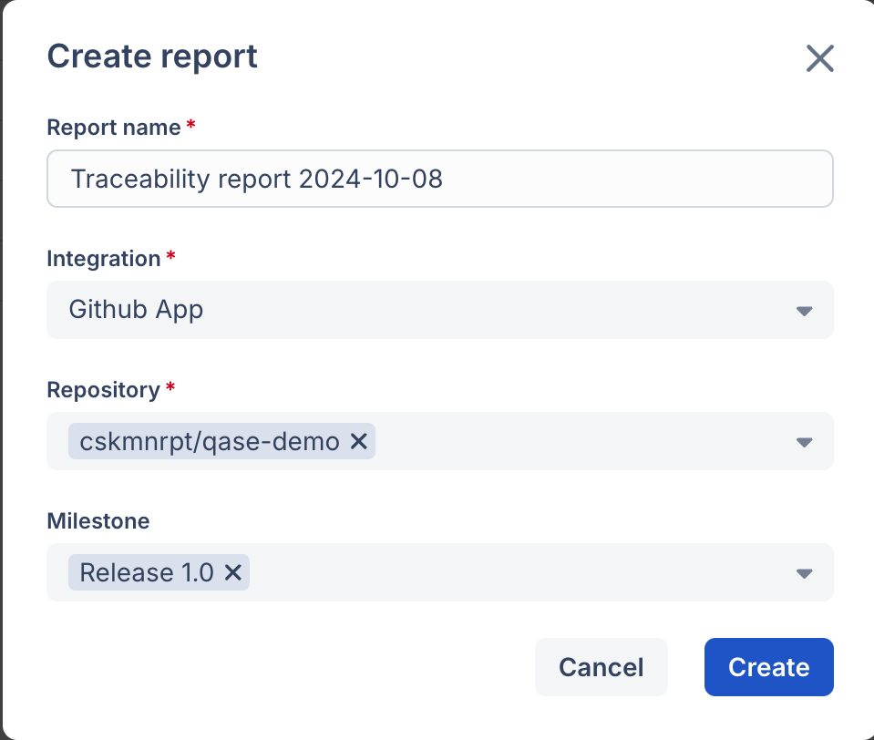
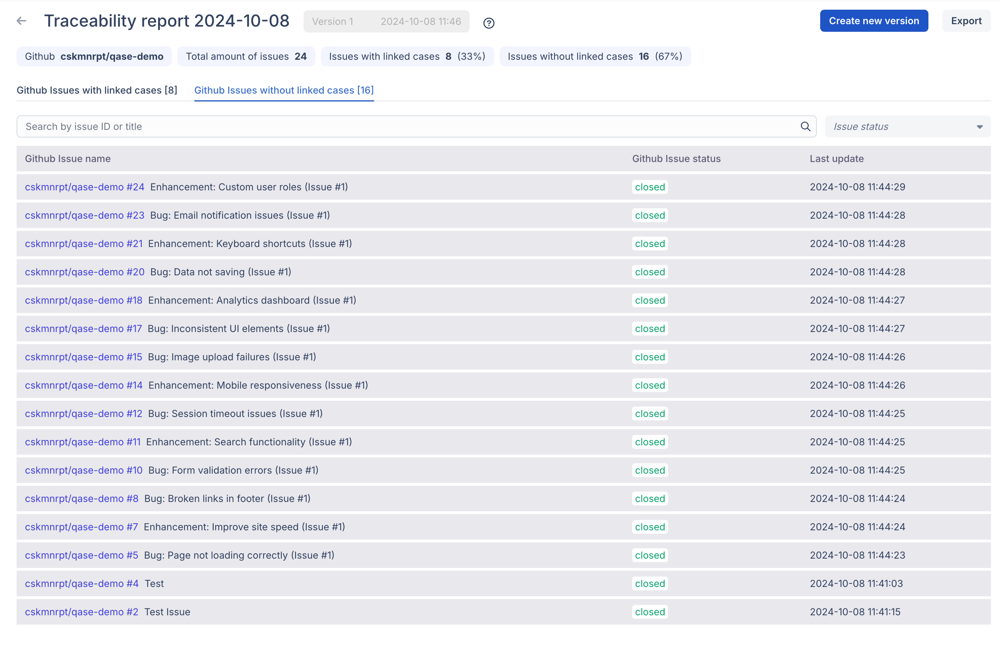
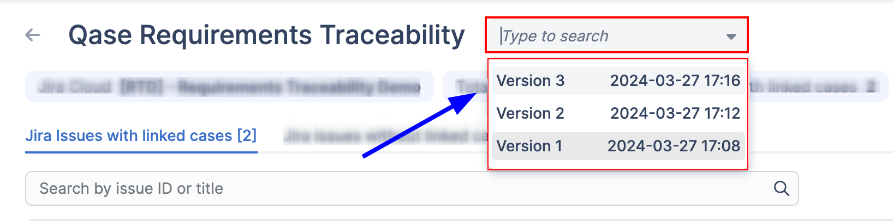

# Requirements Traceability Report



Understanding the relations between test cases and requirements is essential for ensuring the success of any project.

By analyzing this connection, teams can gain valuable insights into the effectiveness of their testing efforts and can make informed decisions to improve quality.

A Requirement Traceability Report provides insight into how each test case aligns with project requirements, allowing for better tracking and management of testing efforts.

## Overview 

***

Requirement Traceability Report is a _snapshot_ of the relationship between your test cases and requirements from the external issue trackers like Jira.

At its core, the report provides insights into the _number of linked requirements_ and identifies any un-linked ones, providing you with a clear overview of the test coverage status.

Furthermore, it offers detailed insights for each linked requirement, showcasing the specific test cases associated with them, as well as the _testing status of each test case_.

If a test case has failed during a recent run, the report also _highlights any associated defects_, providing visibility into the defect status.


The Report enables you to quickly **assess the current state of testing** for each requirement, identifying any failed tests and corresponding defect statuses, thus empowering teams to _prioritize and address critical issues effectively_.


**Tracking changes**

In addition to capturing a snapshot of testing status at a specific point in time, you have the flexibility to _generate new versions_ of the report, as needed.

This helps track changes in _test coverage, and execution status status over time_ providing a historical record of testing progress and improvements.


Generate new versions to _compare_ different snapshots, _identify trends_, and _measure the impact_ of changes in testing efforts.


## Generating a Report 

***

To generate a new report, go to the _Traceability Reports_ section and click on the _Create a new report_ button.

<figure><figcaption></figcaption></figure>

Give a title to your report, and select the integration app. Then, choose the specific project/repository, type of issue/milestone and proceed to generate the report. _(You can choose multiple projects and issue types)_

`For Jira - Select your Projects, and Issue types.`

<figure><figcaption></figcaption></figure>

`For GitHub - Select your repositories, and the milestone.`

<figure><figcaption></figcaption></figure>

Allow a few moments for the the report to be generated, you can leave this page and come back to view the report later.

## Exploring the report 

***

`Example report for Jira`

<figure><figcaption>
Example report for Jira cloud integration
</figcaption></figure>

<code>Example report for Jira</code>

.png>)

1. Each report can have multiple versions generated at different points in time. You can easily switch between these versions from this drop-down.

<figure><figcaption></figcaption></figure>

2. Click on 'Create new version' to generate a fresh snapshot of the report.
3. View the External projects in the integration _(eg: Jira)_ that are used to create the current report, along with the number of _total_, _linked_ and _unlinked_ requirements.

<figure><figcaption></figcaption></figure>

4. Switch between the linked and unlinked issues from this tab section.

<figure><figcaption></figcaption></figure>

5. Search your requirements, and filter your _requirement_, _test case,_ and _defect_ statuses

<figure><figcaption></figcaption></figure>

6. View the requirement name and external ID. _(click on the Id to open the requirement in a new tab)_
7. Status and timestamp for the latest update of the requirement at the time of generating the report.
8. View the number of linked test cases and their associated defects with statuses.
9. Click on this area to expand and collapse each requirement.

<figure><figcaption></figcaption></figure>

10. View the latest Run result for the test cases, along with their Name, and caseID.
11. View all associated defects for the specific test cases, along with their Name, Defect ID, and status.
12. Monitor the status of your test cases based on the most recent update to your requirement. The report includes a link to edit the test case or mute it if no changes are necessary.

<figure><figcaption></figcaption></figure>

## Report Dashboard 

***

The report dashboard provides a quick glance at all available report versions. You can identify each version by its date of generation.

Additionally, the dashboard highlights the number of linked and unlinked requirements, offering insights into test coverage and alignment with project requirements.

<figure><figcaption></figcaption></figure>


💡 Linked issues show _alignment_ with project goals, while unlinked ones signal potential _testing gaps_. Monitor changes with each report version for comprehensive testing insights.


<figure><figcaption></figcaption></figure>

1. You can also _create_ a new version of the report from here.
2. _Edit_ or _Delete_ a specific version from the (---) menu.

## Reports Overview 

***

You can access all available reports here. Quickly scan through the list of reports, each accompanied by its corresponding projects from the external integration.

Additionally, the overview displays the latest version of each report, along with the total number of versions available.\

<figure><figcaption></figcaption></figure>

1. You can create a new Report from here.
2. View the external integration's projects that are used to create the report.
3. View the date and time of the latest report version generated.
4. View the total versions available for the report.\

<figure><figcaption></figcaption></figure>

From the (---) menu of each report, you can _Generate a new version, edit report name, or Delete_ it.

## Linking your test cases 

***

To link your test case to an external requirement, go to your project repository and click on the test case to open a preview.

Switch to the Properties tab and scroll down to find the option to link the external issue.

<figure><figcaption></figcaption></figure>

<figure><figcaption></figcaption></figure>

## Export your Report 

***

To share the report with external stakeholders or for in-depth data analysis, click the 'Export' button in the upper right corner. You'll be presented with two options:

* CSV: This format is best suited for when we need to process the data from the report further using data analysis tools.
* PDF (beta): This format is ideal for quickly sharing the report with key stakeholders

<em>Example exports:</em>

* \[beta] [PDF (landscape)](https://drive.google.com/file/d/1YVYedVI6803Isy8dGXkfJuomcyy_Ydxk/view?usp=sharing) 🔗
* \[beta] [PDF (portrait)](https://drive.google.com/file/d/1YEsB2bTbkFyMD5UTG2EXBBEl7XOlpeK5/view?usp=sharing) 🔗
* [CSV (w/ linked issues)](https://drive.google.com/file/d/1V-HpzPxUQj2s_6a-Xft2rgpm45oQTSrR/view?usp=sharing) 🔗
* [CSV (w/o linked issues)](https://drive.google.com/file/d/1pxfc34VPJbIupku1Gpzb8aoU3jCQWdqB/view?usp=sharing) 🔗

## Available Integrations 


Currently, the report can be only generated from the following integrations.

1. [Jira Cloud](../../apps/issue-tracking/jira-cloud.md)
2. [Jira Server](../../apps/issue-tracking/jira-server-datacenter-plugin-installation.md)
3. [GitHub](../../apps/issue-tracking/github.md)\

We'll be adding support of other integrated issue trackers in the coming months.

