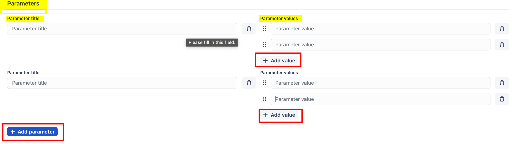
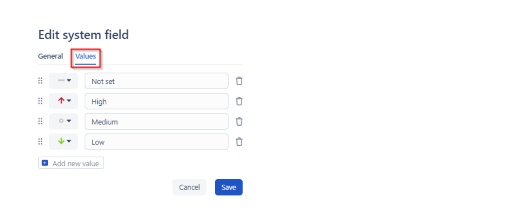

# Test cases

### What is a test case in software testing?

A test case contains all the details about our test. In Qase, a test case is a specific set of instructions and conditions that outline a test to be carried out successfully. It includes testing procedures, necessary inputs, execution conditions, and expected results to achieve a testing objective.



In Qase, you can define various parameters and expected outcomes of a particular testing scenario.

### Create Test Case

#### **A. Create a quick test case**

Quickly create a test case by clicking the "+ Create case" button in a Suite, by providing a title, and add other details later if needed.\

<figure><figcaption></figcaption></figure>

#### B. Create a detailed case 

The second method lets you fully detail your new Test Case. Click the "+ Case" button above the Suite structure in the repository to begin.

<figure><figcaption></figcaption></figure>

You'll be guided in setting up your new Test Case and providing all the necessary information.

<figure><figcaption></figcaption></figure>

### Test Case Properties 

***

Test Case properties can be divided into several sections:

#### Basic fields 

You will define the following Test Case properties:

* _Title:_ define the name of a test case
* _Status:_ can be either Active, Draft, or Deprecated
* _Description:_ additional details for more context about a test case
* _Suite:_ choose here which Test Suite your new case belongs to
* _Severity:_ can be either Trivial, Minor, Normal, Major, Critical, Blocker, or Not Set
* _Priority:_ can be either Low, Medium, High, or Not Set
* _Type:_ select what type of testing is applicable for your test case
* _Layer:_ pick a layer of the test case, whether it's an end-to-end, API, or a unit test
* _Is flaky:_ if a test case is unstable, you can mark it as flaky
* _Milestone:_ select whether a test case is related to one of your Milestones, which you can create separately
* _Behavior:_ can be either Destructive, Negative, Positive, or Not Set
* _Automation Status:_ you can choose from Manual or Automated
* _To be automated_: a checkbox property only available for those cases that have a "Manual" automation status

#### Conditions 

Here, you can outline what needs to happen before conducting the Test Case (Pre-conditions) and the actions to be taken after the Test Case is completed (Post-conditions).

<figure><figcaption></figcaption></figure>

#### Tags: 

[Tags](https://help.qase.io/en/articles/5563696-tags) are a quick way to label your test cases with values that doesn't require any preliminary configuration.

#### Custom Fields: 

Predicting the specific parameters or properties needed for your Test Case is challenging, and this is where [Custom Fields](https://docs.qase.io/administration/workspace-management/custom-fields) come in handy.

You can make your own Custom Fields with different data types to store extra information about your test cases not included in default properties. You won't find this field If you haven't created any Custom Fields yet.

<figure><figcaption></figcaption></figure>

#### [Attachments](https://docs.qase.io/administration/workspace-management/attachments): 

Add clarity and additional context to your Test Case by uploading images, screenshots, video snippets, or other documents.

<figure><figcaption></figcaption></figure>

**Note**: There is a 32MB maximum size for a single file that can be attached.

#### [Parameters](https://docs.qase.io/general/get-started-with-the-qase-platform/test-cases/test-case-parameters): 

You can set up your test case to be parametrized and run it through multiple iterations during a test run, depending on the parameter values you define.

<figure><figcaption></figcaption></figure>

You have the flexibility to add multiple parameters, each with multiple values.

Once you include a parametrized case in a test run, multiple instances of it will be added to the run, each representing a specific parameter value.

<figure><figcaption></figcaption></figure>

### Modifying fields 

System fields can be optionally switched on and off via the [fields section](https://help.qase.io/en/articles/6705423-workspace-management-fields). Click the "Configure fields" button and select the field you want to configure. Click on the “Enable for all projects button” and then configure:

<figure><figcaption></figcaption></figure>

<figure><figcaption></figcaption></figure>

<mark style="background-color:green;">**Note**</mark><mark style="background-color:green;">: The values of system fields can be modified.</mark>\ <mark style="background-color:green;">​</mark> <mark style="background-color:green;"></mark>_<mark style="background-color:green;">(available on the</mark>_ [_<mark style="background-color:green;">Startup</mark>_](https://help.qase.io/en/articles/5563728-startup-plan)_<mark style="background-color:green;">,</mark>_ [_<mark style="background-color:green;">Business</mark>_](https://help.qase.io/en/articles/5563727-business-plan)_<mark style="background-color:green;">, and</mark>_ [_<mark style="background-color:green;">Enterprise</mark>_](https://help.qase.io/en/articles/6640055-enterprise-plan) _<mark style="background-color:green;">plans)</mark>_<mark style="background-color:green;">:</mark>

<figure><figcaption></figcaption></figure>

### Test Case Steps: 

***

This section outlines the actions to be taken and the expected results for each step when executing a test case. For instance, when testing a software module offering GPS connectivity, you must specify the actions to perform and the anticipated outcomes.

There are two types of steps to pick from -

**a) Classic**

<figure><figcaption></figcaption></figure>

**b) Gherkin**

<figure><figcaption></figcaption></figure>

Test Case can consist of several steps that must be performed; for every new step, hit the "+ Add Step" button on the bottom.

<figure><figcaption></figcaption></figure>
