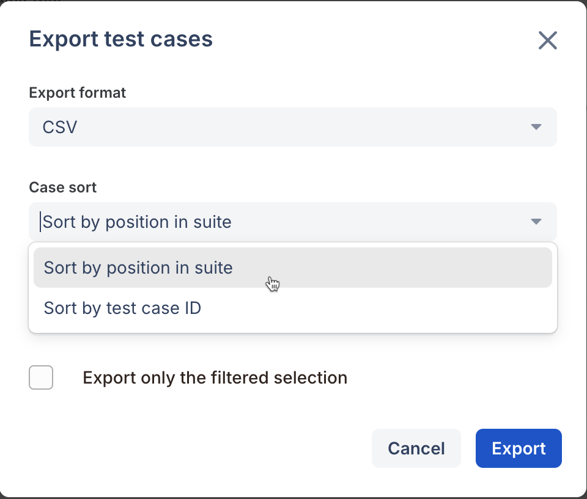

# Export test cases

### How to export test cases?



### What formats can I save my test cases to?

Qase allows you to export your test suites and test cases into several different formats:

* CSV
* XLS
* XML
* JSON
* PDF
* HTML

<figure><figcaption></figcaption></figure>

As with importing data, you can export test case data from each specific project available in your team. You can download information from a particular suite or the whole project at once.

When you export test cases to CSV, XLS, or PDF format, you can choose test case order: sort them by ID or by position in the suite.

<figure><figcaption></figcaption></figure>

Note: There is a possibility of exporting only filtered selections (filter here, includes active search too).

\
