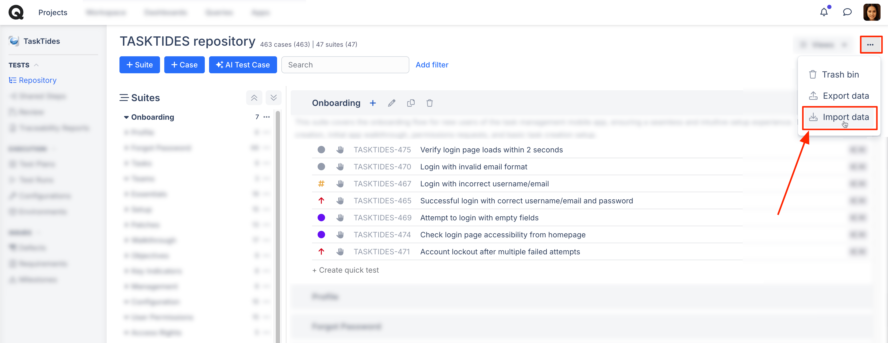
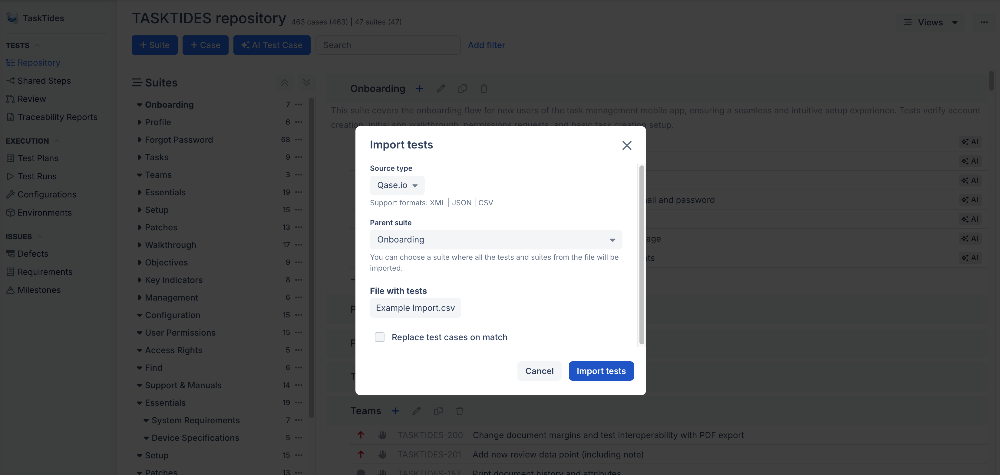
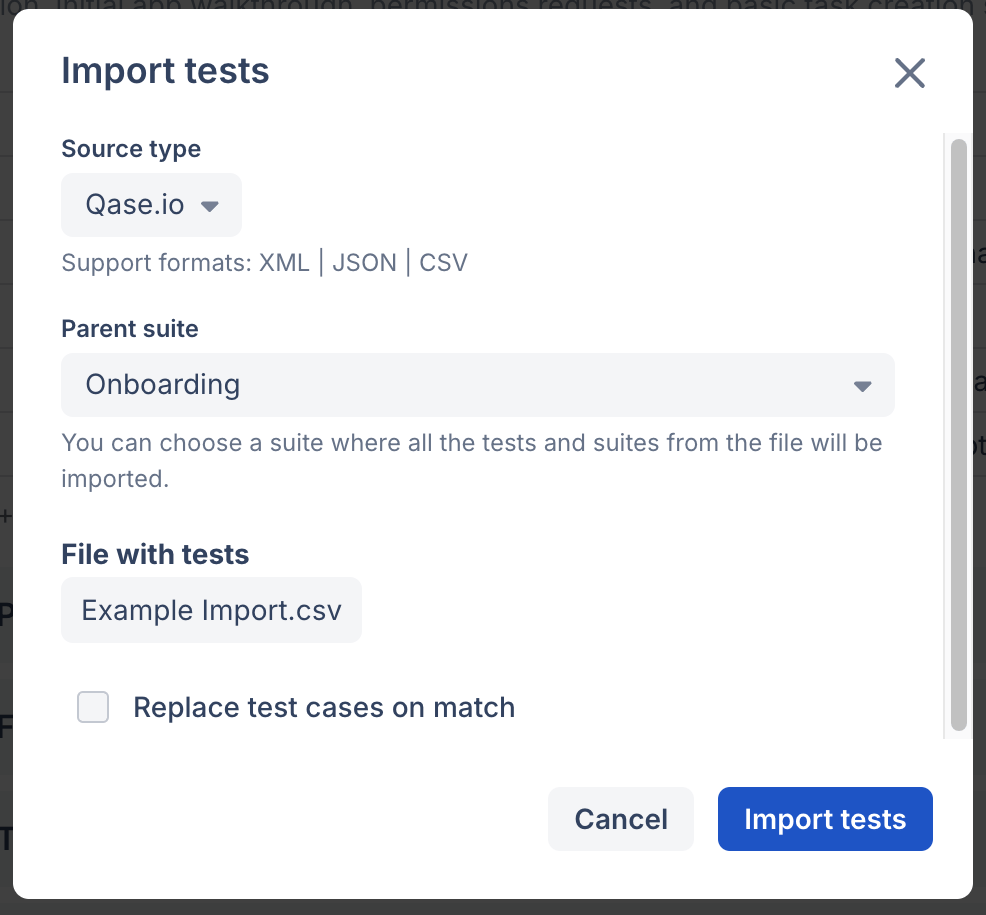

# Import test cases



### How to import test cases?



You can import your test cases into Qase in 3 easy steps.

1. **Click the "..." menu icon** in the top right-hand corner of your repository, and choose "**Import Data**" from the menu.

<figure><figcaption></figcaption></figure>

After clicking "Import Data," a pop-up will appear.

<figure><figcaption></figcaption></figure>

2. **Select the Source type** - the TMS platform you are migrating from.


If you're using MS Excel for your test cases, choose the Qase.io format when uploading your file. Ensure that the headers in your file follow the specified format. You can download this example CSV for reference.


3. **Select a Suite** to act as the parent for all imported test cases. If no suite is defined, all test cases and suites will go to the project's root.

<figure><figcaption></figcaption></figure>

### Source Types

| Source                | Formats          | Description                                                                                                                                                 |
| --------------------- | ---------------- | ----------------------------------------------------------------------------------------------------------------------------------------------------------- |
| Qase                  | XML / JSON / CSV | It can be helpful when you want to move test cases from one project to another and start it from scratch.                                                   |
| Test Rail             | XML / CSV        | If you want to import test cases from TestRail, the best choice is to use XML because it has a nested structure, and you will get the most accurate result. |
| Test Link             | XML              |                                                                                                                                                             |
| Zephyr Squad/Scale    | XML              |                                                                                                                                                             |
| SquashTM              | XLS              |                                                                                                                                                             |
| CucumberStudio        | XML              |                                                                                                                                                             |
| Zephyr Standalone     | XML              |                                                                                                                                                             |
| Zephyr for Jira Cloud | XML              |                                                                                                                                                             |
| TestLodge             | CSV              |                                                                                                                                                             |
| TestCollab            | XML              |                                                                                                                                                             |
| Xray                  | XML              |                                                                                                                                                             |
| TestCaseLab           | CSV              |                                                                                                                                                             |
| TestPad               | CSV              |                                                                                                                                                             |
| AllureTestOps         | CSV              |                                                                                                                                                             |
| AllureReporter        | CSV              |                                                                                                                                                             |
| qTest                 | XLS              |                                                                                                                                                             |
| PractiTest            | CSV              |                                                                                                                                                             |

### Troubleshooting 

We offer many parsers for various source types, but if you encounter import issues, reach out to our support team via [email](mailto:support@qase.io) or the in-app chat.
