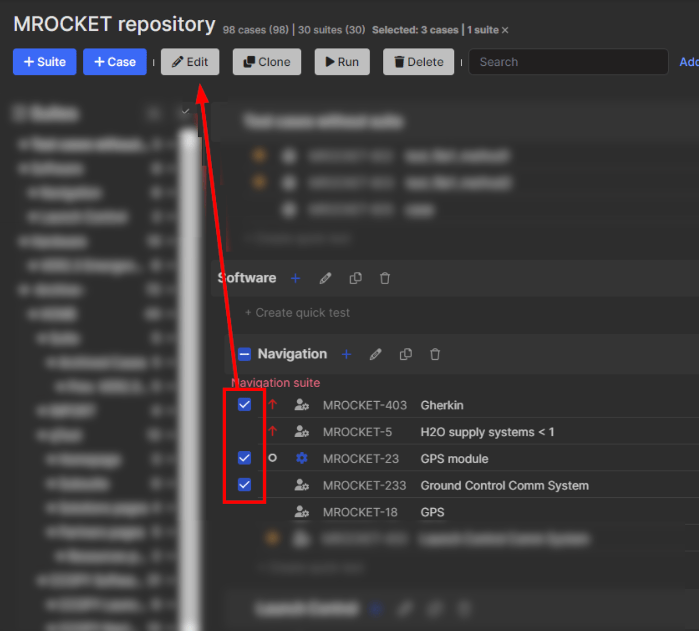

# Muted Tests



Test cases in Qase can be marked muted. This functionality is especially useful for handling flaky tests or those test cases that are currently less critical. When a test is marked as "muted", its results will not affect the overall status of test runs.&#x20;

This means your test runs can still pass even if a muted test fails, preventing unnecessary delays in your release process.

### How to mark a test case "muted": 

***


Ability to mute or unmute test cases is regulated by a user permission - "Mute/Unmute" in the "Test cases" category of a user role.&#x20;

Among the system roles, it is enabled for Owner and Administrator roles.For custom user roles, it can be granted through editing a custom role.


1. In the repository, open a test case in the preview sidebar, switch to the "Properties" tab and check the box for "Muted case":

<figure><figcaption></figcaption></figure>

2. Open a test case in edition mode, and check the box for "Muted case":

<figure><figcaption></figcaption></figure>

3. Select multiple cases in the repository and bulk edit them, checking the "Muted" box:

<figure><figcaption></figcaption></figure>

<figure><figcaption></figcaption></figure>

4. In a test run, select a test case and click the "Mute" button above the result statuses:

<figure><figcaption></figcaption></figure>

### Recognising Muted test cases:

***

#### In the repository:

<figure><figcaption></figcaption></figure>

#### In the Test runs: 

<figure><figcaption></figcaption></figure>


If a test case has been "muted" from a test run, it will also appear "muted" in the repository.


Any previously muted test case can be "unmuted" at any time by unchecking the "Muted case" box when editing a test case - or by clicking an "Unmute" button when viewing the test case in a test run:

<figure><figcaption></figcaption></figure>

### What does Muting a test do? 

***

* If a test run includes a muted test case, then a Failed, Invalid, Blocked result (or a custom result of a "Failure" type) submitted for such a case will not affect the completion status of the test run, i.e. having failed a muted test case will not result in the test run getting marked failed:

<figure><figcaption></figcaption></figure>

* :exclamation:If a test run already has a completion status (Passed/Failed), even after extra test cases were added into it or cases were muted - after the run was completed - the completion status of the run will not be recalculated;
* When [Parametrized test cases](https://docs.qase.io/general/get-started-with-the-qase-platform/test-cases/test-case-parameters) are included in a run, marking one of the parametrized siblings "muted" will also mute all the other parametrized versions of such a test case.
