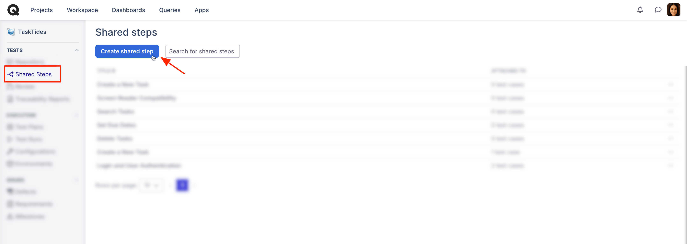
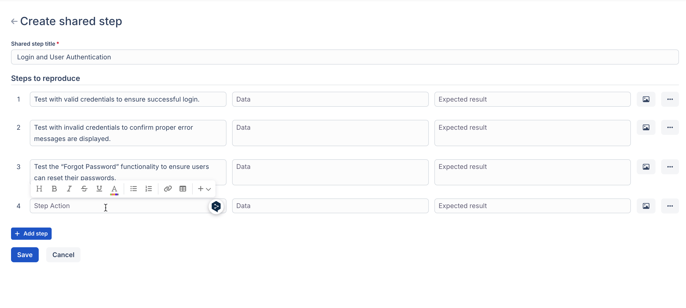

# Shared steps

### What are shared steps?

Shared steps are a unique feature of Qase that allows you to create a single step that can be shared across multiple test cases. This eliminates the need to recreate the same step manually for each test case and ensures consistency across all test cases in which the shared step is used.



Imagine that you have two different cases for a test suite - both require authorization into the internal system to proceed, so it will be one of the steps to recreate.

You could manually add an “Authorization” step to each test case individually, but it’s better to create a single shared step that you can consistently use across multiple test cases.

### Create a Shared step 

Go to the Shared Steps section and create a new shared step

<figure><figcaption></figcaption></figure>

Provide a title for your shared step to identify it easily.

<figure><figcaption></figcaption></figure>

A shared step can either be a single step or a group of multiple steps.

* Use the +Add Step button (located below the title field) to add individual steps, just like when creating steps for a test case.
* If your scenario involves multiple consistent actions across several test cases, group these steps into one shared step for better reusability.

<figure><figcaption></figcaption></figure>

### Convert existing step: 

While editing a test case, you can convert a regular step into a shared step. Adjust the newly created shared step later in the Shared Steps section.

<figure><figcaption></figcaption></figure>

### Add Shared step to a test case: 

When creating or editing a test case, click the Add Shared Step button to include a shared step. You can preview the shared step before adding it to the test case.

<figure><figcaption></figcaption></figure>

### Edit Shared step: 

After adding a shared step to a test case, you can:

* Convert it into a regular step and edit it within the test case.
* Modify the shared step itself by clicking the Edit button in the Shared Steps section.
* Any changes you make and save will automatically apply to all test cases that use the shared step.

<figure><figcaption></figcaption></figure>

### View linked test cases. 

Clicking the links in the ‘Attached to’ column for a shared step will open the repository page, showing only the test cases that include that shared step.

<figure><figcaption></figcaption></figure>

<figure><figcaption></figcaption></figure>
