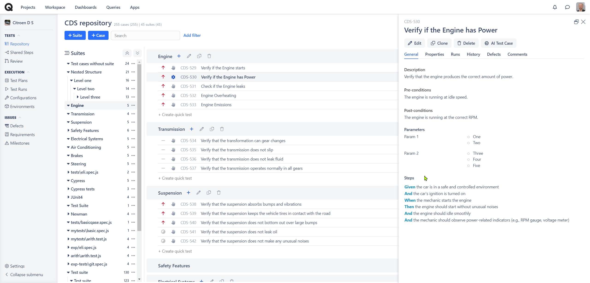

# Test Case Parameters

### What are parameters in software testing?

In the testing process, variables can be captured as Parameters. Testers can then utilize these Parameters in multiple executions of the same [Test Case](https://docs.qase.io/general/get-started-with-the-qase-platform/create-a-test-run), eliminating the need to create separate test cases or duplicate sets of steps.



### How to create Parameters? 

You can simply click on "+ Add Parameter' button while creating a new test case or editing an existing one.

<figure><figcaption></figcaption></figure>

<mark style="background-color:yellow;">You can add up to</mark> <mark style="background-color:yellow;"></mark><mark style="background-color:yellow;">**10**</mark> <mark style="background-color:yellow;"></mark><mark style="background-color:yellow;">different Parameters with their respective values for each Test case.</mark>

### Parameters in test runs 

After introducing Parameters in a case, when this case is included in a test run, it will be divided into multiple identical copies of the same test case, each corresponding to a specified parameter value.

For instance, if you have three parameters A, B and C with 3, 5 and 2 values respectively. In total, you'll see a total of 30 ( 3\*5\*2 ) identical copies of the test case, one for each unique parameter combination.\
​

<figure><figcaption></figcaption></figure>

### Example use case: 

When evaluating the logon process of a web application, such as testing a sign-in, you can streamline the process using Test Parameters. For example:

1. Launch your computer's browser.
2. Enter the website's URL.
3. Fill in the user name and password fields.
4. Click the Sign In button.

If you want to perform this test with different browsers, you can create a Test Parameter named "Browser" while creating a test case. This eliminates the need to create separate test cases for each browser, as you can use the same case with different data.

If you also want to test across various browsers and operating systems, follow the steps mentioned earlier and additionally add an operating system parameter with its corresponding values.

This approach allows you to conduct the same actions with different combinations of browsers and operating systems without creating multiple test cases.
