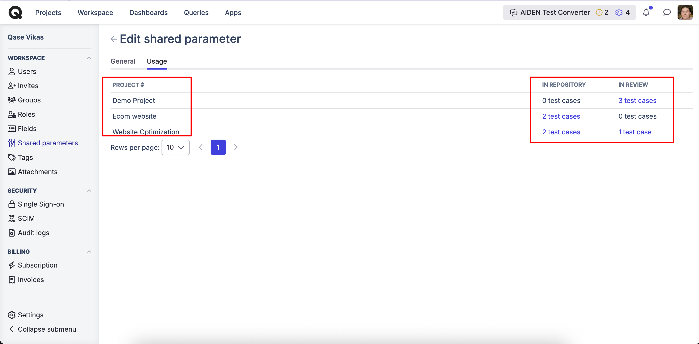

# Test Case Parameters

### What are parameters in software testing?

In your testing process, Parameters allow you to capture variables that can be reused across [multiple executions](../create-a-test-run/test-run-dashboard.md) of the same [Test Case](./#what-is-a-test-case-in-software-testing). This eliminates the need to create separate test cases or duplicate steps for different conditions.&#x20;


Parameters explained using a common testing scenario.&#x20;


### How Parameters help? 

Consider a scenario where you need to test the sign-in functionality of a web application under various conditions. For each user, you’ll need to test each website twice under different conditions (VPN, WiFi, HTTPS, SSO, Cookies), both enabled and disabled.

**Parameter 1**

| <mark style="color:yellow;">Browser</mark> | Chromium | Firefox | Safari | Microsoft Edge |
| ------------------------------------------ | -------- | ------- | ------ | -------------- |

**Parameter 2**

| <mark style="color:yellow;">Website</mark> | qase.io | blog.qase.io | help.qase.io |
| ------------------------------------------ | ------- | ------------ | ------------ |

Group 1 is a **Secure network**; Group 2 is an **In-secure network**.

| <mark style="color:yellow;">is on VPN?</mark> | <mark style="color:yellow;">is on WiFi?</mark> | <mark style="color:yellow;">is HTTPS?</mark> | <mark style="color:yellow;">Using SSO?</mark> | <mark style="color:yellow;">Cookies Accepted?</mark> |
| --------------------------------------------- | ---------------------------------------------- | -------------------------------------------- | --------------------------------------------- | ---------------------------------------------------- |
| Yes                                           | No                                             | Yes                                          | No                                            | No                                                   |
| No                                            | Yes                                            | No                                           | Yes                                           | No                                                   |

### Create a test case with Parameters - 

***

Go to your repository, to select an existing test case, or create a new one.

<figure><figcaption></figcaption></figure>

<figure><figcaption></figcaption></figure>

When you either create or edit an existing test case, you can scroll down to find the "Parameters" section and simply click on the "+ Add Parameter' button.

<figure><figcaption></figcaption></figure>

**Then**, proceed to add the following test case steps

* Check the network condition specified (Secure/ Insecure)
* Launch the specified browser.
* Navigate to the specified website.
* Enter the login credentials for the specified site.
* Click the "Sign In" button.

## Executing a Parameterized test case - 

***

When a test case with Parameters is included in a test run, it generates multiple instances of the test case, each corresponding to a specific combination of parameter values.

<figure><figcaption></figcaption></figure>

For example:

* Test 1: Browser = `Chromium`, Website = `https://www.qase.io`, Secure = `VPN = Yes, WiFi = Yes, HTTPS = Yes, SSO = Yes, Cookies = Yes`\
  ​
* Test 2: Browser = `Chromium`, Website = `https://blog.qase.io`, Secure = `VPN = Yes, WiFi = Yes, HTTPS = Yes, SSO = Yes, Cookies = Yes`

(and so on, until all combinations are covered)

* Test 24: Browser = `Microsoft Edge`, Website = `https://help.qase.io`, Insecure = `VPN = Yes, WiFi = Yes, HTTPS = Yes, SSO = Yes, Cookies = Yes`

With single parameters, the total number of test cases is the product of the number of values for each parameter. For example, with two parameters having 3 and 4 values, you get (3\*4) 12 test cases.

Given the network security conditions (Secured and Unsecured), it’s impractical to list each component as a separate parameter. Instead, all components are either enabled in a secured network or disabled in an unsecured network. This is where Parameter Groups become useful.

### How is a Parameter group different from a single parameter? 

To further streamline the testing process, you can group related parameters into "Parameter Groups." For example:

* Network security: Is on VPN, Is on WiFi, Is HTTPS, SSO sign-in, Cookies enabled
* Account status: is Active; has a custom role; is a regular user, is Owner

Parameter Groups are useful when not all combinations of parameters are relevant or meaningful. For instance, with “Account Status” parameter, a combination of “not active” and “not Owner” might not exist in your system or be applicable.

In such cases, Parameter Groups help you focus only on practical and realistic combinations, eliminating unnecessary tests. This ensures that your testing is efficient and covers only meaningful scenarios.

In our example, although we initially had 12 combinations for the single parameters, each of these needs to be tested on both Secure and Insecure network groups. As a result, the total number of test cases in the run will now be 24.


In a test run, the total number of parameter combinations for a case cannot exceed 1,024.


### Find your parameter siblings from the Run wizard 

In the Test Run dashboard, selecting a parameterized test case will display a ‘siblings’ tab. This tab shows copies of the test case for all other parameter values associated with the selected case.

<figure><figcaption></figcaption></figure>

## Shared Parameters 

Shared Parameters allow you to create reusable parameters at the workspace level that can be applied across multiple test cases and projects. Instead of creating the same parameters repeatedly in individual test cases, you can now define them once and share them wherever needed.

If you change a shared parameter, these changes will automatically apply to all test cases using this parameter.

### Creating Shared Parameters 

1.  From the workspace , go to "Shared Parameters" and create your Single or Group shared parameters.\

    <figure><figcaption></figcaption></figure>

2.  You can select which projects should have access to this shared parameter\
    ​

    <figure><figcaption></figcaption></figure>

3. And, save your shared parameter

Once created, you'll see your shared parameters listed with the following information:

<figure><figcaption></figcaption></figure>

* Parameter name and type (single or group)
* Which projects have access
* Number of test cases currently using the parameter

### Attaching Shared Parameters to Test Cases 

When editing or creating a test case, you'll notice the Parameters section now includes separate options:

* Single Parameters (local to the test case)
* Group Parameters (local to the test case)
*   Shared Parameters (workspace-level parameters)

    <figure><figcaption></figcaption></figure>

\*\*Note\*\*: Shared parameters cannot be edited directly from within individual test cases. You can only attach or detach them. All modifications must be made from the main Shared Parameters section.

### Deleting Shared Parameters 

When deleting a shared parameter, you have two options:

<figure><figcaption></figcaption></figure>

1. Convert to Local Parameters: Transform the shared parameter into individual local parameters within each test case.\
   ​
2. Delete from All Test Cases: Completely remove the parameter from all associated test cases.

### Tracking Usage of your shared parameter 

You can view the usage of a shared parameter from the Edit screen by navigating to the Usage tab. This tab provides a detailed overview of:

* All projects that have access to the shared parameter.
* The number of test cases in the repository that use the shared parameter.
* The number of test cases submitted for review that include the shared parameter.

This allows you to quickly understand where and how your shared parameters are being utilized across your projects.

<figure><figcaption></figcaption></figure>
