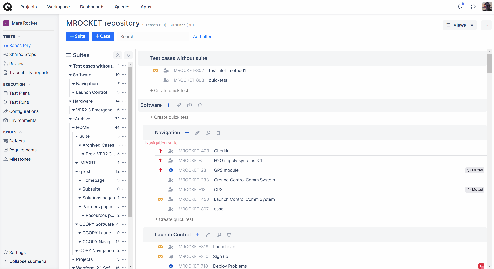
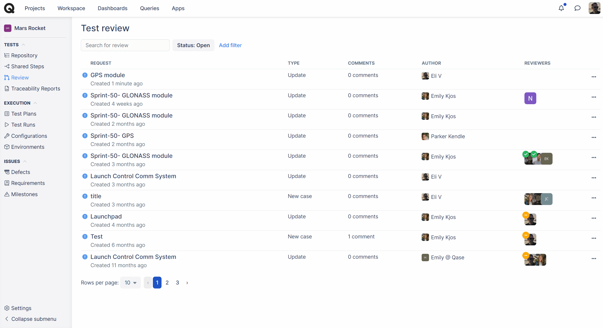

# Test case review

_<mark style="background-color:purple;">Review is available in</mark>_ [_<mark style="background-color:purple;">Business</mark>_](https://docs.qase.io/administration/subscriptions/business-plan) _<mark style="background-color:purple;">and</mark>_ [_<mark style="background-color:purple;">Enterprise</mark>_](https://docs.qase.io/administration/subscriptions/enterprise-plan) _<mark style="background-color:purple;">subscriptions.</mark>_



In Qase, it is possible to ensure that the [Test Cases](https://docs.qase.io/general/get-started-with-the-qase-platform/test-cases) being created are first verified by someone superior, be it a QA team manager, supervisor, CTO, or else. In the [Project Settings](https://docs.qase.io/general/get-started-with-the-qase-platform/create-a-project), you can define several options regarding Test Case Review:

<figure><figcaption></figcaption></figure>

* _Review enabled:_ If selected, you and your teammates will have the option to send a test case to review.
* _Review is mandatory:_ If selected, any changes submitted for a test case cannot be updated unless it’s sent to review.
* _Self Merge:_ This option permits the initiator of the review to merge the changes requested in the review.
* _Approvals required:_ In order to merge the changes, the number of approvals (determined by the Administrator/Owner) will have to be met.

Let's go about creating a new Test Case and submitting it for Review:

* Just like with a regular flow of creating Test Cases, navigate to the Repository, and create a new Case:

<figure><figcaption></figcaption></figure>

* Fill in all the necessary details, define steps, etc. Once ready, hit the "Send to Review" button at the bottom of the screen:

<figure><figcaption></figcaption></figure>

\
In a scenario where a Review is set to "Mandatory", there will be no option to "Save" or "Save and create another" - only send your Test Case to review

\

<figure><figcaption></figcaption></figure>

* Once a Test Case has been sent to review, you will now find a new Case Review Request under the "Review" section:\

<figure><figcaption></figcaption></figure>

* If you’re creating a new case and have sent the case to review, you will see the Type as “New case”. However, if you’re making changes to an existing test case and send it to review, the type will reflect “Update”

<figure><figcaption></figcaption></figure>

* From the "Review" section, you can go into every particular review there is. In a review, you will find a change log of a Test Case and comments that have been left regarding this review:\

<figure><figcaption></figcaption></figure>

* For an author and a reviewer, available actions will be different - a reviewer will also be able to "Approve" or "Request changes"
* Both a review author and other reviewers can leave comments and see others' comments left before.

Once a review is approved (again, depending on the pre-defined requirements in Project Settings), a Review can be merged. After that, a new Test Case will appear in the repository, or the reviewed updates will be set for an existing Test Case:

Step 1: Before review

<figure><figcaption></figcaption></figure>

Step 2: Merging review

<figure><figcaption></figcaption></figure>

_For Reviewers:_

If you are a reviewer and not the author who sent the Test Case to Review. You will be able to see five options on the right-hand side of the page, which are - Merge, Approve, Request Changes, Edit, and Decline.

When you click on _Merge_, the suggested changes are accepted and updated to the test case. _Approve_ allows you to cast your vote for the change while other reviewers still have the chance to look at the suggested updates.

_Request Changes_ allows you to update your status for the review as someone who has requested changes. This feature is a visual indicator to the other reviewers that you’ve requested for changes.

_Edit_ allows you to suggest further changes to the review.

_Decline_ allows you to decline the review request.

\

<figure><figcaption></figcaption></figure>

_For Authors:_

If you’re the person who created the review, you will be able to Merge the review yourself if the following two conditions are met:

1. If the option to self-merge is enabled in the settings
2. If the required approvals number is not set

Here’s what the page would look like for the author if the conditions stated above are met. You will have three options available to you: Merge, Edit, and Decline.

<figure><figcaption></figcaption></figure>

Here’s what the page would look like if the conditions stated above were not met. You will have the option to Edit and Decline the review.

<figure><figcaption></figcaption></figure>

**Note:** If you are the author and the self-review option is enabled in the settings, you will still be able to merge the review even if the required approvals are two or more. You will supersede the settings as you are, in fact, the author, and since the Self-review option is enabled.
