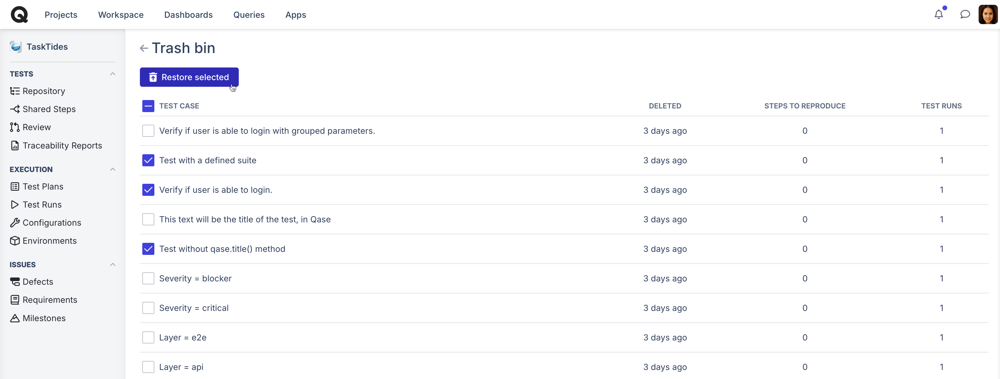

# Trash bin

If you have deleted a [test case](./), it will reside in trash bin located in the three-dots-menu:

<figure><figcaption></figcaption></figure>

From the trash bin, you can restore a previously deleted test case (either a singular case or in bulk):

<figure><figcaption></figcaption></figure>


Please note that only individual test cases can be restored from the Trash bin. If you’ve accidentally deleted a **`test suite`** containing multiple cases, the test cases can be recovered, but the suite itself must be recreated.


Recovered test cases without an associated suite will be moved to the root of the project under the label “Test cases without a suite.”
